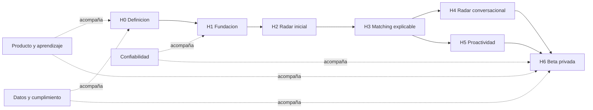

# Backlog maestro de Umbral

Fecha base: 2026-07-28

Estado: aprobado para descomposicion

Horizonte ejecutable: beta privada de alquiler residencial en CABA

## Resultado buscado

Llevar Umbral desde su estado documental actual hasta una beta privada en
produccion donde una persona invitada pueda expresar como quiere vivir, crear
un radar persistente, revisar oportunidades importadas de forma controlada,
entender por que matchean, enseñar preferencias con feedback y recibir alertas
web/email de alta precision.

La fuente de verdad son busquedas, perfiles, listings, recommendation runs,
feedback y eventos auditables. LangGraph interpreta y opera mediante tools
explicitas; scoring y notificaciones se deciden con codigo deterministico.

## Como usar este backlog

- **P0**: bloquea la salida del hito o la beta.
- **P1**: necesario para una beta confiable, pero puede entrar despues del
  primer recorrido interno del hito.
- **P2**: mejora posterior a la beta; no debe colarse en el camino critico.
- Cada item es una historia de backlog, no una tarea de codigo.
- Cada incremento implementable debe recibir su propio `spec.md`, `plan.md` y
  `tasks.md` de Spec Kit.
- Las dependencias indican el minimo bloqueo conocido, no una asignacion de
  personas ni una estimacion de calendario.

Tracks:

- **PROD**: producto, investigacion y medicion.
- **DATA**: ingestion, calidad, lineage y enriquecimiento.
- **APP**: dominio, aplicacion y Product API.
- **WEB**: Next.js, shadcn/ui y experiencia de usuario.
- **AGENT**: LangGraph, tools y evals.
- **PLAT**: persistencia, infraestructura y delivery.
- **TRUST**: seguridad, privacidad, evidencia y cumplimiento.
- **OPS**: operacion de beta, soporte y confiabilidad.

## Definition of Done comun

Una historia se considera terminada cuando:

1. Cumple sus criterios de aceptacion con evidencia verificable.
2. Mantiene la direccion de dependencias y no introduce acceso libre del
   agente a infraestructura.
3. Incluye los tests, contract checks o evals proporcionales al riesgo.
4. Emite telemetria y eventos de auditoria cuando cambia estado de producto.
5. Documenta contratos, decisiones operativas y cambios de datos.
6. Contempla accesibilidad en toda superficie de usuario.
7. Tiene migracion compatible y rollback o compensacion cuando corresponda.
8. No registra secretos ni PII innecesaria.
9. Pasa `.\scripts\check.ps1` y los checks propios del incremento.

## Metricas de beta

Metrica principal:

```text
precision_percibida =
  recomendaciones notificadas y vistas con save/like/contacted dentro de 7 dias
  / recomendaciones notificadas y vistas
```

Objetivo inicial: `>= 35%`.

Guardrails:

- irrelevancia explicita de recomendaciones notificadas y vistas: `<= 15%`;
- alertas que violan hard filters: `0`;
- notificaciones duplicadas: `0`;
- recomendaciones con lineage completo: `100%`;
- notificaciones con decision y razon auditable: `100%`;
- usuarios activados que crean un radar y evaluan cinco propiedades en siete
  dias: `>= 70%`.

## Mapa de dependencias



## Resumen cuantitativo

| Horizonte | Historias |
| --- | ---: |
| H0 - Definicion de beta | 15 |
| H1 - Fundacion ejecutable | 23 |
| H2 - Primer radar de punta a punta | 34 |
| H3 - Matching explicable y feedback | 35 |
| H4 - Radar conversacional | 30 |
| H5 - Proactividad controlada | 20 |
| H6 - Beta privada | 29 |
| **Total beta** | **186** |
| Roadmap posterior R1-R5 | 29 |
| **Total general** | **215** |

# H0 - Definicion de beta

Objetivo: eliminar ambiguedades de producto, datos, confianza y medicion antes
de comprometer arquitectura de ejecucion.

Puerta de salida: charter aprobado, dataset controlado disponible, contratos
de datos definidos, riesgos legales registrados y metricas instrumentables.

## Epica H0.1 - Producto y aprendizaje

- [ ] **UM-H0-001 [P0] [PROD] Aprobar el charter de beta** — Define problema,
  usuario, alquiler CABA, propuesta de valor, alcance, exclusiones, riesgos y
  autoridad de go/no-go en un documento versionado.
- [ ] **UM-H0-002 [P0] [PROD] Definir cohorte y protocolo de investigacion** —
  Establece criterios de reclutamiento, consentimiento, guion y registro de
  hallazgos para usuarios invitados. Depende de UM-H0-001.
- [ ] **UM-H0-003 [P0] [PROD] Validar jobs-to-be-done con entrevistas** —
  Produce evidencia sintetizada sobre busqueda, ansiedad, alertas, feedback y
  criterios subjetivos; separa hallazgos de hipotesis. Depende de UM-H0-002.
- [ ] **UM-H0-004 [P0] [PROD] Mapear el journey de alquiler en CABA** — Cubre
  desde intencion y busqueda hasta contacto/visita, identifica decisiones,
  fricciones, datos y riesgos. Depende de UM-H0-003.
- [ ] **UM-H0-005 [P1] [PROD] Validar un prototipo del radar** — Prueba crear
  busqueda, revisar cards/mapa, entender razones, dar feedback y configurar
  alertas; registra problemas por severidad. Depende de UM-H0-004.
- [ ] **UM-H0-006 [P0] [PROD] Definir taxonomia del brief vivo** — Especifica
  hard filters, preferencias blandas, tolerancias, destinos, pesos,
  incertidumbre y reglas de confirmacion sin depender del chat. Depende de
  UM-H0-003.
- [ ] **UM-H0-007 [P0] [PROD] Definir politica de evidencia y explicaciones** —
  Fija que puede afirmarse con evidencia fuerte, inferida o ausente, el copy de
  incertidumbre y ejemplos aceptables/rechazados. Depende de UM-H0-006.

## Epica H0.2 - Datos, cumplimiento y medicion

- [ ] **UM-H0-008 [P0] [DATA] Confirmar la fuente controlada de beta** — Registra
  propietario, formato, frecuencia, volumen, derechos de uso, restricciones y
  contacto operativo; el scraping queda fuera del camino critico.
- [ ] **UM-H0-009 [P0] [DATA] Publicar el contrato de importacion v1** — Define
  campos requeridos/opcionales, moneda, superficies, ubicacion, media,
  identidad de fuente, timestamps, version y ejemplos validos/invalidos.
  Depende de UM-H0-008.
- [ ] **UM-H0-010 [P0] [DATA] Preparar el dataset controlado de referencia** —
  Incluye listings validos, duplicados, cambios de precio, campos faltantes,
  ubicaciones aproximadas y casos que deben ir a cuarentena. Depende de
  UM-H0-009.
- [ ] **UM-H0-011 [P0] [TRUST] Completar evaluacion legal inicial** — Documenta
  derechos sobre datos e imagenes, atribucion, contacto con la fuente,
  retencion, terminos de beta y riesgos que requieren asesoria especializada.
  Depende de UM-H0-008.
- [ ] **UM-H0-012 [P0] [TRUST] Crear mapa de datos personales** — Enumera PII,
  finalidad, ubicacion, acceso, retencion, exportacion y borrado para identidad,
  conversaciones, preferencias y eventos.
- [ ] **UM-H0-013 [P0] [PROD] Definir diccionario de eventos y metricas** —
  Especifica identidad, payload, version y momento de emision de activacion,
  impresion, vista, feedback, contacto, alerta y error. Depende de UM-H0-001.
- [ ] **UM-H0-014 [P0] [PROD] Fijar rubric de salida de beta** — Formaliza la
  precision percibida, guardrails, ventana de medicion, tamaño minimo de
  muestra y proceso de recalibracion. Depende de UM-H0-013.
- [ ] **UM-H0-015 [P1] [TRUST] Crear registro de riesgos inicial** — Asigna
  responsable, probabilidad, impacto, mitigacion y señal de activacion a
  fuentes, calidad, sesgo, privacidad, costos y abuso.

# H1 - Fundacion ejecutable

Objetivo: disponer de una aplicacion desplegable, autenticada, observable y
preparada para datos auditables sin construir features de producto prematuras.

Puerta de salida: usuario invitado autenticado; API, base, workers y storage
operativos; preview/produccion desplegables; telemetria y checks verificados.

## Epica H1.1 - Estructura y contratos

- [x] **UM-H1-001 [P0] [APP] Crear el esqueleto del monolito modular** — Separa
  dominio, aplicacion, agent, infraestructura, API y workers bajo `src/umbral`;
  los checks de arquitectura rechazan imports prohibidos.
- [x] **UM-H1-002 [P0] [WEB] Crear la aplicacion Next.js App Router** — Usa
  TypeScript, linting, testing, alias de imports y estructura por slices de
  producto sin duplicar reglas del backend.
- [x] **UM-H1-003 [P0] [WEB] Inicializar shadcn/ui y tokens semanticos** —
  Registra `components.json`, base/preset elegido, tipografia, tema,
  accesibilidad y primitives minimas sin construir pantallas especulativas.
  Depende de UM-H1-002.
- [x] **UM-H1-004 [P0] [APP] Establecer versionado de contratos HTTP** — Publica
  OpenAPI estable, errores tipados, request/correlation id y estrategia de
  compatibilidad.
- [x] **UM-H1-005 [P0] [WEB] Generar cliente tipado desde OpenAPI** — La web no
  mantiene DTOs manuales divergentes y el check detecta contratos
  desactualizados. Depende de UM-H1-004.
- [x] **UM-H1-006 [P0] [PLAT] Implementar configuracion y secretos por ambiente**
  — Valida settings al iniciar, separa local/preview/produccion y evita defaults
  inseguros o secretos en logs.

## Epica H1.2 - Persistencia y ejecucion asincronica

- [x] **UM-H1-007 [P0] [PLAT] Provisionar Postgres, PostGIS y pgvector** —
  Verifica extensiones y conectividad en local y ambientes remotos.
- [x] **UM-H1-008 [P0] [APP] Configurar SQLAlchemy 2 y Alembic** — Incluye
  convencion de metadata, transacciones, migracion inicial y check de drift.
  Depende de UM-H1-007.
- [x] **UM-H1-009 [P0] [APP] Definir primitives persistentes de identidad y
  auditoria** — Incluye ids, timestamps, version optimista, actor, source y
  metadata de correlacion reutilizables sin acoplar dominio a SQLAlchemy.
  Depende de UM-H1-008.
- [x] **UM-H1-010 [P0] [PLAT] Provisionar Redis y runtime de workers** — Ejecuta
  un job idempotente, registra estado/reintentos y soporta scheduler simple.
- [x] **UM-H1-011 [P0] [PLAT] Implementar adapter de object storage** — Ofrece
  put/get versionado, hash, content type y adapter local de prueba; no expone
  credenciales a dominio.
- [x] **UM-H1-012 [P1] [OPS] Definir politica de backup y restauracion** —
  Especifica RPO/RTO de beta, alcance de Postgres/storage y procedimiento
  verificable. Depende de UM-H1-007 y UM-H1-011.

## Epica H1.3 - Identidad, observabilidad y delivery

- [ ] **UM-H1-023 [P0] [PLAT] Seleccionar providers de identidad y email** —
  Un ADR compara magic link, validacion desde FastAPI, aislamiento de datos,
  entregabilidad, costo, observabilidad, soporte local y estrategia de salida;
  deja definidos los adapters y credenciales por ambiente.
- [ ] **UM-H1-013 [P0] [TRUST] Implementar invitaciones y magic link** — Solo
  emails invitados pueden autenticarse; tokens expiran, son de un uso y los
  eventos de acceso quedan auditados. Depende de UM-H1-023.
- [ ] **UM-H1-014 [P0] [APP] Mapear identidad externa a usuario de producto** —
  FastAPI valida identidad y autorizacion; cada recurso se limita al usuario o
  rol operador correspondiente. Depende de UM-H1-013.
- [ ] **UM-H1-015 [P0] [TRUST] Implementar roles minimos** — Distingue usuario,
  operador y administrador, con deny-by-default y pruebas de acceso cruzado.
  Depende de UM-H1-014.
- [x] **UM-H1-016 [P0] [PLAT] Añadir logs estructurados y correlacion** — Une
  request, job, import, recommendation run, graph run y notification sin
  registrar contenido sensible por defecto.
- [x] **UM-H1-017 [P0] [PLAT] Instrumentar OpenTelemetry y Sentry** — Captura
  latencia, errores y trazas entre web, API y workers con filtros de PII.
  Depende de UM-H1-016.
- [x] **UM-H1-018 [P0] [APP] Publicar health, readiness y version** — Readiness
  comprueba dependencias criticas sin ejecutar efectos ni revelar secretos.
- [x] **UM-H1-019 [P0] [PLAT] Automatizar el harness en CI** — Ejecuta docs,
  arquitectura, migraciones, contratos, frontend build y tests disponibles;
  bloquea merge ante fallos.
- [x] **UM-H1-020 [P0] [PLAT] Crear despliegues preview y produccion** —
  Versiona artefactos, ejecuta migraciones de forma controlada y ofrece smoke
  test y rollback documentado. Depende de UM-H1-006 a UM-H1-019.
- [ ] **UM-H1-021 [P1] [OPS] Crear dashboard tecnico inicial** — Muestra salud,
  errores, latencia, jobs y consumo de recursos con enlaces a trazas.
- [ ] **UM-H1-022 [P1] [TRUST] Ejecutar threat model fundacional** — Revisa
  auth, sesiones, API, secretos, uploads, SSRF, prompt injection y aislamiento
  por usuario; cada riesgo alto genera backlog bloqueante.

# H2 - Primer radar de punta a punta

Objetivo: convertir un lote controlado en listings persistentes y matches que
un usuario pueda explorar en lista, mapa y detalle.

Puerta de salida: un operador importa propiedades y un usuario crea una
busqueda, ejecuta hard filters y revisa matches persistentes de punta a punta.

## Epica H2.1 - Ingestion Bronze

- [ ] **UM-H2-001 [P0] [DATA] Definir la interfaz ImportSource** — Recibe un
  lote, identidad de fuente y version; devuelve snapshots y un reporte sin
  conocer Silver. Incluye adapter de archivo y fake de prueba.
- [ ] **UM-H2-002 [P0] [DATA] Validar archivos CSV/JSON contra el contrato** —
  Rechaza formato, encoding, tamaño o version no soportados con errores por
  registro accionables. Depende de UM-H0-009 y UM-H2-001.
- [ ] **UM-H2-003 [P0] [OPS] Crear entrada operativa de importacion** — Permite
  subir un lote controlado con permisos, source id, idempotency key y vista de
  progreso; no acepta URLs arbitrarias. Depende de UM-H1-015 y UM-H2-002.
- [ ] **UM-H2-004 [P0] [DATA] Persistir crawl/import runs** — Registra estado,
  conteos, version de parser, actor, timestamps y errores resumidos.
- [ ] **UM-H2-005 [P0] [DATA] Preservar raw listing snapshots inmutables** —
  Guarda payload/hash en Bronze y contenido pesado en object storage antes de
  transformar. Depende de UM-H1-011 y UM-H2-004.
- [ ] **UM-H2-006 [P0] [DATA] Hacer la captura idempotente** — Repetir un lote
  con la misma clave/hash no duplica snapshots ni efectos.
- [ ] **UM-H2-007 [P0] [DATA] Implementar cuarentena por registro** — Los
  registros invalidos quedan consultables con codigo, detalle y payload
  referenciado; los validos continuan. Depende de UM-H2-002 y UM-H2-005.
- [ ] **UM-H2-008 [P1] [OPS] Exponer reporte de calidad del lote** — Muestra
  aceptados, duplicados, cuarentena, campos faltantes y distribuciones
  anormales con descarga segura.

## Epica H2.2 - Normalizacion Silver

- [ ] **UM-H2-009 [P0] [DATA] Normalizar listing sources y versions** — Conserva
  external id, URL, fuente, publicacion, ultima observacion y payload de origen.
- [ ] **UM-H2-010 [P0] [DATA] Normalizar precio y costo total** — Preserva
  moneda/valor original, expensas, supuestos y errores; no convierte moneda sin
  una tasa versionada.
- [ ] **UM-H2-011 [P0] [DATA] Normalizar atributos inmobiliarios** — Superficie,
  ambientes, dormitorios, piso, tipo, operacion y amenities usan unidades,
  enums y rangos validados.
- [ ] **UM-H2-012 [P0] [DATA] Normalizar ubicacion y granularidad** — Guarda
  texto original, barrio, geometria y precision exact/block/barrio/aproximada/
  desconocida sin inventar direccion.
- [ ] **UM-H2-013 [P1] [DATA] Geocodificar ubicaciones permitidas** — Usa cache,
  rate limits, adapter y fuente registrada; no mejora artificialmente la
  precision. Depende de UM-H2-012.
- [ ] **UM-H2-014 [P0] [DATA] Crear canonical properties** — Separa la propiedad
  real de sus publicaciones y versiones, preservando lineage a Bronze.
- [ ] **UM-H2-015 [P0] [DATA] Aplicar dedupe deterministico** — Vincula matches
  exactos por identidad de fuente/hash/datos fuertes y registra evidencia.
- [ ] **UM-H2-016 [P1] [DATA] Proponer dedupe probabilistico no destructivo** —
  Genera dedupe links con score, evidencia y estado pendiente/confirmado/
  rechazado; no fusiona automaticamente casos ambiguos.
- [ ] **UM-H2-017 [P0] [DATA] Registrar cambios entre versiones** — Detecta
  precio, estado, texto y atributos; conserva before/after y origen.
- [ ] **UM-H2-018 [P0] [DATA] Probar lineage Bronze-Silver** — Para cada entidad
  de referencia se puede volver al snapshot y parser que la produjo.

## Epica H2.3 - Busqueda, matching baseline y radar

- [ ] **UM-H2-019 [P0] [APP] Modelar search profiles y snapshots** — Incluye
  nombre, operacion alquiler, zonas CABA, presupuesto, ambientes, superficie,
  estado y politica inicial; cada cambio produce version.
- [ ] **UM-H2-020 [P0] [APP] Implementar casos de uso de busqueda** — Crear,
  listar, obtener, editar, pausar y archivar respetan ownership e invariantes.
  Depende de UM-H2-019.
- [ ] **UM-H2-021 [P0] [APP] Exponer contratos HTTP de busqueda** — Actualiza
  OpenAPI y cliente web con errores de validacion y concurrencia tipados.
  Depende de UM-H2-020.
- [ ] **UM-H2-022 [P0] [WEB] Construir onboarding estructurado del radar** —
  Permite definir presupuesto, zonas y requisitos P0 con shadcn forms,
  validacion accesible, resumen y confirmacion.
- [ ] **UM-H2-023 [P0] [WEB] Construir selector y administracion de busquedas** —
  Lista activas, pausadas y archivadas, mantiene contexto en desktop/mobile y
  no mezcla datos entre radares.
- [ ] **UM-H2-024 [P0] [APP] Implementar hard filters puros** — Presupuesto,
  operacion, ubicacion, ambientes y requisitos obligatorios tienen casos
  golden; desconocido sigue la politica explicita de cada filtro.
- [ ] **UM-H2-025 [P0] [APP] Recuperar candidatos con SQL/PostGIS** — Aplica
  hard filters y paginacion estable sin embeddings ni LLM. Depende de
  UM-H2-012, UM-H2-019 y UM-H2-024.
- [ ] **UM-H2-026 [P0] [APP] Calcular scoring baseline versionado** — Ordena
  candidatos por fit objetivo con tie-break estable y retorna contribuciones
  visibles.
- [ ] **UM-H2-027 [P0] [APP] Persistir recommendation runs/items** — Congela
  profile snapshot, candidate set, score version, orden y tiempos antes de
  publicar resultados. Depende de UM-H2-026.
- [ ] **UM-H2-028 [P0] [APP] Exponer listado y detalle de matches** — Incluye
  score, datos esenciales, fuente, precision geografica y lineage permitido.
- [ ] **UM-H2-029 [P0] [WEB] Construir radar en cards y lista** — Muestra precio
  total, barrio, superficie, ambientes, score, fuente y estados accesibles con
  paginacion.
- [ ] **UM-H2-030 [P0] [WEB] Construir mapa sincronizado con resultados** —
  Usa MapLibre, respeta precision geografica, sincroniza seleccion y no revela
  coordenadas mas precisas que las autorizadas.
- [ ] **UM-H2-031 [P0] [WEB] Construir detalle de listing** — Muestra media,
  atributos, fuente original, ubicacion, datos faltantes y cambios conocidos
  sin afirmaciones cualitativas no soportadas.
- [ ] **UM-H2-032 [P0] [WEB] Completar estados responsive y de recuperacion** —
  Radar, mapa y detalle distinguen loading, empty, parcial, error recuperable,
  no autorizado y no encontrado en desktop/mobile.
- [ ] **UM-H2-033 [P0] [PROD] Instrumentar activacion y exploracion** — Emite
  eventos versionados de crear radar, run publicado, impresion, vista y fuente
  abierta de acuerdo con UM-H0-013.
- [ ] **UM-H2-034 [P0] [OPS] Verificar el recorrido E2E inicial** — Un lote con
  validos/invalidos produce reporte, entidades Silver, radar y detalles
  correctos sin duplicacion al reimportar.

# H3 - Matching explicable y feedback

Objetivo: incorporar preferencias subjetivas, evidencia, incertidumbre y
aprendizaje controlado sin ceder ranking al LLM.

Puerta de salida: cada recomendacion se reconstruye desde perfil, listing,
features, scoring y evidencia; todo feedback persiste como evento.

## Epica H3.1 - Criterios y observaciones

- [ ] **UM-H3-001 [P0] [APP] Implementar concept registry v1** — Registra
  conceptos curados, aliases, matcher type, fuente, defaults y politica de
  computo; los cambios son versionados.
- [ ] **UM-H3-002 [P0] [APP] Modelar preference facts** — Guarda valor, peso,
  polaridad, confianza, fuente, validez y alcance por busqueda.
- [ ] **UM-H3-003 [P0] [APP] Modelar profile criteria ejecutables** — Separa
  memoria semantica de instrucciones evaluables y valida matcher types y
  parametros permitidos.
- [ ] **UM-H3-004 [P0] [APP] Compilar ediciones estructuradas a criterios** —
  Produce un conjunto ordenado/versionado con advertencias y no convierte
  preferencias blandas en hard filters sin confirmacion.
- [ ] **UM-H3-005 [P0] [DATA] Modelar listing observations** — Cada observacion
  conserva concepto, valor, score, confianza, evidencia, fuente, modelo/prompt
  o regla, version y timestamp.
- [ ] **UM-H3-006 [P0] [DATA] Extraer features objetivas con reglas** — Balcon,
  ambientes, piso, tipo de cocina y otras señales textuales verificables tienen
  evidencia de fragmento y casos golden.
- [ ] **UM-H3-007 [P0] [DATA] Extraer features cualitativas con salida
  estructurada** — El modelo solo produce esquemas permitidos, evidencia y
  confianza; resultados invalidos se rechazan o reintentan de forma acotada.
- [ ] **UM-H3-008 [P0] [AGENT] Versionar modelos, prompts y schemas de
  extraccion** — Toda observacion generativa referencia versiones inmutables y
  permite reproducir el input permitido.
- [ ] **UM-H3-009 [P1] [DATA] Generar embeddings de listings normalizados** —
  Indexa texto/features permitidos en pgvector con modelo y version, nunca raw
  HTML ni PII.
- [ ] **UM-H3-010 [P1] [DATA] Incorporar contexto urbano inicial** — Importa o
  consulta de forma cacheada cafes, transporte y espacios verdes; cada señal
  guarda fuente, fecha, geometria y algoritmo.
- [ ] **UM-H3-011 [P0] [DATA] Implementar recomputacion selectiva** — Un cambio
  de parser, prompt, modelo o concepto invalida solo observaciones afectadas y
  preserva versiones previas usadas.

## Epica H3.2 - Scoring y explicaciones

- [ ] **UM-H3-012 [P0] [APP] Definir scoring policy v1** — Fija criterios,
  pesos, normalizacion, gates, confianza, bonuses, penalizaciones y tie-breaks
  en una version inmutable.
- [ ] **UM-H3-013 [P0] [APP] Implementar evaluadores genericos iniciales** —
  Numeric range, categorical, geo proximity y semantic feature comparten un
  contrato pequeño y retornan score/confianza/evidencia.
- [ ] **UM-H3-014 [P0] [APP] Diferenciar desconocido de evidencia negativa** —
  Casos golden demuestran que falta de datos baja confianza y no equivale a un
  mismatch observado.
- [ ] **UM-H3-015 [P0] [APP] Evaluar criterios contra listings** — Persiste
  criterion evaluations con inputs versionados, contribucion y razon.
- [ ] **UM-H3-016 [P0] [APP] Calcular scoring v1 puro y deterministico** — La
  misma entrada produce el mismo orden y desglose sin llamadas a red, DB o LLM.
- [ ] **UM-H3-017 [P0] [APP] Publicar recommendation runs atomicos** — Un run
  fallido no reemplaza el ultimo run valido y registra la causa.
- [ ] **UM-H3-018 [P0] [APP] Generar explicaciones desde evidencia** — Produce
  razones, riesgos, datos faltantes y confianza a partir del desglose; el texto
  generativo opcional no puede agregar hechos.
- [ ] **UM-H3-019 [P0] [APP] Exponer explicacion por listing y busqueda** —
  Devuelve score version, profile snapshot, feature snapshot, criterios y
  evidence refs con permisos.
- [ ] **UM-H3-020 [P0] [APP] Implementar comparacion estructurada** — Compara
  hasta el limite definido usando dimensiones homogeneas, faltantes y
  tradeoffs; no inventa un ganador generativo.
- [ ] **UM-H3-021 [P0] [WEB] Mostrar razones, riesgos e incertidumbre** — Cards y
  detalle distinguen evidencia fuerte/media/baja, desconocidos y filtros
  cumplidos sin presentar scores como certeza.
- [ ] **UM-H3-022 [P1] [WEB] Construir comparador persistente** — Selecciona
  listings del mismo radar, conserva shortlist y muestra una matriz responsive
  con dimensiones auditables.

## Epica H3.3 - Feedback y aprendizaje controlado

- [ ] **UM-H3-023 [P0] [APP] Modelar feedback events inmutables** — Soporta
  like, dislike, save, dismiss, contacted y reasons; conserva actor, contexto,
  recommendation item y timestamp.
- [ ] **UM-H3-024 [P0] [APP] Registrar feedback de forma idempotente** — Repetir
  una accion no duplica eventos; cambiar decision genera un nuevo evento o
  compensacion trazable.
- [ ] **UM-H3-025 [P0] [WEB] Implementar guardar, descartar y razones rapidas** —
  Ofrece feedback accesible desde card/detalle, confirmacion visible y estados
  optimistas reversibles.
- [ ] **UM-H3-026 [P0] [WEB] Construir shortlist y descartados** — Son vistas
  persistentes por busqueda, con filtros y retorno al detalle.
- [ ] **UM-H3-027 [P1] [WEB] Capturar feedback libre contextual** — Permite
  explicar un like/dislike sin forzar texto; muestra como se usara y evita PII
  en analytics.
- [ ] **UM-H3-028 [P0] [APP] Proponer aprendizaje desde feedback** — Convierte
  señales suficientes en una propuesta de preference fact/criterion, sin
  aplicar cambios globales automaticamente.
- [ ] **UM-H3-029 [P0] [WEB] Confirmar, deshacer o ampliar aprendizaje** —
  Muestra el cambio exacto, alcance de busqueda y efecto esperado.
- [ ] **UM-H3-030 [P0] [APP] Recalcular tras cambios relevantes** — Versiona el
  perfil, crea un nuevo run y conserva el anterior para auditoria.
- [ ] **UM-H3-031 [P1] [WEB] Mostrar historial de precio y cambios** — Usa
  listing versions, fechas y fuente sin inferir tendencias con muestra
  insuficiente.

## Epica H3.4 - Calidad del matching

- [ ] **UM-H3-032 [P0] [PROD] Crear dataset golden de recomendaciones** —
  Incluye perfiles/listings, hard filter violations, unknowns, preferencias
  subjetivas y orden esperado revisado por producto.
- [ ] **UM-H3-033 [P0] [APP] Automatizar regresiones de scoring** — Compara
  versiones sobre el dataset golden y bloquea cambios no explicados.
- [ ] **UM-H3-034 [P0] [AGENT] Evaluar fidelidad de explicaciones** — Mide
  cobertura de evidencia, contradicciones, afirmaciones no soportadas y copy de
  incertidumbre.
- [ ] **UM-H3-035 [P1] [TRUST] Revisar fairness y lenguaje geografico** — Evita
  inferencias sensibles, proxies discriminatorios y afirmaciones normativas
  sobre zonas; documenta features prohibidas.

# H4 - Radar conversacional

Objetivo: permitir que el usuario maneje y entienda el radar mediante lenguaje
natural, conservando permisos, auditabilidad y confirmacion.

Puerta de salida: el chat crea/refina busquedas y opera sobre listings
persistentes mediante tools, sin SQL libre ni ranking generativo.

## Epica H4.1 - Runtime LangGraph

- [ ] **UM-H4-001 [P0] [APP] Modelar sesiones y mensajes persistentes** —
  Vincula cada session a usuario y search profile, conserva roles, contenido
  permitido, estado y lineage a graph runs.
- [ ] **UM-H4-002 [P0] [AGENT] Definir state schema y topologia v1** — Separa
  mensajes, contexto, intencion, pending action, tool results y errores; todo
  valor checkpointed es serializable y versionado.
- [ ] **UM-H4-003 [P0] [AGENT] Configurar checkpointer Postgres** — Threads se
  aislan por usuario/session, persisten entre requests y tienen politica de
  retencion y migracion.
- [ ] **UM-H4-004 [P0] [AGENT] Implementar adapter de modelo con structured
  outputs** — Centraliza modelo, timeout, retry acotado, token usage y versiones
  sin filtrar proveedor al dominio.
- [ ] **UM-H4-005 [P0] [AGENT] Implementar ejecucion streaming y reanudable** —
  Entrega eventos tipados, reanuda tras desconexion y evita repetir efectos.
- [ ] **UM-H4-006 [P0] [AGENT] Registrar graph runs y node/tool runs** — Guarda
  version, latencia, estado, errores, uso y correlacion sin copiar PII
  innecesaria.

## Epica H4.2 - Tools explicitas y permisos

- [ ] **UM-H4-007 [P0] [AGENT] Definir contrato y politica comun de tools** —
  Valida identidad, search scope, schema, timeout, idempotency, autorizacion y
  redaccion de outputs.
- [ ] **UM-H4-008 [P0] [AGENT] Implementar get_search_profile** — Solo recupera
  el perfil autorizado y devuelve snapshot/criterios necesarios.
- [ ] **UM-H4-009 [P0] [AGENT] Implementar propose_search_profile_update** —
  Produce diff validado, impacto y necesidad de confirmacion; no persiste
  automaticamente cambios sensibles.
- [ ] **UM-H4-010 [P0] [AGENT] Implementar apply_search_profile_update** —
  Requiere proposal id valido, confirmacion e idempotency key; versiona perfil
  y dispara recomputacion.
- [ ] **UM-H4-011 [P0] [AGENT] Implementar find_matches** — Delega al motor y
  retorna recommendation items persistentes, nunca scores inventados.
- [ ] **UM-H4-012 [P0] [AGENT] Implementar explain_match** — Recupera la
  explicacion/evidencia persistida y declara datos faltantes.
- [ ] **UM-H4-013 [P0] [AGENT] Implementar compare_listings** — Valida que los
  listings pertenezcan al contexto permitido y usa comparacion estructurada.
- [ ] **UM-H4-014 [P0] [AGENT] Implementar record_feedback** — Registra evento
  idempotente y devuelve propuesta de aprendizaje cuando corresponda.
- [ ] **UM-H4-015 [P1] [AGENT] Implementar search_urban_context** — Solo consulta
  signals versionadas y respeta precision geografica.
- [ ] **UM-H4-016 [P0] [TRUST] Probar aislamiento y abuso de tools** — Cubre
  acceso cruzado, args manipulados, prompt injection, outputs excesivos y tools
  mutantes sin confirmacion.

## Epica H4.3 - Comportamiento conversacional y UI

- [ ] **UM-H4-017 [P0] [AGENT] Compilar intencion a acciones permitidas** —
  Distingue consulta, refinamiento, comparacion, feedback y fuera de alcance;
  no convierte texto directamente en SQL o ranking.
- [ ] **UM-H4-018 [P0] [AGENT] Pedir aclaraciones de alto impacto** — Presupuesto,
  zona, hard filter, radio y contradicciones se interrumpen cuando la confianza
  no supera la politica aprobada.
- [ ] **UM-H4-019 [P0] [AGENT] Implementar human-in-the-loop** — Permite aprobar,
  editar o rechazar cambios y reanuda el mismo checkpoint sin repetir acciones.
- [ ] **UM-H4-020 [P0] [AGENT] Redactar respuestas grounded** — Cita listings,
  criterios y evidence refs; si falta evidencia lo dice y no completa hechos.
- [ ] **UM-H4-021 [P0] [APP] Exponer contratos de chat streaming** — Crear
  session, enviar mensaje, recibir eventos, reanudar y recuperar historial tiene
  errores y permisos tipados.
- [ ] **UM-H4-022 [P0] [WEB] Construir chat contextual con primitives shadcn** —
  Usa MessageScroller/Message/Bubble, soporta streaming, retry, jump-to-latest,
  teclado y lectores de pantalla.
- [ ] **UM-H4-023 [P0] [WEB] Renderizar acciones y mini-cards persistentes** —
  Cada listing enlaza al radar/detalle y cada cambio muestra diff,
  confirmacion/deshacer; nada vive solo en el chat.
- [ ] **UM-H4-024 [P0] [WEB] Manejar reconexion, interrupcion y error parcial** —
  El usuario entiende si el graph espera confirmacion, reanuda o fallo, sin
  mensajes duplicados.
- [ ] **UM-H4-025 [P1] [WEB] Añadir entrada contextual en detalle/comparador** —
  Preguntas sobre un listing conservan search profile y evidence scope.

## Epica H4.4 - Evals, costos y operacion

- [ ] **UM-H4-026 [P0] [PROD] Crear dataset de conversaciones golden** — Cubre
  onboarding, cambios ambiguos, explicacion, comparacion, feedback, injection y
  rechazo seguro.
- [ ] **UM-H4-027 [P0] [AGENT] Automatizar evals del graph** — Mide seleccion de
  tool, argumentos, grounding, confirmacion, outcome y costo por caso.
- [ ] **UM-H4-028 [P0] [AGENT] Versionar prompts y graph releases** — Una
  release registra modelos/schemas/nodos y puede compararse o revertirse sin
  mutar runs previos.
- [ ] **UM-H4-029 [P0] [OPS] Aplicar presupuestos y rate limits** — Limita
  tokens, tools, concurrencia y costo por usuario/session; comunica limites
  recuperables.
- [ ] **UM-H4-030 [P1] [OPS] Publicar dashboard del agente** — Muestra latencia,
  errores, tool success, interrupts, tokens, costo y regresiones de eval.

# H5 - Proactividad controlada

Objetivo: interrumpir al usuario solo por oportunidades justificadas, en el
canal y horario permitidos.

Puerta de salida: toda alerta es deterministica, auditable, idempotente y
respeta preferencias, fatiga y deduplicacion.

## Epica H5.1 - Politica y planner

- [ ] **UM-H5-001 [P0] [APP] Modelar notification preferences** — Incluye canal,
  timezone, quiet hours, frecuencia, digest, umbral y estado por usuario/
  busqueda con versionado.
- [ ] **UM-H5-002 [P0] [WEB] Construir configuracion accesible de alertas** —
  Permite ver/editar preferencias, explicar impacto y desactivar sin ocultar el
  radar.
- [ ] **UM-H5-003 [P0] [APP] Definir interfaz PlanNotifications** — Recibe
  recommendation items, historial y policy snapshot; retorna decisiones puras
  con razon/codigo.
- [ ] **UM-H5-004 [P0] [APP] Implementar trigger de nuevo match** — Solo
  considera items nuevos que superan hard filters, score y confianza.
- [ ] **UM-H5-005 [P0] [APP] Implementar trigger de baja de precio** — Exige
  cambio confirmado, umbral versionado y relevancia actual para la busqueda.
- [ ] **UM-H5-006 [P0] [APP] Implementar deduplicacion de decisiones** — La
  misma oportunidad/evento/policy no genera mas de una entrega.
- [ ] **UM-H5-007 [P0] [APP] Implementar quiet hours y timezone** — Pospone,
  agrupa o descarta segun politica sin perder razon.
- [ ] **UM-H5-008 [P0] [APP] Implementar fatiga y frecuencia** — Considera
  entregas/vistas/feedback recientes y aplica cooldowns deterministas.
- [ ] **UM-H5-009 [P1] [APP] Implementar diversidad y digest** — Evita alertas
  redundantes y agrupa oportunidades sin alterar scores individuales.
- [ ] **UM-H5-010 [P0] [APP] Persistir notification decisions/events** —
  Conserva policy, inputs, reason, estado y vinculacion a recommendation item.

## Epica H5.2 - Entrega web y email

- [ ] **UM-H5-011 [P0] [PLAT] Implementar transactional outbox** — La decision
  y el mensaje se confirman atomicamente; un worker puede reanudar sin perdida
  ni duplicacion.
- [ ] **UM-H5-012 [P0] [PLAT] Implementar worker de entrega idempotente** —
  Maneja lease, timeout, backoff acotado, dead letter y provider message id.
- [ ] **UM-H5-013 [P0] [PLAT] Implementar email adapter y fake** — Centraliza
  proveedor, redaccion, unsubscribe, metadata permitida y clasificacion de
  errores.
- [ ] **UM-H5-014 [P0] [WEB] Diseñar templates de email grounded** — Muestran
  oportunidad, razones, riesgos, fuente, CTA, preferencias y baja; no agregan
  afirmaciones no persistidas.
- [ ] **UM-H5-015 [P0] [APP] Exponer inbox de notificaciones** — Lista
  paginada, unread/read, reason y enlace al contexto correcto con ownership.
- [ ] **UM-H5-016 [P0] [WEB] Construir centro de notificaciones** — Badge, lista,
  estados, mark read y empty/error accesibles; refleja la misma decision que
  email.
- [ ] **UM-H5-017 [P0] [TRUST] Implementar unsubscribe y preferencias desde
  email** — Token acotado y expirable permite desactivar sin iniciar sesion y
  audita el cambio.
- [ ] **UM-H5-018 [P0] [OPS] Exponer fallos y reintentos operativos** — Operador
  ve backlog, causa, intentos y accion segura sin reenviar duplicados.
- [ ] **UM-H5-019 [P0] [PROD] Instrumentar entrega, vista y accion** — Eventos
  alimentan precision percibida, irrelevancia y fatiga con ventanas definidas.
- [ ] **UM-H5-020 [P0] [OPS] Verificar alertas E2E** — Casos new match, price
  drop, quiet hours, duplicate, fatigue, unsubscribe y fallo de proveedor
  cumplen decisiones esperadas.

# H6 - Beta privada

Objetivo: operar con usuarios reales de forma segura, medible y recuperable.

Puerta de salida: beta desplegada a una cohorte acotada, soporte y operacion
activos, metricas confiables y evaluacion go/no-go ejecutable.

## Epica H6.1 - Onboarding y operacion

- [ ] **UM-H6-001 [P0] [OPS] Construir gestion de invitaciones** — Operador
  crea, revoca, reenvia y audita invitaciones con cupos y expiracion.
- [ ] **UM-H6-002 [P0] [WEB] Completar onboarding de beta** — Explica alcance,
  origen de datos, incertidumbre, privacidad y alertas antes de crear el primer
  radar.
- [ ] **UM-H6-003 [P0] [OPS] Construir consola de import runs** — Permite
  consultar lote, calidad, cuarentena y lineage sin editar datos crudos.
- [ ] **UM-H6-004 [P0] [OPS] Implementar reprocess controlado** — Reejecuta una
  version de parser/enricher sobre snapshots seleccionados, crea nuevas
  versiones y conserva las usadas previamente.
- [ ] **UM-H6-005 [P0] [OPS] Construir dashboard de calidad de datos** — Muestra
  frescura, cobertura, cuarentena, duplicados, ubicacion y campos criticos por
  lote/fuente.
- [ ] **UM-H6-006 [P1] [OPS] Crear vista de soporte con minimo privilegio** —
  Permite entender estado, runs y eventos de un usuario con acceso auditado y
  contenido sensible oculto por defecto.
- [ ] **UM-H6-007 [P0] [PROD] Implementar canal de feedback de beta** — Captura
  problema, severidad, contexto permitido y consentimiento para contacto;
  vincula eventos sin copiar conversaciones completas.
- [ ] **UM-H6-008 [P0] [OPS] Definir triage y SLA de beta** — Clasifica
  seguridad, datos, ranking, agente, notificaciones y UX; asigna responsables y
  escalamiento.

## Epica H6.2 - Privacidad y seguridad

- [ ] **UM-H6-009 [P0] [TRUST] Publicar terminos, privacidad y consentimiento**
  — Copy corresponde a datos/canales reales y registra version aceptada.
- [ ] **UM-H6-010 [P0] [APP] Implementar exportacion de datos del usuario** —
  Incluye perfil, busquedas, feedback, conversaciones y notificaciones en un
  formato portable con autorizacion fuerte.
- [ ] **UM-H6-011 [P0] [APP] Implementar borrado y retencion** — Borra o
  anonimiza segun mapa/politica, elimina checkpoints y storage relacionados, y
  conserva solo auditoria legalmente permitida.
- [ ] **UM-H6-012 [P0] [TRUST] Auditar autorizacion y aislamiento** — Pruebas
  cubren IDs manipulados, roles, sesiones, tools, export/delete y consola
  operativa.
- [ ] **UM-H6-013 [P0] [TRUST] Revisar uploads y contenido externo** — Limita
  tamaño/tipo, inspecciona nombres y media, evita SSRF/path traversal y sirve
  assets con politica segura.
- [ ] **UM-H6-014 [P0] [TRUST] Ejecutar revision de prompt injection y
  exfiltracion** — Dataset adversarial demuestra que listings/mensajes no
  habilitan tools, secretos ni datos de otros usuarios.
- [ ] **UM-H6-015 [P0] [TRUST] Auditar secretos, dependencias y headers** —
  Resuelve hallazgos altos en configuracion, supply chain, cookies, CSP/CORS y
  logs antes del rollout.

## Epica H6.3 - Confiabilidad y experiencia

- [ ] **UM-H6-016 [P0] [WEB] Ejecutar auditoria de accesibilidad** — Onboarding,
  radar, mapa alternativo, detalle, chat, feedback, alertas y consola cumplen
  navegacion por teclado, nombres y contraste acordados.
- [ ] **UM-H6-017 [P0] [WEB] Fijar y medir budgets de performance** — Define
  tamaño cliente, Web Vitals, latencia percibida del radar y first-token del
  chat sobre dispositivos/redes de beta.
- [ ] **UM-H6-018 [P0] [OPS] Ejecutar pruebas de carga representativas** —
  Cubre login, radar, matching, graph streaming, imports y notificaciones con
  concurrencia de cohorte y limites seguros.
- [ ] **UM-H6-019 [P0] [OPS] Verificar backup y restauracion** — Restaura
  Postgres y snapshots en ambiente aislado, mide RPO/RTO y corrige el runbook.
- [ ] **UM-H6-020 [P0] [OPS] Definir alertas y on-call de beta** — Cubre
  disponibilidad, errores, jobs detenidos, data freshness, agent failures,
  outbox y costos con umbrales accionables.
- [ ] **UM-H6-021 [P0] [OPS] Publicar runbooks de incidentes** — Incluye
  rollback, pausa de imports, pausa de agente, pausa de email, revocacion de
  acceso, restauracion y comunicacion.
- [ ] **UM-H6-022 [P0] [OPS] Crear checklist y smoke test de release** —
  Verifica migraciones, auth, import, radar, scoring, chat, email, telemetria y
  rollback sobre la version candidata.
- [ ] **UM-H6-023 [P1] [WEB] Revisar copy y recuperacion de errores** — El
  usuario puede distinguir limitacion de datos, baja confianza, fallo temporal,
  permiso y accion no soportada.

## Epica H6.4 - Medicion y decision

- [ ] **UM-H6-024 [P0] [PROD] Construir dashboard de activacion** — Cohortes,
  invitacion, login, primer radar, cinco evaluaciones y tiempo a valor usan el
  diccionario versionado.
- [ ] **UM-H6-025 [P0] [PROD] Construir dashboard de precision percibida** —
  Calcula numerador, denominador, ventana de siete dias, irrelevancia y cortes
  por busqueda/fuente sin cambiar definiciones historicas.
- [ ] **UM-H6-026 [P0] [OPS] Construir dashboard de costos y capacidad** —
  Muestra costo por usuario/run, tokens, imports, storage, email y capacidad
  restante con alertas.
- [ ] **UM-H6-027 [P0] [PROD] Establecer revision semanal de evidencia** —
  Combina metricas, entrevistas, tickets, fallos de datos, regresiones de
  scoring y evals con decisiones registradas.
- [ ] **UM-H6-028 [P0] [PROD] Ejecutar rollout por cohortes** — Amplia acceso
  solo si smoke, seguridad, datos y guardrails estan verdes; permite congelar o
  revertir.
- [ ] **UM-H6-029 [P0] [PROD] Ejecutar evaluacion go/no-go** — Al completar la
  ventana y muestra definidas, compara resultados con UM-H0-014 y decide
  continuar, iterar o detener con evidencia.

# Roadmap posterior a la beta

Estos items son P2 hasta que UM-H6-029 justifique promoverlos. No bloquean la
beta.

## R1 - Adquisicion automatizada

- [ ] **UM-R1-001 [P2] [TRUST] Evaluar legal y comercialmente cada fuente** —
  Ningun adapter automatizado se habilita sin derechos, limites y responsable.
- [ ] **UM-R1-002 [P2] [DATA] Crear harness versionado de source adapters** —
  Contratos, fixtures y conformance tests son comunes a feed, scraper y carga.
- [ ] **UM-R1-003 [P2] [DATA] Implementar primer feed o scraper autorizado** —
  Captura Bronze con rate limits, cache, identificacion y kill switch.
- [ ] **UM-R1-004 [P2] [OPS] Monitorear salud y drift de fuente** — Detecta
  cambios de schema/DOM, caida de volumen, errores y bloqueo antes de degradar
  Silver.
- [ ] **UM-R1-005 [P2] [DATA] Programar discovery, captura y reparsing** —
  Scheduler controla concurrencia, backfill, checkpoints y prioridad.
- [ ] **UM-R1-006 [P2] [OPS] Operar pause/resume por fuente** — Un operador
  puede aislar una fuente sin detener imports ni recomendaciones restantes.

## R2 - Publicacion directa

- [ ] **UM-R2-001 [P2] [PROD] Validar propuesta para publicadores** — Define
  actor inicial, incentivo, contenido minimo y riesgo de fraude.
- [ ] **UM-R2-002 [P2] [TRUST] Verificar identidad y rol de publicador** —
  Inmobiliaria/propietario tiene permisos, consentimiento y trazabilidad.
- [ ] **UM-R2-003 [P2] [WEB] Construir alta y edicion de propiedad** — Formularios
  guardan drafts, validan campos/media y explican estado.
- [ ] **UM-R2-004 [P2] [DATA] Ingresar publicaciones por Bronze** — Una
  submission genera snapshots y atraviesa validacion, dedupe y enriquecimiento
  igual que cualquier fuente.
- [ ] **UM-R2-005 [P2] [OPS] Implementar moderacion y calidad** — Aprobar,
  rechazar, pedir cambios y suspender conserva razon y version.
- [ ] **UM-R2-006 [P2] [TRUST] Implementar protecciones antifraude** — Señales,
  rate limits, reportes, evidencia y escalamiento no dependen solo del LLM.
- [ ] **UM-R2-007 [P2] [WEB] Crear panel del publicador** — Estado, versiones,
  leads consentidos y calidad respetan privacidad del buscador.

## R3 - Profundidad de mercado

- [ ] **UM-R3-001 [P2] [DATA] Incorporar segunda fuente real** — Valida que el
  seam de ingestion soporte diferencias sin filtrar al dominio.
- [ ] **UM-R3-002 [P2] [DATA] Mejorar dedupe multimodal** — Usa texto, ubicacion
  y similitud de imagen con confianza, revision y lineage.
- [ ] **UM-R3-003 [P2] [DATA] Construir comparables versionados** — Define
  cohortes, ventanas y cobertura minima antes de afirmar valor de mercado.
- [ ] **UM-R3-004 [P2] [APP] Incorporar market value al scoring** — Solo usa
  comparables con calidad suficiente y expone contribucion/confianza.
- [ ] **UM-R3-005 [P2] [OPS] Medir cobertura y calidad por fuente** — Frescura,
  duplicados, completitud, precision y conversion alimentan decisiones.
- [ ] **UM-R3-006 [P2] [PROD] Mostrar tendencias con incertidumbre** — La UI
  explicita muestra, periodo, fuente y limitaciones.

## R4 - Expansion de producto

- [ ] **UM-R4-001 [P2] [PROD] Diseñar busqueda de compra** — Valida journey,
  contratos, gastos, financiacion y scoring antes de reutilizar alquiler.
- [ ] **UM-R4-002 [P2] [DATA] Expandir cobertura a GBA** — Define geografia,
  transporte, fuentes, calidad y precision por municipio.
- [ ] **UM-R4-003 [P2] [APP] Profundizar multiples radares** — Memoria global y
  criterios locales tienen reglas de precedencia y confirmacion.
- [ ] **UM-R4-004 [P2] [PLAT] Añadir Telegram o WhatsApp** — Cada canal es un
  adapter del mismo delivery contract y respeta el planner existente.
- [ ] **UM-R4-005 [P2] [WEB] Evaluar PWA o experiencia movil dedicada** —
  Decision basada en uso real, notificaciones y limitaciones de mapa/chat.

## R5 - Negocio y crecimiento

- [ ] **UM-R5-001 [P2] [PROD] Validar disposicion a pagar** — Compara usuario
  final, brokers y leads con entrevistas y experimentos consentidos.
- [ ] **UM-R5-002 [P2] [APP] Diseñar entitlements y planes** — Mantiene matching
  y explicaciones correctos aunque cambien limites comerciales.
- [ ] **UM-R5-003 [P2] [TRUST] Definir consentimiento para leads** — Ningun dato
  del buscador se comparte sin accion explicita, destinatario y auditoria.
- [ ] **UM-R5-004 [P2] [PLAT] Integrar billing tras validar el modelo** —
  Webhooks idempotentes, reconciliacion y soporte siguen un modulo separado.
- [ ] **UM-R5-005 [P2] [PROD] Ejecutar experimentos de crecimiento** — Cada
  experimento declara hipotesis, segmento, guardrails y criterio de cierre.

## Exclusiones explicitas de beta

- Scraping como dependencia operativa.
- Publicacion abierta de propiedades.
- Compra y GBA.
- WhatsApp, Telegram y push.
- Billing, planes y monetizacion.
- Microservicios, Kafka y vector DB separada.
- Multi-agent, fine-tuning y ranking generativo.
- SQL libre o acceso irrestricto a DB desde LangGraph.
- Dedupe destructivo sin evidencia y confianza.
- Notificaciones sin fatiga, horario, duplicacion y razon auditable.

## Primeros incrementos a especificar

El orden recomendado para generar artefactos Spec Kit es:

1. `foundation-runtime`: UM-H1-001 a UM-H1-012, UM-H1-016 a UM-H1-020.
2. `private-beta-identity`: UM-H1-023 y UM-H1-013 a UM-H1-015.
3. `controlled-import`: UM-H2-001 a UM-H2-018.
4. `structured-search-radar`: UM-H2-019 a UM-H2-034.
5. `explainable-matching`: UM-H3-001 a UM-H3-022 y UM-H3-032 a UM-H3-035.
6. `feedback-learning`: UM-H3-023 a UM-H3-031.
7. `conversational-radar`: UM-H4-001 a UM-H4-030.
8. `proactive-alerts`: UM-H5-001 a UM-H5-020.
9. `private-beta-readiness`: UM-H6-001 a UM-H6-029.

Cada incremento debe poder desplegarse, demostrarse y verificarse sin depender
de que todo el producto este terminado.
