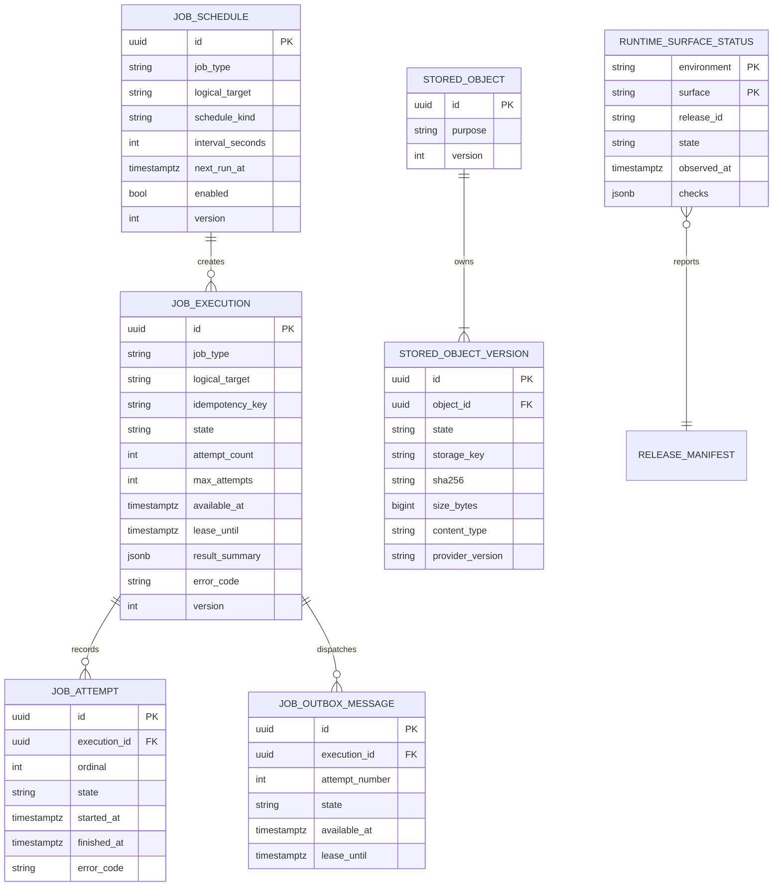
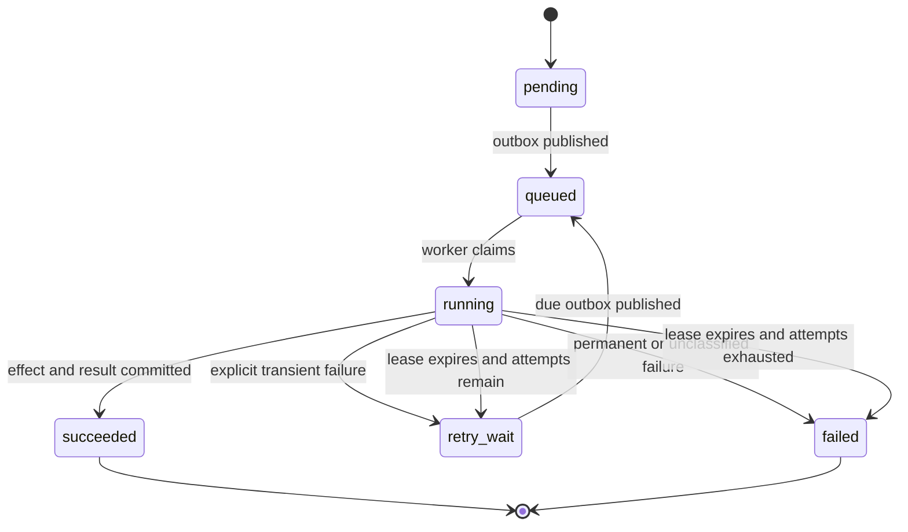

# Data Model: Foundation Runtime

**Feature**: `001-foundation-runtime`  
**Database**: PostgreSQL 17, PostGIS, pgvector  
**Time and IDs**: UTC `timestamptz`; application-generated UUIDs

## Modeling Rules

1. Domain and application records are plain Python values. SQLAlchemy mappings
   live only under `infrastructure/db`.
2. Every transaction has one SQLAlchemy `Session`; repositories may `flush`
   but only the transaction manager may `commit`.
3. Mutable auditable rows carry `version`; SQLAlchemy includes it in `UPDATE`
   predicates and stale writes become `ConcurrencyConflict`.
4. All strings written to operational rows are bounded and normalized.
   Request bodies, header values, parameters and exception text are forbidden.
5. Redis contains disposable transport state. PostgreSQL contains the durable
   job, schedule and outbox state required to rebuild Redis.
6. Object bytes and their metadata cross different transactional systems.
   A state machine and reconciler make interrupted writes recoverable; only
   `available` versions are observable to readers.

## Shared Value Objects

These are reusable Python values and SQLAlchemy column groups, not standalone
tables.

### `RecordIdentity`

| Field | Type | Rule |
| --- | --- | --- |
| `id` | UUID | Generated once by application; immutable |
| `created_at` | timestamptz | Database UTC time; immutable |
| `updated_at` | timestamptz | Database UTC time; changes on confirmed mutation |
| `version` | integer | Starts at 1; positive; optimistic lock |

### `AuditContext`

| Field | Type | Rule |
| --- | --- | --- |
| `actor_kind` | enum | `system`, `service`, `operator` in this increment |
| `actor_id` | varchar(128), nullable | Required except for `system`; opaque and non-secret |
| `source` | varchar(128) | Stable operation/source code, never free text |
| `correlation_id` | UUID | Required for every mutation |

Product identity can add an actor kind later without changing the meaning of
existing records.

## Entity Relationship View

`ReleaseManifest` is shown for its relationship but is an immutable JSON/OCI
artifact, not a database table.

## `job_executions`

Durable identity and current state of one logical execution.

| Column | Type | Null | Rule |
| --- | --- | ---: | --- |
| `id` | UUID | no | Primary key |
| `job_type` | varchar(100) | no | Registered handler name; lowercase dotted identifier |
| `logical_target` | varchar(300) | no | Canonical non-sensitive target defined by job type |
| `idempotency_key` | varchar(200) | no | Caller or scheduler supplied; opaque and non-secret |
| `state` | enum | no | See state machine |
| `attempt_count` | smallint | no | Starts 0; cannot exceed `max_attempts` |
| `max_attempts` | smallint | no | `1..10`; default reference policy is 5 |
| `available_at` | timestamptz | no | Earliest time the next attempt may run |
| `lease_owner` | varchar(128) | yes | Worker instance identifier |
| `lease_until` | timestamptz | yes | Required only while running |
| `result_summary` | JSONB | yes | Typed, bounded, allowlisted result; never arbitrary payload |
| `error_code` | varchar(100) | yes | Stable normalized code |
| `finished_at` | timestamptz | yes | Required for terminal states |
| shared identity/audit columns | mixed | no | `RecordIdentity` and `AuditContext` |

Constraints and indexes:

- unique `(job_type, logical_target, idempotency_key)`;
- check `attempt_count BETWEEN 0 AND max_attempts`;
- check terminal state iff `finished_at IS NOT NULL`;
- check running state iff lease fields are present;
- index `(state, available_at)` for relay/retry scans;
- index `(state, lease_until)` for abandoned-work recovery;
- index `correlation_id`;
- `result_summary` maximum serialized size enforced by application and test
  contract; intended limit is 8 KiB.

### State machine

Terminal replay loads `succeeded` or `failed` and returns it without changing
the row, adding an attempt or publishing an outbox message.

## `job_attempts`

Append-only evidence for every claimed attempt.

| Column | Type | Rule |
| --- | --- | --- |
| `id` | UUID | Primary key |
| `execution_id` | UUID FK | `job_executions.id`, restrict delete |
| `ordinal` | smallint | Starts 1; unique per execution |
| `transport_message_id` | varchar(200) | Deterministic `<execution_id>:<ordinal>` |
| `worker_id` | varchar(128) | Non-secret instance ID |
| `state` | enum | `running`, `succeeded`, `transient_failure`, `permanent_failure`, `abandoned` |
| `started_at` | timestamptz | Required |
| `finished_at` | timestamptz | Required except while running |
| `duration_ms` | integer | Nonnegative once finished |
| `error_code` | varchar(100), nullable | Stable normalized code only |
| `correlation_id` | UUID | Copied from execution |
| `release_id` | varchar(100) | Code version that ran the attempt |

Unique `(execution_id, ordinal)` and index `(correlation_id, started_at)`.
Attempts are never updated after they leave `running`.

## `job_outbox_messages`

Durable bridge from a committed execution or retry to Redis.

| Column | Type | Rule |
| --- | --- | --- |
| `id` | UUID | Primary key |
| `execution_id` | UUID FK | Restrict delete |
| `attempt_number` | smallint | Next attempt to enqueue |
| `state` | enum | `pending`, `publishing`, `published`, `failed` |
| `available_at` | timestamptz | Honors retry backoff |
| `lease_owner` / `lease_until` | bounded values | Present only while publishing |
| `publish_attempts` | smallint | Bounded; transport failures remain recoverable |
| `published_at` | timestamptz, nullable | Required when published |
| `error_code` | varchar(100), nullable | Normalized transport code |
| `created_at` / `updated_at` | timestamptz | Audit times |

Unique `(execution_id, attempt_number)`. The relay may publish the same message
more than once after a crash; the worker claim protocol makes this safe.

## `job_schedules`

Simple one-shot or fixed-interval activation. Cron expressions and calendars
are outside this increment.

| Column | Type | Rule |
| --- | --- | --- |
| `id` | UUID | Primary key |
| `job_type` | varchar(100) | Registered type |
| `logical_target` | varchar(300) | Canonical target template/value |
| `schedule_kind` | enum | `one_shot` or `fixed_interval` |
| `interval_seconds` | integer, nullable | Required for fixed interval; `>=60` |
| `next_run_at` | timestamptz | Next planned UTC occurrence |
| `enabled` | boolean | False after one-shot is emitted |
| `max_attempts` | smallint | Copied into created executions |
| `last_scheduled_at` | timestamptz, nullable | Evidence of latest occurrence |
| shared identity/audit columns | mixed | Optimistically versioned |

The occurrence idempotency key is
`schedule:<schedule_id>:<next_run_at in canonical UTC>`. Two schedulers claim
rows with `FOR UPDATE SKIP LOCKED`; advancing `next_run_at` and creating the
execution/outbox occur in one transaction.

## `stored_objects`

Stable logical identity independent of content versions.

| Column | Type | Rule |
| --- | --- | --- |
| `id` | UUID | Primary key |
| `purpose` | varchar(100) | Closed application purpose such as `runtime_reference` |
| shared identity/audit columns | mixed | Optimistically versioned |

No public arbitrary key or provider locator is accepted. Future Bronze objects
will point to this logical record without changing storage-provider semantics.

## `stored_object_versions`

Immutable application version and recoverable write state.

| Column | Type | Rule |
| --- | --- | --- |
| `id` | UUID | Application version ID; primary key |
| `object_id` | UUID FK | `stored_objects.id`, restrict delete |
| `state` | enum | `pending`, `available`, `failed` |
| `storage_key` | varchar(500) | Derived, immutable, unique; never logged |
| `sha256` | char(64) | Lowercase hexadecimal |
| `size_bytes` | bigint | Nonnegative |
| `content_type` | varchar(150) | Normalized media type, no parameters unless allowed |
| `provider_version` | varchar(300), nullable | Exact opaque remote reference if provided |
| `failure_code` | varchar(100), nullable | Normalized code |
| `available_at` | timestamptz, nullable | Required only for available |
| `created_at` | timestamptz | Immutable |
| `actor_kind` / `actor_id` / `source` / `correlation_id` | mixed | Creation audit |

Constraints and indexes:

- unique `(object_id, id)` (also implied by PK, retained in repository
  semantics);
- unique `storage_key`;
- check SHA-256 format and nonnegative size;
- check `available_at` only for available;
- index `(object_id, created_at DESC)`;
- index `(state, created_at)` for reconciliation;
- index `correlation_id`.

### Write protocol

1. Create or load the logical object.
2. Insert a pending version with derived immutable key and declared hash.
3. Outside the DB transaction, stream `put_if_absent`.
4. Verify provider stat, size and SHA-256.
5. Mark available in a new transaction.
6. On retry, same version/hash is idempotent; different hash is conflict.
7. A reconciler checks aged pending rows. Matching bytes complete the row;
   absence retries; conflicting bytes mark it failed and alert.

Readers query metadata first and only pass exact available references to the
adapter. They recalculate SHA-256 while streaming and fail closed on mismatch.

## `runtime_surface_status`

Latest bounded heartbeat for surfaces without an HTTP listener and optional
aggregation for all four surfaces. It is operational evidence, not product
truth.

| Column | Type | Rule |
| --- | --- | --- |
| `environment` | enum | `local`, `preview`, `production` |
| `surface` | enum | `web`, `api`, `worker`, `scheduler` |
| `release_id` | varchar(100) | Release manifest ID |
| `manifest_sha256` | char(64) | Same across all surfaces in a release |
| `artifact_digest` | varchar(200) | Exact surface image digest |
| `state` | enum | `ready`, `degraded`, `not_ready` |
| `observed_at` | timestamptz | Heartbeat time |
| `checks` | JSONB | Closed names/state/criticality only |
| `correlation_id` | UUID | Probe cycle correlation |

Primary key `(environment, surface)`. `checks` may contain only:
`name`, `state`, `critical` and stable `code`; no exception, endpoint,
credential or provider response. A worker/scheduler record is stale and
therefore `not_ready` after 60 seconds without a heartbeat.

## External but Versioned Records

### Alembic schema change

Alembic's revision graph and `alembic_version` table are authoritative.
Each revision file declares:

- revision and predecessor;
- expand/contract classification;
- transactional behavior;
- rollback safety or forward compensation;
- expected lock/runtime bound;
- verification query.

No duplicate application table is introduced solely to mirror Alembic.
Deployment evidence records the before/after revisions and outcome.

### Release manifest

The release manifest is validated by
`contracts/release-manifest.schema.json`, stored as a CI artifact and attached
to deployment evidence. It is not environment-specific and is not stored in
the product database.

## Transaction Boundaries

| Operation | Atomic boundary |
| --- | --- |
| Submit job | Execution plus initial outbox in one PostgreSQL transaction |
| Schedule occurrence | Advance schedule plus execution plus outbox in one PostgreSQL transaction |
| Claim job | Execution state/lease plus new attempt in one PostgreSQL transaction |
| PostgreSQL-only handler effect | Effect plus succeeded state/attempt in one transaction |
| External handler effect | Handler-specific idempotency key; record normalized result after external acknowledgement |
| Publish queue message | Claim/commit, publish outside transaction, mark published in a second transaction |
| Store object | Pending metadata, external write/verify, then available metadata; reconciler closes interruption |
| Update versioned record | `WHERE id=? AND version=?`; row count must be exactly one |

No transaction remains open across Redis, R2, HTTP or telemetry calls.

## Migration Order

Initial Alembic revision:

1. verify/create `postgis` and `vector`;
2. create enum types;
3. create job execution, attempt, outbox and schedule tables;
4. create stored object and object version tables;
5. create runtime surface status;
6. add checks, unique constraints and indexes;
7. verify one Alembic head and extension versions.

The initial downgrade may remove only empty foundation tables and enums. Once
later increments depend on them, normal rollback keeps the expanded schema and
uses forward compensation.

