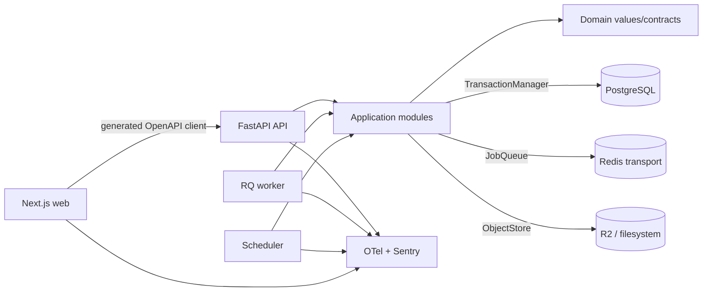

# Implementation Plan: Foundation Runtime

**Branch**: `001-foundation-runtime` | **Date**: 2026-07-28 | **Spec**: [spec.md](./spec.md)

**Input**: Feature specification for UM-H1-001 through UM-H1-012 and
UM-H1-016 through UM-H1-020.

## Summary

Create Umbral's first executable modular monolith: a synchronous Python/FastAPI
runtime, a minimal Next.js foundation, PostgreSQL-backed audit/job/object
metadata, Redis/RQ workers and scheduler, versioned object storage, safe
telemetry, probes and an immutable preview-to-production release path.

PostgreSQL is the source of truth for job execution and audit state; Redis is a
reconstructible transport. The implementation exposes small Interfaces at real
Seams (`JobQueue`, `ObjectStore`, `TransactionManager`) while keeping domain
primitives free of framework imports. Two OCI images are built once and bound
to a release manifest promoted unchanged through persistent preview and
production environments.

## Technical Context

**Language/Version**: Python `>=3.13,<3.14`; Node.js `>=24.11,<25`;
TypeScript `>=6.0,<6.1`

**Primary Dependencies**: FastAPI, Pydantic/pydantic-settings, SQLAlchemy 2,
Alembic, Psycopg 3, RQ, redis-py, Boto3; Next.js 16, React 19, shadcn/ui with
Base UI, Tailwind 4, TanStack Query, generated Hey API client; OpenTelemetry
and Sentry

**Storage**: PostgreSQL 17 with PostGIS and pgvector; Redis for disposable
queue/cache transport; S3-compatible Cloudflare R2 remotely and filesystem
locally; MinIO only for S3 contract tests

**Testing**: pytest, Testcontainers, Ruff, mypy, Alembic checks, architecture
contracts; ESLint, TypeScript, Vitest, Testing Library, Playwright and axe;
oasdiff for OpenAPI compatibility

**Target Platform**: local Windows/Linux development through Docker Compose;
`linux/amd64` OCI images on Render Pro; Cloudflare Access/R2, Grafana Cloud and
Sentry as remote providers

**Project Type**: modular monolith with separate web, API, worker and scheduler
process surfaces

**Performance Goals**: clean local start to four ready surfaces plus harness in
15 minutes; readiness reflects dependency loss in under 60 seconds; rollback
in 15 minutes; diagnosis in 15 minutes; restore in 4 hours; ten duplicate
reference submissions yield one effect

**Constraints**: RPO at most 24 hours with 12-hour backup cadence; preview and
production restricted before product identity; only minimal web `/health` may
be public; metadata-only telemetry; same release manifest and image digests
across environments; no product screens, authentication, listings, scoring,
agent runtime or notification behavior

**Scale/Scope**: four runtime surfaces, three environments, two OCI images,
three operational HTTP paths, seven foundation tables and one reference job;
single-region/single-instance beta baseline. Capacity, HA and regional recovery
remain assigned to UM-H6-018 through UM-H6-020.

## Constitution Check

*GATE: evaluated before Phase 0 and re-evaluated after Phase 1.*

| Principle | Before research | After design | Evidence |
| --- | --- | --- | --- |
| Persistent radar truth | PASS | PASS | No product listing, match or decision is introduced; durable job/object/audit primitives support later product objects |
| Auditable deterministic matching | PASS | PASS | No LLM, ranking, matching or notification decision exists in scope |
| Layer boundaries | PASS | PASS | Module map keeps framework/DB/queue/storage in adapters; automated direct and transitive import contracts are release gates |
| Data lineage and evidence | PASS | PASS | Immutable object versions, correlation, actor/source metadata, release manifests and job attempt history preserve evidence |
| Minimal verifiable scope | PASS | PASS | One monolith, one web app, one queue adapter, one scheduler loop and two object adapters; speculative product/UI/agent capabilities are excluded |

There are no constitution violations requiring a complexity exception.

## Assumptions and Tradeoffs

- A synchronous runtime is the smallest coherent model for the chosen
  blocking DB/queue/storage libraries. Moving one measured use case to async
  remains possible without changing domain contracts.
- RQ is only a transport Adapter. The additional outbox, lease and scheduler
  tables are justified by the specification's restart/idempotency guarantees;
  using Redis as truth would not meet them.
- Object bytes and PostgreSQL cannot share a transaction. Pending/available
  metadata plus reconciliation is the explicit compensation strategy.
- Cloudflare Access is an environment gate, not Umbral product identity.
  Product users, sessions and roles remain in the next increment.
- Render plus Cloudflare reduces operating work but spans two providers.
  Grafana/Sentry are already required operational capabilities. Provider
  choices and exit conditions are documented in a runtime platform ADR.
- The release is a manifest containing two image digests, not one binary.
  “Same artifact” means the same immutable manifest and exact digest pair in
  preview and production.
- PostgreSQL rollback normally keeps an expanded backward-compatible schema
  and redeploys the prior images. Unsafe data downgrade triggers an approved
  forward compensation or stops promotion.

Detailed decision records and rejected alternatives are in
[research.md](./research.md).

## Architecture



All arrows are dependency/use direction. Infrastructure Adapters implement
application Interfaces; domain code never imports infrastructure or runtime
surfaces.

## Module, Interface and Seam Design

| Module | Public Interface | Adapters / consumers | Boundary rule |
| --- | --- | --- | --- |
| Domain audit primitives | `RecordIdentity`, `AuditActor`, `AuditContext`, typed domain errors | Application consumes plain values | No FastAPI, SQLAlchemy, RQ, Boto3, OTel or web imports |
| Transactions | `TransactionManager.transaction() -> UnitOfWork` | SQLAlchemy production Adapter; in-memory unit-test Adapter | One transaction owner; repositories never commit; no external call while transaction is open |
| Durable jobs | `JobRuntime.submit/get`, registered `JobHandler` | API/scheduler/worker; PostgreSQL repositories | Owns identity, state transitions, leases, terminal replay and retry classification |
| Queue Seam | `JobQueue.publish(execution_id, attempt, correlation_id)` | RQ JSON Adapter and recording/inline test Adapter | Redis payload contains IDs only; queue state is never authoritative |
| Versioned objects | `VersionedObjects.put/open/stat` | Future ingestion/application modules | Deep Module hides pending-write/reconciliation and exposes only available exact versions |
| Object-store Seam | `ObjectStore.put_if_absent/open/stat` | Filesystem and S3 Adapters | No list/delete/latest/public URL; provider references remain opaque |
| Readiness | `ReadinessService.for_surface()` and bounded heartbeat publisher | HTTP routers, worker and scheduler loops | Probes are side-effect free; only allowlisted check names/codes leave the Module |
| Safe telemetry | typed log/span/metric methods | stdlib JSON, OTel and Sentry Adapters | No arbitrary attribute maps; unknown fields drop by default |
| HTTP boundary | OpenAPI operations and RFC 9457 problems | FastAPI routers and generated web client | Explicit stable `operationId`; Pydantic DTOs stay outside domain |
| Web API Module | generated SDK plus `server.ts`/future `browser.ts` wrappers | Server Components now; TanStack client views later | No manual DTOs or business rules; generated directory contains no manual code |
| Delivery Module | release manifest schema, access gate, migration/smoke/rollback commands | GitHub Actions, Render and Cloudflare APIs | Environments inject config only; they never rebuild candidate images |

Do not introduce `BaseRepository[T]`, a global `ports/` grab bag, a generic
service locator or an infrastructure facade. Each Interface stays next to the
capability whose complexity it hides.

## Readiness and Failure Isolation

| Surface | Critical dependencies | Degradable dependencies | Published through |
| --- | --- | --- | --- |
| web | validated runtime config, private API | telemetry | own `/health`, `/ready`, `/version` |
| api | config, PostgreSQL, expected Alembic head, PostGIS, pgvector | Redis, object storage, telemetry | own restricted probes |
| worker | config, PostgreSQL, Redis, object storage, fresh execution loop | telemetry | bounded heartbeat aggregated by API |
| scheduler | config, PostgreSQL, Redis, fresh scheduling loop | telemetry | bounded heartbeat aggregated by API |

`/ready` returns 200 for `ready` or `degraded` and 503 for `not_ready`; the
release gate is stricter and accepts only four `ready` states with the same
manifest checksum. A worker/scheduler heartbeat older than 60 seconds is
`not_ready`.

Failure isolation examples:

- Redis loss: API degraded; worker/scheduler not ready; web remains ready while
  API responds. PostgreSQL outbox rebuilds transport after recovery.
- Object-store loss: API degraded and worker not ready; scheduler remains
  ready; existing unrelated API operations remain available.
- Telemetry sink loss: affected surfaces degrade but state mutations continue
  safely; promotion is blocked until telemetry is healthy.
- PostgreSQL loss: API, worker and scheduler not ready; web becomes not ready
  because its critical private API dependency is unavailable.

## Configuration and Secret Boundary

Pydantic Settings validates one explicit inventory for `local`, `preview` and
`production`. The inventory records owner, source, consumer, requiredness,
format, secret classification, validation and permitted exposure.

Preview/production startup rejects:

- example/blank credentials;
- localhost or filesystem backends;
- plaintext external dependency URLs;
- missing release manifest/digest values;
- public API/datastore ingress;
- invalid/missing environment access configuration;
- unknown settings where accepting them would hide a typo.

Configuration errors expose field name and rule only. Settings objects,
environment dumps and secret values never enter logs, exceptions or HTTP
responses. `NEXT_PUBLIC_*` is restricted to a reviewed non-secret allowlist;
environment-specific API hosts remain runtime server configuration so the web
image is not rebuilt.

## Data and Migration Design

The full schema is in [data-model.md](./data-model.md). The initial revision
creates:

1. `job_executions`;
2. `job_attempts`;
3. `job_outbox_messages`;
4. `job_schedules`;
5. `stored_objects`;
6. `stored_object_versions`;
7. `runtime_surface_status`.

It also provisions/verifies `postgis` and `vector`, stable constraint naming
and all uniqueness/check/index requirements.

Important transaction rules:

- job execution plus outbox is atomic;
- schedule advance plus execution/outbox is atomic;
- worker claim plus attempt/lease is atomic;
- a PostgreSQL-only effect plus success result is atomic;
- queue publish and object bytes happen outside DB transactions and use
  explicit reconciliation/idempotency;
- optimistic update uses `WHERE id AND version`, increments version and checks
  exactly one row.

Migration tests cover empty DB, previous released revision, one head, metadata
drift and the declared downgrade/compensation path. APIs never migrate on boot.

## Contracts

Planning contracts:

- [OpenAPI operational contract](./contracts/openapi.yaml)
- [durable job runtime](./contracts/job-runtime.md)
- [versioned object storage](./contracts/object-storage.md)
- [operational signal allowlist](./contracts/operational-signals.md)
- [release manifest JSON Schema](./contracts/release-manifest.schema.json)

Implementation publishes deterministic OpenAPI 3.1 at
`contracts/openapi/v1/openapi.json`. Future product routes begin at `/api/v1`.
Errors use `application/problem+json`; stable request and correlation UUIDs
propagate to jobs and object operations. Contract drift, generated-client drift
and backward compatibility are independent required checks.

## Job Idempotency and Recovery

The application identity is
`(job_type, canonical logical_target, idempotency_key)`. The unique database
constraint arbitrates concurrent submitters. A terminal replay returns the
existing result with no attempt or effect; a deliberate rerun uses a new key.

The runtime is at-least-once:

- RQ messages use JSON and deterministic attempt IDs;
- the outbox closes commit-before-publish loss;
- duplicate delivery is a no-op unless it can claim the expected attempt;
- expired leases are recovered;
- only explicit transient errors retry with a declared bound/backoff;
- every mutating handler must document a transaction, provider idempotency key
  or immutable-version guard.

The reference job writes one uniquely constrained audit effect. Its acceptance
test submits ten duplicates, injects duplicate delivery and an
effect-before-ack interruption, and observes one logical effect and result.

## Object Integrity and Recovery

`VersionedObjects` derives opaque keys, creates pending metadata, streams bytes
through `ObjectStore`, verifies size/SHA-256 and marks the version available.
Only available exact versions are readable. Same-version/same-content retry is
success; differing content is conflict.

The same conformance suite runs against filesystem and S3/MinIO Adapters. A
reconciler handles stranded pending writes without making partial content
observable. Remote primary and recovery buckets are private; recovery objects
and checksum manifests are locked for 35 days.

## Observability and Audit

The allowlist in [operational-signals.md](./contracts/operational-signals.md)
is the only telemetry input surface. Route templates, normalized codes and
opaque IDs replace raw URLs, exceptions and object keys. Canary tests inspect
serialized logs, spans and Sentry events recursively.

Audit coverage:

| Operation | Durable evidence |
| --- | --- |
| schema change | Alembic before/after revision, outcome and release evidence |
| job | identity, actor/source/correlation, state, attempts, release and result/error code |
| object write | logical/version IDs, actor/source/correlation, hash, type, size and provider ref |
| release | manifest/digests, environment, access gate, migration, smoke, approval and rollback |
| recovery | source recovery point, manifests/checksums, timings, validation and cutover result |

Telemetry export failure never changes a product/job transaction. It is visible
as degraded readiness and a provider/local diagnostic without recursive
payload capture.

## Delivery and Recovery Topology

Remote baseline:

- Render Web Service: Next.js;
- Render Private Service: FastAPI;
- Render Background Worker: RQ execution;
- Render Background Worker: scheduler/outbox/reaper loops;
- managed PostgreSQL 17 and Render Key Value;
- Cloudflare Access in front of web; R2 primary/recovery buckets;
- Grafana Cloud OTLP and Sentry;
- GHCR digest-pinned images and provenance.

Only web `/health` bypasses Access and returns `{"status":"alive"}`. The Render
origin subdomain is disabled; Next validates Access JWTs. API and datastores
have no public ingress.

Release order is build/attest once, preview access gate, migration, deploy,
smoke, explicit approval, production recovery/access gates, migration, deploy
and smoke. Rollback redeploys the previous manifest by digest. Every 12 hours,
production creates an encrypted logical DB dump and copies new immutable object
versions plus checksum manifest to the locked recovery bucket. Initial and
monthly drills restore beside the primary resources.

## Project Structure

### Documentation (this feature)

```text
specs/001-foundation-runtime/
├── spec.md
├── plan.md
├── research.md
├── data-model.md
├── quickstart.md
├── contracts/
│   ├── openapi.yaml
│   ├── job-runtime.md
│   ├── object-storage.md
│   ├── operational-signals.md
│   └── release-manifest.schema.json
├── checklists/
│   ├── requirements.md
│   └── runtime-readiness.md
└── tasks.md                    # created later by /speckit-tasks
```

### Source Code (repository root)

```text
.
├── pyproject.toml
├── uv.lock
├── .python-version
├── package.json
├── package-lock.json
├── compose.yaml
├── .env.example
├── Dockerfile.runtime
├── render.yaml
├── contracts/
│   ├── openapi/v1/openapi.json
│   └── release-manifest.schema.json
├── src/umbral/
│   ├── domain/
│   │   ├── audit.py
│   │   └── errors.py
│   ├── application/
│   │   ├── transactions.py
│   │   ├── jobs/
│   │   │   ├── contracts.py
│   │   │   ├── ports.py
│   │   │   ├── service.py
│   │   │   ├── relay.py
│   │   │   └── scheduler.py
│   │   ├── objects/
│   │   │   ├── contracts.py
│   │   │   ├── ports.py
│   │   │   └── service.py
│   │   └── runtime/
│   │       ├── readiness.py
│   │       └── telemetry.py
│   ├── agent/
│   │   └── __init__.py
│   ├── infrastructure/
│   │   ├── config/settings.py
│   │   ├── db/
│   │   │   ├── base.py
│   │   │   ├── session.py
│   │   │   ├── models/
│   │   │   ├── repositories/
│   │   │   └── transaction.py
│   │   ├── queue/
│   │   │   ├── rq_queue.py
│   │   │   └── recording_queue.py
│   │   ├── object_store/
│   │   │   ├── filesystem.py
│   │   │   └── s3.py
│   │   └── observability/
│   │       ├── filtering.py
│   │       ├── logging.py
│   │       ├── otel.py
│   │       └── sentry.py
│   ├── api/
│   │   ├── main.py
│   │   ├── dependencies.py
│   │   ├── errors.py
│   │   ├── middleware/correlation.py
│   │   └── routers/runtime.py
│   ├── workers/
│   │   ├── __main__.py
│   │   ├── registry.py
│   │   ├── worker.py
│   │   └── scheduler.py
│   └── ops/
│       ├── smoke.py
│       ├── backup.py
│       └── restore.py
├── alembic/
│   ├── env.py
│   └── versions/
├── apps/web/
│   ├── package.json
│   ├── Dockerfile
│   ├── components.json
│   ├── next.config.ts
│   ├── openapi-ts.config.ts
│   └── src/
│       ├── app/
│       │   ├── layout.tsx
│       │   ├── page.tsx
│       │   ├── globals.css
│       │   ├── health/route.ts
│       │   ├── ready/route.ts
│       │   └── version/route.ts
│       ├── components/ui/
│       ├── lib/
│       │   ├── access/cloudflare.ts
│       │   ├── api/generated/
│       │   ├── api/server.ts
│       │   ├── api/browser.ts
│       │   ├── observability/
│       │   └── runtime/
│       └── proxy.ts
├── tests/
│   ├── unit/
│   ├── architecture/
│   ├── contract/
│   ├── integration/
│   ├── migrations/
│   └── e2e/
├── infra/
│   ├── cloudflare/access-policy.json
│   └── otel/collector.yaml
├── scripts/
│   ├── check.ps1
│   ├── check-architecture.ps1
│   ├── check-contracts.ps1
│   ├── check-migrations.ps1
│   ├── check-web.ps1
│   └── deploy/
│       ├── verify-access.ps1
│       ├── build-release.ps1
│       ├── promote-release.ps1
│       ├── smoke.ps1
│       └── rollback.ps1
├── docs/
│   ├── architecture/decisions/0002-runtime-platform.md
│   └── runbooks/
│       ├── configuration.md
│       ├── observability.md
│       ├── backup-restore.md
│       └── release-rollback.md
└── .github/workflows/
    ├── check.yml
    ├── release.yml
    └── promote.yml
```

**Structure Decision**: keep the accepted modular monolith under
`src/umbral`, with runtime surfaces acting only as composition roots. Keep one
Next.js app under an npm workspace because it is a separately built artifact,
not a second business backend. Root contracts and lockfiles are shared release
inputs. Provider configuration stays under `infra`/`render.yaml`; operational
commands live in explicit `ops` or deployment scripts, not in domain modules.

## Planned Implementation Sequence

The later `/speckit-tasks` artifact must decompose these phases into
test-first, path-specific tasks. Each behavioral slice starts with the failing
contract/unit/integration test named here, then the minimum implementation, then
the full gate.

### Phase A — Reproducible Toolchains and Boundaries

- Add Python/npm lockfiles, Compose dependencies and deterministic root
  commands.
- Strengthen architecture checks for direct and transitive layer violations.
- Scaffold `src/umbral` composition roots and the npm workspace without
  product behavior.
- Gate: architecture violation fixtures fail; clean skeleton passes
  `.\scripts\check.ps1`.

### Phase B — US1 Executable API/Web and Contracts

- Test invalid/unsafe configuration before implementing Settings.
- Test `/health`, `/ready`, `/version`, correlation and RFC 9457 schemas before
  adding FastAPI middleware/routes.
- Export deterministic OpenAPI, generate the web client and add drift/breaking
  checks.
- Build the accessible semantic-token foundation and minimal runtime page.
- Gate: clean local start meets the four-surface/version protocol; web lint,
  typecheck, unit, Playwright/axe and production build pass.

### Phase C — US2 Persistent Evolution

- Test empty/previous upgrades, extension verification, one head and drift
  before the initial migration.
- Test transaction commit/rollback and two competing versioned writes before
  implementing mappings/repositories.
- Gate: real PostgreSQL integration suite and migration checks pass; a stale
  writer receives typed conflict without overwriting.

### Phase D — US3 Durable Jobs and Objects

- Test duplicate submission/transport, terminal replay, retry classification,
  outbox interruption, lease expiry and concurrent scheduling before runtime
  implementation.
- Test the object Interface once and run it against filesystem and S3/MinIO
  Adapters before orchestration/reconciliation.
- Implement 12-hour backup/replica commands and restore validation, then
  perform the initial local/provider drill.
- Gate: reference job/object/recovery independent tests and operational
  allowlist tests pass.

### Phase E — US4 Observability and Delivery

- Test closed telemetry fields/canaries and per-surface dependency failures
  before configuring OTel/Sentry/readiness.
- Build and attest the two images once; validate the release manifest.
- Provision persistent preview, Cloudflare Access and provider resources;
  verify access, migrate, deploy and smoke.
- Promote the exact manifest to production, measure rollback and attach
  evidence.
- Gate: same manifest on four surfaces, metadata-only trace reconstruction,
  access rejection, smoke, rollback under 15 minutes and restore under 4 hours.

### Phase F — Cross-story Closure

- Update the configuration, observability, recovery and release runbooks.
- Run every functional-requirement fixture, success metric and
  `.\scripts\check.ps1` from a clean checkout.
- Record known provider/cost/scale limits without introducing HA or product
  features.

## Verification Commands

Target commands after implementation:

```powershell
uv sync --frozen --all-groups
uv run ruff format --check .
uv run ruff check .
uv run mypy src tests
uv run pytest
uv run alembic current --check-heads
uv run alembic check
npm ci
npm run lint
npm run typecheck
npm run test
npm run api:check
npm run build
npm run test:e2e
.\scripts\check.ps1
```

Provider/release evidence additionally runs the access gate, remote smoke,
timed rollback and restore drill from the exact runtime image. No success claim
is based only on a mock, a skipped surface or a provider dashboard screenshot.

## Backlog and Requirement Traceability

| Backlog item | Plan ownership | Primary evidence |
| --- | --- | --- |
| UM-H1-001 modular monolith | Module/Seam design and source tree | architecture contract fixtures |
| UM-H1-002 Next.js app | web workspace and Phase B | lint, typecheck, build, Playwright |
| UM-H1-003 shadcn/tokens | Phase B visual foundation | WCAG token/component/keyboard/axe checks |
| UM-H1-004 HTTP versioning | OpenAPI contract | deterministic export and oasdiff |
| UM-H1-005 typed client | web API Module | generated-directory clean diff |
| UM-H1-006 config/secrets | configuration boundary | invalid/unsafe fixture matrix and canary scan |
| UM-H1-007 PostgreSQL/extensions | data design and topology | connection/extension readiness and migration tests |
| UM-H1-008 SQLAlchemy/Alembic | transaction and migration design | empty/previous/head/drift suite |
| UM-H1-009 persistent primitives | shared data values | optimistic conflict and audit metadata tests |
| UM-H1-010 Redis/workers/scheduler | job contract and Phase D | duplicate/retry/outbox/lease/schedule suite |
| UM-H1-011 object storage | object contract and Phase D | filesystem/S3 conformance |
| UM-H1-012 backup/restore | delivery/recovery design | 12-hour/35-day policy and timed restore drill |
| UM-H1-016 logs/correlation | operational signal contract | end-to-end canary/correlation capture |
| UM-H1-017 OTel/Sentry | observability design | request-job-object trace and exporter outage |
| UM-H1-018 probes/version | readiness matrix and OpenAPI | per-surface failure isolation under 60 seconds |
| UM-H1-019 CI harness | verification commands/Phase F | required GitHub check and local harness |
| UM-H1-020 preview/production | immutable delivery design | same manifest, access gate, smoke and timed rollback |

Every FR maps through these backlog rows to at least one automated check,
provider smoke or documented timed drill. `tasks.md` must preserve these
mappings rather than regrouping cross-cutting checks away from their story.

## Complexity Tracking

No constitution violation is present. The outbox, object-write state machine
and two-provider access/hosting topology are the minimum mechanisms that close
explicit durability and access requirements; their simpler rejected
alternatives and exit conditions are recorded in [research.md](./research.md).

