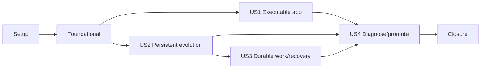

# Tasks: Foundation Runtime

**Input**: Design documents from `specs/001-foundation-runtime/`

**Prerequisites**: [plan.md](./plan.md), [spec.md](./spec.md),
[research.md](./research.md), [data-model.md](./data-model.md),
[contracts/](./contracts/), [quickstart.md](./quickstart.md)

**Tests/checks**: La especificación exige verificaciones automatizadas,
contract tests, smoke tests y drills operativos. En cada historia se escriben
primero los tests indicados y se confirma que fallen por la conducta ausente
antes de implementar.

**Organization**: Las tareas se agrupan por historia para conservar slices
demostrables. Setup y Foundational contienen sólo trabajo compartido; las
integraciones transversales permanecen explícitas en US4 y en el cierre.

## Format: `[ID] [P?] [Story] Description`

- **[P]**: puede ejecutarse en paralelo porque toca archivos distintos y no
  depende de una tarea incompleta.
- **[Story]**: historia de usuario de `spec.md`.
- Cada tarea nombra los paths exactos que crea o modifica.

## Phase 1: Setup (Shared Infrastructure)

**Purpose**: Crear toolchains reproducibles y el layout vacío aprobado, sin
introducir comportamiento de producto.

- [ ] T001 Configurar Python `>=3.13,<3.14`, dependencias runtime/dev, grupos de pytest/Ruff/mypy y resolución reproducible en `pyproject.toml`, `.python-version` y `uv.lock`
- [ ] T002 [P] Crear el workspace npm raíz con versión Node/npm y scripts `dev`, `build`, `lint`, `typecheck`, `test`, `test:e2e` y `api:check` en `package.json`
- [ ] T003 Inicializar la aplicación Next.js App Router sin pantallas de producto, fijar sus dependencias y generar el lock único en `apps/web/package.json`, `apps/web/tsconfig.json`, `apps/web/next.config.ts`, `apps/web/eslint.config.mjs`, `apps/web/postcss.config.mjs` y `package-lock.json`
- [ ] T004 [P] Crear los composition roots y paquetes vacíos aprobados mediante `src/umbral/__init__.py`, `src/umbral/domain/__init__.py`, `src/umbral/application/__init__.py`, `src/umbral/infrastructure/__init__.py`, `src/umbral/api/__init__.py`, `src/umbral/workers/__init__.py`, `src/umbral/agent/__init__.py` y `src/umbral/ops/__init__.py`
- [ ] T005 [P] Definir servicios locales fijados para PostgreSQL 17 con PostGIS/pgvector, Redis, MinIO y OpenTelemetry Collector en `compose.yaml` e `infra/otel/collector.yaml`
- [ ] T006 [P] Declarar archivos ignorados y ejemplos locales sin secretos reales en `.gitignore`, `.dockerignore`, `.env.example` y `apps/web/.env.example`
- [ ] T007 Verificar instalaciones congeladas con `uv sync --frozen --all-groups` y `npm ci`, y documentar versiones/comandos comprobados en `docs/development/runtime-toolchain.md`

**Checkpoint**: los lockfiles se instalan desde cero y el layout coincide con
el plan, aunque las superficies todavía no implementan comportamiento.

---

## Phase 2: Foundational (Blocking Prerequisites)

**Purpose**: Establecer tests compartidos, límites arquitectónicos y el harness
que usarán todas las historias.

**CRITICAL**: ninguna historia comienza hasta completar esta fase.

- [ ] T008 [P] Escribir fixtures positivos y negativos para dependencias directas/transitivas de domain, application, agent, API, workers e infrastructure en `tests/architecture/test_dependency_rules.py` y `tests/architecture/fixtures/`
- [ ] T009 Hacer fallar primero T008 y luego configurar contratos de Import Linter en `pyproject.toml` y enforcement accionable en `scripts/check-architecture.ps1`
- [ ] T010 [P] Crear fixtures compartidos de pytest/Testcontainers para PostgreSQL, Redis y MinIO, con limpieza por test y sin SQLite, en `tests/conftest.py` y `tests/support/containers.py`
- [ ] T011 [P] Configurar Vitest, Testing Library, Playwright y axe en `apps/web/vitest.config.ts`, `apps/web/playwright.config.ts` y `apps/web/src/test/setup.ts`
- [ ] T012 [P] Versionar matrices finitas de configuración, release y canaries sensibles en `tests/fixtures/configuration_cases.json`, `tests/fixtures/release-manifests/` y `tests/fixtures/telemetry_canaries.json`
- [ ] T013 Integrar checks Python/web condicionales y la regla “si la superficie existe no puede quedar SKIP” en `scripts/check.ps1`, `scripts/check-python.ps1` y `scripts/check-web.ps1`

**Checkpoint**: los límites prohibidos fallan de forma demostrable y el harness
puede incorporar checks de cada slice sin cambiar su punto de entrada.

---

## Phase 3: User Story 1 — Iniciar una aplicación coherente (Priority: P1) MVP

**Goal**: Iniciar API y web con configuración segura, contratos compartidos,
correlación, probes/version y una base visual accesible, sin features de
producto.

**Independent Test**: desde un checkout limpio con prerrequisitos instalados,
levantar API y web, consultar `/health`, `/ready` y `/version`, confirmar el
mismo release y ejecutar arquitectura, contratos, cliente generado,
accesibilidad y build en 15 minutos o menos.

### Tests for User Story 1

> Escribir T014–T020 primero y confirmar que fallan por la conducta ausente.

- [ ] T014 [P] [US1] Escribir casos parametrizados para valores ausentes, mal formados, inseguros, de ejemplo, locales o secretos canary en `tests/unit/config/test_settings.py`
- [ ] T015 [P] [US1] Escribir contract tests para esquemas, status, headers, no-store y ausencia de efectos en `/health`, `/ready` y `/version` en `tests/contract/test_runtime_api_contract.py`
- [ ] T016 [P] [US1] Escribir tests de request/correlation UUID y problemas RFC 9457 sin eco de input en `tests/contract/test_http_correlation_and_errors.py`
- [ ] T017 [P] [US1] Escribir tests de export OpenAPI 3.1 determinista, `operationId` estable y clasificación compatible/incompatible en `tests/contract/test_openapi_versioning.py`
- [ ] T018 [P] [US1] Escribir el check que detecta drift entre OpenAPI publicado y cliente web generado en `tests/contract/test_generated_client.py`
- [ ] T019 [P] [US1] Escribir tests unitarios de layout, tokens semánticos y primitives mínimas en `apps/web/src/app/page.test.tsx` y `apps/web/src/components/ui/foundation.test.tsx`
- [ ] T020 [P] [US1] Escribir Playwright para health/version, teclado, foco, contraste, ambos temas, zoom/reflow, reduced motion y axe A/AA en `tests/e2e/web-foundation.spec.ts`

### Implementation for User Story 1

- [ ] T021 [P] [US1] Implementar el valor inmutable de release y carga/validación del manifiesto local en `src/umbral/application/runtime/version.py`
- [ ] T022 [P] [US1] Implementar Settings por ambiente, diagnóstico por nombre/regla y rechazo de defaults inseguros sin imprimir valores en `src/umbral/infrastructure/config/settings.py`
- [ ] T023 [US1] Completar inventario de configuración con owner, fuente, consumidor, requiredness, formato, secreto y exposición en `docs/runbooks/configuration.md`, `.env.example` y `apps/web/.env.example`
- [ ] T024 [P] [US1] Implementar errores tipados, respuestas `application/problem+json` y middleware request/correlation ID en `src/umbral/domain/errors.py`, `src/umbral/api/errors.py` y `src/umbral/api/middleware/correlation.py`
- [ ] T025 [US1] Implementar el Module base de readiness con probes side-effect-free y estados `ready/degraded/not_ready` en `src/umbral/application/runtime/readiness.py`
- [ ] T026 [US1] Implementar `/health`, `/ready` y `/version` con los schemas/headers exactos del contrato en `src/umbral/api/routers/runtime.py`
- [ ] T027 [US1] Componer Settings, release, errores, correlación y router runtime en `src/umbral/api/dependencies.py` y `src/umbral/api/main.py`
- [ ] T028 [US1] Crear export OpenAPI ordenado y publicar la salida de FastAPI en `scripts/export-openapi.ps1` y `contracts/openapi/v1/openapi.json`
- [ ] T029 [US1] Configurar Hey API fijado y generar Fetch/TypeScript/SDK/TanStack sin código manual en `apps/web/openapi-ts.config.ts` y `apps/web/src/lib/api/generated/`
- [ ] T030 [US1] Implementar wrappers de configuración server/browser y QueryClient sin duplicar DTOs en `apps/web/src/lib/api/server.ts`, `apps/web/src/lib/api/browser.ts` y `apps/web/src/lib/query/query-client.ts`
- [ ] T031 [P] [US1] Inicializar shadcn/ui Base UI/Vega y tokens OKLCH/WCAG con button, field/input, card, alert, skeleton y spinner en `apps/web/components.json`, `apps/web/package.json`, `package-lock.json`, `apps/web/src/app/globals.css` y `apps/web/src/components/ui/`
- [ ] T032 [US1] Implementar layout `es-AR`, skip-link, landmarks, tipografía, temas y página mínima de estado sin UI inmobiliaria en `apps/web/src/app/layout.tsx` y `apps/web/src/app/page.tsx`
- [ ] T033 [US1] Implementar probes web side-effect-free y versión derivada del manifiesto en `apps/web/src/app/health/route.ts`, `apps/web/src/app/ready/route.ts`, `apps/web/src/app/version/route.ts` y `apps/web/src/lib/runtime/`
- [ ] T034 [US1] Implementar drift/compatibilidad/generación y build web como gates del harness en `scripts/check-contracts.ps1`, `scripts/check-web.ps1` y `scripts/check.ps1`
- [ ] T035 [US1] Documentar y ejecutar el recorrido independiente cronometrado, guardando comandos, release observado y resultado en `docs/runbooks/runtime-local.md` y `docs/runbooks/evidence/us1-local-start.md`

**Checkpoint**: US1 es un MVP demostrable; API y web arrancan, comparten
release/contrato, rechazan configuración insegura y pasan accesibilidad.

---

## Phase 4: User Story 2 — Evolucionar datos con trazabilidad (Priority: P2)

**Goal**: Evolucionar PostgreSQL de forma repetible y ofrecer transacciones,
metadata auditada y locking optimista sin acoplar dominio a SQLAlchemy.

**Independent Test**: aplicar la revisión inicial desde vacío y desde la
revisión previa, comprobar PostGIS/pgvector y ausencia de drift, confirmar
rollback transaccional y demostrar que dos escritores con la misma versión
producen un único cambio y un conflicto tipado.

### Tests for User Story 2

> Escribir T036–T040 primero y confirmar que fallan por la conducta ausente.

- [ ] T036 [P] [US2] Escribir tests de bootstrap vacío, revisión esperada y capacidades PostGIS/pgvector en `tests/migrations/test_bootstrap_and_extensions.py`
- [ ] T037 [P] [US2] Escribir tests de upgrade desde revisión previa, head único, downgrade vacío declarado y drift metadata/schema en `tests/migrations/test_upgrade_and_drift.py`
- [ ] T038 [P] [US2] Escribir integración de commit, rollback, close y prohibición de commit en repositorios en `tests/integration/db/test_transactions.py`
- [ ] T039 [P] [US2] Escribir tests de identidad/timestamps/actor/source/correlation y dos updates con la misma versión en `tests/integration/db/test_audit_and_optimistic_locking.py`
- [ ] T040 [P] [US2] Escribir tests de conectividad, extensiones y Alembic head como probes sanitizados en `tests/integration/db/test_persistence_readiness.py`

### Implementation for User Story 2

- [ ] T041 [P] [US2] Implementar `RecordIdentity`, `AuditActor`, `AuditContext` y `ConcurrencyConflict` como valores puros en `src/umbral/domain/audit.py` y `src/umbral/domain/errors.py`
- [ ] T042 [US2] Definir `TransactionManager`/`UnitOfWork` y Adapter in-memory de pruebas sin repositorio genérico en `src/umbral/application/transactions.py` y `tests/fakes/transactions.py`
- [ ] T043 [US2] Implementar naming convention, engine/session por ejecución, transacción SQLAlchemy y traducción de `StaleDataError` en `src/umbral/infrastructure/db/base.py`, `src/umbral/infrastructure/db/session.py` y `src/umbral/infrastructure/db/transaction.py`
- [ ] T044 [P] [US2] Mapear ejecuciones, intentos, outbox y schedules con constraints/índices/versionado definidos en `src/umbral/infrastructure/db/models/jobs.py`
- [ ] T045 [P] [US2] Mapear objetos/versiones y estados de superficie con constraints/índices/auditoría definidos en `src/umbral/infrastructure/db/models/objects.py` y `src/umbral/infrastructure/db/models/runtime.py`
- [ ] T046 [US2] Configurar Alembic lineal, comparación de tipos/defaults y carga de metadata en `alembic.ini` y `alembic/env.py`
- [ ] T047 [US2] Crear la revisión bootstrap transaccional con extensiones, siete tablas, verificación y downgrade sólo-vacío documentado en `alembic/versions/0001_foundation_runtime.py`
- [ ] T048 [US2] Implementar probes PostgreSQL/Alembic/PostGIS/pgvector con códigos allowlisted en `src/umbral/infrastructure/db/readiness.py`
- [ ] T049 [US2] Incorporar upgrade vacío/previo, head y drift al harness sin migrar durante startup en `scripts/check-migrations.ps1` y `scripts/check.ps1`
- [ ] T050 [US2] Documentar creación, upgrade, verificación, bloqueo concurrente y compensación de cambios de datos, y registrar la prueba independiente en `docs/runbooks/data-evolution.md` y `docs/runbooks/evidence/us2-data-evolution.md`

**Checkpoint**: US2 recrea el estado persistente sin drift, revierte
transacciones fallidas y rechaza escrituras obsoletas.

---

## Phase 5: User Story 3 — Ejecutar trabajo durable y recuperable (Priority: P3)

**Goal**: Ejecutar jobs at-least-once con efecto lógico idempotente, scheduling
simple, objetos inmutables verificables y recuperación dentro de RPO/RTO.

**Independent Test**: diez submissions iguales, duplicate delivery,
effect-before-ack, retry, lease vencido y dos schedulers dejan un efecto y
resultado; dos versiones de objeto pasan el mismo contrato local/S3; un restore
recupera DB y objetos con checksums dentro del presupuesto.

### Tests for User Story 3

> Escribir T051–T060 primero y confirmar que fallan por la conducta ausente.

- [ ] T051 [P] [US3] Escribir unit tests de normalización de objetivo, identidad compuesta, estados terminales y clasificación transient/permanent/unclassified en `tests/unit/application/jobs/test_job_contracts.py`
- [ ] T052 [P] [US3] Escribir contract tests para `JobQueue` recording/RQ, JSON-only y payload limitado a IDs/correlación en `tests/contract/test_job_queue.py`
- [ ] T053 [P] [US3] Escribir integración de diez submissions, replay terminal, rerun con clave nueva y no-colisión por tipo/objetivo en `tests/integration/jobs/test_submission_idempotency.py`
- [ ] T054 [P] [US3] Escribir integración de crash commit-before-publish, duplicate publish y reconstrucción tras pérdida de Redis en `tests/integration/jobs/test_outbox_recovery.py`
- [ ] T055 [P] [US3] Escribir integración de duplicate delivery, lease vencido, backoff acotado, agotamiento y effect-before-ack sin duplicación en `tests/integration/jobs/test_worker_recovery.py`
- [ ] T056 [P] [US3] Escribir integración de dos schedulers sobre one-shot/fixed-interval y una occurrence key UTC en `tests/integration/jobs/test_scheduler_overlap.py`
- [ ] T057 [P] [US3] Escribir la suite de conformance de versiones, hash, content type, retry/conflict y concurrencia para filesystem en `tests/contract/test_object_store.py`
- [ ] T058 [P] [US3] Parametrizar la misma suite de T057 contra S3/MinIO y checksums/provider refs opacos en `tests/integration/object_store/test_s3_conformance.py`
- [ ] T059 [P] [US3] Escribir integración pending/available/failed, interrupción metadata-bytes, reconciliación y lectura fail-closed en `tests/integration/object_store/test_versioned_objects.py`
- [ ] T060 [P] [US3] Escribir integración de dump/replica/manifest, restore beside-primary, Alembic/counts/checksums y medición RPO/RTO en `tests/integration/recovery/test_backup_restore.py`

### Implementation for User Story 3

- [ ] T061 [P] [US3] Implementar DTOs, estados, errores, `JobRuntime`, `JobHandler` y `JobQueue` Interfaces en `src/umbral/application/jobs/contracts.py` y `src/umbral/application/jobs/ports.py`
- [ ] T062 [US3] Implementar repositorios específicos y operaciones lock/lease/attempt/outbox/schedule sin commit propio en `src/umbral/infrastructure/db/repositories/jobs.py`
- [ ] T063 [US3] Implementar submit/get, unique-conflict replay, claim, outcomes y backoff de cinco intentos en `src/umbral/application/jobs/service.py`
- [ ] T064 [P] [US3] Implementar Adapters RQ con `JSONSerializer` e inline/recording sin pickle en `src/umbral/infrastructure/queue/rq_queue.py` y `src/umbral/infrastructure/queue/recording_queue.py`
- [ ] T065 [US3] Implementar relay de outbox y reaper de leases con claims cortos y publish fuera de transacción en `src/umbral/application/jobs/relay.py`
- [ ] T066 [US3] Implementar registry explícito y job `foundation.reference` cuyo efecto auditado único usa un `stored_objects` determinista en `src/umbral/workers/registry.py` y `src/umbral/application/jobs/reference.py`
- [ ] T067 [US3] Implementar ejecución worker, transacción de efecto/resultado y manejo sanitizado de fallos en `src/umbral/workers/worker.py`
- [ ] T068 [US3] Implementar scheduler one-shot/fixed-interval con `SKIP LOCKED`, occurrence UTC y avance+submit atómico en `src/umbral/application/jobs/scheduler.py`
- [ ] T069 [US3] Componer CLI `worker|scheduler`, relay/reaper/reconciler y heartbeat <=30 s en `src/umbral/workers/__main__.py`, `src/umbral/workers/scheduler.py` y `src/umbral/infrastructure/db/repositories/runtime.py`
- [ ] T070 [P] [US3] Implementar `ObjectVersionRef`, errores, `VersionedObjects` y `ObjectStore` Interfaces mínimos en `src/umbral/application/objects/contracts.py` y `src/umbral/application/objects/ports.py`
- [ ] T071 [US3] Implementar repositorios específicos de objeto/versión con transitions y exact refs en `src/umbral/infrastructure/db/repositories/objects.py`
- [ ] T072 [US3] Implementar put/open/stat profundo, claves derivadas, verificación streaming y reconciliación de pending writes en `src/umbral/application/objects/service.py` y `src/umbral/application/objects/reconcile.py`
- [ ] T073 [P] [US3] Implementar creación exclusiva y rename atómico del Adapter filesystem en `src/umbral/infrastructure/object_store/filesystem.py`
- [ ] T074 [P] [US3] Implementar Adapter S3/R2 con conditional put, stat/checksum y provider ref opaco en `src/umbral/infrastructure/object_store/s3.py`
- [ ] T075 [US3] Componer DB, Redis y object-store Adapters por ambiente sin credenciales fuera de infrastructure en `src/umbral/api/dependencies.py` y `src/umbral/infrastructure/config/settings.py`
- [ ] T076 [US3] Implementar backup lógico cifrado, inventario de objetos nuevos, checksum manifest cada 12 horas y policy privada/lock de 35 días en `src/umbral/ops/backup.py` e `infra/cloudflare/r2-policy.json`
- [ ] T077 [US3] Implementar réplica a recovery bucket y restore a namespaces nuevos con validación Alembic/counts/hashes en `src/umbral/ops/restore.py`
- [ ] T078 [US3] Documentar owners, frecuencia, 35 días, exclusiones y cutover; ejecutar el drill inicial local y guardar tiempos/evidencia en `docs/runbooks/backup-restore.md` y `docs/runbooks/evidence/us3-restore-initial.md`
- [ ] T079 [US3] Incorporar suites jobs/object/recovery y comandos focalizados al harness en `scripts/check-jobs.ps1`, `scripts/check-storage.ps1`, `scripts/check-recovery.ps1` y `scripts/check.ps1`

**Checkpoint**: US3 demuestra durable execution, object integrity y restore
sin depender de Redis como fuente de verdad.

---

## Phase 6: User Story 4 — Diagnosticar y promover una versión (Priority: P4)

**Goal**: Reconstruir recorridos metadata-only, aislar readiness por superficie
y promover el mismo manifiesto por preview/production con acceso restringido,
smoke, rollback y evidencia.

**Independent Test**: un release manifest recorre preview y production con los
mismos digests, cuatro superficies ready, acceso externo denegado salvo
`/health`, trace request-job-object reconstruible, fallo localizado en menos de
15 minutos, rollback menor a 15 minutos y restore menor a 4 horas.

### Tests for User Story 4

> Escribir T080–T086 primero y confirmar que fallan por la conducta ausente.

- [ ] T080 [P] [US4] Escribir contract tests recursivos de JSON logs, spans y Sentry `beforeSend` con allowlist/canaries en `tests/contract/test_operational_signals.py`
- [ ] T081 [P] [US4] Escribir tests TypeScript de allowlist, route templates y rechazo de URLs/headers/query/free text en `apps/web/src/lib/observability/telemetry.test.ts`
- [ ] T082 [P] [US4] Escribir E2E con app/router de test que origine request->job->object bajo una correlación, release y cero contenido sensible en `tests/e2e/test_correlation_trace.py`
- [ ] T083 [P] [US4] Escribir integración parametrizada de pérdida de PostgreSQL, Redis, object storage y telemetría con aislamiento y cambio <60 s en `tests/integration/runtime/test_readiness_failure_isolation.py`
- [ ] T084 [P] [US4] Escribir tests JSON Schema, dos digests, manifest checksum y coincidencia entre cuatro superficies en `tests/contract/test_release_manifest.py`
- [ ] T085 [P] [US4] Escribir contract tests del policy esperado: origin cerrado, API/datastores privados, Access requerido y único bypass `/health` en `tests/contract/test_environment_access.py`
- [ ] T086 [P] [US4] Escribir integración del lock de promoción, migration-before-deploy, mismo manifest, smoke fallido y rollback al manifest previo en `tests/integration/delivery/test_release_flow.py`

### Implementation for User Story 4

- [ ] T087 [P] [US4] Implementar normalización y closed-field filtering común sin mapas arbitrarios en `src/umbral/application/runtime/telemetry.py` y `src/umbral/infrastructure/observability/filtering.py`
- [ ] T088 [US4] Implementar JSON logging, OpenTelemetry OTLP y Sentry sin PII/replay/attachments con fallo de exporter degradable en `src/umbral/infrastructure/observability/logging.py`, `src/umbral/infrastructure/observability/otel.py` y `src/umbral/infrastructure/observability/sentry.py`
- [ ] T089 [US4] Instrumentar API, job attempts, scheduler y object operations con correlation/release/operation/state/duration únicamente en `src/umbral/api/middleware/correlation.py`, `src/umbral/workers/worker.py`, `src/umbral/application/jobs/scheduler.py` y `src/umbral/application/objects/service.py`
- [ ] T090 [P] [US4] Implementar facade web metadata-only e inicialización OTel/Sentry segura en `apps/web/src/lib/observability/telemetry.ts`, `apps/web/src/instrumentation.ts` y `apps/web/src/instrumentation-client.ts`
- [ ] T091 [US4] Componer matriz completa de probes, heartbeats stale, aggregate status y códigos sanitizados en `src/umbral/application/runtime/readiness.py`, `src/umbral/api/routers/runtime.py` y `src/umbral/api/dependencies.py`
- [ ] T092 [US4] Propagar correlación/readiness/version por el server client y routes web sin exponer host privado ni parámetros en `apps/web/src/lib/api/server.ts`, `apps/web/src/app/ready/route.ts` y `apps/web/src/app/version/route.ts`
- [ ] T093 [P] [US4] Publicar el JSON Schema aprobado y construir manifests inmutables desde git/Alembic/digests en `contracts/release-manifest.schema.json` y `src/umbral/ops/release.py`
- [ ] T094 [P] [US4] Crear imágenes multi-stage reproducibles `linux/amd64`, non-root y runtime-configurable en `Dockerfile.runtime` y `apps/web/Dockerfile`
- [ ] T095 [US4] Implementar build único, scan, push GHCR por digest, attestations y manifest checksum en `scripts/deploy/build-release.ps1`
- [ ] T096 [P] [US4] Declarar web, API privada, worker, scheduler, PostgreSQL 17 y Key Value por ambiente sin auto-build mutable en `render.yaml`
- [ ] T097 [P] [US4] Declarar policy Cloudflare por ambiente y validar JWT signature/audience/expiry con bypass exacto de `/health` en `infra/cloudflare/access-policy.json`, `apps/web/src/lib/access/cloudflare.ts` y `apps/web/src/proxy.ts`
- [ ] T098 [US4] Implementar gate read-only que compara Render/Cloudflare con el policy esperado y registra evidencia sin credenciales en `scripts/deploy/verify-access.ps1`
- [ ] T099 [US4] Implementar lock mutuo por ambiente con create-if-absent, owner/release/expiry y rechazo concurrente en `src/umbral/ops/release_lock.py`
- [ ] T100 [US4] Implementar promoción por manifest exacto con access/backup gates, migration única y orden de superficies en `scripts/deploy/promote-release.ps1`
- [ ] T101 [US4] Implementar smoke interno de cuatro superficies, extensiones, reference job, objeto sintético y release identity sin datos de producto en `src/umbral/ops/smoke.py` y `scripts/deploy/smoke.ps1`
- [ ] T102 [US4] Implementar rollback por digest/config snapshot, verificación de schema compatible y evidencia cronometrada en `scripts/deploy/rollback.ps1`
- [ ] T103 [US4] Implementar gate de recovery point <12 h y validación de retención/manifest antes de production en `src/umbral/ops/recovery_gate.py`
- [ ] T104 [P] [US4] Crear CI requerida con lockfiles frozen, arquitectura, migraciones, contratos, Python, web, Playwright y manifest schema en `.github/workflows/check.yml`
- [ ] T105 [P] [US4] Crear workflow que construye/escanea/attesta una vez y publica manifest/digests como artefacto inmutable en `.github/workflows/release.yml`
- [ ] T106 [US4] Crear workflow manual que promociona preview, requiere aprobación production y reutiliza exactamente el manifest aprobado en `.github/workflows/promote.yml`
- [ ] T107 [P] [US4] Registrar topología, alternativas, costos/riesgos y exit conditions de Render/Cloudflare/R2/Grafana/Sentry en `docs/architecture/decisions/0002-runtime-platform.md`
- [ ] T108 [P] [US4] Documentar búsqueda por correlación, códigos, dashboards/enlaces, filtros PII y outage de exporter en `docs/runbooks/observability.md`
- [ ] T109 [US4] Documentar build, access gate, migration, smoke, lock, approval, rollback/compensación y evidencia en `docs/runbooks/release-rollback.md`
- [ ] T110 [US4] Provisionar preview persistente, ejecutar access gate+migration+deploy+smoke y guardar manifest/resultados en `docs/runbooks/evidence/us4-preview-release.md`
- [ ] T111 [US4] Provisionar/verificar production, promover el mismo manifest, forzar un smoke fallido controlado, medir rollback <15 min y guardar evidencia en `docs/runbooks/evidence/us4-production-rollback.md`
- [ ] T112 [US4] Ejecutar restore remoto beside-primary de DB+objetos, validar RPO/RTO/head/counts/hashes y guardar evidencia en `docs/runbooks/evidence/us4-production-restore.md`
- [ ] T113 [US4] Inyectar un fallo representativo, entregarlo sólo por correlation ID, medir diagnóstico <15 min y guardar superficie/ejecución/release causal en `docs/runbooks/evidence/us4-diagnostic-drill.md`

**Checkpoint**: las cuatro historias están integradas y el mismo release
verificado puede observarse, promoverse, restaurarse y revertirse.

---

## Phase 7: Polish & Cross-Cutting Closure

**Purpose**: Cerrar documentación, trazabilidad y evidencia integral sin sumar
features ni refactors.

- [ ] T114 [P] Actualizar superficies implementadas, endpoints operativos, checks y dirección de dependencias en `docs/api/endpoints.md`, `docs/harness/overview.md` y `docs/architecture/overview.md`
- [ ] T115 Ejecutar `specs/001-foundation-runtime/quickstart.md` desde checkout limpio, medir el límite de 15 minutos y registrar prerrequisitos/comandos/resultados en `docs/runbooks/evidence/foundation-quickstart.md`
- [ ] T116 Recorrer FR-001–FR-031 y SC-001–SC-011 contra tests/drills reales y registrar matriz de evidencia y limitaciones en `docs/runbooks/evidence/foundation-acceptance.md`
- [ ] T117 Eliminar todo SKIP residual de superficies ya implementadas, ejecutar `uv run pytest`, checks npm y `.\scripts\check.ps1`, y ajustar sólo wiring in-scope en `scripts/check.ps1`
- [ ] T118 Marcar UM-H1-001–UM-H1-012 y UM-H1-016–UM-H1-020 como completados únicamente después de T116–T117 en `docs/product/backlog.md`
- [ ] T119 [P] Documentar límites aceptados de capacidad, single-region, costos, HA y recovery regional diferido sin implementarlos en `docs/runbooks/runtime-limitations.md`

---

## Dependencies & Execution Order

### Phase Dependencies

- **Phase 1 — Setup**: sin dependencias; comienza inmediatamente.
- **Phase 2 — Foundational**: depende de Phase 1 y bloquea las historias.
- **US1 (P1)**: depende de Foundational.
- **US2 (P2)**: depende de Foundational. Su núcleo de DB puede avanzar en
  paralelo con US1; la integración del harness debe coordinarse porque ambas
  historias tocan scripts raíz.
- **US3 (P3)**: depende de US2 para mappings, transacciones y migración.
- **US4 (P4)**: depende de US1, US2 y US3 porque verifica el recorrido
  request-job-object y entrega el runtime completo.
- **Phase 7 — Closure**: depende de las historias incluidas.

### User Story Dependency Graph



### Within Each User Story

- Los tests del bloque se escriben y fallan antes de la implementación.
- Valores/Interfaces preceden a Adapters.
- Mappings preceden a migraciones y repositorios.
- Services preceden a composition roots/endpoints/workers.
- Gates y evidencia se ejecutan al final de cada historia.
- No se marca una historia completa por pasar sólo mocks o checks con SKIP.

## Parallel Opportunities

### Setup and Foundational

- T002, T004, T005 y T006 pueden avanzar en paralelo después de T001; T003
  depende de que T002 defina el workspace raíz.
- T008, T010, T011 y T012 trabajan sobre suites distintas.

### Parallel Example: User Story 1

```text
Tests: T014, T015, T016, T017, T018, T019, T020
Implementation branches: T021 + T022 + T024 + T031
```

T025–T030 y T032–T035 integran esas ramas en orden.

### Parallel Example: User Story 2

```text
Tests: T036, T037, T038, T039, T040
Mappings after T043: T044 and T045
```

T046–T050 cierran migración, readiness y evidencia.

### Parallel Example: User Story 3

```text
Tests: T051, T052, T053, T054, T055, T056, T057, T058, T059, T060
Interfaces: T061 and T070
Adapters after their Interfaces: T064, T073, T074
```

La rama jobs converge en T069; la rama objects converge en T075. Backup/restore
comienza después de ambas.

### Parallel Example: User Story 4

```text
Tests: T080, T081, T082, T083, T084, T085, T086
Provider-independent implementation: T087, T090, T093, T094
Documentation after decisions stabilize: T107 and T108
Workflows after scripts: T104, T105, then T106
```

Los cambios remotos T110–T113 se ejecutan secuencialmente para preservar
evidencia y evitar promociones concurrentes.

## Backlog Coverage

| Backlog item | Primary tasks |
| --- | --- |
| UM-H1-001 | T004, T008–T009 |
| UM-H1-002 | T002–T003, T019–T020, T032–T033 |
| UM-H1-003 | T019–T020, T031–T032 |
| UM-H1-004 | T015–T017, T024, T026, T028 |
| UM-H1-005 | T018, T029–T030, T034 |
| UM-H1-006 | T014, T022–T023 |
| UM-H1-007 | T005, T036, T040, T047–T048 |
| UM-H1-008 | T036–T038, T043, T046–T049 |
| UM-H1-009 | T039, T041–T045 |
| UM-H1-010 | T051–T056, T061–T069 |
| UM-H1-011 | T057–T059, T070–T075 |
| UM-H1-012 | T060, T076–T078, T103, T112 |
| UM-H1-016 | T016, T080–T082, T087–T090 |
| UM-H1-017 | T080–T083, T088–T090, T108, T113 |
| UM-H1-018 | T015, T033, T040, T069, T083, T091–T092 |
| UM-H1-019 | T013, T034, T049, T079, T104, T117 |
| UM-H1-020 | T084–T086, T093–T106, T109–T112 |

## Implementation Strategy

### MVP First — US1

1. Complete Setup and Foundational.
2. Complete T014–T035.
3. Stop and validate US1 from a clean checkout.
4. Demo API/web, config rejection, contract drift and accessibility before
   adding persistence/jobs/providers.

### Incremental Delivery

1. **US1**: executable contract-first app.
2. **US2**: durable auditable persistence.
3. **US3**: recoverable jobs and objects.
4. **US4**: telemetry and immutable remote delivery.
5. **Closure**: full evidence, no SKIPs, backlog update.

Each checkpoint is independently demonstrable; production promotion is not
attempted until all four stories and their provider gates exist.

### Parallel Team Strategy

- Después de Foundational, un stream puede terminar US1 mientras otro
  implementa el núcleo DB de US2.
- Tras US2, job runtime y object storage de US3 pueden avanzar como ramas
  coordinadas porque sus Interfaces/Adapters viven en archivos distintos.
- En US4, observabilidad, packaging y documentación pueden avanzar en paralelo;
  acceso/promoción remotos permanecen serializados.

## Notes

- `[P]` significa archivos distintos y ausencia de dependencia incompleta, no
  permiso para ignorar orden test-first.
- Los paths generados (`apps/web/src/lib/api/generated/`, lockfiles y OpenAPI)
  se versionan y deben quedar sin diff después de regenerar.
- No agregar autenticación de producto, pantallas inmobiliarias, MapLibre,
  LangGraph, dashboards, Storybook, HA, regional recovery ni features fuera de
  este incremento.
- No crear `BaseRepository[T]`, un directorio global de ports, servicios
  genéricos o wrappers vacíos.
- Commits pueden agrupar una tarea o un bloque lógico pequeño, pero cada
  checkpoint se verifica antes de avanzar.
