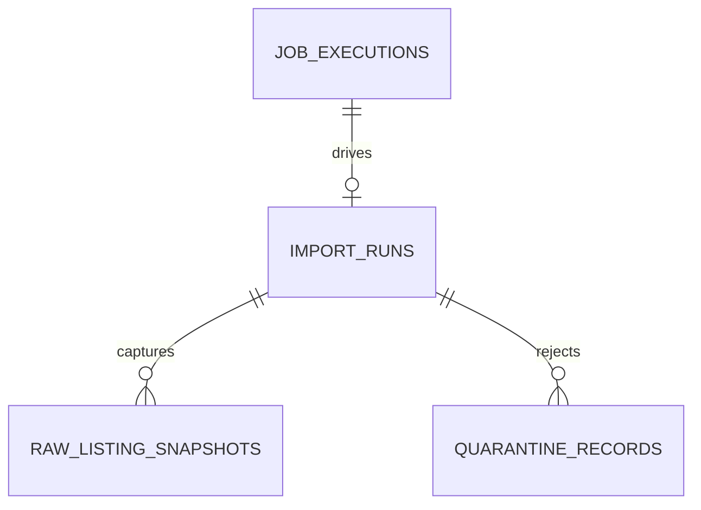

# Data Model: Bronze Ingestion

**Feature**: `002-bronze-ingestion` | **Date**: 2026-08-06

Data entities added by this increment. All tables use the shared
`IdentityAuditMixin` columns (`id`, `created_at`, `updated_at`, `version`,
`actor_kind`, `actor_id`, `source`, `correlation_id`) except where noted, and
follow the repository naming/constraint conventions of `001-foundation-runtime`.

## Entity overview



- An `import_run` is created by the operator entry and executed by a durable
  job (`job_executions`). Its job identity guarantees batch idempotency.
- The full raw file is stored as an immutable object version
  (`ingestion/raw/<sha256>`) via the object-storage seam; the run keeps the
  storage key for cross-process reads.
- Valid records produce `raw_listing_snapshots` (Bronze, immutable, additive).
- Invalid records produce `quarantine_records`.

## import_runs

One row per batch submission. Identity: `(source_id, batch_key)` unique.

| Column | Type | Rules |
| --- | --- | --- |
| id | UUID | PK (mixin) |
| created_at / updated_at | timestamptz | mixin |
| version | int | mixin, optimistic lock |
| actor_kind / actor_id / source / correlation_id | | mixin (operator actor) |
| job_execution_id | UUID FK `job_executions.id` | nullable, RESTRICT |
| batch_key | string 200 | normalized opaque key; unique with source_id |
| source_id | string 100 | normalized source identity |
| source_version | string 100 | source's declared version |
| contract_version | string 100 | supported contract version ("1") |
| format | enum `import_format` | `csv` \| `json` |
| file_name | string 255 | safe basename only (no path) |
| file_sha256 | string 64 | lowercase hex of raw file |
| file_size_bytes | bigint | >= 0 |
| raw_storage_key | string 500 | immutable content-addressed key of the raw file |
| state | enum `import_run_state` | `pending` \| `running` \| `succeeded` \| `failed` |
| parser_version | string 100 | contract/parser version used |
| total_records | int | derived at completion |
| accepted | int | derived at completion |
| quarantined | int | derived at completion |
| duplicates | int | derived at completion |
| missing_fields | int | derived at completion |
| finished_at | timestamptz | nullable |
| error_code | string 100 | nullable, normalized |
| error_detail | string 500 | nullable, actionable, non-sensitive |

**Constraints**:
- `uq_import_runs_source_batch` on `(source_id, batch_key)`.
- `ck_import_runs_terminal_finished`: `(state IN ('succeeded','failed') AND
  finished_at IS NOT NULL) OR (state NOT IN ('succeeded','failed') AND
  finished_at IS NULL)`.
- `ck_import_runs_counts`: each count `>= 0`.
- `ck_import_runs_file_size`: `file_size_bytes >= 0`.
- Indexes: `(state, created_at)`, `(correlation_id)`.

**State transitions**:

```text
pending -> running -> succeeded
                  \-> failed
```

- `succeeded` / `failed` are terminal. Re-submission with the same identity
  returns the existing run.
- Counts are recomputed from committed rows at completion, so an interrupted
  retry never double counts.

## raw_listing_snapshots

One immutable row per valid captured record. Unique:
`(source_id, external_id, content_sha256)`.

| Column | Type | Rules |
| --- | --- | --- |
| id | UUID | PK (mixin) |
| created_at / updated_at / version / actor / source / correlation_id | | mixin |
| run_id | UUID FK `import_runs.id` | RESTRICT |
| source_id | string 100 | |
| source_version | string 100 | |
| contract_version | string 100 | |
| external_id | string 500 | source's listing identifier from payload |
| content_sha256 | string 64 | lowercase hex of raw record bytes |
| payload | JSONB | parsed raw record, bounded |
| content_type | string 100 | normalized media type of raw content |
| size_bytes | bigint | >= 0 |
| published_at | timestamptz | nullable; from payload when present |
| captured_at | timestamptz | import time |

**Constraints**:
- `uq_raw_listing_snapshots_content` on `(source_id, external_id,
  content_sha256)`.
- `ck_raw_listing_snapshots_size`: `size_bytes >= 0`.
- Indexes: `(run_id)`, `(source_id, external_id)`.

**Notes**:
- Immutable: rows are never updated; a correction inserts a new snapshot.
- Additive: changed content for the same `external_id` inserts a new row
  (change detection belongs to H2.2).
- The full raw file remains available as the run's immutable object version
  (`import_runs.raw_storage_key` = `ingestion/raw/<sha256>`) for audit and
  reparsing, content-addressed so identical re-uploads never duplicate bytes.

## quarantine_records

One row per rejected record. Never blocks the rest of the batch.

| Column | Type | Rules |
| --- | --- | --- |
| id | UUID | PK (mixin) |
| created_at / updated_at / version / actor / source / correlation_id | | mixin |
| run_id | UUID FK `import_runs.id` | RESTRICT |
| source_id / source_version / contract_version | string | |
| external_id | string 500 | nullable |
| code | string 100 | stable validation code (e.g. `contract.required_field`) |
| rule | string 100 | contract rule name |
| detail | string 500 | actionable, non-sensitive |
| payload | JSONB | bounded offending record |

**Constraints**:
- `ck_quarantine_records_detail_len`: length checks enforced in application and
  DB.
- Indexes: `(run_id)`, `(code)`.

## Concurrency and transaction rules

- `import_run` insert + job submit is atomic (the API uses
  `TransactionManager`); the durable job is published through the outbox.
- Snapshot/quarantine inserts and the run's state/count update happen in one
  worker transaction; `(source_id, external_id, content_sha256)` uniqueness
  arbitrates concurrent or retried capture.
- Object bytes (raw file) are written outside the DB transaction through the
  `ObjectStore` adapter using a content-derived key; `put_if_absent` makes the
  write idempotent and no metadata row is required for cross-process reads.
- Optimistic updates use `WHERE id AND version`, increment version and assert
  exactly one row.

## Migration

New Alembic revision `0003_bronze_ingestion.py` (down: `0002_private_beta_identity`)
creates the three tables, their ENUM types (`import_format`,
`import_run_state`) and all constraints/indexes. Migration tests cover empty
DB, previous revision, one head and metadata drift, following
`tests/migrations`.
