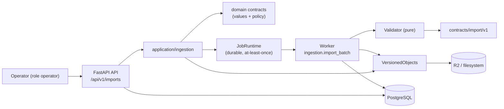

# Implementation Plan: Bronze Ingestion

**Branch**: `main` | **Date**: 2026-08-06 | **Spec**: [spec.md](./spec.md)

**Input**: Feature specification for UM-H2-001 through UM-H2-008 (Epica H2.1 -
Ingestion Bronze).

## Summary

Turn a controlled batch into immutable Bronze raw snapshots, quarantine and a
quality report that a later increment normalizes into Silver. An operator with
the `operator` role uploads a CSV/JSON file through a new `/api/v1/imports`
surface; the request creates an `import_run` and submits a durable
`ingestion.import_batch` job. The worker validates each record against the
published import contract v1, stores the raw file as an immutable object
version, inserts one `raw_listing_snapshot` per valid record and one
`quarantine_record` per rejected record, then derives counts and finishes the
run. Repeating the same batch (same `batch_key` or same content hash) never
duplicates snapshots.

The increment reuses the existing durable-job runtime for idempotency, leases,
bounded retries and the outbox; the existing `VersionedObjects` seam for raw
content; and the identity `AccessControl` for operator authorization. It adds
pure validation (no LLM), three tables, an ImportSource port with a file
adapter and a test fake, and a deterministic quality report.

## Technical Context

**Language/Version**: Python `>=3.13,<3.14`; Node.js `>=24.11,<25`;
TypeScript `>=6.0,<6.1`

**Primary Dependencies**: FastAPI, Pydantic, SQLAlchemy 2, Alembic, Psycopg 3,
RQ, redis-py, Boto3; existing `application/jobs` and `application/objects`
modules; no new third-party runtime dependency

**Storage**: PostgreSQL 17 (new tables `import_runs`, `raw_listing_snapshots`,
`quarantine_records`); S3-compatible R2 remotely / filesystem locally for the
raw batch object; no new stores

**Testing**: pytest, Testcontainers, Ruff, mypy, Alembic checks, architecture
contracts; conformance suite shared by file adapter and test fake; API
authorization tests via TestClient

**Target Platform**: same runtime surfaces (web/API/worker/scheduler); import
processing runs on the existing worker; no new topology

**Project Type**: modular monolith (data/application module + operator API
surface)

**Performance Goals**: reference batch (12 records) imported and queryable in
under 1 minute locally; quality report derived from committed rows in seconds;
idempotent replay returns in the time of one lookup

**Constraints**: operator entry enabled only with the `operator`/`administrator`
role; never accepts arbitrary URLs; raw snapshots immutable and additive;
payload+hash in Bronze and full raw file in object storage before transform;
run counts derived at completion (retry-safe); no Silver normalization, dedupe
or matching; no LLM

**Scale/Scope**: one new module (`application/ingestion`), three tables, one
durable job type, five operator endpoints, one import contract v1; batch file
cap 10 MiB

## Constitution Check

*GATE: evaluated before Phase 0 and re-evaluated after Phase 1.*

| Principle | Before research | After design | Evidence |
| --- | --- | --- | --- |
| Persistent radar truth | PASS | PASS | Snapshots, runs and quarantine are persistent product objects; the raw file is an immutable object version. Nothing lives only in logs or memory. |
| Auditable deterministic matching | PASS | PASS | Validation, capture, quarantine, counts and idempotency are deterministic code; no LLM anywhere in the increment. |
| Layer boundaries | PASS | PASS | `ImportSource` is an application port; the file adapter and object/repository adapters are infrastructure; API only crosses use cases. Architecture contracts stay release gates. |
| Data lineage and evidence | PASS | PASS | Snapshots keep source/version/hash/run/timestamps and link to the immutable raw object, grounding future Bronze-Silver lineage (UM-H2-018). |
| Minimal verifiable scope | PASS | PASS | Bronze capture only; normalización (H2.2), dedupe (H2.2) and matching (H2.3) are explicitly deferred. One port, one job, three tables, five endpoints. |

There are no constitution violations requiring a complexity exception.

## Assumptions and Tradeoffs

- The controlled import contract v1 is drafted in this increment (see
  [import-contract-v1.md](./contracts/import-contract-v1.md)) because UM-H0-009
  is not yet published; it is ratified against the real source before beta and
  the loader stays versioned.
- Identity and the `operator` role already exist in the tree, so the operator
  entry binds to product authorization now; the spec's "restricted until
  identity" contingency does not require environment backdoors.
- Batch and record idempotency are both implemented (job identity + unique
  `(source_id, external_id, content_sha256)`). The record constraint is the
  cheap extra layer that makes interrupted retries safe.
- The raw file is stored as one immutable object version per batch; per-record
  payloads live in Bronze JSONB. Media bytes are not downloaded in H2.1
  (enrichment belongs to H2.2).
- Run counts are derived from committed rows at completion instead of being
  accumulated, so a retried attempt can never double count.
- The worker writes raw bytes through `VersionedObjects` outside the DB
  transaction; a stranded pending write is reclaimed by the existing
  reconciler, exactly like foundation object writes.

Detailed decision records and rejected alternatives are in
[research.md](./research.md).

## Architecture



All arrows are dependency/use direction. `ImportSource` and repositories are
application ports; file adapter, object store and SQLAlchemy repositories are
infrastructure; domain policy and contract values are pure.

## Module, Interface and Seam Design

| Module | Public Interface | Adapters / consumers | Boundary rule |
| --- | --- | --- | --- |
| Ingestion contracts | `ImportBatch`, `RawRecord`, `RawListingSnapshot`, `QuarantineRecord`, `ImportRunSnapshot`, typed errors and validation results | application services and handler; pure values | No FastAPI, SQLAlchemy, RQ, storage or web imports |
| Import contract | `load_contract_v1()`, `validate_record()` returning per-record results | application validator; infra loader | Pure; rule set from `contracts/import/v1`; versioned and immutable once ratified |
| ImportSource seam | `ImportSource.read_batch(batch, source, version) -> (records, report)` | `FileImportSource` (infra) and `FakeImportSource` (tests) | Returns raw records + report only; never mentions Silver |
| Import runs | `ImportRunService.submit/get/quality()` | API router; worker handler | Owns run state transitions, derived counts and terminal replay |
| Ingestion job | `IngestionImportHandler` registered as `ingestion.import_batch` | worker registry | Idempotent via job identity + unique snapshot constraint; result is a bounded counts summary |
| Import repositories | `ImportRunRepository`, `RawSnapshotRepository`, `QuarantineRepository` | SQLAlchemy adapters + in-memory adapters | Never commit; optimistic update with version guard |
| Object seam | existing `VersionedObjects` (`purpose="ingestion.raw_batch"`) | file adapter for raw batch content | Bytes outside DB transaction; immutable available versions only |
| Operator API | `POST /api/v1/imports/batches`, `GET .../runs/{id}`, `.../quality`, `.../quality/download`, `GET .../quarantine/{id}` | FastAPI router; generated web client later | Authorization via `AccessControl`; file upload only, no URLs |

Do not introduce a generic `BaseRepository[T]`, a global `ports/` grab bag or
an infrastructure facade. Each Interface stays next to the capability it hides.

## Readiness and Failure Isolation

No new critical dependency is added: the worker already declares PostgreSQL and
object storage as critical. Failure behavior:

- Postgres loss during capture: job fails transiently and retries within bounds;
  the run stays non-terminal and no duplicate rows can appear on retry (unique
  constraint).
- Object-store loss: raw-file write is pending/failed; the run fails
  transiently; existing objects remain untouched; reconciler reclaims stranded
  pending writes.
- Invalid/unsupported file: permanent failure classified with an actionable
  `error_code`; run ends `failed`, zero records processed.
- Operator session missing/unauthorized: 401/403 before any effect, audited.

## Configuration and Secret Boundary

No new settings or secrets. The upload size cap (10 MiB) and the supported
`contract_version` are fixed in the import contract loader, not in runtime
settings. File content is never logged; quarantine details and run error
details are bounded and non-sensitive. Multipart filenames are reduced to a
safe basename and stored only for operator traceability.

## Data and Migration Design

The full schema is in [data-model.md](./data-model.md). The new revision
`0003_bronze_ingestion.py` creates:

1. `import_runs`;
2. `raw_listing_snapshots`;
3. `quarantine_records`;

plus the ENUM types `import_format` and `import_run_state`, stable constraint
naming and all uniqueness/check/index requirements.

Important transaction rules:

- `import_run` insert + job submit is atomic via `TransactionManager`; the
  outbox closes publish-before-commit loss.
- Worker capture inserts snapshots/quarantine and updates run state/counts in
  one transaction; `(source_id, external_id, content_sha256)` arbitrates
  duplicates.
- Raw-file object write happens outside the DB transaction and is reconciled by
  the existing object reconciler.
- Optimistic updates use `WHERE id AND version`, increment version and check
  exactly one row.

Migration tests cover empty DB, previous released revision, one head, metadata
drift and the declared downgrade/compensation path. APIs never migrate on boot.

## Contracts

Planning contracts:

- [controlled import contract v1](./contracts/import-contract-v1.md)
- [import operations (operator entry)](./contracts/import-operations.md)

The OpenAPI 3.1 document at `contracts/openapi/v1/openapi.json` is extended
with the five operator operations and exported deterministically. Errors use
`application/problem+json` with typed codes; correlation IDs propagate to the
run and job. Contract drift, generated-client drift and backward compatibility
remain independent required checks.

## Job Idempotency and Recovery

Identity: `(job_type="ingestion.import_batch", logical_target=<source_id>:<batch_key>,
idempotency_key=<batch_key>)`. A terminal replay returns the existing result
with no attempt or effect; a deliberate rerun uses a new key. The default
`batch_key` is the SHA-256 of the uploaded file, so re-uploading the same file
is naturally idempotent.

At-least-once guarantees from the foundation runtime apply unchanged (outbox,
lease, bounded retries, classified failures). Additionally:

- record uniqueness prevents partial-commit duplicates on interrupted retries;
- run counts are derived from committed rows at completion;
- the handler's mutating effects (snapshot/quarantine inserts, object write,
  run update) all carry the immutable guard or unique constraint.

## Object Integrity and Recovery

The raw batch file is written once as an immutable `ingestion.raw_batch`
object version: pending metadata, bytes through `ObjectStore`, size/SHA-256
verification, then available. Same-content retry succeeds; differing content is
a conflict. The filesystem and S3 conformance suites run the same assertions,
and the existing reconciler reclaims stranded pending writes.

## Observability and Audit

Audit coverage (reuses the metadata-only telemetry allowlist):

| Operation | Durable evidence |
| --- | --- |
| batch submit | run id, source/version, batch_key, file hash/size, operator actor, correlation |
| capture | snapshot rows with run, source, version, content hash, timestamps |
| quarantine | code, rule, detail, payload ref per rejected record |
| run completion | state, derived counts, parser_version, finished_at, error code |
| access denial | `AccessControl` audit event for unauthorized submit/read |

Counts and quality are derivable from committed rows, so reports never diverge
from the data. No payload, filename path or file content enters default logs or
traces.

## Delivery and Recovery Topology

No new deployment topology. The new tables ride the existing migration flow on
preview/production; the import handler is registered in the worker job registry
(next to the identity handlers), and the OpenAPI extension flows through the
existing release/contract gates. Backup/restore scope extends automatically to
the three new tables via the existing full-DB backup procedure.

## Project Structure

### Documentation (this feature)

```text
specs/002-bronze-ingestion/
├── spec.md
├── plan.md
├── research.md
├── data-model.md
├── quickstart.md
├── contracts/
│   ├── import-contract-v1.md
│   └── import-operations.md
├── checklists/
│   └── requirements.md
└── tasks.md                    # created later by /speckit-tasks
```

### Source Code (repository root)

```text
contracts/
└── import/v1/                          # published import contract v1 (machine checkable)
src/umbral/
├── domain/
│   └── identity/policy.py              # + ops.ingestion.* actions (edited)
├── application/
│   └── ingestion/
│       ├── contracts.py                # pure values/errors
│       ├── import_contract.py          # contract v1 rules + validate_record
│       ├── ports.py                    # ImportSource, run/snapshot/quarantine repos
│       └── service.py                  # ImportRunService (submit/get/quality)
│   └── (new job handler under workers/)
├── infrastructure/
│   ├── sources/
│   │   ├── file_source.py              # FileImportSource (CSV/JSON)
│   │   └── fake_source.py              # FakeImportSource (tests)
│   └── db/
│       ├── models/imports.py           # ImportRun, RawListingSnapshot, QuarantineRecord
│       └── repositories/imports.py     # SQLAlchemy + in-memory adapters
├── api/
│   └── routers/imports.py              # operator entry endpoints
└── workers/
    └── imports.py                      # IngestionImportHandler + registry helper
alembic/versions/0003_bronze_ingestion.py
tests/
├── unit/application/ingestion/         # contract/validator/service tests
├── unit/api/test_imports.py            # router + authz tests
├── unit/infrastructure/test_import_source.py
├── contract/test_import_contract.py    # conformance against import/v1
├── integration/ingestion/              # real DB + object store: capture, idempotency, quality
├── integration/identity/test_import_authorization.py
├── fixtures/imports/reference-batch.json
└── migrations/                         # 0003 upgrade/downgrade tests
scripts/check-imports.ps1               # new harness surface (mirrors check-jobs.ps1)
```

**Structure Decision**: keep the accepted modular monolith layout. The new
`application/ingestion` module follows `application/jobs` and
`application/objects` conventions; adapters sit under `infrastructure/sources`
and `infrastructure/db`; the operator API is a router bound through the
existing `configure_*_routes` composition pattern; the handler is registered in
`workers/registry.py`. No new top-level services or repositories beyond what
the seams require.

## Planned Implementation Sequence

The later `/speckit-tasks` artifact must decompose these phases into test-first,
path-specific tasks. Each behavioral slice starts with the failing contract/
unit/integration test named here, then the minimum implementation, then the
full gate.

### Phase A — Import contract and pure validation

- Load contract v1 rules from `contracts/import/v1`; implement
  `validate_record` (types, enums, ranges, required/optional).
- Fixtures: valid JSON/CSV, unsupported format/encoding/size/version, per-field
  violations.
- Conformance suite `tests/contract/test_import_contract.py` and unit tests.
- Gate: 100% conformance; invalid records quarantine with actionable codes
  without aborting the batch.

### Phase B — ImportSource port and adapters

- Define `ImportSource` port and `ImportBatch`/`RawRecord` contracts.
- Implement `FileImportSource` (CSV/JSON) and `FakeImportSource`; shared
  conformance suite.
- Gate: file adapter and fake produce identical records/report; architecture
  check rejects domain→infrastructure imports.

### Phase C — Persistence and run state machine

- Migration `0003_bronze_ingestion` and models for the three tables.
- SQLAlchemy + in-memory repositories; `ImportRunService.submit/get` with state
  transitions and optimistic locking.
- Gate: migration suite (empty/previous/head/drift) and integration tests for
  terminal replay and derived counts.

### Phase D — Ingestion job, capture and idempotency

- `IngestionImportHandler` (`ingestion.import_batch`): validate, write raw
  object, insert snapshots/quarantine, derive counts, finish run.
- Register the handler in `workers/registry.py`; wire object seam
  (`purpose=ingestion.raw_batch`).
- Integration tests: full capture, re-import same key (no new effects),
  same content different key (no duplicate rows), interrupted retry.
- Gate: `tests/integration/ingestion` green; idempotency scenarios prove zero
  duplicates.

### Phase E — Operator entry API and quality report

- Add `ops.ingestion.*` actions to the policy matrix.
- Router `api/routers/imports.py` with the five endpoints; multipart upload
  (file only), authorization via `AccessControl`, Problem errors.
- Quality summary + CSV download derived from committed rows.
- Export OpenAPI, regenerate the web client, extend contract/drift checks.
- Gate: operator/administrator succeed; user/anonymous rejected and audited;
  URL upload rejected; SC-006 counts match real data.

### Phase F — Harness and cross-story closure

- Add `scripts/check-imports.ps1` and wire it into `check.ps1`.
- Run every functional-requirement fixture, success metric and
  `.\scripts\check.ps1` from a clean checkout; record evidence.
- Update the runtime-local runbook and import quickstart with the manual smoke.

## Verification Commands

Target commands after implementation:

```powershell
uv sync --frozen --all-groups
uv run ruff format --check .
uv run ruff check .
uv run mypy src tests
uv run pytest
uv run alembic current --check-heads
uv run alembic check
uv run pytest tests/unit/application/ingestion tests/contract/test_import_contract.py tests/integration/ingestion tests/integration/identity/test_import_authorization.py
npm run api:check
npm run build
.\scripts\check.ps1
```

No success claim is based only on a mock or a skipped surface; the reference
batch must be imported against the real Postgres/object-storage stack in
`tests/integration/ingestion`.

## Backlog and Requirement Traceability

| Backlog item | Plan ownership | Primary evidence |
| --- | --- | --- |
| UM-H2-001 ImportSource | Phase B port + adapters | shared adapter conformance suite |
| UM-H2-002 validate against contract | Phase A validator + contract v1 | contract conformance fixtures |
| UM-H2-003 operator entry | Phase E router + policy actions | authorization integration tests |
| UM-H2-004 persist import runs | Phase C run state machine | migration + integration tests |
| UM-H2-005 raw snapshots immutable | Phase D handler + object seam | capture + integrity integration tests |
| UM-H2-006 idempotent capture | Phase D job identity + unique constraint | idempotency integration tests |
| UM-H2-007 quarantine per record | Phase A + D | quarantine conformance + integration |
| UM-H2-008 quality report | Phase E report + download | SC-006 count-match tests |

Every FR maps through these rows to at least one automated check. `tasks.md`
must preserve these mappings rather than regrouping cross-cutting checks away
from their story.

## Complexity Tracking

No constitution violation is present. The only deliberate duplication is the
second idempotency layer (record-level unique constraint) beyond the job
runtime identity; its simpler rejected alternative (job identity only) could
leave partial rows after an interrupted crash, which the spec's US2.3 forbids.
