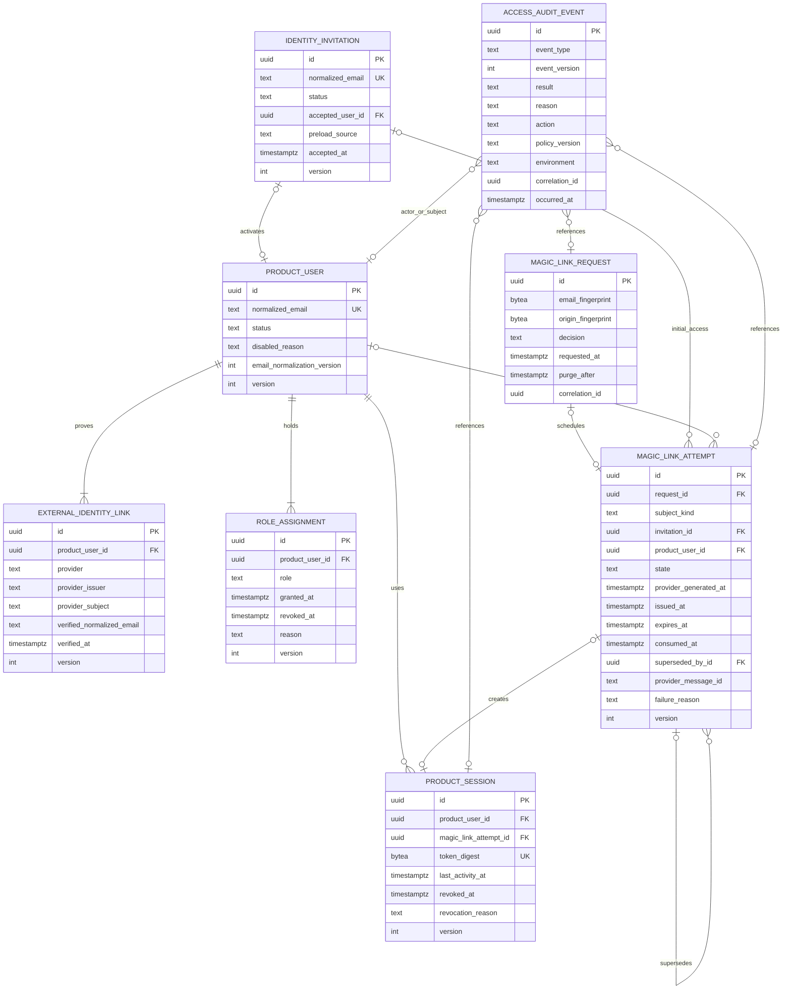
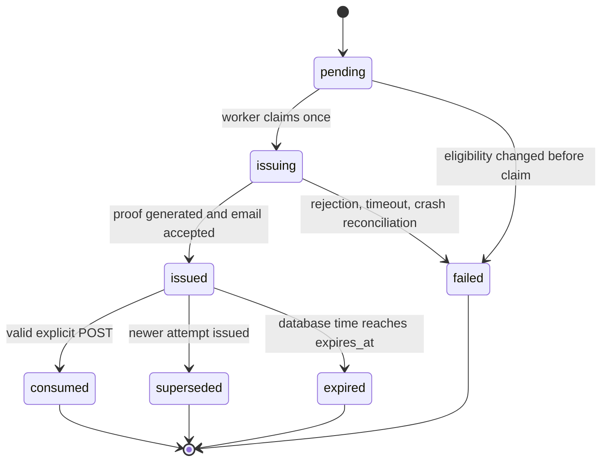

# Data Model: Private Beta Identity

**Feature**: `002-private-beta-identity`

**Database**: PostgreSQL 17

**Time and IDs**: database UTC `timestamptz`; application-generated UUIDs

## Modeling Rules

1. Domain and application records are plain Python values. SQLAlchemy mappings
   and PostgreSQL locking live under `infrastructure/db`.
2. Follow foundation `RecordIdentity` and `AuditContext`. Mutable product rows
   carry `version`; append-only request/audit evidence does not.
3. Email normalization is versioned. Version 1 trims surrounding ASCII
   whitespace, validates the address, lowercases local and domain parts, and
   performs no provider-specific dot/plus folding.
4. Raw normalized email exists only on eligible invitation/user/link records.
   Rate-limit rows use environment-scoped HMAC-SHA-256 fingerprints. Raw origin
   is never persisted.
5. Product session tokens contain at least 256 random bits. Only a SHA-256
   digest is stored. Magic-link token hashes, full links, provider tokens, and
   message bodies are never stored.
6. States and roles are bounded lowercase text with named check constraints.
   Database enums are avoided to keep controlled evolution simple.
7. Every foreign key is indexed. Equality columns precede range timestamps in
   rolling-window indexes. Partial indexes cover current sessions, roles, and
   issued attempts.
8. Database time is authoritative for link/session expiry. Application clocks
   do not extend validity.
9. Product tables are private to the FastAPI/worker database role. Browser and
   providers receive no grants and no Data API exposure.

## Entity Relationship View



## `identity_invitations`

Controlled beta eligibility. There is no open-create HTTP route and no
management console in this increment.

| Column | Type | Null | Rule |
| --- | --- | ---: | --- |
| shared identity columns | mixed | no | Foundation `RecordIdentity`; optimistic lock |
| `normalized_email` | text | no | Unique; version-1 canonical form |
| `email_normalization_version` | smallint | no | `1` |
| `status` | text | no | `active`, `accepted` |
| `accepted_user_id` | UUID FK | yes | `product_users.id`; unique when present |
| `accepted_at` | timestamptz | yes | Required only with `accepted` |
| `preload_actor_kind` | text | no | `deployment`, `operator`, `administrator` |
| `preload_actor_id` | text | no | Bounded opaque operator/deployment identity |
| `preload_source` | text | no | Stable code, not free text |

Constraints:

- unique `normalized_email`;
- unique non-null `accepted_user_id`;
- `active` implies no accepted user/time;
- `accepted` implies accepted user/time;
- no update from `accepted` to `active` in H1.

Indexes:

- unique `identity_invitations_normalized_email_uq`;
- partial lookup `(normalized_email) WHERE status = 'active'`;
- index `accepted_user_id`.

## `product_users`

Stable Umbral identity and owner of future product resources.

| Column | Type | Null | Rule |
| --- | --- | ---: | --- |
| shared identity columns | mixed | no | Foundation `RecordIdentity`; optimistic lock |
| `normalized_email` | text | no | Unique; not an identity-merge key outside this closed cohort |
| `email_normalization_version` | smallint | no | `1` |
| `status` | text | no | `active`, `disabled` |
| `disabled_reason` | text | yes | Stable bounded reason; required when disabled |
| `status_changed_at` | timestamptz | no | Database time |
| `status_changed_by_user_id` | UUID FK | yes | Active administrator when applicable |
| `status_change_source` | text | no | Stable operation code |

Constraints:

- unique `normalized_email`;
- disabled status and reason must agree;
- self-referencing actor FK uses `RESTRICT`.

Indexes:

- unique normalized email;
- partial `(id) WHERE status = 'active'`;
- index `status_changed_by_user_id`.

## `external_identity_links`

Authoritative mapping from external proof subject to one product user. Email
supports conflict detection but never automatic merge.

| Column | Type | Null | Rule |
| --- | --- | ---: | --- |
| shared identity columns | mixed | no | Foundation `RecordIdentity`; immutable after creation in H1 |
| `product_user_id` | UUID FK | no | `product_users.id`, `RESTRICT` |
| `provider` | text | no | `supabase` in production; bounded registry value |
| `provider_issuer` | text | no | Canonical environment-specific issuer/project identifier |
| `provider_subject` | text | no | Stable provider user ID; bounded and opaque |
| `verified_normalized_email` | text | no | Observed verified email |
| `email_normalization_version` | smallint | no | `1` |
| `verified_at` | timestamptz | no | Provider proof time or local verification time |
| `linked_at` | timestamptz | no | Database time |

Constraints:

- unique `(provider, provider_issuer, provider_subject)`;
- unique `(product_user_id, provider, provider_issuer)` for the one-identity beta;
- verified email must equal the product user's normalized email at link time;
- issuer must equal configured environment issuer before persistence.

Indexes:

- both unique constraints;
- index `product_user_id`.

## `role_assignments`

Grant history for the fixed `user`, `operator`, and `administrator` roles.
Rows are revoked, not deleted.

| Column | Type | Null | Rule |
| --- | --- | ---: | --- |
| shared identity columns | mixed | no | Foundation `RecordIdentity`; optimistic lock |
| `product_user_id` | UUID FK | no | `RESTRICT` |
| `role` | text | no | `user`, `operator`, `administrator` |
| `granted_at` | timestamptz | no | Database time |
| `granted_by_user_id` | UUID FK | yes | Active administrator except activation/bootstrap |
| `grant_actor_kind` | text | no | `activation`, `deployment`, `administrator` |
| `grant_actor_id` | text | no | Internal bounded reference |
| `grant_reason` | text | no | Stable code |
| `revoked_at` | timestamptz | yes | Database time |
| `revoked_by_user_id` | UUID FK | yes | Active administrator |
| `revoke_reason` | text | yes | Required with revocation |

Constraints:

- partial unique `(product_user_id, role) WHERE revoked_at IS NULL`;
- activation may grant only `user`;
- `operator`/`administrator` grants require a later separate operation;
- bootstrap may grant `administrator` only to an active user and only when no
  current administrator exists;
- revoke fields must agree.

Indexes:

- index every actor/user FK;
- partial current-role lookup `(product_user_id, role) WHERE revoked_at IS NULL`;
- partial current-admin lookup `(role, product_user_id)
  WHERE role = 'administrator' AND revoked_at IS NULL`.

## `product_sessions`

Opaque Umbral sessions. Multiple browser sessions per user are allowed; logout
revokes the current session only.

| Column | Type | Null | Rule |
| --- | --- | ---: | --- |
| shared identity columns | mixed | no | Foundation `RecordIdentity`; optimistic lock |
| `product_user_id` | UUID FK | no | `RESTRICT` |
| `magic_link_attempt_id` | UUID FK | no | Unique activation/login attempt |
| `token_digest` | bytea | no | Unique SHA-256 digest; exactly 32 bytes |
| `last_activity_at` | timestamptz | no | Set on creation and each allowed protected operation |
| `revoked_at` | timestamptz | yes | Logout, idle expiry, or controlled revocation |
| `revocation_reason` | text | yes | `logout`, `idle_timeout`, `user_disabled`, `security` |

Constraints:

- unique `token_digest`;
- unique `magic_link_attempt_id`, so one attempt creates at most one session;
- revocation fields agree;
- no absolute expiry column.

Indexes:

- unique token digest;
- index `product_user_id`;
- partial active-session lookup `(product_user_id, last_activity_at)
  WHERE revoked_at IS NULL`;
- index `magic_link_attempt_id`.

Idle decision:

```text
valid iff revoked_at is null
      and product_user.status = active
      and database_now < last_activity_at + interval '7 days'
```

The strict `<` makes a session expired at exactly seven full days. An allowed
protected operation updates `last_activity_at` with database time inside the
authorization transaction. A denial rolls back/omits the touch.

## `magic_link_requests`

Minimized evidence and exact rolling-window input for every public request,
including ineligible and over-limit requests.

| Column | Type | Null | Rule |
| --- | --- | ---: | --- |
| `id` | UUID | no | Primary key |
| `email_fingerprint` | bytea | no | Environment HMAC-SHA-256; exactly 32 bytes |
| `email_fingerprint_version` | smallint | no | Active key version |
| `origin_fingerprint` | bytea | no | BFF HMAC-SHA-256; exactly 32 bytes |
| `origin_fingerprint_version` | smallint | no | Active key version |
| `decision` | text | no | `eligible`, `not_eligible`, `email_limited`, `origin_limited`, `both_limited` |
| `requested_at` | timestamptz | no | Database time |
| `purge_after` | timestamptz | no | `requested_at + 24 hours` |
| `correlation_id` | UUID | no | Foundation request correlation |

Indexes:

- composite `(email_fingerprint_version, email_fingerprint, requested_at)`;
- composite `(origin_fingerprint_version, origin_fingerprint, requested_at)`;
- ordinary purge index `(purge_after)`; a dynamic `now()` predicate is not used
  because PostgreSQL partial-index predicates must be immutable;
- correlation index.

Every request row counts toward later requests in the rolling window. Therefore
continued abusive attempts continue the cooldown; a new request becomes
eligible 15 minutes after enough prior attempts age out.

The limiter takes transaction-scoped advisory locks derived from the
fingerprints in this order:

1. email fingerprint;
2. origin fingerprint.

A hash collision may serialize unrelated callers but cannot bypass a limit.
The transaction counts rows newer than `database_now - 15 minutes`, inserts the
current row and only creates an attempt/job when prior counts are below 3 and
20. Rotating fingerprint keys requires accepting current plus previous
versions for at least one full window.

## `magic_link_attempts`

One eligible local issuance/confirmation state machine. It contains no bearer
material.

| Column | Type | Null | Rule |
| --- | --- | ---: | --- |
| shared identity columns | mixed | no | Foundation `RecordIdentity`; optimistic lock |
| `request_id` | UUID FK | no | Unique `magic_link_requests.id` |
| `subject_kind` | text | no | `invitation`, `product_user` |
| `invitation_id` | UUID FK | yes | Required only for initial activation |
| `product_user_id` | UUID FK | yes | Required only for repeat access at request time |
| `state` | text | no | State list below |
| `job_execution_id` | UUID FK | no | Foundation issue job; unique |
| `issuing_started_at` | timestamptz | yes | Claim time |
| `provider_generated_at` | timestamptz | yes | Starts local/provider 15-minute validity |
| `issued_at` | timestamptz | yes | Resend acceptance time |
| `expires_at` | timestamptz | yes | At most generated time + 15 minutes |
| `consumed_at` | timestamptz | yes | One valid confirmation |
| `superseded_at` | timestamptz | yes | Newer issued attempt won |
| `superseded_by_id` | UUID self-FK | yes | Newer attempt |
| `provider_message_id` | text | yes | Unique when known; bounded opaque ID |
| `failure_reason` | text | yes | Stable provider/local code, never exception text |

States:



Constraints:

- exactly one subject FK agrees with `subject_kind`;
- unique `request_id` and `job_execution_id`;
- partial unique current issued attempt per invitation:
  `(invitation_id) WHERE state = 'issued'`;
- partial unique current issued attempt per user:
  `(product_user_id) WHERE state = 'issued'`;
- terminal timestamps/reasons agree with state;
- `expires_at <= provider_generated_at + interval '15 minutes'`;
- consumed attempt can create at most one session through the session unique FK.

Issuing a new attempt atomically changes the previous current attempt to
`superseded` and the new attempt to `issued`. A rate-limited request creates no
attempt and cannot change this index.

Repeated confirmation never creates a second session. If the first response was
lost, the consumed attempt returns a recoverable generic result and the person
requests another link; Umbral does not persist the opaque session token merely
to replay a cookie.

## `access_audit_events`

Append-only evidence for authentication, authorization, administration, and
known delivery outcomes.

| Column | Type | Null | Rule |
| --- | --- | ---: | --- |
| `id` | UUID | no | Primary key |
| `event_type` | text | no | Closed registry from `contracts/access-events.md` |
| `event_version` | smallint | no | Starts at `1` |
| `result` | text | no | `allowed`, `denied`, `accepted`, `failed`, `observed` |
| `reason` | text | no | Closed stable reason |
| `action` | text | yes | Registered authorization/admin action |
| `policy_version` | text | yes | Required for authorization events |
| `actor_kind` | text | no | `anonymous`, `product_user`, `operator`, `administrator`, `service`, `deployment`, `system` |
| `actor_user_id` | UUID FK | yes | Required for authenticated human actor |
| `actor_reference` | text | yes | Bounded opaque non-user actor ID |
| `subject_user_id` | UUID FK | yes | Affected product user |
| `invitation_id` | UUID FK | yes | Internal reference only |
| `request_id` | UUID FK | yes | Internal request reference |
| `attempt_id` | UUID FK | yes | Internal attempt reference |
| `session_id` | UUID FK | yes | Internal session reference |
| `role_assignment_id` | UUID FK | yes | Internal grant/revoke reference |
| `resource_type` | text | yes | Bounded registered resource kind |
| `resource_id` | UUID | yes | Opaque; no resource content |
| `provider` | text | yes | Registered provider |
| `provider_event_id` | text | yes | Unique with provider when a webhook |
| `environment` | text | no | `test`, `local`, `preview`, `production` |
| `correlation_id` | UUID | no | Required |
| `occurred_at` | timestamptz | no | Database time |

Constraints:

- unique `(provider, provider_event_id)` where provider event ID is present;
- authenticated actor kind and actor user must agree;
- authorization events require action and policy version;
- field allowlist varies by event type and is validated before insert;
- application role receives no `UPDATE` or `DELETE` grant.

Indexes:

- `(correlation_id, occurred_at)`;
- each populated internal FK;
- `(event_type, occurred_at)`;
- partial unique provider event index.

Email/origin fingerprints are deliberately not copied into long-lived audit.
The audit references the 24-hour request row and retains the stable
decision/reason after the fingerprint is purged.

## Transaction Boundaries

### Controlled invitation preload

In one transaction:

1. normalize/validate email;
2. acquire email fingerprint advisory lock;
3. create or return the identical active invitation;
4. reject conflicting state/source;
5. append `invitation.preloaded.v1`.

### Public magic-link request

In one short transaction:

1. take email then origin advisory locks;
2. count the exact rolling windows;
3. insert request evidence;
4. if below limits, resolve active invitation or active linked user;
5. create `pending` attempt and foundation job/outbox by attempt ID;
6. append request decision audit;
7. commit before returning neutral `202`.

No provider call occurs here.

### Issue worker

1. Short transaction claims `pending -> issuing`, re-checks eligibility, and
   commits.
2. Outside all DB transactions, generate proof and call Resend once.
3. On known success, short transaction locks the access subject, supersedes the
   previous current attempt, marks the new attempt issued, stores only provider
   message ID/times, and appends audit.
4. On known/ambiguous failure, short transaction marks failed and appends
   stable failure audit. Crash reconciliation converts stranded `issuing` to a
   safe failed state; it does not regenerate a bearer link.

### Confirmation

Before provider call, a read transaction confirms the attempt is current,
issued, unexpired, and not consumed. Provider verification occurs outside a DB
transaction.

After verified proof, one transaction locks in this order:

1. access subject;
2. invitation or product user;
3. attempt;
4. conflicting provider link/product email candidates.

It re-checks all facts, then:

- initial access: creates product user and external link, creates only the
  `user` role, accepts invitation, consumes attempt, creates one session, and
  appends all events;
- repeat access: resolves the existing link/user, consumes attempt, creates one
  session, and appends all events.

Any conflict or audit failure rolls back every product/session change. Provider
verification may already have occurred, but it alone grants no product access.

### Protected operation

Use one database transaction for access decision and database-backed product
work when practical:

1. find session by token digest and lock it;
2. evaluate revocation and exact idle boundary with database time;
3. load current user and active roles;
4. load/derive the resource owner without exposing it;
5. evaluate the registered policy;
6. if allowed, update `last_activity_at`, perform the operation, and append
   allowed audit;
7. if denied, do not touch activity; append denial through a safe standalone
   audit transaction when the product transaction has no committed mutation.

External network effects never run while session/authorization locks are held.

### Role/status administration

Lock target user then current role rows. For privileged grants, also lock the
active-administrator key. Validate active administrator or the one-time
zero-admin bootstrap condition, mutate status/assignment, and append audit in
one transaction.

### Email webhook

Verify signature against the unmodified body before parsing. In one transaction
insert/deduplicate provider event, locate attempt by provider message ID, apply
only monotonic known delivery state, and append audit. Raw body and recipient
fields are discarded.

## Migration Order and Verification

One Alembic revision creates tables in this order:

1. `identity_invitations`;
2. `product_users`;
3. deferred invitation accepted-user FK;
4. `external_identity_links`;
5. `role_assignments`;
6. `magic_link_requests`;
7. `magic_link_attempts`;
8. `product_sessions`;
9. `access_audit_events`;
10. indexes, named checks, least-privilege grants.

Migration tests cover:

- empty database upgrade;
- upgrade from the foundation released head;
- one Alembic head and metadata drift;
- every FK index and unique/partial constraint;
- insert/update fixtures for valid and invalid states;
- downgrade/compensation behavior declared by the foundation release process.

## Retention and Deletion

| Data | Planning rule |
| --- | --- |
| request email/origin fingerprints | purge after 24 hours |
| magic-link bearer material | never persisted |
| failed/superseded/expired attempt metadata | retain per approved security-audit policy, then purge/anonymize by internal reference |
| revoked sessions | retain metadata per approved security-audit policy; token digest remains non-reversible |
| invitation/user/link/role history | retain while required for product account and legal/security policy |
| access audit | immutable for the approved security retention period |
| raw provider webhook/email body | never persist |

Production startup/promotion must fail if the required personal-data map,
retention owner, and purge schedule are absent. The schema does not invent a
legal retention duration beyond the explicit 24-hour anti-abuse evidence.
