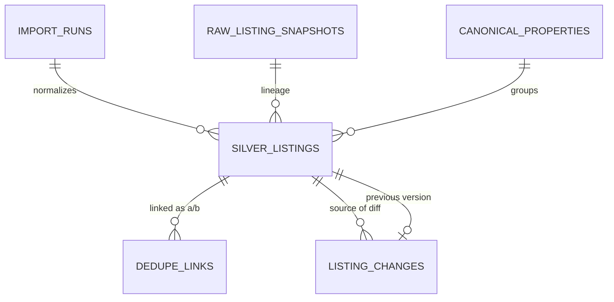

# Data Model: Silver Normalization

**Feature**: `003-silver-normalization` | **Date**: 2026-08-06

Data entities added by this increment. All tables use the shared
`IdentityAuditMixin` columns (`id`, `created_at`, `updated_at`, `version`,
`actor_kind`, `actor_id`, `source`, `correlation_id`) except where noted, and
follow the repository naming/constraint conventions of `001-foundation-runtime`
and `002-bronze-ingestion`.

## Entity overview



- A `silver_listings` row is the immutable normalized view of one snapshot
  (Bronze); it belongs to a publication chain `(source_id, external_id)` and to
  exactly one `canonical_properties` row.
- `canonical_properties` separates the real property from its publications and
  versions (UM-H2-014).
- `dedupe_links` records deterministic links (state `confirmed`) and
  non-destructive proposals (state `pending`, transitionable to `confirmed` /
  `rejected`) with score and evidence (UM-H2-015, UM-H2-016).
- `listing_changes` records detected diffs between consecutive versions with
  before/after and origin (UM-H2-017).
- Lineage: `silver_listings.snapshot_id` → `raw_listing_snapshots` →
  `import_runs.parser_version`; plus `normalizer_version` per row (UM-H2-018).

## canonical_properties

One row per real property. Created on first publication; reused by every
publication version that resolves to it (deterministic dedupe).

| Column | Type | Rules |
| --- | --- | --- |
| id | UUID | PK (mixin) |
| created_at / updated_at / version / actor / source / correlation_id | | mixin |
| state | enum `canonical_state` | `active` only in v1 |
| first_seen_at | timestamptz | captured_at of the first silver listing |
| latest_listing_id | UUID FK `silver_listings.id` | nullable, set by maintenance |

**Constraints**:
- `ck_canonical_properties_state`: state in `('active')`.

## silver_listings

One immutable, additive row per (snapshot, normalizer_version). This is the
entity H2.3 filters and matches against.

| Column | Type | Rules |
| --- | --- | --- |
| id | UUID | PK (mixin) |
| created_at / updated_at / version / actor / source / correlation_id | | mixin |
| canonical_property_id | UUID FK `canonical_properties.id` | set at insert; RESTRICT |
| run_id | UUID FK `import_runs.id` | RESTRICT |
| snapshot_id | UUID FK `raw_listing_snapshots.id` | RESTRICT; lineage to Bronze |
| source_id / source_version / contract_version | string | copied from snapshot |
| external_id | string 500 | copied from snapshot |
| url | string 2000 | nullable; valid http(s) when present |
| published_at | timestamptz | nullable |
| last_observed_at | timestamptz | captured_at of the snapshot |
| normalizer_version | string 100 | from `silver-schema-v1` loader |
| operation | enum `operation_type` | `rental` in v1 |
| property_type | enum `property_type` | `apartment` \| `house` \| `room` \| `studio` \| `commercial` \| `other` |
| price_value | numeric(18,2) | original value, never converted (FR-003) |
| price_currency | enum `currency_type` | `ARS` \| `USD`; original currency |
| expenses_value | numeric(18,2) | nullable |
| expenses_currency | enum `currency_type` | nullable; original |
| total_cost | numeric(18,2) | price + expenses when both present, else price |
| price_assumptions | JSONB | bounded; recorded assumptions/errors (e.g. no rate available) |
| surface_m2 | numeric(12,2) | nullable; > 0, <= 1_000_000 |
| rooms | int | nullable; 0..200 |
| bedrooms | int | nullable; 0..100 |
| floor | int | nullable; -10..1000 |
| amenities | array of string | bounded list, each <= 100 |
| description_text | text | nullable; <= 20_000 |
| location_text | string 500 | original address text, preserved |
| neighborhood | string 200 | normalized casing, original value |
| geo_precision | enum `geo_precision` | `exact` \| `block` \| `neighborhood` \| `approximate` \| `unknown`; never better than input (FR-007) |
| geometry | GEOMETRY(Point, 4326) | nullable; PostGIS; coordinates from source or registered geocoder (FR-008) |
| geo_source | string 100 | nullable; registered source id (e.g. `osm.nominatim`) |
| normalization_errors | array of string | bounded codes for invalid/out-of-range values (FR-006) |

**Constraints**:
- `uq_silver_listings_snapshot_version` on `(snapshot_id, normalizer_version)` —
  reprocess-safe (SC-008).
- `uq_silver_listings_source_external_captured` on
  `(source_id, external_id, captured_at, normalizer_version)` — one row per
  chain position.
- `ck_silver_listings_price`: `price_value > 0`.
- `ck_silver_listings_total_cost`: `total_cost > 0`.
- `ck_silver_listings_expenses`: `expenses_value >= 0` when present.
- Range checks on surface/rooms/bedrooms/floor per silver-schema-v1.
- Indexes: `(canonical_property_id, captured_at)`, `(source_id, external_id,
  captured_at)`, `(geo_precision)`, `(operation, property_type, price_currency)`.

**Notes**:
- Immutable and additive: corrections or re-parses insert new rows; nothing is
  updated (FR-010). Same snapshot + same normalizer_version never inserts twice.
- `normalization_errors` keeps invalid/out-of-range values visible instead of
  silently coercing them (FR-006, UM-H2-011).

## dedupe_links

One row per publication pair that was evaluated. Immutable for creation and
`state` transitions via optimistic lock.

| Column | Type | Rules |
| --- | --- | --- |
| id | UUID | PK (mixin) |
| created_at / updated_at / version / actor / source / correlation_id | | mixin |
| listing_a_id | UUID FK `silver_listings.id` | lower id of the pair |
| listing_b_id | UUID FK `silver_listings.id` | higher id of the pair |
| method | enum `dedupe_method` | `deterministic` \| `proposal` |
| state | enum `dedupe_link_state` | `pending` \| `confirmed` \| `rejected` |
| fingerprint | string 64 | lowercase hex of the strong-field fingerprint (deterministic only) |
| score | numeric(5,4) | nullable; proposal similarity 0..1 |
| evidence | JSONB | bounded; per-dimension detail + source rows (dedupe-policy-v1) |
| decided_by / decided_at | | mixin actor / timestamptz; set on confirm/reject |

**Constraints**:
- `uq_dedupe_links_pair` on `(listing_a_id, listing_b_id)` with `listing_a_id <
  listing_b_id`.
- `ck_dedupe_links_state_method`: `(method = 'deterministic' AND state =
  'confirmed') OR (method = 'proposal')`.
- `ck_dedupe_links_score`: `score >= 0 AND score <= 1` when present.
- Indexes: `(state)`, `(canonical_property_id via listing)`.

**Transitions**:

```text
proposal: pending -> confirmed | rejected
deterministic: inserted directly as confirmed
```

- Ambiguous cases are never auto-merged (FR-012); only `confirmed` links resolve
  a canonical. Confirm/reject requires the exact row `version` (optimistic
  update, `WHERE id AND version`, exactly one row) and records actor (audit).

## listing_changes

One row per field-level diff between consecutive versions of a chain.

| Column | Type | Rules |
| --- | --- | --- |
| id | UUID | PK (mixin) |
| created_at / updated_at / version / actor / source / correlation_id | | mixin |
| listing_id | UUID FK `silver_listings.id` | the newer version |
| previous_listing_id | UUID FK `silver_listings.id` | nullable; the older version |
| change_type | enum `change_type` | `price` \| `text` \| `attribute` \| `status` |
| field | string 100 | normalized field name that changed |
| before | JSONB | previous value (scalar or object) |
| after | JSONB | new value |
| origin | JSONB | bounded: `{previous_snapshot_id, new_snapshot_id, run_id, normalizer_version}` |

**Constraints**:
- `uq_listing_changes_field` on `(listing_id, field)`.
- `ck_listing_changes_origin`: `origin` must reference non-empty snapshot ids.
- Indexes: `(listing_id)`, `(previous_listing_id)`, `(change_type, created_at)`.

**Notes**:
- `status` changes are only emitted when the contract version defines a status
  field (clarification session 2026-08-06; FR-013).
- Comparing the same snapshot under a new normalizer_version only emits changes
  when values actually differ (SC-008: zero false changes).

## ENUM types (new)

| Type | Values |
| --- | --- |
| `canonical_state` | `active` |
| `operation_type` | `rental` |
| `property_type` | `apartment`, `house`, `room`, `studio`, `commercial`, `other` |
| `currency_type` | `ARS`, `USD` |
| `geo_precision` | `exact`, `block`, `neighborhood`, `approximate`, `unknown` |
| `dedupe_method` | `deterministic`, `proposal` |
| `dedupe_link_state` | `pending`, `confirmed`, `rejected` |
| `change_type` | `price`, `text`, `attribute`, `status` |

## Concurrency and transaction rules

- The normalization handler processes snapshot slices in one DB transaction:
  silver insert + canonical resolution + dedupe links + change records. Unique
  constraints (`uq_silver_listings_snapshot_version`, `uq_dedupe_links_pair`,
  `uq_listing_changes_field`) arbitrate interrupted retries.
- Canonical resolution is deterministic: `(source_id, external_id)` within a
  source; strong-field fingerprint across sources. Concurrent slices for the
  same source never create a second canonical for the same chain (lookup +
  unique guard on `(source_id, external_id)` first canonical).
- Dedupe link transitions and `latest_listing_id` maintenance use optimistic
  updates (`WHERE id AND version`, increment version, assert one row).
- Geometry is written via GeoAlchemy2; PostGIS must be present (foundation
  UM-H1-007 provisioned it; migration asserts the extension like 0001).

## Migration

New Alembic revision `0004_silver_normalization.py` (down: `0003_bronze_ingestion`)
creates the four tables, the ENUM types above and all constraints/indexes.
Migration tests cover empty DB, previous revision, one head, metadata drift and
the declared downgrade path, following `tests/migrations` conventions.
