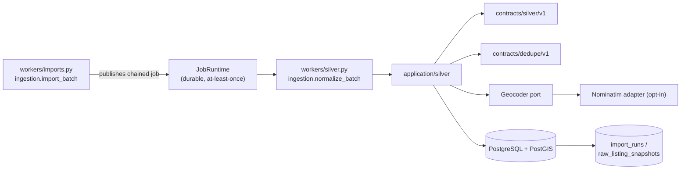

# Implementation Plan: Silver Normalization

**Branch**: `main` | **Date**: 2026-08-06 | **Spec**: [spec.md](./spec.md)

**Input**: Feature specification for UM-H2-009 through UM-H2-018 (Epica H2.2 -
Normalizacion Silver), including the clarification session 2026-08-06 (status
field semantics; deterministic dedupe auto-groups exact matches).

## Summary

Turn Bronze raw snapshots into normalized, deduplicated, versioned Silver
entities with full lineage. When an `import_run` from H2.1 succeeds, the worker
atomically publishes a durable `ingestion.normalize_batch` job (outbox, same
pattern as foundation). The handler, in transaction slices, normalizes each
snapshot against the versioned `silver-schema-v1` contract (price without
currency conversion, validated attributes, location with declared precision),
inserts one immutable `silver_listings` row per `(snapshot, normalizer_version)`,
resolves/creates `canonical_properties` (within-source chains plus deterministic
cross-source fingerprint dedupe), emits non-destructive `dedupe_links`
(deterministic confirmed; ambiguous proposals pending) and `listing_changes`
(before/after/origin) between consecutive versions. Geocoding (P1) sits behind
a `Geocoder` port with cache, rate limits and a registered source, defaulting
to a fake locally.

The increment reuses the durable job runtime, the `AccessControl` policy matrix
(no new roles), PostGIS/GeoAlchemy2 (already provisioned) and the
`application/ingestion` module conventions. It adds no HTTP surface, no LLM and
no new third-party runtime dependency. Reprocessing with a new
`normalizer_version` creates new rows and preserves the previous ones
(UM-H6-004 direction).

## Technical Context

**Language/Version**: Python `>=3.13,<3.14`; no frontend changes

**Primary Dependencies**: SQLAlchemy 2, GeoAlchemy2, Alembic, Psycopg 3, httpx
(all existing); existing `application/ingestion`, `application/jobs`,
`application/objects` modules; no new third-party runtime dependency

**Storage**: PostgreSQL 17 with PostGIS (new tables `canonical_properties`,
`silver_listings`, `dedupe_links`, `listing_changes` + 8 ENUM types); no new
object storage usage

**Testing**: pytest, Testcontainers, Ruff, mypy, Alembic checks, architecture
contracts; conformance suites shared between the normalization service and the
test fakes; integration tests against real Postgres/PostGIS

**Target Platform**: same runtime surfaces; normalization runs on the existing
worker; no new topology

**Project Type**: modular monolith (data/application module; no API surface in
this increment)

**Performance Goals**: reference batch (12 records, H2.1 fixture) normalized and
lineage-walkable in under 1 minute locally; reprocess replay returns in the time
of one idempotent lookup; dedupe proposals bounded to the pair set of the batch

**Constraints**: no currency conversion without a versioned rate; no invented
addresses/coordinates/precision; no silent coercion of invalid attributes;
silver rows immutable and additive; dedupe non-destructive (ambiguous cases
never auto-merge); status compared only when the contract defines it; no LLM;
no HTTP surface; geocoding disabled by default (fake locally)

**Scale/Scope**: one new module (`application/silver`), four tables, one chained
job type, two versioned contracts (silver-schema-v1, dedupe-policy-v1), one
optional geocoding adapter; batch of the controlled fixture

## Constitution Check

*GATE: evaluated before Phase 0 and re-evaluated after Phase 1.*

| Principle | Before research | After design | Evidence |
| --- | --- | --- | --- |
| Persistent radar truth | PASS | PASS | Silver listings, canonical properties, dedupe links and changes are persistent, immutable product objects; nothing lives only in logs or memory. |
| Auditable deterministic matching | PASS | PASS | Normalization, dedupe, change detection and geocoding precision are deterministic versioned code; no LLM anywhere in the increment. |
| Layer boundaries | PASS | PASS | `SilverNormalizer`, `DedupePolicy` and `Geocoder` are application ports; SQLAlchemy/GeoAlchemy2 repositories and the geocoding adapter are infrastructure; no API router is added. Architecture contracts stay release gates. |
| Data lineage and evidence | PASS | PASS | Every silver row keeps snapshot, run, source identity and `normalizer_version`; changes keep before/after/origin; dedupe links keep evidence; lineage walk is a tested contract (UM-H2-018). |
| Minimal verifiable scope | PASS | PASS | Silver layer only; search/matching/radar (H2.3), Gold features, UI surfaces and the operator review console are explicitly deferred. Two contracts, four tables, one job. |

There are no constitution violations requiring a complexity exception.

## Assumptions and Tradeoffs

- The `import_run` completion path of H2.1 is extended to publish the chained
  normalization job in the same transaction (outbox). This is the seam that
  makes the pipeline "operator imports → Silver exists" without a new trigger
  surface.
- Deterministic dedupe is defined as within-source `(source_id, external_id)`
  chains plus a cross-source strong-field fingerprint; any missing strong field
  degrades to a proposal (see [dedupe-policy-v1.md](./contracts/dedupe-policy-v1.md)).
  The spec's "hash o datos fuertes" is grounded in the fingerprint; content-hash
  equality is already handled by Bronze uniqueness in H2.1.
- `status` change detection is contract-driven (clarification 2026-08-06): no
  status field exists in import contract v1, so `listing_changes` of type
  `status` are only emitted when a future contract version defines one.
- Geocoding provider is Nominatim behind the port, disabled by default with a
  fake for local runs; the commercial provider decision stays open for beta
  (documented in research.md).
- Reprocessing semantics follow UM-H6-004 without building the full controlled
  reprocess console (that is H6-004): a new `normalizer_version` over the same
  snapshots creates new rows; uniqueness `(snapshot_id, normalizer_version)`
  keeps replays idempotent.
- No HTTP endpoints in this increment: reads (listings, chains, changes,
  dedupe links by state, lineage walk) are service/repository contracts consumed
  by tests and the harness; the operator console arrives in H6-003.

Detailed decision records and rejected alternatives are in
[research.md](./research.md).

## Architecture



All arrows are dependency/use direction. The normalization handler reads Bronze
rows through repositories, normalizes with pure policy, and writes Silver rows
inside transaction slices. `Geocoder` is an application port; the Nominatim
adapter is opt-in infrastructure; domain policy is pure.

## Module, Interface and Seam Design

| Module | Public Interface | Adapters / consumers | Boundary rule |
| --- | --- | --- | --- |
| Silver contracts | `NormalizedListing`, `CanonicalProperty`, `DedupeLink`, `ListingChange`, `NormalizationError`, typed results | application services and handler; pure values | No FastAPI, SQLAlchemy, httpx or web imports |
| Silver schema | `load_silver_schema_v1()`, `normalize_snapshot()` returning normalized fields + errors | application normalizer; infra loader | Pure; rules from `contracts/silver/v1`; versioned and immutable once ratified |
| Dedupe policy | `load_dedupe_policy_v1()`, `evaluate_pair()` → link or proposal, `fingerprint()` | application dedupe service | Pure; rules from `contracts/dedupe/v1`; non-destructive |
| Geocoder seam | `Geocoder.geocode(location, max_precision) -> GeoResult` | `NominatimGeocoder` (infra, opt-in) and `FakeGeocoder` (tests) | Returns coordinates + registered source; never raises precision |
| Silver service | `NormalizeRunService.process(run)`, `get_listing/chain/changes/links`, `confirm_link/reject_link()` | job handler; integration tests | Owns canonical resolution, change emission and link state transitions with optimistic lock |
| Silver repositories | `SilverListingRepository`, `CanonicalPropertyRepository`, `DedupeLinkRepository`, `ChangeRepository` | SQLAlchemy/GeoAlchemy2 adapters + in-memory adapters | Never commit; optimistic update with version guard |
| Normalization job | `SilverNormalizeHandler` registered as `ingestion.normalize_batch` | worker registry | Idempotent via job identity + unique constraints; result is a bounded counts summary |

Do not introduce a generic `BaseRepository[T]`, a global `ports/` grab bag or
an infrastructure facade. Each Interface stays next to the capability it hides.

## Readiness and Failure Isolation

No new critical dependency is added: PostgreSQL (with PostGIS) is already
critical from foundation. Failure behavior:

- Postgres loss during normalization: job fails transiently and retries within
  bounds; unique constraints (`uq_silver_listings_snapshot_version`,
  `uq_dedupe_links_pair`, `uq_listing_changes_field`) prevent duplicates on
  retry.
- Geocoder outage (opt-in): the location stays at the declared input precision
  with `geo_source` unset; failures degrade to `unknown` and never block the
  batch (FR-008 edge case).
- Malformed snapshot (should not happen past Bronze validation): normalization
  records `normalization_errors` per field; the run completes with a bounded
  error summary.
- Job chained from an import run that later is re-imported (same batch key):
  Bronze idempotency means no new snapshots, so normalization produces no new
  rows.

## Configuration and Secret Boundary

No new secrets. New settings (behind `Settings`, validated at startup, safe
defaults):

- `silver.geocoding_enabled` (default `false`; local runtime uses
  `FakeGeocoder`);
- `silver.geocoding_endpoint` (default Nominatim endpoint, non-secret);
- `silver.geocoding_cache_size` (default 512 entries) and
  `silver.geocoding_rate_limit` (default 1 req/sec burst 5) — fixed safe values
  matching the registered source policy.

Normalized values and payloads are never logged; `normalization_errors`,
assumptions and change records are bounded and non-sensitive. The geocoder
receives only `location_text`/`neighborhood` (no PII beyond address text already
present in the source payload).

## Data and Migration Design

The full schema is in [data-model.md](./data-model.md). The new revision
`0004_silver_normalization.py` creates:

1. `canonical_properties`;
2. `silver_listings`;
3. `dedupe_links`;
4. `listing_changes`;

plus 8 ENUM types (`canonical_state`, `operation_type`, `property_type`,
`currency_type`, `geo_precision`, `dedupe_method`, `dedupe_link_state`,
`change_type`), stable constraint naming, PostGIS geometry column and all
uniqueness/check/index requirements. The migration asserts PostGIS like 0001.

Important transaction rules:

- The handler processes snapshot slices, each in one transaction: silver
  inserts, canonical resolution, dedupe links and change records commit
  together; unique constraints arbitrate interrupted retries.
- Canonical resolution is deterministic and guarded: within-source lookup by
  `(source_id, external_id)`; cross-source by fingerprint against existing
  confirmed links; a race can only ever create a redundant empty canonical,
  never duplicate rows (guards in the repository).
- Dedupe transitions and `latest_listing_id` maintenance use optimistic updates
  (`WHERE id AND version`, increment version, exactly one row).
- Geometry is written via GeoAlchemy2; PostGIS extension present.

Migration tests cover empty DB, previous released revision, one head, metadata
drift and the declared downgrade/compensation path, following
`tests/migrations`.

## Contracts

Planning contracts:

- [silver schema v1 (normalized listing)](./contracts/silver-schema-v1.md)
- [dedupe policy v1](./contracts/dedupe-policy-v1.md)

No OpenAPI changes in this increment: there is no new HTTP surface. The
contract loaders publish machine-checkable rule sets under `contracts/silver/v1`
and `contracts/dedupe/v1`, mirroring how `contracts/import/v1` loads in H2.1.

## Job Idempotency and Recovery

Identity: `(job_type="ingestion.normalize_batch", logical_target=<source_id>:<run_id>,
idempotency_key=<run_id>)`. A terminal replay returns the existing result with
no attempt or effect; a deliberate rerun uses a new key.

At-least-once guarantees from the foundation runtime apply unchanged (outbox,
lease, bounded retries, classified failures). Additionally:

- `(snapshot_id, normalizer_version)` uniqueness prevents partial-commit
  duplicates on interrupted retries (SC-008);
- change emission recomputes against the previous chain version, so a replayed
  slice cannot double-emit (unique `(listing_id, field)`);
- dedupe pair evaluation is guarded by `uq_dedupe_links_pair`.

## Observability and Audit

Audit coverage (reuses the metadata-only telemetry allowlist):

| Operation | Durable evidence |
| --- | --- |
| normalize run | run id, source/version, snapshot counts, normalizer_version, actor (job), correlation |
| silver insert | row with snapshot_id, run_id, source, normalizer_version, timestamps |
| canonical resolve/create | canonical id, first publication ref |
| dedupe link | method, state, fingerprint, score, evidence refs, pair ids |
| link transition | actor, previous/new state, version guard |
| change emission | listing_id, previous_listing_id, change_type, field, origin |
| geocode call (opt-in) | source, precision requested/assigned, cache hit/miss counts |

Counts are derivable from committed rows. No normalized values, payloads or
address text enter default logs or traces.

## Delivery and Recovery Topology

No new deployment topology. The four tables ride the existing migration flow on
preview/production; `ingestion.normalize_batch` is registered in the worker job
registry next to `ingestion.import_batch`; geocoding remains disabled in all
environments until an operator enables it with the registered source policy.
Backup/restore scope extends automatically via the existing full-DB backup
procedure.

## Project Structure

### Documentation (this feature)

```text
specs/003-silver-normalization/
├── spec.md
├── plan.md
├── research.md
├── data-model.md
├── quickstart.md
├── contracts/
│   ├── silver-schema-v1.md
│   └── dedupe-policy-v1.md
├── checklists/
│   └── requirements.md
└── tasks.md                    # created later by /speckit-tasks
```

### Source Code (repository root)

```text
contracts/
├── silver/v1/                          # machine-checkable silver schema v1
└── dedupe/v1/                          # machine-checkable dedupe policy v1
src/umbral/
├── application/silver/
│   ├── contracts.py                    # pure values/errors
│   ├── silver_schema.py                # schema v1 rules + normalize_snapshot
│   ├── dedupe_policy.py                # policy v1 rules + fingerprint/evaluate
│   ├── ports.py                        # Geocoder + 4 repositories
│   └── service.py                      # NormalizeRunService + reads + transitions
├── infrastructure/
│   ├── geocoding/
│   │   ├── nominatim.py                # NominatimGeocoder (opt-in; cache + rate limit)
│   │   └── fake.py                     # FakeGeocoder (tests)
│   └── db/
│       ├── models/silver.py            # CanonicalProperty, SilverListing, DedupeLink, ListingChange
│       └── repositories/silver.py      # SQLAlchemy + in-memory adapters
├── application/ingestion/service.py    # + publish chained job on run completion (edited)
└── workers/silver.py                   # SilverNormalizeHandler + registry helper
alembic/versions/0004_silver_normalization.py
tests/
├── unit/application/silver/            # schema/dedupe/service tests
├── unit/infrastructure/test_geocoding.py
├── contract/test_silver_schema.py      # conformance against contracts/silver/v1
├── contract/test_dedupe_policy.py      # conformance against contracts/dedupe/v1
├── integration/silver/                 # real DB+PostGIS: pipeline, dedupe, changes, lineage, reprocess, geocoding
├── fixtures/silver/reference-batch.json
└── migrations/                         # 0004 upgrade/downgrade tests
scripts/check-silver.ps1                # new harness surface (mirrors check-imports.ps1)
```

**Structure Decision**: keep the accepted modular monolith layout. The new
`application/silver` module follows `application/ingestion` conventions;
adapters sit under `infrastructure/geocoding` and `infrastructure/db`; the
handler is registered in `workers/registry.py`; the chained-job publication
lives in the existing `ImportRunService` completion path (small, surgical edit).
No new top-level services or repositories beyond what the seams require.

## Planned Implementation Sequence

The later `/speckit-tasks` artifact must decompose these phases into test-first,
path-specific tasks. Each behavioral slice starts with the failing contract/
unit/integration test named here, then the minimum implementation, then the
full gate.

### Phase A — Silver schema contract and pure normalization

- Load silver-schema-v1 rules from `contracts/silver/v1`; implement
  `normalize_snapshot` (price/expenses/total cost, attributes with ranges,
  location + precision, error codes).
- Fixtures: `tests/fixtures/silver/reference-batch.json` plus per-field
  violations (out-of-range, unsupported currency, missing location).
- Conformance suite `tests/contract/test_silver_schema.py` + unit tests.
- Gate: SC-001..SC-003 fixture expectations; zero silent conversions; zero
  invented values.

### Phase B — Persistence and migration

- Migration `0004_silver_normalization` and models for the four tables + ENUMs
  + PostGIS geometry.
- SQLAlchemy + in-memory repositories; canonical resolution guards.
- Gate: migration suite (empty/previous/head/drift/downgrade) and repository
  unit tests green.

### Phase C — Normalization job and pipeline chaining

- `SilverNormalizeHandler` (`ingestion.normalize_batch`): read snapshots of the
  run, normalize per slice, insert silver rows, resolve/create canonicals,
  emit changes, finish with counts.
- Extend `ImportRunService` completion to publish the chained job atomically
  (outbox).
- Register handler in `workers/registry.py`.
- Integration tests: full pipeline, interrupted retry (no duplicates), chain
  publication, lineage walk (SC-007).
- Gate: `tests/integration/silver` pipeline green; SC-008 replay idempotent.

### Phase D — Dedupe: deterministic links and proposals

- `dedupe_policy.py` (fingerprint, evaluate_pair, threshold, evidence schema);
  `dedupe_links` wiring in the handler.
- `confirm_link`/`reject_link` service ops with optimistic lock + audit.
- Golden-pair fixtures (exact same-source, exact cross-source, ambiguous,
  missing-field degradation); conformance suite `tests/contract/test_dedupe_policy.py`
  + integration `test_dedupe_golden.py`.
- Gate: SC-004; zero ambiguous auto-merges; evidence recorded on every link.

### Phase E — Change detection service

- `ListingChangeService` emitting `listing_changes` between consecutive chain
  versions (price/text/attribute; status only when contract defines it);
  before/after/origin.
- Integration tests: price change, text/attribute change, identical
  re-publication emits nothing.
- Gate: SC-005 fixture expectations.

### Phase F — Geocoding port and adapters (P1)

- `Geocoder` port, `FakeGeocoder`, `NominatimGeocoder` (LRU cache, token-bucket
  rate limit, registered source, precision guard), settings wiring (disabled by
  default).
- Conformance suite shared by fake and nominatim adapter; rate-limit and
  precision tests.
- Gate: SC-006 (precision never upgraded; bounded requests; failures degrade to
  unknown).

### Phase G — Harness and cross-story closure

- Add `scripts/check-silver.ps1` and wire it into `check.ps1`.
- Run every functional-requirement fixture, success metric and
  `.\scripts\check.ps1` from a clean checkout; record evidence.
- Update quickstart and the runtime-local runbook with the manual smoke.

## Verification Commands

Target commands after implementation:

```powershell
uv sync --frozen --all-groups
uv run ruff format --check .
uv run ruff check .
uv run mypy src tests
uv run pytest
uv run alembic current --check-heads
uv run alembic check
uv run pytest tests/unit/application/silver tests/contract/test_silver_schema.py tests/contract/test_dedupe_policy.py tests/integration/silver
.\scripts\check.ps1
```

No success claim is based only on a mock or a skipped surface; the reference
batch must be normalized against the real Postgres/PostGIS stack in
`tests/integration/silver`.

## Backlog and Requirement Traceability

| Backlog item | Plan ownership | Primary evidence |
| --- | --- | --- |
| UM-H2-009 normalize sources/versions | Phase A + C | conformance fixtures + pipeline tests |
| UM-H2-010 price and total cost | Phase A | silver-schema conformance (SC-003) |
| UM-H2-011 real-estate attributes | Phase A | silver-schema conformance (SC-002) |
| UM-H2-012 location and granularity | Phase A + F | precision conformance (SC-006) |
| UM-H2-013 geocoding (P1) | Phase F | geocoding conformance + rate-limit tests |
| UM-H2-014 canonical properties | Phase C | canonical resolution integration tests |
| UM-H2-015 deterministic dedupe | Phase D | golden-pair conformance (SC-004) |
| UM-H2-016 non-destructive proposals | Phase D | proposal/transition integration tests |
| UM-H2-017 change between versions | Phase E | before/after integration tests (SC-005) |
| UM-H2-018 Bronze-Silver lineage | Phase C | lineage walk tests (SC-007) |

Every FR maps through these rows to at least one automated check. `tasks.md`
must preserve these mappings rather than regrouping cross-cutting checks away
from their story.

## Complexity Tracking

No constitution violation is present. The only deliberate additions beyond a
naive Silver pass are: (a) the chained-job publication seam in `ImportRunService`
— the minimum plumbing that guarantees "import → Silver" without a new trigger
surface; and (b) the deterministic fingerprint + proposal degradation rule —
required by UM-H2-015/016 to keep dedupe non-destructive. Both have simpler
rejected alternatives recorded in research.md that would violate the spec
(no Silver without a trigger; auto-merge of ambiguous cases).
