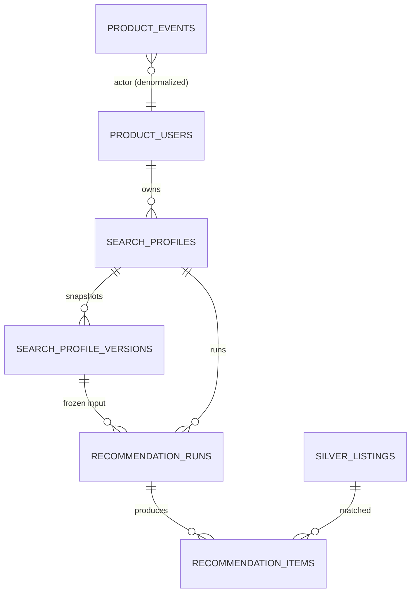

# Data Model: Structured Search Radar

**Feature**: `004-structured-search-radar` | **Date**: 2026-08-06

Data entities added by this increment. All tables use the shared
`IdentityAuditMixin` columns (`id`, `created_at`, `updated_at`, `version`,
`actor_kind`, `actor_id`, `source`, `correlation_id`) except where noted, and
follow the conventions of `001-foundation-runtime`, `002-bronze-ingestion` and
`003-silver-normalization`.

## Entity overview

- A `search_profiles` row is the current state of one radar; its history is a
  chain of immutable `search_profile_versions` rows (FR-002).
- A `recommendation_runs` row freezes `profile_version_id` and `score_policy_version`;
  its `recommendation_items` rows are the persistent, ordered matches (UM-H2-027).
- `product_events` records the closed-registry events of the increment
  (contracts/events-v1) without PII (FR-020).

## search_profiles

One row per radar (current state).

| Column | Type | Rules |
| --- | --- | --- |
| id | UUID | PK (mixin) |
| created_at / updated_at / version / actor / source / correlation_id | | mixin |
| owner_id | UUID FK `product_users.id` | ownership; all reads filter by owner (FR-004) |
| name | string 80 | 1..80 chars |
| operation | enum `operation_type` | `rental` only in v1 |
| zones | array of string | 1..15 CABA neighborhoods (closed list) |
| budget_max | numeric(18,2) | > 0; ARS monthly cap |
| budget_min | numeric(18,2) | nullable; >= 0; < budget_max |
| min_rooms | int | 0..200 |
| surface_min | numeric(12,2) | nullable; >= 0 |
| surface_max | numeric(12,2) | nullable; > surface_min |
| status | enum `search_profile_state` | `active` \| `paused` \| `archived` |
| unknown_strategy | JSONB | per-filter `exclude`/`include`; contract search-profile-v1 |
| current_version_id | UUID FK `search_profile_versions.id` | nullable; set on first version |
| latest_run_id | UUID FK `recommendation_runs.id` | nullable; denormalized for list views |

**Constraints**:
- `uq_search_profiles_owner_name`: `(owner_id, lower(name))`.
- `ck_search_profiles_budget`: `budget_max > 0 AND (budget_min IS NULL OR budget_min < budget_max)`.
- `ck_search_profiles_surface`: `surface_min >= 0 AND (surface_max IS NULL OR surface_max > surface_min)`.
- `ck_search_profiles_rooms`: `min_rooms BETWEEN 0 AND 200`.
- Indexes: `(owner_id, status)`, `(owner_id, created_at desc)`.

**Transitions** (v1): `active <-> paused`; `active/paused -> archived`;
`archived` terminal. Changing status is an optimistic update on `version`.

## search_profile_versions

Immutable snapshot of a profile; created on every change (FR-002).

| Column | Type | Rules |
| --- | --- | --- |
| id | UUID | PK (mixin) |
| created_at / version / actor / source / correlation_id | | mixin |
| profile_id | UUID FK `search_profiles.id` | RESTRICT |
| profile_version | int | 1 at creation; +1 per change; unique per profile |
| payload | JSONB | full copy of profile fields at that point (contract search-profile-v1) |

**Constraints**:
- `uq_search_profile_versions_profile_version` on `(profile_id, profile_version)`.
- `ck_search_profile_versions_profile_version`: `profile_version >= 1`.

**Notes**:
- Immutable and additive: runs reference the version they consumed; the payload
  is never mutated (FR-013). A version can be recreated only by re-running the
  same change (idempotent by profile + version).

## recommendation_runs

One row per executed run (async job; contract of the increment).

| Column | Type | Rules |
| --- | --- | --- |
| id | UUID | PK (mixin) |
| created_at / updated_at / version / actor / source / correlation_id | | mixin |
| profile_id | UUID FK `search_profiles.id` | RESTRICT |
| profile_version_id | UUID FK `search_profile_versions.id` | RESTRICT; frozen input |
| state | enum `recommendation_run_state` | `pending` \| `running` \| `succeeded` \| `failed` |
| trigger | enum `recommendation_run_trigger` | `created` \| `edited` \| `resumed` |
| score_policy_version | string 100 | `scoring-baseline-v1` |
| candidate_count | int | candidates that passed hard filters |
| published_item_count | int | items persisted (== candidate_count on success) |
| failure_code | string 100 | nullable; set when `failed` |
| job_execution_id | UUID FK `job_executions.id` | nullable; the durable job |
| finished_at | timestamptz | nullable; set on succeeded/failed |

**Constraints**:
- `uq_recommendation_runs_profile_version` on `(profile_id, profile_version_id,
  trigger)` — one run per (version, trigger); replay idempotent (SC-008).
- `ck_recommendation_runs_state_finished`: terminal states set `finished_at`.
- Indexes: `(profile_id, state)`, `(profile_id, created_at desc)`,
  `(profile_version_id)`.

**Semantics**:
- `pending`/`running`: the radar shows "generando resultados" (FR-023,
  SC-011). The UI polls while the run is not terminal, with the < 30 s target
  (SC-013).
- `succeeded`: items are published atomically with the run transition
  (single transaction, same pattern as job `record_outcome`); the run becomes
  the visible result of the profile.
- `failed`: `failure_code` recorded; the last succeeded run remains the only
  visible result (FR-013); a retry reuses the same job identity.
- Edited active profile: new version -> new run (trigger `edited`); the
  previous run and items are preserved for audit (FR-015).

## recommendation_items

Persistent, ordered matches of one run (UM-H2-027, FR-014).

| Column | Type | Rules |
| --- | --- | --- |
| id | UUID | PK (mixin) |
| created_at / version / actor / source / correlation_id | | mixin |
| run_id | UUID FK `recommendation_runs.id` | RESTRICT |
| listing_id | UUID FK `silver_listings.id` | RESTRICT |
| score | numeric(6,4) | 0..1 |
| position | int | 0..n; stable order of the run |
| contributions | JSONB | per-dimension fit values + `score_policy_version` (scoring-baseline-v1) |

**Constraints**:
- `uq_recommendation_items_run_position` on `(run_id, position)`.
- `uq_recommendation_items_run_listing` on `(run_id, listing_id)`.
- `ck_recommendation_items_score`: `score >= 0 AND score <= 1`.
- `ck_recommendation_items_position`: `position >= 0`.
- Indexes: `(run_id, position)`, `(listing_id)`.

**Notes**:
- Frozen at publication: the radar pages over items with keyset
  `(run_id, position)` — stable by construction (SC-003: 0 repeats/omissions).
- Detail views join to `silver_listings` for media/attributes and to
  `listing_changes` for known changes (FR-018).

## product_events

One row per validated product event (contracts/events-v1; FR-020, SC-007).

| Column | Type | Rules |
| --- | --- | --- |
| id | UUID | PK (mixin) |
| created_at / version / source / correlation_id | | mixin (actor fields optional) |
| event_type | string 100 | closed registry (`radar.created.v1`, `recommendation.run_published.v1`, `recommendation.impression.v1`, `recommendation.detail_viewed.v1`, `listing.source_opened.v1`) |
| event_version | int | from the registry |
| actor_id | UUID | nullable; user or system |
| occurred_at | timestamptz | UTC |
| payload | JSONB | validated, bounded, PII-free |

**Constraints**:
- `ck_product_events_type`: event_type matches `^[a-z][a-z0-9_.]{0,99}$`.
- Indexes: `(event_type, occurred_at)`, `(occurred_at)`, `(actor_id)`.

**Notes**:
- Registry and payload validation live in `application/events` (closed
  registry pattern of `domain/identity/events.py`); DB rows are append-only.
- Server events are written in the same transaction as their domain change;
  client events are written by the event endpoint after validation.

## ENUM types (new)

| Type | Values |
| --- | --- |
| `search_profile_state` | `active`, `paused`, `archived` |
| `recommendation_run_state` | `pending`, `running`, `succeeded`, `failed` |
| `recommendation_run_trigger` | `created`, `edited`, `resumed` |

## Concurrency and transaction rules

- PATCH on a profile carries `expected_version`; update uses
  `WHERE id AND version` with version increment; a miss raises the typed
  `ConcurrencyConflict` (409) — the existing error contract (FR-006).
- Run publication is a single transaction: run `succeeded` + items insert +
  `radar.created`/`run_published` event row commit together; interrupted
  retries arbitrate by `uq_recommendation_runs_profile_version` and
  `uq_recommendation_items_run_position`.
- The run job follows the durable runtime (outbox, lease, bounded retries);
  the job result summary is JSON-scalar <= 8 KiB.
- All reads (list, matches, detail) filter by `owner_id`; the listing detail
  endpoint authorizes the listing through the requesting user's runs
  (FR-004, FR-014).

## Migration

New Alembic revision `0005_search_radar.py` (down: `0004_silver_normalization`)
creates the five tables, the three ENUM types above and all
constraints/indexes. Migration tests cover empty DB, previous revision, one
head, metadata drift and the declared downgrade path, following
`tests/migrations` conventions.
