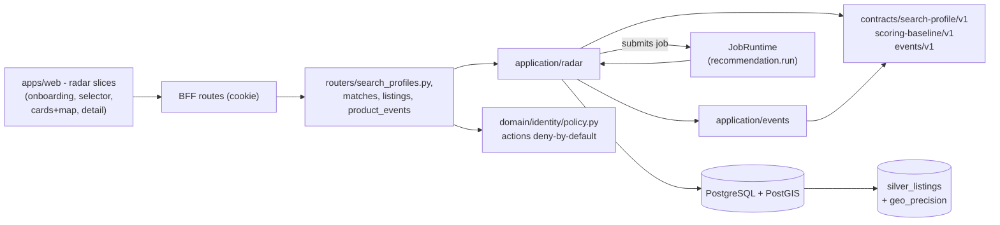

# Implementation Plan: Structured Search Radar

**Branch**: `main` | **Date**: 2026-08-06 | **Spec**: [spec.md](./spec.md)

**Input**: Feature specification for UM-H2-019 through UM-H2-034 (Epica H2.3 -
Busqueda, matching baseline y radar), including the clarification session
2026-08-06 (async runs with visible generation state; no operator surface on
user radars; score breakdown only in the match detail; < 30 s publication
target).

## Summary

Turn Silver listings into persistent, explorable matches for a user-owned
radar. A user creates or edits a `search_profile` (radar) through an
onboarding UI; each change persists an immutable `search_profile_versions`
row and submits the durable async job `recommendation.run` (same runtime as
imports/silver). The handler applies pure hard filters (with the versioned
per-filter unknown strategy), retrieves the candidate set with a read-only
PostGIS query, computes the deterministic `scoring-baseline-v1` order and
publishes `recommendation_runs` + `recommendation_items` atomically. The radar
UI pages over the frozen items (`run_id` + `position`), shows cards/lista and a
MapLibre map that never reveals coordinates beyond the authorized
`geo_precision`, and a listing detail with media, attributes, source, missing
fields, known changes and the score breakdown. Product events
(`radar.created.v1`, `recommendation.run_published.v1` server-side;
`impression`, `detail_viewed`, `source_opened` via a validated client endpoint)
persist in `product_events` under the closed `contracts/events/v1` registry.

The increment adds the first product HTTP surface under `/api/v1` (search
profiles, matches, listing detail, product events), new deny-by-default policy
actions (`product.search_profile.*`, `product.matches.read`,
`product.listing.read`, `product.events.emit`), migration `0005_search_radar`
(5 tables, 3 ENUMs), the regenerated typed web client, the radar web slices
(onboarding, selector, radar cards/lista + map, detail, responsive states) and
the E2E verification. It adds no LLM, no embeddings for ranking, no operator
console and no notifications (all H3/H5/H6).

## Technical Context

**Language/Version**: Python `>=3.13,<3.14`; TypeScript/Next.js App Router on
`apps/web` (Node >= 24 < 25)

**Primary Dependencies**: SQLAlchemy 2, GeoAlchemy2, Alembic, Psycopg 3 (all
existing); maplibre-gl (NEW web dependency, client-only); hey-api generated
client and TanStack Query (existing deps, first use for product UI); no new
Python runtime dependency

**Storage**: PostgreSQL 17 with PostGIS (new tables `search_profiles`,
`search_profile_versions`, `recommendation_runs`, `recommendation_items`,
`product_events` + 3 ENUM types); no new object storage usage

**Testing**: pytest, Testcontainers, Ruff, mypy, Alembic checks, architecture
contracts; vitest + testing-library; Playwright (e2e with mock identity);
OpenAPI export + generated-client drift check

**Target Platform**: same runtime surfaces; the run handler runs on the
existing worker (`recommendation.run` in the registry); web adds product
routes under `(protected)`; no new topology

**Project Type**: modular monolith; first product HTTP surface (search
profiles, matches, listing detail, product events)

**Performance Goals**: a run over the reference fixture publishes in under
30 seconds (SC-013); radar paging returns stable pages over frozen items;
profile create/edit responses return immediately (run is async)

**Constraints**: hard filters deterministic, no embeddings/LLM in filtering or
ranking; unknown values follow the versioned per-filter strategy; runs freeze
profile snapshot, candidate set, score version and timestamps; failed runs
never replace the last valid one; map never reveals coordinates beyond
authorized `geo_precision`; events under the closed registry without PII;
deny-by-default ownership on every product route; operator has no surface on
user radars in this increment

**Scale/Scope**: one new application module (`application/radar`), one new
events module (`application/events`), five tables, one async job type, four
HTTP routers, three versioned contracts (search-profile-v1, scoring-baseline-v1,
events-v1), four web slices, one new web dependency; fixture-driven golden
cases for filters, scoring and pagination

## Constitution Check

*GATE: evaluated before Phase 0 and re-evaluated after Phase 1.*

| Principle | Before research | After design | Evidence |
| --- | --- | --- | --- |
| Persistent radar truth | PASS | PASS | Radars, profile versions, runs and items are persistent product objects; matches never live only in the chat or memory. |
| Auditable deterministic matching | PASS | PASS | Hard filters and scoring-baseline-v1 are pure, versioned, deterministic code; ranking is never decided by an LLM; runs freeze inputs (profile snapshot, candidate set, score version, timestamps). |
| Layer boundaries | PASS | PASS | `application/radar` and `application/events` are application modules; SQLAlchemy/PostGIS repositories and MapLibre UI are infrastructure; routers call application services; policy actions live in the identity policy matrix; architecture contracts stay release gates. |
| Data lineage and evidence | PASS | PASS | Each run references `profile_version_id` and `score_policy_version`; items reference `silver_listings` with lineage to Bronze; events carry correlation ids; server events commit with their domain change. |
| Minimal verifiable scope | PASS | PASS | Scope is exactly UM-H2-019..UM-H2-034: feedback, explanations with evidence, comparison, chat and notifications are deferred (H3/H4/H5); operator console deferred (H6); no speculative limits or rate policies. |

There are no constitution violations requiring a complexity exception.

## Assumptions and Tradeoffs

- Runs are async jobs with a visible "generando resultados" state
  (clarification 2026-08-06); the UI polls the run state while
  `pending/running` (3 s interval) and pages the published items afterwards.
- The operator has no surface on user radars in this increment
  (clarification 2026-08-06): E2E verification uses the harness test actor;
  `product.search_profile.*` actions are `owner_required` for role `user`.
- The score breakdown is shown only in the match detail, never in cards
  (clarification 2026-08-06); evidence-based explanations are H3.
- Unknown-value strategies per hard filter (price/location -> `exclude`;
  rooms/surface -> `include`) are versioned defaults in search-profile-v1 and
  configurable per profile at creation (see research R-03).
- Archived profiles are terminal in v1 (no restore): data, versions, runs and
  items are preserved (research R-07); restore is trivial to add later if the
  beta asks for it.
- The events contract v1 is the seed for UM-H0-013: a closed registry with a
  `product_events` table; no event bus or outbox beyond the server-side
  same-transaction write (research R-05).
- The map uses public OSM raster tiles with required attribution (research
  R-06); a commercial provider and tile CSP are deferred to H6-013; a tile
  failure degrades to a recoverable map error while the list stays usable.
- Routes use the implemented `/api/v1` convention (auth/imports); the docs
  `docs/api/endpoints.md` are updated to the implemented surface (research
  R-09). Adding paths is non-breaking for the OpenAPI major 1 gate.
- The web onboarding uses the existing shadcn primitives and native form
  validation; react-hook-form/zod/Radix select are not added in this increment
  (research R-10).
- `QueryClientProvider` is mounted and the generated hey-api client is wired
  to the browser client (BFF origin pattern); identity BFF routes are the
  template (research R-11).
- No hard limit on radars per user and no product rate limits in this
  increment (research R-08).

Detailed decision records and rejected alternatives are in
[research.md](./research.md).

## Architecture



All arrows are dependency/use direction. The web only talks to `/api/v1`
through BFF routes with the session cookie; routers authorize via the
`AccessControl` policy matrix (new `product.*` actions, `owner_required`);
application services are pure of FastAPI/SQLAlchemy; the run job consumes the
durable runtime and publishes atomically.

## Module, Interface and Seam Design

| Module | Public Interface | Adapters / consumers | Boundary rule |
| --- | --- | --- | --- |
| Radar contracts | `SearchProfile`, `ProfileVersion`, `HardFilterPolicy`, `RunSnapshot`, `ItemSnapshot`, `RadarError` | routers and run job; pure values | No FastAPI, SQLAlchemy, LLM or web imports |
| Search profile policy | `load_search_profile_contract_v1()`, `validate_profile()`, `apply_hard_filters()`, `unknown_strategy()` | application service + contract conformance tests | Pure; rules from `contracts/search-profile/v1`; versioned |
| Scoring baseline | `load_scoring_baseline_v1()`, `compute_score(listing, profile) -> (score, contributions)` | run job; golden tests | Pure; rules from `contracts/scoring-baseline/v1`; deterministic, versioned |
| Events registry | `load_events_registry_v1()`, `validate_event(type, payload)`, `EVENT_TYPES` | routers (client events) and services (server events) | Pure; closed registry pattern of `domain/identity/events.py` |
| Radar service | `create_profile`, `get_profile`, `list_profiles`, `update_profile`, `set_status`, `get_matches(run_id)`, `get_listing_detail`, `submit_run` | routers, run job, tests | Owns versioning, run triggering, optimistic updates and authorization checks |
| Radar repositories | `SearchProfileRepository`, `RunRepository`, `ItemRepository`, `EventRepository` | SQLAlchemy adapters + in-memory adapters | Never commit alone; optimistic `WHERE id AND version` |
| Run handler | `RecommendationRunHandler` registered as `recommendation.run` | worker registry | Idempotent via job identity + unique constraints; result is a <= 8 KiB counts summary |
| HTTP routers | `routers/search_profiles.py` (CRUD + status), `routers/matches.py`, `routers/listings.py`, `routers/product_events.py` | BFF routes of the web | `configure_*_routes` + `_deps()` pattern; `_authorize` with `resource_owner_id`; RFC 9457 problems |
| Web slices | `radar/new` (onboarding), `radar` (selector), `radar/[id]` (cards+map), `listings/[id]` (detail) | generated hey-api client via BFF; TanStack Query | Client components acotados; estados responsive; accesibilidad por DoD |

Do not introduce a generic `BaseRepository[T]`, a global `ports/` grab bag or
an infrastructure facade. Each Interface stays next to the capability it hides;
the events registry reuses the closed-registry style of identity events instead
of creating a new pattern.

## Readiness and Failure Isolation

No new critical dependency is added: PostgreSQL (with PostGIS) is already
critical. MapLibre tiles are a non-critical web dependency (degradable).
Failure behavior:

- Postgres loss during a run: the job fails transiently and retries within
  bounds; `uq_recommendation_runs_profile_version` and
  `uq_recommendation_items_run_position` prevent duplicates on retry.
- Run handler crash mid-publish: the retry re-executes; unique constraints
  arbitrate; the last succeeded run stays the visible result (FR-013).
- Candidate query failure or malformed listing: the run records
  `failure_code` and does not publish partial items; the previous run remains
  visible.
- Tile server outage: the map shows a recoverable error state; the list stays
  fully usable (FR-019).
- Profile edit race: `expected_version` mismatch returns the typed 409;
  nothing is lost silently (FR-006).
- Event validation failure (client): 400 with the registry reason; no row is
  written; the UI can retry the action (bounded, no retry loops).

## Configuration and Secret Boundary

No new secrets. New settings (behind `Settings`, validated at startup, safe
defaults):

- `radar.page_size_default` (25) and `radar.page_size_max` (100) — matches
  paging bounds;
- `radar.run_job_type` (`recommendation.run`) and
  `radar.score_policy_version` (`scoring-baseline-v1`);
- `radar.run_poll_interval_seconds` (3) — web polling while
  `pending/running`.

Tile URLs are public constants in the web map component (no secrets). Event
payloads, profile payloads and scores are never logged; event rows are
bounded and PII-free by registry validation. The web BFF forwards only the
session cookie; no API keys cross the browser.

## Data and Migration Design

The full schema is in [data-model.md](./data-model.md). The new revision
`0005_search_radar.py` creates:

1. `search_profiles`;
2. `search_profile_versions`;
3. `recommendation_runs`;
4. `recommendation_items`;
5. `product_events`;

plus 3 ENUM types (`search_profile_state`, `recommendation_run_state`,
`recommendation_run_trigger`), stable constraint naming and all
uniqueness/check/index requirements. The migration asserts PostGIS like 0001
(the candidate query uses geometry when present).

Important transaction rules:

- Profile create: profile + version 1 + `radar.created.v1` event row commit
  together; the job submission is idempotent by identity
  (`recommendation:{profile_id}:{version_id}`).
- Run publication: run `succeeded` + items + `run_published.v1` event row
  commit together (same pattern as job `record_outcome`);
  `uq_recommendation_runs_profile_version` prevents double publish.
- Status transitions and edits use optimistic updates
  (`WHERE id AND version`, increment version, exactly one row).
- All product reads filter by `owner_id`; the listing detail endpoint
  authorizes through the requesting user's runs.

Migration tests cover empty DB, previous released revision, one head,
metadata drift and the declared downgrade/compensation path, following
`tests/migrations`.

## Contracts

Planning contracts:

- [search profile v1](./contracts/search-profile-v1.md)
- [scoring baseline v1](./contracts/scoring-baseline-v1.md)
- [product events v1](./contracts/events-v1.md)

The OpenAPI contract is exported from code (`scripts/export-openapi.ps1`) and
grows additively under major 1: `POST/GET /api/v1/search-profiles`,
`GET/PATCH /api/v1/search-profiles/{id}`, `POST
/api/v1/search-profiles/{id}/status`, `GET
/api/v1/search-profiles/{id}/matches`, `GET /api/v1/listings/{listing_id}`,
`POST /api/v1/product-events`. The web client is regenerated
(`api:generate`) and committed; `api:check` blocks drift. `docs/api/endpoints.md`
is updated to the implemented surface.

## Job Idempotency and Recovery

Identity: `(job_type="recommendation.run", logical_target=<profile_id>:<version_id>,
idempotency_key="recommendation:{profile_id}:{version_id}")`. A terminal replay
returns the existing run with no attempt or effect; an edit that produced a new
version uses a new key (new run). At-least-once guarantees from the foundation
runtime apply unchanged (outbox, lease, bounded retries, classified failures).
Additionally:

- `uq_recommendation_runs_profile_version` prevents partial-commit duplicates
  on interrupted retries (SC-008);
- item publication is guarded by `uq_recommendation_items_run_position`;
- the run handler returns a bounded JSON summary (counts, failure code) so the
  job result stays <= 8 KiB.

## Observability and Audit

Audit coverage (reuses the metadata-only telemetry allowlist; no new telemetry
fields — events are DB rows):

| Operation | Durable evidence |
| --- | --- |
| profile create/edit/status | profile row + new version row + `radar.created.v1` (create) with actor/correlation |
| run submit | `recommendation_runs` row with job_execution_id, trigger, profile_version_id |
| run publish | run `succeeded` + items + `recommendation.run_published.v1` with counts and score_policy_version |
| run failure | run `failed` with `failure_code`; last valid run remains visible |
| match read (list/detail) | `recommendation.impression.v1` / `detail_viewed.v1` client events (bounded) |
| source open | `listing.source_opened.v1` client event (no URL echo) |
| authorization decision | existing `access_audit_events` (allowed/denied with policy version) |

Counts are derivable from committed rows. No profile payloads, scores, URLs or
description text enter default logs or traces.

## Delivery and Recovery Topology

No new deployment topology. The five tables ride the existing migration flow on
preview/production; `recommendation.run` is registered in the worker job
registry next to `ingestion.normalize_batch`; `maplibre-gl` is a web build
dependency (client-only, dynamic import, no SSR). Backup/restore scope extends
automatically via the existing full-DB backup procedure. Web product routes
live under `(protected)`; the public route allowlist in
`apps/web/src/lib/access/policy.ts` is unchanged (tests keep the exact list).

## Project Structure

### Documentation (this feature)

```text
specs/004-structured-search-radar/
├── spec.md
├── plan.md
├── research.md
├── data-model.md
├── quickstart.md
├── contracts/
│   ├── search-profile-v1.md
│   ├── scoring-baseline-v1.md
│   └── events-v1.md
├── checklists/
│   └── requirements.md
└── tasks.md                    # created later by /speckit-tasks
```

### Source Code (repository root)

```text
contracts/
├── events/v1/                        # machine-checkable events registry v1
├── scoring/v1/                       # machine-checkable scoring baseline v1
└── search-profiles/v1/               # machine-checkable search profile v1
src/umbral/
├── application/radar/
│   ├── contracts.py                  # pure values/errors
│   ├── profile_policy.py             # search-profile-v1 rules + validate
│   ├── hard_filters.py               # pure filters + unknown strategy
│   ├── scoring.py                    # scoring-baseline-v1 rules + compute
│   ├── ports.py                      # 4 repositories
│   └── service.py                    # RadarService: CRUD/status/matches/detail/run
├── application/events/
│   ├── contracts.py                  # product event values
│   └── registry.py                   # closed registry v1 + validate_event
├── domain/identity/policy.py         # + product.* actions (edited)
├── infrastructure/db/
│   ├── models/radar.py               # 5 tables
│   └── repositories/radar.py         # SQLAlchemy + in-memory adapters
├── infrastructure/events/loader.py   # contract loader (contracts/events/v1)
├── api/routers/
│   ├── search_profiles.py
│   ├── matches.py
│   ├── listings.py
│   └── product_events.py
└── workers/radar.py                  # RecommendationRunHandler + registry helper
alembic/versions/0005_search_radar.py
apps/web/src/
├── app/(protected)/radar/
│   ├── new/page.tsx                  # onboarding 3 pasos + resumen
│   ├── page.tsx                      # selector activas/pausadas/archivadas
│   └── [id]/page.tsx                 # radar cards/lista + mapa
├── app/(protected)/listings/[id]/page.tsx   # detalle + desglose
├── lib/query/providers.tsx           # QueryClientProvider (mount)
├── lib/radar/                        # hooks, polling, estados, eventos cliente
└── components/radar/                 # cards, map, states, pagination
tests/
├── contract/test_search_profile_contract.py
├── contract/test_scoring_baseline.py
├── contract/test_events_registry.py
├── unit/application/radar/
├── unit/application/events/
├── integration/radar/                # real DB: pipeline, pagination, editing, events, e2e reimport
├── fixtures/radar/
└── migrations/                       # 0005 upgrade/downgrade tests
tests/e2e/radar.spec.ts               # web e2e (mock identity)
scripts/check-radar.ps1               # new harness surface (mirrors check-silver.ps1)
```

**Structure Decision**: keep the accepted modular monolith layout. The new
`application/radar` module follows `application/silver` conventions; the events
registry follows the closed-registry style of `domain/identity/events.py`; the
handler is registered in `workers/registry.py`; routers follow the
`configure_*_routes` + `_authorize` pattern of `routers/imports.py`; web slices
follow the identity slice conventions (BFF routes, `(protected)` layout,
shadcn primitives). No new top-level services or repositories beyond what the
seams require.

## Planned Implementation Sequence

The later `/speckit-tasks` artifact must decompose these phases into test-first,
path-specific tasks. Each behavioral slice starts with the failing contract/
unit/integration test named here, then the minimum implementation, then the
full gate.

### Phase A — Contracts and pure domain policy

- Load search-profile-v1, scoring-baseline-v1 and events-v1 rules from
  `contracts/`; implement `validate_profile`, `apply_hard_filters`,
  `compute_score` and the events registry.
- Golden fixtures: `tests/fixtures/radar/profiles-golden.json` (valid,
  invalid, unknown-value cases), `scoring-golden.json`, `events-golden.json`.
- Conformance suites `tests/contract/test_search_profile_contract.py`,
  `test_scoring_baseline.py`, `test_events_registry.py`.
- Gate: SC-001 (validation), SC-002 (filters), SC-003 (determinism),
  SC-012 (breakdown), zero silent defaults.

### Phase B — Persistence and migration

- Migration `0005_search_radar` and models for the five tables + ENUMs.
- SQLAlchemy + in-memory repositories; optimistic version guards.
- Gate: migration suite (empty/previous/head/drift/downgrade) and repository
  unit tests green.

### Phase C — Radar service and async run job

- `RadarService`: create/list/get/update/status with versioning, run
  triggering and events; `RecommendationRunHandler` (`recommendation.run`)
  with candidate query (PostGIS when geometry present), scoring and atomic
  publication.
- Register handler in `workers/registry.py`; wire the browser of the run job.
- Integration tests: pipeline (< 30 s, SC-013), failure keeps last valid run
  (SC-004), reimport idempotency (SC-008).
- Gate: `tests/integration/radar/test_run_pipeline.py` + editing tests green.

### Phase D — HTTP surface, policy actions and typed client

- Policy actions in `domain/identity/policy.py`: `product.search_profile.create/
  read/update/status`, `product.matches.read`, `product.listing.read`,
  `product.events.emit` (owner_required where applicable).
- Routers `search_profiles.py`, `matches.py`, `listings.py`,
  `product_events.py` following the imports pattern; RFC 9457 problems and
  typed 409 on concurrency.
- Export OpenAPI (`scripts/export-openapi.ps1`), regenerate + commit the web
  client; update `docs/api/endpoints.md`.
- Gate: contract tests (OpenAPI additive), authz cross-user tests, client
  drift check green.

### Phase E — Web: onboarding and selector

- Mount `QueryClientProvider`; wire the generated client to the BFF origin.
- Onboarding `(protected)/radar/new`: 3 pasos (presupuesto y operacion; zonas
  CABA; requisitos P0) + resumen + confirmacion with accessible validation
  (FR-007); selector `(protected)/radar` with activas/pausadas/archivadas and
  context preservation (FR-008).
- Vitest + axe e2e for the new routes; states loading/empty/error/no
  autorizado (FR-019).
- Gate: SC-006 (states), SC-009 (accessibility), SC-010 (guided walkthrough).

### Phase F — Web: radar cards/lista + mapa and detail

- Radar `(protected)/radar/[id]`: cards/lista with price total, barrio,
  superficie, ambientes, score total, fuente, estados and stable paging over
  `run_id`; polling while the run is `pending/running` (SC-011, SC-013).
- MapLibre client component: points respect `geo_precision` (SC-005),
  selection synced with the list, tile-failure error state (FR-017, FR-019).
- Detail `(protected)/listings/[id]`: media, atributos, fuente original,
  ubicacion, datos faltantes, cambios conocidos and the score breakdown
  (FR-018, SC-012); client events (impression, detail_viewed, source_opened).
- Gate: e2e `tests/e2e/radar.spec.ts` covering desktop/mobile states and
  precision.

### Phase G — Instrumentacion verificada, harness and closure

- Verify events end-to-end (SC-007) and the E2E reimport walk (SC-008);
  `scripts/check-radar.ps1` wired into `check.ps1`.
- Run every functional-requirement fixture, success metric and
  `.\scripts\check.ps1` from a clean checkout; record evidence in
  `docs/runbooks/evidence/`; update quickstart and the runtime-local runbook.

## Verification Commands

Target commands after implementation:

```powershell
uv sync --frozen --all-groups
uv run ruff format --check .
uv run ruff check .
uv run mypy src tests
uv run pytest
uv run alembic current --check-heads
uv run alembic check
uv run pytest tests/contract/test_search_profile_contract.py tests/contract/test_scoring_baseline.py tests/contract/test_events_registry.py tests/unit/application/radar tests/unit/application/events tests/integration/radar
npm run api:generate --workspace @umbral/web
npm run api:check --workspace @umbral/web
npm run typecheck --workspace @umbral/web
npm run test --workspace @umbral/web
npm run test:e2e --workspace @umbral/web
.\scripts\check.ps1
```

No success claim is based only on a mock or a skipped surface: the run
pipeline, pagination, editing and events must run against the real
Postgres/PostGIS stack in `tests/integration/radar`, and the web flows run
against the app with the e2e mock identity.

## Backlog and Requirement Traceability

| Backlog item | Plan ownership | Primary evidence |
| --- | --- | --- |
| UM-H2-019 search profiles + snapshots | Phase A + B + C | profile contract conformance + versioning tests (SC-001) |
| UM-H2-020 search use cases | Phase C + D | service + router tests (ownership, states) |
| UM-H2-021 HTTP search contracts | Phase D | OpenAPI export + typed client + concurrency 409 |
| UM-H2-022 structured onboarding | Phase E | e2e onboarding + a11y (SC-010) |
| UM-H2-023 selector and administration | Phase E | selector e2e + state transitions (SC-006) |
| UM-H2-024 pure hard filters | Phase A | golden conformance (SC-002) |
| UM-H2-025 candidates with SQL/PostGIS | Phase C | run pipeline integration (SC-013) |
| UM-H2-026 versioned baseline scoring | Phase A + C | scoring conformance + determinism (SC-003, SC-012) |
| UM-H2-027 persist runs/items | Phase C | run publication tests (SC-004, SC-011) |
| UM-H2-028 matches list/detail | Phase D + F | matches/listings routers + detail UI (SC-004) |
| UM-H2-029 radar cards and list | Phase F | radar UI e2e (SC-006) |
| UM-H2-030 synced map with precision | Phase F | map precision tests (SC-005) |
| UM-H2-031 listing detail | Phase F | detail UI + known changes (SC-006) |
| UM-H2-032 responsive states | Phase E + F | states coverage desktop/mobile (SC-006, SC-009) |
| UM-H2-033 activation/exploration events | Phase A + C + F | events registry + product_events integration (SC-007) |
| UM-H2-034 E2E initial walk | Phase C + G | reimport idempotency + full walk (SC-008) |

Every FR maps through these rows to at least one automated check. `tasks.md`
must preserve these mappings rather than regrouping cross-cutting checks away
from their story.

## Complexity Tracking

No constitution violation is present. The only deliberate additions beyond a
naive radar pass are: (a) the product events contract and table — required by
UM-H2-033 and the audit guardrails, with the rejected alternative (telemetry
only) recorded in research R-05; and (b) the frozen-items pagination over
`run_id` — required by SC-003 stable paging, with the rejected alternative
(live paging) recorded in research R-02. Both have simpler rejected
alternatives documented that would violate the spec (events without
auditability; unstable paging).
