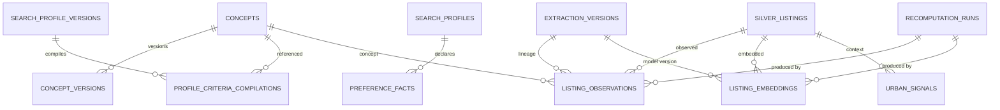

# Data Model: Criteria and Observations

**Feature**: `005-criteria-observations` | **Date**: 2026-08-06

Data entities added by this increment (UM-H3-001 a UM-H3-011). All tables use
the shared `IdentityAuditMixin` columns (`id`, `created_at`, `updated_at`,
`version`, `actor_kind`, `actor_id`, `source`, `correlation_id`) except where
noted, and follow the conventions of `001-foundation-runtime`,
`002-bronze-ingestion`, `003-silver-normalization` and
`004-structured-search-radar`.

## Entity overview

- A `concepts` row is the current state of one curated concept; its history is
  a chain of immutable `concept_versions` rows (FR-001).
- `preference_facts` are append-only; the active row per (profile, concept)
  is the latest with `state = active` (FR-004/FR-005).
- `profile_criteria_compilations` persist the ordered, versioned compilation
  of executable criteria per profile version (FR-006/FR-007/FR-008).
- `listing_observations` are append-only with at most one `active` row per
  (listing, concept, source) via a partial unique index (FR-009, SC-012);
  `extraction_versions` is the immutable version registry for rules, prompts,
  schemas and models (FR-013, SC-006).
- `recomputation_runs` records every invalidation-recompute cycle with
  state, counts, cause and timestamps (FR-016, SC-009).
- `listing_embeddings` (P1) and `urban_signals` (P1) hold the optional Gold
  signals (FR-018/FR-019, FR-020/FR-021).

## concepts

One row per curated concept (current state).

| Column | Type | Rules |
| --- | --- | --- |
| id | UUID | PK (mixin) |
| created_at / updated_at / version / actor / source / correlation_id | | mixin |
| key | string 100 | canonical key (`^[a-z][a-z0-9_]{0,99}$`); unique |
| name | string 200 | display name |
| aliases | JSONB | array of alias strings; resolved to one canonical concept (FR-003) |
| matcher_type | string 50 | from `contracts/criteria/v1/matcher-types-v1.json` (FR-002) |
| params_schema | JSONB | allowed params for the matcher type (FR-002) |
| source | string 50 | `seed` (v1) |
| defaults | JSONB | default value/params for the concept |
| compute_policy | JSONB | e.g. `{"unknown": "exclude" \| "penalize" \| "include", "qualitative": bool}` |
| current_version_id | UUID FK `concept_versions.id` | nullable; set on first version |

**Constraints**:
- `uq_concepts_key` on `(key)`.
- `ck_concepts_key_format`: `key ~ '^[a-z][a-z0-9_]{0,99}$'`.
- `ck_concepts_aliases`: aliases is an array of strings, max 20.
- Indexes: none beyond the PK/unique.

## concept_versions

Immutable snapshot of a concept; created on every change (FR-001).

| Column | Type | Rules |
| --- | --- | --- |
| id | UUID | PK (mixin) |
| created_at / version / actor / source / correlation_id | | mixin |
| concept_id | UUID FK `concepts.id` | RESTRICT |
| concept_version | int | 1 at creation; +1 per change; unique per concept |
| payload | JSONB | full copy of the concept fields at that point (name, aliases, matcher_type, params_schema, defaults, compute_policy) |

**Constraints**:
- `uq_concept_versions_concept_version` on `(concept_id, concept_version)`.
- `ck_concept_versions_concept_version`: `concept_version >= 1`.

**Notes**:
- Immutable and additive: observations and compilations reference the version
  they consumed; a new version triggers automatic invalidation of the affected
  observations (R-07, FR-015).

## preference_facts

Append-only facts of one search profile (FR-004/FR-005).

| Column | Type | Rules |
| --- | --- | --- |
| id | UUID | PK (mixin) |
| created_at / version / actor / source / correlation_id | | mixin |
| profile_id | UUID FK `search_profiles.id` | RESTRICT; ownership deny-by-default |
| concept_key | string 100 | FK-concept by key; concept must exist in the registry |
| value | JSONB | fact value (per concept schema) |
| weight | numeric(6,4) | 0..1 |
| polarity | string 20 | `positive` \| `negative` |
| confidence | numeric(6,4) | 0..1 |
| fact_source | string 50 | `structured_edit` \| `harness` (feedback conversion is H3.3) |
| state | enum `fact_state` | `active` \| `superseded` |
| superseded_by | UUID | nullable; id of the superseding fact |

**Constraints**:
- `ck_preference_facts_weight`: `weight >= 0 AND weight <= 1`.
- `ck_preference_facts_confidence`: `confidence >= 0 AND confidence <= 1`.
- `ck_preference_facts_polarity`: polarity in the declared set.
- Partial unique index `uq_preference_facts_active` on
  `(profile_id, concept_key) WHERE state = 'active'` — at most one active fact
  per (profile, concept).
- Indexes: `(profile_id, concept_key)`, `(profile_id, created_at desc)`.

**Semantics**: a decision change inserts a new row and supersedes the previous
one (`superseded_by`); the previous row is never mutated (FR-004).

## profile_criteria_compilations

Ordered, versioned compilation of executable criteria (FR-006/FR-007/FR-008).

| Column | Type | Rules |
| --- | --- | --- |
| id | UUID | PK (mixin) |
| created_at / version / actor / source / correlation_id | | mixin |
| profile_id | UUID FK `search_profiles.id` | RESTRICT |
| profile_version_id | UUID FK `search_profile_versions.id` | RESTRICT; the profile snapshot compiled |
| compilation_version | int | 1 per profile_version; +1 per recompile |
| criteria | JSONB | ordered array of criteria: `{concept_key, matcher_type, params, source_ref (fact_id/edition_id), soft_to_hard: bool}` |
| warnings | JSONB | array of warnings (alias collisions, unknown-value policies, soft->hard pending) |
| confirmations | JSONB | recorded confirmations for soft->hard conversions |

**Constraints**:
- `uq_criteria_compilations_profile_version_version` on
  `(profile_version_id, compilation_version)`.
- Indexes: `(profile_id, created_at desc)`, `(profile_version_id)`.

**Semantics**:
- Compilation is a pure function of (profile payload, active facts, structured
  edits, confirmations); invalid matcher types or params are rejected, never
  compiled (FR-002/FR-008).
- Semantic memory of the profile is never compiled into criteria without an
  explicit validated edit (FR-006).
- Soft->hard conversion requires a recorded confirmation; without it the
  compilation fails or warns, never converts silently (FR-007).

## extraction_versions

Immutable version registry for extraction artifacts (FR-013, SC-006; UM-H3-008).

| Column | Type | Rules |
| --- | --- | --- |
| id | UUID | PK (mixin) |
| created_at / version / source / correlation_id | | mixin |
| kind | enum `extraction_kind` | `rule` \| `prompt` \| `schema` \| `model` \| `embedding` |
| key | string 100 | e.g. `balcon` (rule), `cocina.schema` (schema), provider model id (model) |
| artifact_version | string 100 | immutable version identifier; unique per (kind, key) |
| payload | JSONB | prompt text, schema definition, model id, rule module/function ref, embedding model/params |

**Constraints**:
- `uq_extraction_versions_kind_key_version` on `(kind, key, artifact_version)`.
- `ck_extraction_versions_payload_size`: payload text <= 64 KiB.

**Notes**: every observation references the exact `extraction_version_id`
used; rule versions and prompt/schema/model versions share this registry so
lineage is uniform (R-08).

## listing_observations

Append-only observations of one Silver listing (FR-009, SC-012).

| Column | Type | Rules |
| --- | --- | --- |
| id | UUID | PK (mixin) |
| created_at / version / actor / source / correlation_id | | mixin |
| listing_id | UUID FK `silver_listings.id` | RESTRICT |
| concept_key | string 100 | must exist in the registry |
| matcher_type | string 50 | from matcher-types-v1 |
| value | JSONB | observed value per concept schema |
| score | numeric(6,4) | 0..1 |
| confidence | numeric(6,4) | 0..1 |
| evidence | JSONB | `{fragment: string\|null, span: [start,end]\|null, matched_on: [field]}` (FR-010) |
| source | enum `observation_source` | `rule` \| `model` |
| extraction_version_id | UUID FK `extraction_versions.id` | nullable; exact lineage (FR-013) |
| state | enum `observation_state` | `active` \| `invalidated` \| `superseded` \| `failed` |
| failure_code | string 100 | nullable; set when `failed` (FR-012) |
| recomputation_run_id | UUID FK `recomputation_runs.id` | nullable; the run that produced it |

**Constraints**:
- Partial unique index `uq_listing_observations_active` on
  `(listing_id, concept_key, source) WHERE state = 'active'` — SC-012 at DB
  level.
- `ck_listing_observations_score`: `score >= 0 AND score <= 1`.
- `ck_listing_observations_confidence`: `confidence >= 0 AND confidence <= 1`.
- `ck_listing_observations_state_failure`: `state = 'failed'` implies
  `failure_code IS NOT NULL`.
- Indexes: `(listing_id, concept_key)`, `(concept_key, state)`,
  `(extraction_version_id)`, `(state)`.

**Semantics**:
- `active`: usable by the scoring consumer (H3.2).
- `invalidated`: affected by a version change, awaiting recompute; never used
  in new results (FR-017).
- `superseded`: replaced by a newer observation; kept for audit.
- `failed`: rejected after bounded retries, consultable with cause (FR-012).
- Lineage: observation -> extraction version -> silver listing
  (`normalizer_version`, `snapshot_id`) -> Bronze snapshot (SC-006).

## recomputation_runs

One row per invalidation-recompute cycle (FR-016, SC-009).

| Column | Type | Rules |
| --- | --- | --- |
| id | UUID | PK (mixin) |
| created_at / updated_at / version / actor / source / correlation_id | | mixin |
| scope_kind | enum `recompute_scope` | `concept` \| `extraction` \| `parser` \| `full` |
| scope_key | string 200 | e.g. concept key, extraction version id, normalizer version (nullable for `full`) |
| cause | string 200 | operator-provided reason (FR-015/FR-016) |
| state | enum `recompute_run_state` | `pending` \| `running` \| `succeeded` \| `failed` |
| counts | JSONB | `{invalidated, published, superseded, failed}` on success |
| job_execution_id | UUID FK `job_executions.id` | nullable; the durable job |
| finished_at | timestamptz | nullable; set on terminal state |

**Constraints**:
- `ck_recompute_runs_scope_key`: `scope_kind <> 'full'` implies
  `scope_key IS NOT NULL`.
- Indexes: `(scope_kind, scope_key)`, `(created_at desc)`, `(state)`.

## listing_embeddings (P1)

One row per (listing, embedding model version) (FR-018/FR-019; UM-H3-009).

| Column | Type | Rules |
| --- | --- | --- |
| id | UUID | PK (mixin) |
| created_at / version / source / correlation_id | | mixin |
| listing_id | UUID FK `silver_listings.id` | RESTRICT |
| extraction_version_id | UUID FK `extraction_versions.id` | kind = `embedding`; RESTRICT |
| embedding | vector | dimension from settings (`embeddings.dimension`) |
| state | enum `observation_state` | `active` \| `invalidated` \| `superseded` \| `failed` |
| recomputation_run_id | UUID FK `recomputation_runs.id` | nullable |

**Constraints**:
- Partial unique index `uq_listing_embeddings_active` on
  `(listing_id, extraction_version_id) WHERE state = 'active'`.
- Indexes: `(listing_id)`, `(extraction_version_id)`.

**Semantics**: input is the permitted projection of the normalized listing
(never raw HTML or PII, FR-018); a model/text change regenerates only the
affected embeddings via selective recompute (FR-019).

## urban_signals (P1)

Context signals per listing (FR-020/FR-021; UM-H3-010).

| Column | Type | Rules |
| --- | --- | --- |
| id | UUID | PK (mixin) |
| created_at / version / source / correlation_id | | mixin |
| listing_id | UUID FK `silver_listings.id` | RESTRICT |
| signal_type | string 50 | `cafe` \| `transport` \| `green_space` |
| signal_source | string 100 | registered source of the signal |
| observed_at | timestamptz | when the source reported it |
| geometry | Geometry(Point, 4326) | nullable; never more precise than the listing's authorized `geo_precision` |
| algorithm_version | string 100 | versioned algorithm |
| payload | JSONB | bounded signal details |

**Constraints**:
- `ck_urban_signals_signal_type`: signal_type in the declared set.
- Indexes: `(listing_id)`, `(signal_type, observed_at)`.

**Semantics**: external queries are cached and rate-limited (FR-021); every
signal is traceable by source, date, geometry and algorithm (SC-008).

## ENUM types (new)

| Type | Values |
| --- | --- |
| `fact_state` | `active`, `superseded` |
| `observation_state` | `active`, `invalidated`, `superseded`, `failed` |
| `observation_source` | `rule`, `model` |
| `extraction_kind` | `rule`, `prompt`, `schema`, `model`, `embedding` |
| `recompute_scope` | `concept`, `extraction`, `parser`, `full` |
| `recompute_run_state` | `pending`, `running`, `succeeded`, `failed` |

## Concurrency and transaction rules

- Concept registration/edit: `concepts` update + new `concept_versions` row +
  `criteria.concept_version_created.v1` event commit together; the concept
  change triggers automatic invalidation of affected observations in the same
  transaction (FR-015).
- Fact change: insert new row + supersede previous (`superseded_by`) in one
  transaction; the partial unique index arbitrates.
- Compilation: insert `profile_criteria_compilations` row + event; unique per
  (profile_version, compilation_version).
- Extraction batch/recompute publication is a single transaction: new `active`
  observations + supersede `invalidated` + `recomputation_runs` terminal state
  + `criteria.observation_batch_published.v1` / `recompute_completed.v1` event
  rows commit together; interrupted retries arbitrate by the partial unique
  index (no partial or duplicate active observations).
- All facts, compilations and events filter by `owner_id` of the profile
  (FR-005); observations and embeddings are listing-scoped, not user-scoped.
- The recompute job follows the durable runtime (outbox, lease, bounded
  retries); the job result summary is JSON-scalar <= 8 KiB.

## Migration

New Alembic revision `0006_criteria_observations.py` (down:
`0005_search_radar`) creates the nine tables, the six ENUM types above and all
constraints/indexes. Migration tests cover empty DB, previous revision, one
head, metadata drift and the declared downgrade path, following
`tests/migrations` conventions.
