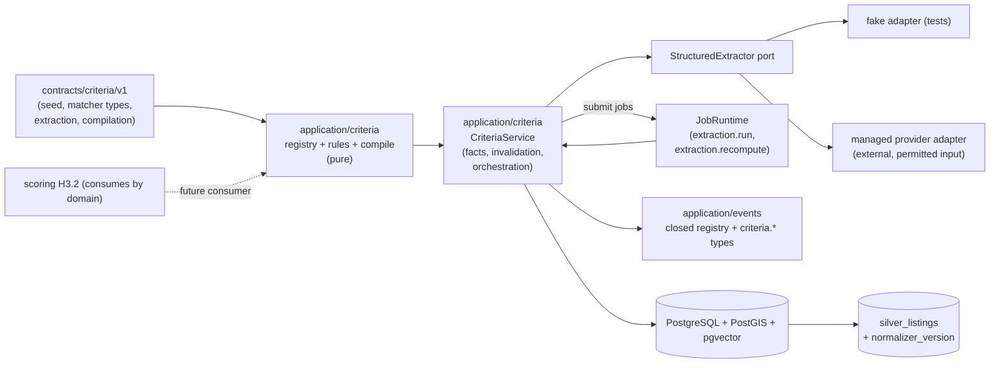

# Implementation Plan: Criteria and Observations

**Branch**: `main` | **Date**: 2026-08-06 | **Spec**: [spec.md](./spec.md)

**Input**: Feature specification for UM-H3-001 through UM-H3-011 (Epica H3.1 -
Criterios y observaciones), including the clarification session 2026-08-06
(one active observation per (listing, concept, source); automatic invalidation
+ manual recompute; external managed extraction provider with permitted input
only; no HTTP contracts — domain + jobs + harness).

## Summary

Build the Gold layer that turns curated concepts and normalized listings into
versioned, auditable observations and executable criteria. A versioned seed
populates the concept registry (`concepts` + immutable `concept_versions`,
validated against `contracts/criteria/v1/matcher-types-v1.json`); profile
preferences persist as append-only `preference_facts`; a pure
`compile_criteria` turns profile snapshot + active facts + structured edits +
confirmations into ordered, versioned executable criteria
(`profile_criteria_compilations`). Objective extraction runs deterministic
rules (`balcon`, `ambientes`, `piso`, `tipo_cocina`) with fragment evidence;
qualitative extraction goes through a domain `StructuredExtractor` port to an
external managed provider (fake locally) that only ever receives the permitted
projection. All observations persist in `listing_observations` with at most one
active row per (listing, concept, source) via a partial unique index, lineage
to immutable `extraction_versions`, and states
`active/invalidated/superseded/failed`. Version changes invalidate affected
observations automatically; the operator triggers the manual
`extraction.recompute` job (scope + cause) that re-extracts and publishes
atomically, recording `recomputation_runs`. Four additive server events
(`criteria.*`) ride the existing closed events registry. P1 slices
(`listing_embeddings`, `urban_signals`) are specified and ordered after the
first internal pass.

The increment adds no HTTP surface, no policy actions, no web work, no
OpenAPI changes and no new Python dependency (pgvector and httpx already
exist). It consumes the durable job runtime (two new job types:
`extraction.run`, `extraction.recompute`), the closed product events registry
and the Silver lineage; it does not build scoring evaluators (H3.2),
explanations (H3.2), feedback (H3.3), fairness (H3.4), chat (H4) or
notifications (H5).

## Technical Context

**Language/Version**: Python `>=3.13,<3.14`; no web work in this increment

**Primary Dependencies**: SQLAlchemy 2, GeoAlchemy2, Alembic, Psycopg 3,
pgvector, httpx (all existing); no new Python runtime dependency; no web
dependency

**Storage**: PostgreSQL 17 with PostGIS + pgvector (new tables `concepts`,
`concept_versions`, `preference_facts`, `profile_criteria_compilations`,
`listing_observations`, `extraction_versions`, `recomputation_runs`,
`listing_embeddings`, `urban_signals` + 6 ENUM types); no new object storage
usage

**Testing**: pytest, Testcontainers, Ruff, mypy, Alembic checks, architecture
contracts; contract conformance suites with golden fixtures (concepts,
matcher types, rules, compilation, events registry); integration against real
Postgres/PostGIS/pgvector (recompute, lineage, events, embeddings, urban
signals)

**Target Platform**: same runtime surfaces; two new job types in the existing
worker registry; no new topology, no HTTP routers, no policy changes

**Project Type**: modular monolith; data/domain Gold layer without a product
HTTP surface (clarification 2026-08-06)

**Performance Goals**: deterministic double-run of rules (SC-004); recompute
over the harness scope completes under 30 s (plan-level target, not a spec
SC); job result summaries <= 8 KiB

**Constraints**: one active observation per (listing, concept, source) via
partial unique index (Q1); automatic invalidation + manual recompute (Q2);
qualitative extraction on an external managed provider receiving only the
permitted projection, never PII or raw HTML (Q3); no HTTP contracts, domain +
jobs + harness, seed curation (Q4); rules deterministic with golden cases;
model never decides inclusion/ranking/notifications; version changes
invalidate only affected observations; previous versions always preserved;
events carry ids/versions/counts only

**Scale/Scope**: one new application module (`application/criteria`), two
async job types, nine tables, three contract areas (registry, extraction,
compilation/observations), one provider adapter (fake + managed), P1 slices
(embeddings, urban context) after the first internal pass

## Constitution Check

*GATE: evaluated before Phase 0 and re-evaluated after Phase 1.*

| Principle | Before research | After design | Evidence |
| --- | --- | --- | --- |
| Persistent radar truth | PASS | PASS | Concepts, concept versions, preference facts, compilations, observations, recomputation runs and events are persistent product objects; nothing that feeds matching lives only in the chat or memory. |
| Auditable deterministic matching | PASS | PASS | Objective extraction is pure, versioned, golden-tested code; the model only produces permitted schemas with evidence and confidence and never decides inclusion, ranking or notifications; ranking stays deterministic code (H3.2). |
| Layer boundaries | PASS | PASS | `application/criteria` is an application module; SQLAlchemy/pgvector repositories and the provider adapter are infrastructure; the `StructuredExtractor` port hides the LLM client; no HTTP surface or policy changes; architecture contracts stay release gates. |
| Data lineage and evidence | PASS | PASS | Every observation references the exact `extraction_versions` row and the listing (`normalizer_version`, `snapshot_id`) with the existing Bronze lineage; recompute preserves previous versions; evidence fragments and confidence are stored per observation. |
| Minimal verifiable scope | PASS | PASS | Scope is exactly UM-H3-001..UM-H3-011: scoring evaluators, explanations, feedback, fairness, chat and notifications are deferred (H3.2/H3.3/H3.4/H4/H5); no operator console (H6); embeddings and urban context are P1 with `enabled=false` defaults. |

There are no constitution violations requiring a complexity exception.

## Assumptions and Tradeoffs

- Observation identity: at most one active observation per (listing, concept,
  source), previous versions preserved (clarification 2026-08-06; enforced by
  partial unique index, SC-012).
- Recomputation: invalidation is automatic on version change; recompute is a
  manual operator job with scope + cause (clarification 2026-08-06; FR-015/
  FR-016/FR-017).
- Qualitative extraction runs on an external managed provider; only the
  permitted projection leaves the system (clarification 2026-08-06; FR-014).
  The specific provider, cost budget and model are an ADR of this plan; the
  domain sees only the port; the fake adapter covers local/CI.
- No HTTP contracts in this increment (clarification 2026-08-06): curation
  enters as a versioned seed (`contracts/criteria/v1`), facts and edits are
  created through the domain service from the harness, recompute triggers go
  through the job runtime; the operator console is H6 (FR-024).
- The concept seed v1 is curated by product: `balcon`, `ambientes`, `piso`,
  `tipo_cocina` (rules) and `luminosidad`, `estado_general` (model, qualitative).
  Matcher types are registered but evaluated in H3.2 (UM-H3-013).
- The extraction input projection is deterministic and versioned in
  `contracts/criteria/v1/extraction-v1.json`; it never includes PII of users
  or raw HTML; listing text (`description_text`, `location_text`, `amenities`)
  is public rental ad data (research R-06).
- Structured-output validation is hand-rolled against the concept schema from
  the contract (no jsonschema dependency); retry budget is bounded
  (`criteria.qualitative_max_attempts`, default 2) (research R-06).
- Recompute publication is atomic per scope (single transaction: publish +
  supersede + run state + event); the controlled beta dataset (thousands of
  listings) keeps this bounded; chunking is an internal implementation detail
  if needed (research R-07).
- The `< 30 s` recompute target over the harness scope is a plan-level target,
  not a spec success criterion (research R-12 deferred).
- Preference facts and compilations are per-profile with deny-by-default;
  observations and embeddings are listing-scoped (not user-scoped) (FR-005).
- Events: four additive `criteria.*` types on the existing closed registry;
  payloads carry ids/versions/counts only, never values, fragments or text
  (research R-09).
- Embeddings (`listing_embeddings`) and urban context (`urban_signals`) are
  P1: designed and specified, `enabled=false` by default, ordered after the
  first internal pass; they do not block the beta critical path.
- The parser-scope invalidation key is the Silver `normalizer_version`
  (research R-07); a re-normalized batch of listings invalidates the
  observations of those listings.

Detailed decision records and rejected alternatives are in
[research.md](./research.md).

## Architecture



All arrows are dependency/use direction. The web and HTTP layers are absent by
design (FR-024). Application code is pure of FastAPI/SQLAlchemy/LLM clients;
repositories and the provider adapter live in infrastructure; the two handlers
are registered in the existing worker registry and composed in
`workers/composition.py`.

## Module, Interface and Seam Design

| Module | Public Interface | Adapters / consumers | Boundary rule |
| --- | --- | --- | --- |
| Criteria contracts | `Concept`, `ConceptVersion`, `PreferenceFact`, `Criterion`, `Compilation`, `Observation`, `ExtractionVersion`, `RecomputeScope`, `CriteriaError` | services, jobs, tests; pure values | No FastAPI, SQLAlchemy, LLM or web imports |
| Concept registry | `load_concepts_seed_v1()`, `load_matcher_types_v1()`, `register_concept()`, `validate_concept()`, `resolve_alias()` | service + contract conformance tests | Pure; rules from `contracts/criteria/v1`; versioned |
| Compilation rules | `load_compilation_rules_v1()`, `compile_criteria(profile, facts, edits, confirmations) -> Compilation` | service; golden tests | Pure; ordered, versioned, warnings + confirmations (FR-006/007/008) |
| Extraction rules | `load_extraction_contract_v1()`, `run_rule(listing_projection, rule) -> Observation` | extraction service; golden tests | Pure; deterministic; fragment evidence (FR-010) |
| Structured extractor port | `extract(permitted_input, schema, version) -> ExtractResult` | provider adapter (managed) + fake | Infrastructure implements the port; domain never imports provider clients |
| Criteria service | `register_concept_version`, `record_preference_fact`, `compile_profile`, `invalidate_observations`, `submit_extraction`, `submit_recompute`, `process_extraction`, `process_recompute` | jobs, harness, future H3.2 | Owns versioning, invalidation scopes, atomic publication and events |
| Criteria repositories | `ConceptRepository`, `FactRepository`, `CompilationRepository`, `ObservationRepository`, `ExtractionVersionRepository`, `RecomputeRunRepository`, `EmbeddingRepository` (P1), `UrbanSignalRepository` (P1) | SQLAlchemy adapters + in-memory adapters | Never commit alone; partial unique indexes arbitrate active rows |
| Extraction handlers | `ExtractionRunHandler` (`extraction.run`), `RecomputeHandler` (`extraction.recompute`) | worker registry + composition | Idempotent via job identity + unique constraints; result <= 8 KiB summary |

Do not introduce a generic `BaseRepository[T]`, a global `ports/` grab bag or
a scoring evaluator layer. Each interface stays next to the capability it
hides; the extractor port mirrors the `ImportSource` port pattern of H2.1; the
events reuse the closed registry of `application/events`.

## Readiness and Failure Isolation

No new critical dependency is added: PostgreSQL (with PostGIS/pgvector) is
already critical. The managed provider is a non-critical dependency for
qualitative extraction (degradable to `failed` observations with bounded
retries; objective rules keep the core working). Failure behavior:

- Postgres loss during a recompute: the job fails transiently and retries
  within bounds; `uq_listing_observations_active` and
  `uq_listing_embeddings_active` prevent duplicates on retry.
- Recompute handler crash mid-publish: the retry re-executes; the partial
  unique indexes arbitrate; a failed run leaves no partial observations and no
  lost versions (FR-016, SC-009).
- Provider outage: transient job failure with bounded retries (existing
  runtime); after the budget, observations persist as `failed` with
  `failure_code`, queryable; invalidated observations stay invalidated
  (FR-012, FR-017).
- Invalid structured output: rejected and retried up to
  `qualitative_max_attempts`; final failure -> `failed` observation (FR-012).
- Concept/edit race: versioned rows are append-only; a concurrent edit creates
  a new version, never a mutation (FR-001).
- Invalidation during a running recompute: new version changes invalidate
  additional observations; the running job publishes its own scope; the next
  recompute covers the remainder (no data loss, only pending work).

## Configuration and Secret Boundary

No new secrets beyond the managed provider credential (same pattern as the
email/identity provider keys). New settings (behind `Settings`, validated at
startup, safe defaults):

- `criteria.seed_version` (`concepts-v1`) — concept seed to load;
- `criteria.qualitative_max_attempts` (2) — bounded retry budget (FR-012);
- `criteria.batch_size` (250) — internal chunking bound for model extraction;
- `criteria.extraction_job_type` (`extraction.run`) and
  `criteria.recompute_job_type` (`extraction.recompute`);
- `extraction.provider` (`fake` \| `managed`) — `fake` is the local/CI default;
- `extraction.managed_model` and `extraction.managed_api_key` (env-only,
  provider-specific, validated when `provider=managed`);
- `embeddings.enabled` (false), `embeddings.dimension` (1536),
  `embeddings.model_version_key` — P1 slice;
- `urban.context_enabled` (false), `urban.source_limits` (per-source rate
  limits) — P1 slice.

Observation values, evidence fragments, facts and payloads are never logged;
event rows carry ids/versions/counts only (SC-010). The managed provider only
receives the permitted projection built by the contract (FR-014).

## Data and Migration Design

The full schema is in [data-model.md](./data-model.md). The new revision
`0006_criteria_observations.py` (down: `0005_search_radar`) creates:

1. `concepts` + `concept_versions`;
2. `preference_facts`;
3. `profile_criteria_compilations`;
4. `extraction_versions`;
5. `listing_observations`;
6. `recomputation_runs`;
7. `listing_embeddings` (P1);
8. `urban_signals` (P1);

plus 6 ENUM types (`fact_state`, `observation_state`, `observation_source`,
`extraction_kind`, `recompute_scope`, `recompute_run_state`), stable
constraint naming and all uniqueness/check/index requirements. The migration
asserts PostGIS and pgvector like 0001/0005 (geometry and vector columns).

Important transaction rules:

- Concept registration/edit: concept row update + new `concept_versions` row +
  automatic invalidation of affected observations + `criteria.concept_version_created.v1`
  commit together (FR-015).
- Fact change: new fact row + supersede previous (`superseded_by`) in one
  transaction; `uq_preference_facts_active` arbitrates.
- Compilation: compilation row + `criteria.compilation_created.v1` in one
  transaction; unique per (profile_version, compilation_version).
- Recompute publication: new `active` observations + supersede `invalidated` +
  `recomputation_runs` terminal state + `criteria.recompute_completed.v1`
  commit together (pattern of the run `record_outcome`);
  `uq_listing_observations_active` prevents double publish.
- All facts, compilations and their events filter by profile `owner_id`
  (FR-005); observations/embeddings are listing-scoped.

Migration tests cover empty DB, previous released revision, one head,
metadata drift and the declared downgrade/compensation path, following
`tests/migrations`.

## Contracts

Planning contracts:

- [concept registry v1](./contracts/concept-registry-v1.md)
- [extraction v1](./contracts/extraction-v1.md)
- [criteria compilation v1](./contracts/compilation-v1.md)
- [listing observations v1](./contracts/observations-v1.md)
- [product events v1 addendum](./contracts/events-addendum-v1.md)

Machine-checkable files to add under `contracts/criteria/v1/`:
`concepts-seed-v1.json`, `matcher-types-v1.json`, `extraction-v1.json`,
`compilation-v1.json`, `observations-v1.json`, plus the four additive event
types registered in `contracts/events/v1/events-registry.json` (non-breaking).
No OpenAPI changes (no HTTP surface; FR-024).

## Job Idempotency and Recovery

Identity: `(job_type="extraction.run", logical_target=<scope kind>:<scope key>
or "full", idempotency_key="extract:{scope_kind}:{scope_key}")` and
`(job_type="extraction.recompute", logical_target=<same>, idempotency_key=
"recompute:{scope_kind}:{scope_key}:{cause-hash}")`. A terminal replay returns
the existing run with no attempt or effect. At-least-once guarantees from the
foundation runtime apply unchanged (outbox, lease, bounded retries, classified
failures). Additionally:

- `uq_listing_observations_active` and `uq_listing_embeddings_active` prevent
  partial-commit duplicates on interrupted retries;
- publication is atomic per scope (single transaction), so a retry either
  finds the committed result or completes it;
- handlers return bounded JSON summaries (counts, failure code, run id) so job
  results stay <= 8 KiB.

## Observability and Audit

Audit coverage (reuses the metadata-only telemetry allowlist; no new telemetry
fields — events are DB rows):

| Operation | Durable evidence |
| --- | --- |
| concept register/edit | `concepts`/`concept_versions` rows + `criteria.concept_version_created.v1` with version |
| fact change | `preference_facts` new row + supersede link (no event per fact) |
| compilation | `profile_criteria_compilations` row + `criteria.compilation_created.v1` with counts |
| extraction batch | `listing_observations` rows + `criteria.observation_batch_published.v1` with counts and extraction version |
| invalidation | observation rows `active -> invalidated` (same transaction as the version change) |
| recompute | `recomputation_runs` row (state, counts, cause, timestamps) + `criteria.recompute_completed.v1` + job execution |
| observation failure | `failed` row with `failure_code` (FR-012) |
| authorization decision | existing `access_audit_events` (allowed/denied) for profile-scoped facts/compilations |

Counts are derivable from committed rows. No observation values, evidence
fragments, weights, prompts or listing text enter default logs or traces.

## Delivery and Recovery Topology

No new deployment topology. The nine tables ride the existing migration flow
on preview/production; `extraction.run` and `extraction.recompute` are
registered in the worker job registry next to `recommendation.run`;
`extraction.provider` selects the fake (local/CI) or managed adapter
(preview/prod) without code changes. Backup/restore scope extends
automatically via the existing full-DB backup procedure. No web routes, no
public route allowlist changes, no OpenAPI or client regeneration.

## Project Structure

### Documentation (this feature)

```text
specs/005-criteria-observations/
├── spec.md
├── plan.md
├── research.md
├── data-model.md
├── quickstart.md
├── contracts/
│   ├── concept-registry-v1.md
│   ├── extraction-v1.md
│   ├── compilation-v1.md
│   ├── observations-v1.md
│   └── events-addendum-v1.md
├── checklists/
│   └── requirements.md
└── tasks.md                    # created later by /speckit-tasks
```

### Source Code (repository root)

```text
contracts/
├── criteria/v1/                    # machine-checkable: seed, matcher types,
│                                   # extraction, compilation, observations
└── events/v1/                      # + 4 criteria.* event types (additive)
src/umbral/
├── application/criteria/
│   ├── contracts.py                # pure values/errors
│   ├── registry.py                 # concept registry rules + seed load
│   ├── compile.py                  # compile_criteria pure function
│   ├── rules.py                    # deterministic extraction rules + evidence
│   ├── extractor.py                # StructuredExtractor port + orchestration
│   ├── ports.py                    # 7-8 repositories
│   └── service.py                  # CriteriaService: facts/compile/invalidate/
│                                   # extract/recompute + events
├── infrastructure/db/
│   ├── models/criteria.py          # 9 tables
│   └── repositories/criteria.py    # SQLAlchemy + in-memory adapters
├── infrastructure/criteria/
│   ├── composition.py              # build_criteria_service
│   └── extractors/
│       ├── fake.py                 # fake adapter (tests/local)
│       └── managed.py              # managed provider adapter (httpx)
├── infrastructure/events/loader.py # contract loader (contracts/events/v1, extended)
└── workers/criteria.py             # ExtractionRunHandler + RecomputeHandler
alembic/versions/0006_criteria_observations.py
tests/
├── contract/test_concept_registry.py
├── contract/test_extraction_rules.py
├── contract/test_extraction_versions.py
├── contract/test_compilation.py
├── contract/test_events_registry.py     # + criteria.* types
├── unit/application/criteria/
├── integration/criteria/               # real DB: recompute, lineage, events,
│                                       # embeddings (P1), urban signals (P1)
├── fixtures/criteria/
└── migrations/                         # 0006 upgrade/downgrade tests
scripts/check-criteria.ps1               # new harness surface (mirrors check-radar.ps1)
```

**Structure Decision**: keep the accepted modular monolith layout. The new
`application/criteria` module follows `application/radar`/`application/silver`
conventions; the extractor port mirrors `ImportSource`; the events reuse the
closed registry of `application/events`; handlers follow `workers/radar.py`
and are composed in `workers/composition.py`; models/repositories follow
`infrastructure/db/models` and `repositories`. No new top-level services
beyond what the seams require.

## Planned Implementation Sequence

The later `/speckit-tasks` artifact must decompose these phases into
test-first, path-specific tasks. Each behavioral slice starts with the failing
contract/unit/integration test named here, then the minimum implementation,
then the full gate.

### Phase A — Contracts and pure domain policy

- Load `contracts/criteria/v1` rules (seed, matcher types, extraction,
  compilation, observations) and the four additive event types.
- Implement `registry.py` (validate/register/resolve aliases),
  `compile.py` (ordered criteria + warnings + confirmations) and `rules.py`
  (deterministic rules + fragment evidence).
- Golden fixtures: `tests/fixtures/criteria/` (concepts seed, matcher types,
  rules fragments, facts, compilations incl. soft->hard without confirmation).
- Conformance suites: `test_concept_registry.py`, `test_extraction_rules.py`,
  `test_compilation.py`, `test_events_registry.py`.
- Gate: SC-001 (versioning), SC-002 (golden rules), SC-005 (compilation),
  SC-010 (event registry), zero silent conversions.

### Phase B — Persistence and migration

- Migration `0006_criteria_observations` and models for the nine tables +
  ENUMs + partial unique indexes (`uq_listing_observations_active`,
  `uq_listing_embeddings_active`, `uq_preference_facts_active`).
- SQLAlchemy + in-memory repositories; append-only semantics and supersede
  links.
- Gate: migration suite (empty/previous/head/drift/downgrade) and repository
  unit tests green.

### Phase C — Criteria service and extraction/recompute jobs

- `CriteriaService`: `register_concept_version` (with automatic invalidation),
  `record_preference_fact`, `compile_profile`, `submit_extraction`,
  `submit_recompute`, `process_extraction`, `process_recompute` (atomic
  publication + events).
- `StructuredExtractor` port + fake adapter + managed adapter (httpx,
  permitted projection from the contract, bounded retries).
- `ExtractionRunHandler` (`extraction.run`) and `RecomputeHandler`
  (`extraction.recompute`) registered in the worker registry + composition.
- Integration tests: recompute scopes (concept/extraction/parser/full),
  atomicity and retry idempotency (SC-004/SC-009/SC-012), invalidated never
  used (FR-017), events (SC-010), provider failure paths (FR-012).
- Gate: `tests/integration/criteria/test_recompute.py` +
  `test_product_events.py` green against real Postgres/PostGIS/pgvector.

### Phase D — Lineage, harness and closure

- Lineage walk test (observation -> extraction version -> silver listing ->
  Bronze snapshot) for 100% of observations (SC-006).
- `scripts/check-criteria.ps1` wired into `check.ps1`; fixture-driven harness
  scenarios from quickstart.
- Run every functional-requirement fixture, success metric and
  `.\scripts\check.ps1` from a clean checkout; record evidence in
  `docs/runbooks/evidence/`; update quickstart and the runtime-local runbook.

### Phase E — P1: embeddings index and selective regeneration

- `listing_embeddings` model/repository; embedding generation from the
  permitted projection with registered model version (`kind=embedding`),
  `embeddings.enabled=false` default.
- Selective regeneration via recompute scope; previous versions preserved
  (FR-018/FR-019, SC-007).
- Gate: `tests/integration/criteria/test_embeddings.py` (0 embeddings from
  raw HTML or PII).

### Phase F — P1: urban context with traceability

- `urban_signals` model/repository; cached external queries with per-source
  limits; source/date/geometry/algorithm on every signal; precision respect
  (FR-020/FR-021, SC-008).
- Gate: `tests/integration/criteria/test_urban_signals.py`.

## Verification Commands

Target commands after implementation:

```powershell
uv sync --frozen --all-groups
uv run ruff format --check .
uv run ruff check .
uv run mypy src tests
uv run pytest
uv run alembic current --check-heads
uv run alembic check
uv run pytest tests/contract/test_concept_registry.py tests/contract/test_extraction_rules.py tests/contract/test_extraction_versions.py tests/contract/test_compilation.py tests/contract/test_events_registry.py tests/unit/application/criteria tests/integration/criteria
.\scripts\check.ps1
```

No success claim is based only on a mock or a skipped surface: recompute,
lineage, events, embeddings and urban signals run against the real
Postgres/PostGIS/pgvector stack in `tests/integration/criteria`; the
qualitative extraction contract conformance runs against the fake adapter and
the managed adapter is exercised in preview/production with the same
conformance.

## Backlog and Requirement Traceability

| Backlog item | Plan ownership | Primary evidence |
| --- | --- | --- |
| UM-H3-001 concept registry v1 | Phase A + B + C | registry conformance + versioning tests (SC-001) |
| UM-H3-002 preference facts | Phase A + B + C | facts unit tests + partial unique index (FR-004/FR-005) |
| UM-H3-003 executable criteria | Phase A + C | compile conformance (FR-006/FR-008) |
| UM-H3-004 structured compilation | Phase A + C | compile golden incl. soft->hard confirmation (FR-007, SC-005) |
| UM-H3-005 listing observations | Phase B + C | observations model + active uniqueness (SC-012) |
| UM-H3-006 objective features by rules | Phase A + C | rules golden + determinism (FR-010, SC-002, SC-004) |
| UM-H3-007 qualitative extraction | Phase C | extractor conformance + failed observations (FR-011/FR-012, SC-003) |
| UM-H3-008 version models/prompts/schemas | Phase A + C | extraction_versions + lineage (FR-013, SC-006) |
| UM-H3-009 embeddings (P1) | Phase E | embeddings integration (FR-018/FR-019, SC-007) |
| UM-H3-010 urban context (P1) | Phase F | urban signals integration (FR-020/FR-021, SC-008) |
| UM-H3-011 selective recompute | Phase C + D | recompute integration + lineage + events (FR-015/016/017, SC-004/009) |

Every FR maps through these rows to at least one automated check. `tasks.md`
must preserve these mappings rather than regrouping cross-cutting checks away
from their story.

## Complexity Tracking

No constitution violation is present. The only deliberate additions beyond a
naive pass are: (a) the automatic invalidation + manual recompute split —
required by FR-015/FR-016/FR-017 and the clarification, with the rejected
alternative (fully automatic recompute) recorded in research R-07; and
(b) the partial unique indexes for active rows — required by SC-012 and
retry idempotency, with the rejected alternative (mutable single row per
pair) recorded in research R-04. Both have simpler rejected alternatives
documented that would violate the spec.
