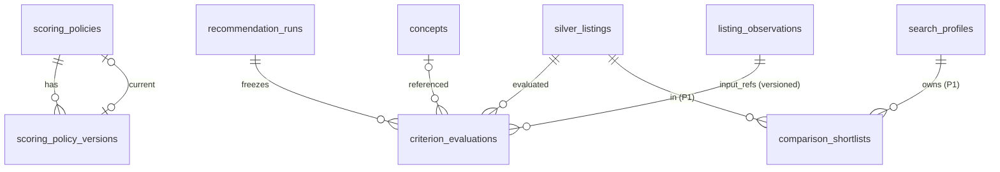

# Data Model: Scoring and Explanations (H3.2)

**Feature**: `006-scoring-explanations` | **Date**: 2026-08-07

Extends the schema of `0005_search_radar` (radar tables) and
`0006_criteria_observations` (criteria tables). New migration:
`0007_scoring_explanations` (down: `0006_criteria_observations`).

Legend: `(r)` = referenced from another table; `(u)` = unique constraint;
`(i)` = index.

## New tables

### scoring_policies

One row per policy key (e.g. `scoring-v1`); tracks the current immutable
version, mirroring the `concepts`/`concept_versions` pattern (R-02).

| Column | Type | Notes |
| --- | --- | --- |
| id | uuid PK | |
| policy_key | varchar(100) (u) | e.g. `scoring-v1` |
| current_version_id | uuid FK -> scoring_policy_versions.id | nullable until first version |
| identity/audit mixin | | id, version, actor, source, correlation, created_at (H1.1 convention) |

Check: `policy_key ~ '^[a-z][a-z0-9_-]{1,99}$'`.

### scoring_policy_versions

Immutable version of the policy document (FR-001/FR-002).

| Column | Type | Notes |
| --- | --- | --- |
| id | uuid PK | |
| policy_id | uuid FK -> scoring_policies.id, RESTRICT | |
| policy_version | int (u with policy_id) | >= 1 |
| contract_version | varchar(50) | `1` |
| payload | jsonb | validated document: weights, normalization, gates, confidence policy, bonuses, penalties, tie_break, score_round (schema `contracts/scoring/v1/scoring-policy-v1.json`) |
| identity/audit mixin | | |

Unique: `(policy_id, policy_version)`; index `(policy_id, created_at)`. The
payload never mutates; edits append new versions.

### criterion_evaluations

Frozen per-run evaluation of one criterion against one listing (R-05, FR-007).

| Column | Type | Notes |
| --- | --- | --- |
| id | uuid PK | |
| run_id | uuid FK -> recommendation_runs.id, RESTRICT | |
| listing_id | uuid FK -> silver_listings.id, RESTRICT | |
| criterion_key | varchar(120) | canonical criterion name (concept or fixed criterion) |
| criterion_version | varchar(100) | version of the criterion/compilation used |
| concept_id | uuid FK -> concepts.id, RESTRICT, nullable | null for fixed criteria (budget, surface, rooms, location) |
| matcher_type | varchar(50) | from `matcher-types-v1.json` |
| params | jsonb | validated evaluator params (allowed_params) |
| input_refs | jsonb | observation refs used: `[{"observation_id", "observation_version", "concept"}]` + listing refs (R-05) |
| score | numeric(6,4) | 0..1 evaluation score |
| confidence | numeric(4,3) | 0..1 |
| state | enum evaluation_state | `match` \| `mismatch` \| `unknown` (R-04, FR-006) |
| contribution | numeric(6,4) | weighted contribution to the run score |
| reason_code | varchar(100) | deterministic reason key (contract `explanations-v1.json`) |
| evidence_refs | jsonb | `[{kind, ref, version}]` for the explanation (FR-013) |
| identity/audit mixin | | |

Uniques: `(run_id, listing_id, criterion_key)`; indexes:
`(run_id, listing_id)`, `(run_id, criterion_key)`, `(listing_id)`. Rows are
written once with the run and never mutated (frozen run; R-07).

### comparison_shortlists (P1, UM-H3-022)

Persisted comparison selection per search (FR-020).

| Column | Type | Notes |
| --- | --- | --- |
| id | uuid PK | |
| profile_id | uuid FK -> search_profiles.id, RESTRICT | |
| listing_id | uuid FK -> silver_listings.id, RESTRICT | |
| position | int | sort order |
| identity/audit mixin | | |

Uniques: `(profile_id, listing_id)`; `(profile_id, position)`; index
`(profile_id)`. Membership is enforced by the service against the latest
published run of the profile (R-10).

## New ENUM types

- `evaluation_state` (`match`, `mismatch`, `unknown`).

No changes to `recommendation_runs`/`recommendation_items` (they already carry
`score_policy_version`, `score` 0..1, `contributions`); legacy runs are
detected by `score_policy_version = 'scoring-baseline-v1'` (R-01,
clarification 2026-08-07).

## Relationships

## Transaction rules

- Policy register/edit: new `scoring_policy_versions` row + `scoring_policies`
  row (first version) in one transaction; version rows are append-only
  (FR-001).
- Run publish: `recommendation_runs` terminal state + `recommendation_items` +
  `criterion_evaluations` + `recommendation.run_published.v1` commit together
  (R-07, FR-010/FR-011); `uq_recommendation_runs_profile_version` and the
  evaluation unique prevent double publish on retry.
- Explanation/comparison reads never write; shortlist writes (P1) are single
  rows with unique arbitration (idempotent re-save).
- All product reads filter by profile `owner_id` through the run (FR-015);
  evaluations are reached only via a run the user can access.
