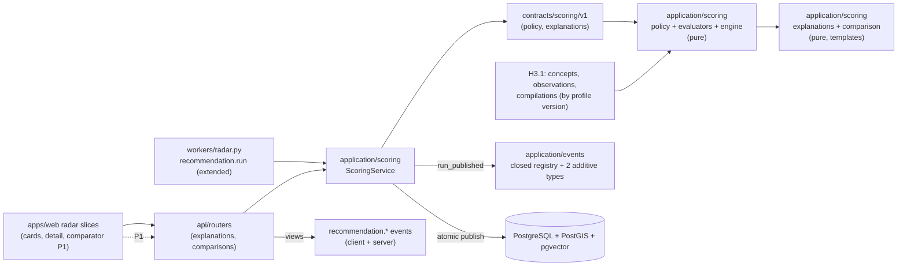

# Implementation Plan: Scoring and Explanations

**Branch**: `main` | **Date**: 2026-08-07 | **Spec**: [spec.md](./spec.md)

**Input**: Feature specification for UM-H3-012 through UM-H3-022 (Epica H3.2 -
Scoring y explicaciones), including the clarification session 2026-08-07
(deterministic template copy, no generative text in v1; frozen runs stay
visible until an existing trigger creates a new run; legacy baseline runs show
score without breakdown plus a notice; comparison dimensions are fixed basics
plus active profile criteria).

## Summary

Scoring v1 replaces the H2.3 baseline engine inside the existing
`recommendation.run` job. A versioned, immutable scoring policy
(`scoring_policies` + `scoring_policy_versions`, validated against
`contracts/scoring/v1/scoring-policy-v1.json`, seed `scoring-policy-v1` loaded
at startup) drives four pure generic evaluators (numeric_range, categorical,
geo_proximity, semantic_feature over H3.1 observations) with one shared output
contract (score, confidence, state `match|mismatch|unknown`, reason_code,
evidence_refs). Per-run `criterion_evaluations` freeze criterion, params,
observation input refs, contribution and reason — they ARE the run's feature
snapshot. The engine (`score_candidates`) is pure and deterministic; the run
publishes run + items + evaluations + `recommendation.run_published.v1`
atomically (existing `record_outcome` pattern); a failed run keeps the last
valid one. Explanations are generated on demand by deterministic templates
from the frozen evaluations (no table, no LLM); two additive read endpoints
plus a comparison endpoint expose them with deny-by-default and typed errors
(legacy runs → `explanation_unavailable`). The web radar slices show up to 3
reasons with evidence levels on cards and the full breakdown on detail; legacy
runs show the notice. P1: the persistent comparator (shortlist + responsive
matrix). Two additive client events complete the closed registry.

The increment adds one new application module (`application/scoring`), three
product endpoints (two GET explanations + one POST comparisons), two new
tables + one ENUM, four contract areas, a P1 web comparator slice and no new
Python dependency; it does not build feedback (H3.3), golden dataset (H3.4),
chat (H4) or notifications (H5).

## Technical Context

**Language/Version**: Python `>=3.13,<3.14`; TypeScript/Next.js for the web
slices

**Primary Dependencies**: SQLAlchemy 2, GeoAlchemy2, Alembic, Psycopg 3,
pgvector (all existing); no new Python runtime dependency; web uses TanStack
Query + shadcn/ui (existing)

**Storage**: PostgreSQL 17 with PostGIS + pgvector (new tables
`scoring_policies`, `scoring_policy_versions`, `criterion_evaluations`,
`comparison_shortlists` (P1) + 1 ENUM type); no new object storage usage

**Testing**: pytest, Testcontainers, Ruff, mypy, Alembic checks, architecture
contracts; contract conformance suites with golden fixtures (policy,
evaluators, explanations, comparison, events registry); integration against
real Postgres/PostGIS/pgvector (run v1 atomic publish, evaluations lineage,
explanation determinism, legacy runs); web build + component tests per H2.3
convention

**Target Platform**: same runtime surfaces; the `recommendation.run` job
handler is extended in place; three new product routers under the existing
protected API; no new topology

**Project Type**: modular monolith; this increment DOES expose product HTTP
contracts (UM-H3-019) unlike H3.1 (R-09)

**Performance Goals**: inherit the `< 30 s` run publish target of H2.3
(unchanged pipeline); plan-level target p95 < 1 s for on-demand explanations
and comparisons over the harness dataset (R-12, not a spec SC)

**Constraints**: deterministic double-run identical (SC-001); no generative
text in v1 (clarification 2026-08-07); runs frozen, no auto invalidation
(FR-010, clarification); legacy runs readable without explanation (FR-018);
comparison limit 6 default and fixed+profile dimensions (clarification);
deny-by-default on all new endpoints; events carry ids/counts only

**Scale/Scope**: one new application module, three new endpoints + two P1
shortlist endpoints, four tables, four contract areas (policy, evaluators/
engine, explanations, comparison), web card/detail updates + P1 comparator,
one new harness surface (`scripts/check-scoring.ps1`)

## Constitution Check

*GATE: evaluated before Phase 0 and re-evaluated after Phase 1.*

| Principle | Before research | After design | Evidence |
| --- | --- | --- | --- |
| Persistent radar truth | PASS | PASS | Policies (immutable versions), criterion evaluations, runs and comparison shortlists are persistent product objects tied to a search; explanations regenerate deterministically from frozen run data and never live only in a transient response. |
| Auditable deterministic matching | PASS | PASS | Final ranking is produced by the pure `score_candidates` engine over a versioned policy (SC-001 double-run identical); the copy is template-based (clarification); the LLM is absent from the critical path and generative text is deferred to a later increment with versioning and no-facts guards. |
| Layer boundaries | PASS | PASS | `application/scoring` is pure (policy validation, evaluators, engine, explanations, comparison); repositories and SQLAlchemy models are infrastructure; routers map DTOs with typed problems; the run job stays in the worker layer calling the same service seams; no domain import of FastAPI/DB/LLM. |
| Data lineage and evidence | PASS | PASS | Every evaluation references criterion version and observation input refs (id + version) so lineage is reconstructible even after H3.1 recomputes; every reason cites evidence refs or declares unknown (SC-007); run confidence and evidence levels follow the policy document. |
| Minimal verifiable scope | PASS | PASS | Scope is exactly UM-H3-012..UM-H3-022: feedback (H3.3), golden dataset/regressions (H3.4), chat (H4) and alerts (H5) are deferred; the comparator is P1 (`scoring.comparator_enabled=false` default); no operator console (H6). |

There are no constitution violations requiring a complexity exception.

## Assumptions and Tradeoffs

- Runs stay frozen: no automatic invalidation or re-run when observations or
  Silver change in this increment; only existing triggers (edit/resume,
  import) create runs; automatic recalculation is H3.3 UM-H3-030
  (clarification 2026-08-07; FR-010).
- Legacy runs (`score_policy_version = scoring-baseline-v1`) keep being served
  by the matches endpoints; explanation/comparison endpoints return a typed
  `explanation_unavailable` and the web shows the notice — no migration or
  backfill (clarification 2026-08-07; FR-018).
- Explanation copy is 100% deterministic templates from
  `contracts/scoring/v1/explanations-v1.json`; no LLM in v1 (clarification
  2026-08-07; FR-013). The exact wording is reviewed with product per
  UM-H0-007 before release.
- The scoring policy seed `scoring-policy-v1` is curated product
  configuration: budget/ambientes/superficie/ubicacion as fixed criteria
  evaluated from profile + listing data (the baseline dimensions become
  criteria), plus curated subjective concepts (balcon, luminosidad,
  estado_general) with small weights; the contract defines the shape, the
  seed file defines the values (research R-02; deferred values in research).
- `semantic_feature` evaluates qualitative observations from H3.1; embeddings
  (H3.1 P1) are NOT required and are out of scope (research R-03).
- Score scale stays 0..1 with `score_round` 4 (baseline convention,
  `ck_recommendation_items_score` constraint already enforces 0..1).
- Evidence levels strong/medium/low use policy thresholds (defaults 0.8/0.5)
  and are only presentation semantics, never ranking inputs.
- Comparison limit default 6 via setting `scoring.comparison_max_listings`;
  the dimension mix (fixed basics + active profile criteria) was fixed by
  clarification (FR-016).
- The three new endpoints follow the existing router + typed problem +
  `access_control.authorize` pattern of `routers/matches.py` (R-09); the TS
  client is regenerated per the H1.5 convention.
- No new telemetry fields: the two additive client events are the only new
  signals; payloads carry ids/versions/counts only (R-11).
- Web work follows the H2.3 convention: component tests + build in the
  harness; the dedicated axe e2e audit remains a H2.3 deferred follow-up.

Detailed decision records and rejected alternatives are in
[research.md](./research.md).

## Architecture



All arrows are dependency/use direction. Application code is pure of
FastAPI/SQLAlchemy/LLM clients; repositories live in infrastructure; the run
handler is extended in `workers/radar.py` without a new job type; routers
follow `routers/matches.py`.

## Module, Interface and Seam Design

| Module | Public Interface | Adapters / consumers | Boundary rule |
| --- | --- | --- | --- |
| Scoring contracts | `ScoringPolicy`, `PolicyVersion`, `Evaluation`, `CriterionEvaluation`, `Explanation`, `Comparison`, `ScoringError` | services, routers, tests; pure values | No FastAPI, SQLAlchemy, LLM or web imports |
| Policy registry | `load_policy_seed_v1()`, `parse_policy_v1()`, `validate_policy()`, `register_policy_version()` | service + conformance tests | Pure; rules from `contracts/scoring/v1`; append-only versions (FR-001/002) |
| Evaluators | `evaluate(criterion, listing_data, observations, params) -> Evaluation` for the 4 matcher types | engine; golden tests | Pure; shared output contract (FR-004); unknown never mismatch (FR-006) |
| Scoring engine | `score_candidates(profile, compilations, candidates, observations, policy) -> tuple[ScoredCandidate, ...]` | run service; determinism tests | Pure; no I/O (FR-008, SC-001); gates/bonuses/penalties/tie-break per policy |
| Explanations | `build_explanation(run, evaluations, policy, templates) -> Explanation` | router + service; conformance tests | Pure; deterministic templates (FR-012/013, SC-007) |
| Comparison | `compare_listings(profile, run, listing_ids, policy, limit) -> Comparison` | router + service; conformance tests | Pure; limit + same-run membership (FR-016/017) |
| Scoring service | `register_policy_version`, `get_policy`, `process_run_scoring` (hook into the run pipeline), `get_explanation`, `list_explanations`, `build_comparison`, `get/set_shortlist` (P1) | run handler, routers, harness | Owns versioning, frozen evaluation persistence, ownership checks and events |
| Scoring repositories | `PolicyRepository`, `EvaluationRepository`, `ShortlistRepository` (P1) | SQLAlchemy adapters + in-memory adapters | Never commit alone; evaluation unique constraints arbitrate retries |
| API routers | `explanations.py`, `comparisons.py` | OpenAPI + generated TS client | Typed problems, deny-by-default, action-based authorization |
| Web slices | radar cards + detail reasons; comparator route (P1) | TanStack Query against generated client | No client-side scoring; legacy notice; a11y by convention |

Do not introduce a generic repository, a second run job type, or an
LLM/external service seam in this increment: the engine stays pure and the
only new external boundary is none (R-08). The policy registry mirrors the
concept registry seam of H3.1; routers mirror `matches.py`.

## Readiness and Failure Isolation

No new critical dependency is added (PostgreSQL is already critical; the LLM
is absent from v1). Failure behavior:

- Postgres loss during a run: the existing job retry semantics apply; the
  `(run_id, listing_id, criterion_key)` unique and the run unique prevent
  duplicates on retry (R-07).
- Run handler crash mid-publish: the retry re-executes the atomic
  `record_outcome`; the last valid run stays visible; no partial evaluations
  (FR-011, SC-006).
- Legacy run queried for an explanation: typed `explanation_unavailable`, no
  fabricated reasons (clarification; FR-018).
- Invalid policy document: rejected at register time with an actionable
  error; a corrupt seed fails startup validation like other contracts
  (FR-002).
- Cross-user/cross-run access: the service resolves ownership through the run
  before any read; routers return typed 403/404 without leaking data
  (FR-015, SC-008).
- Comparison with a listing outside the latest run: rejected with
  `comparison_not_in_radar` (FR-017).
- P1 comparator: `scoring.comparator_enabled=false` until enabled; shortlist
  writes are idempotent replaces.

## Configuration and Secret Boundary

No new secrets (no external provider in v1). New settings (behind `Settings`,
validated at startup, safe defaults):

- `scoring.policy_seed_version` (`scoring-policy-v1`) — policy seed to load
  at startup (mirrors `criteria.seed_version`);
- `scoring.legacy_score_policy_version` (`scoring-baseline-v1`) — marker that
  identifies legacy runs for the explanation/comparison guards;
- `scoring.comparison_max_listings` (6) — comparison limit (FR-016);
- `scoring.comparator_enabled` (false) — P1 comparator feature flag;
- `scoring.explanations_copy_contract_version` (`1`) — template contract
  version.

Evaluation values, evidence refs and listing text never enter logs or traces;
event rows carry ids/versions/counts only (FR-021, SC-010).

## Data and Migration Design

The full schema is in [data-model.md](./data-model.md). The new revision
`0007_scoring_explanations.py` (down: `0006_criteria_observations`) creates:

1. `scoring_policies`;
2. `scoring_policy_versions`;
3. `criterion_evaluations`;
4. `comparison_shortlists` (P1);

plus 1 ENUM type (`evaluation_state`), stable constraint naming and all
uniqueness/check/index requirements. No changes to `recommendation_runs` /
`recommendation_items` (they already carry `score_policy_version`, `score`
0..1 and `contributions`).

Important transaction rules:

- Policy register/edit: `scoring_policy_versions` row (+ `scoring_policies`
  row on first version) commits together; append-only, no mutation (FR-001).
- Run publish: run terminal state + items + `criterion_evaluations` +
  `recommendation.run_published.v1` commit together (R-07, FR-010/FR-011);
  the evaluation unique prevents double publish on retry.
- Explanations and comparisons are read-only computations over committed run
  data; no writes.
- Shortlist (P1): idempotent replace of rows for the profile in one
  transaction with unique arbitration.
- All reads filter by profile `owner_id` through the run (FR-015).

Migration tests cover empty DB, previous released revision, one head,
metadata drift and the declared downgrade path, following `tests/migrations`.

## Contracts

Planning contracts:

- [scoring policy v1](./contracts/scoring-policy-v1.md)
- [explanations v1](./contracts/explanations-v1.md)
- [comparison v1](./contracts/comparison-v1.md)
- [product events v1 addendum](./contracts/events-addendum-v1.md)

Machine-checkable files to add under `contracts/scoring/v1/`:
`scoring-policy-v1.json` (policy document + seed) and `explanations-v1.json`
(reason codes, evidence levels, copy templates), plus the two additive event
types registered in `contracts/events/v1/events-registry.json`
(`recommendation.explanation_viewed.v1`,
`recommendation.comparison_viewed.v1`). OpenAPI changes: the two explanation
endpoints and the comparison endpoint (+ P1 shortlist endpoints) with typed
responses; the generated TS client is regenerated and committed
(`npm run api:generate --workspace @umbral/web`).

## Job Idempotency and Recovery

No new job type: `recommendation.run` keeps its identity
`(job_type="recommendation.run", logical_target=<profile_id>:<version_id>,
idempotency_key=...)` and at-least-once semantics from the foundation runtime
(outbox, lease, bounded retries, classified failures). The handler is extended
so `process_run`:

1. loads the frozen profile version and its compiled criteria (H3.1);
2. computes the candidate set (unchanged hard filters);
3. evaluates criteria per candidate with the policy v1 engine, building
   `criterion_evaluations` in memory;
4. publishes run + items + evaluations + event atomically (existing
   `record_outcome`);

`uq_recommendation_runs_profile_version`,
`uq_recommendation_items_run_position` and
`uq_criterion_evaluations_run_listing_criterion` arbitrate retries; handler
results stay <= 8 KiB (counts only).

## Observability and Audit

Audit coverage (reuses the metadata-only telemetry allowlist; events are DB
rows):

| Operation | Durable evidence |
| --- | --- |
| policy register/edit | `scoring_policy_versions` row (append-only) + startup seed log |
| run v1 publish | `recommendation_runs` + `recommendation_items` + `criterion_evaluations` rows + `recommendation.run_published.v1` with `score_policy_version` |
| evaluation evidence | `criterion_evaluations` rows with criterion version, input refs, contribution, reason_code, evidence_refs |
| explanation view | `recommendation.explanation_viewed.v1` (client) with ids/version |
| comparison view | `recommendation.comparison_viewed.v1` (client) with count |
| authorization decision | existing `access_audit_events` (allowed/denied) for the new actions |
| legacy run guard | typed `explanation_unavailable` problem + denied access audit when applicable |

Counts are derivable from committed rows. No evaluation values, evidence refs,
weights or listing text enter default logs or traces.

## Delivery and Recovery Topology

No new deployment topology. The four tables ride the existing migration flow
on preview/production; the `recommendation.run` handler ships inside the
existing worker artifact; three (plus two P1) routers register in the existing
API; OpenAPI + the TS client are regenerated as part of the web workspace.
Backup/restore scope extends automatically via the existing full-DB backup.
The comparator (P1) is behind `scoring.comparator_enabled=false` until enabled
after the first internal pass of the hito.

## Project Structure

### Documentation (this feature)

```text
specs/006-scoring-explanations/
├── spec.md
├── plan.md
├── research.md
├── data-model.md
├── quickstart.md
├── contracts/
│   ├── scoring-policy-v1.md
│   ├── explanations-v1.md
│   ├── comparison-v1.md
│   └── events-addendum-v1.md
├── checklists/
│   └── requirements.md
└── tasks.md                    # created later by /speckit-tasks
```

### Source Code (repository root)

```text
contracts/
├── scoring/v1/                     # scoring-policy-v1.json,
│                                   # explanations-v1.json
└── events/v1/                      # + 2 recommendation.* types (additive)
src/umbral/
├── application/scoring/
│   ├── contracts.py                # pure values/errors
│   ├── policy.py                   # policy parse/validate/seed load
│   ├── evaluators.py               # 4 pure evaluators (shared contract)
│   ├── engine.py                   # score_candidates pure function
│   ├── explanations.py             # build_explanation (templates)
│   ├── comparison.py               # compare_listings pure builder
│   ├── ports.py                    # 3 repositories
│   └── service.py                  # ScoringService: policy/runs hook/
│                                   # explanations/comparison + events
├── application/radar/scoring.py    # baseline retained only as reference
├── infrastructure/db/
│   ├── models/scoring.py           # 4 tables
│   └── repositories/scoring.py     # SQLAlchemy + in-memory adapters
├── api/routers/
│   ├── explanations.py             # 2 GET endpoints
│   └── comparisons.py              # POST comparisons + shortlist (P1)
└── workers/radar.py                # run handler extended (policy v1)
alembic/versions/0007_scoring_explanations.py
apps/web/src/
├── app/(protected)/radar/[id]/page.tsx      # cards + reasons
├── app/(protected)/listings/[id]/page.tsx   # detail breakdown
├── app/(protected)/radar/[id]/compare/page.tsx  # comparator (P1)
└── lib/api/generated/                      # regenerated client
tests/
├── contract/test_scoring_policy.py
├── contract/test_evaluators.py
├── contract/test_explanations.py
├── contract/test_comparison.py
├── contract/test_explanation_endpoints.py
├── contract/test_events_registry.py     # + 2 types
├── unit/application/scoring/
├── integration/scoring/                 # real DB: run v1 atomic publish,
│                                        # evaluations lineage, determinism
├── fixtures/scoring/
└── migrations/                          # 0007 upgrade/downgrade tests
scripts/check-scoring.ps1                # new harness surface (mirrors
                                         # check-criteria.ps1)
```

**Structure Decision**: keep the accepted modular monolith layout.
`application/scoring` follows `application/radar`/`application/criteria`
conventions; the policy registry mirrors the concept registry; routers mirror
`routers/matches.py`; the run handler is extended in place (no new job type);
models/repositories follow `infrastructure/db/models` and `repositories`.

## Planned Implementation Sequence

The later `/speckit-tasks` artifact must decompose these phases into
test-first, path-specific tasks. Each behavioral slice starts with the failing
contract/unit/integration test named here, then the minimum implementation,
then the full gate.

### Phase A — Contracts and pure scoring engine

- Load `contracts/scoring/v1` rules (policy document + seed, reason codes,
  evidence levels, copy templates) and the two additive event types.
- Implement `policy.py` (parse/validate/seed), `evaluators.py` (four pure
  evaluators with the shared output contract), `engine.py` (score_candidates
  with weights, normalization, gates, bonuses, penalties, tie-break),
  `explanations.py` and `comparison.py` (pure builders).
- Golden fixtures: `tests/fixtures/scoring/` (policy documents incl. invalid
  ones, per-evaluator inputs/outputs, unknown-vs-mismatch cases, explanation
  copy, comparison matrices).
- Conformance suites: `test_scoring_policy.py`, `test_evaluators.py`,
  `test_explanations.py`, `test_comparison.py`, `test_events_registry.py`.
- Gate: SC-001 (double-run identical), SC-002 (policy versioning), SC-003
  (evaluator goldens), SC-004 (unknown vs negative), SC-007 (evidence refs +
  deterministic copy), SC-009 (comparison rules).

### Phase B — Persistence and migration

- Migration `0007_scoring_explanations` + models for the four tables + ENUM +
  unique constraints (`uq_criterion_evaluations_run_listing_criterion`).
- SQLAlchemy + in-memory repositories; append-only policy versions.
- Gate: migration suite (empty/previous/head/drift/downgrade) and repository
  unit tests green.

### Phase C — Run v1 integration and atomic publish

- `ScoringService.process_run_scoring` hooked into `RadarService.process_run`:
  frozen profile + compilation -> candidate set -> policy v1 evaluations ->
  atomic publish (run + items + evaluations + event).
- Legacy detection by `score_policy_version`; the baseline engine is no longer
  used by the job (kept only as reference for old runs).
- Integration tests: `tests/integration/scoring/test_run_v1.py` (atomicity,
  retry idempotency, legacy runs untouched, observation recompute does not
  invalidate runs) (FR-010/011, SC-005/006).

### Phase D — API contracts

- `routers/explanations.py` (per-listing + paginated list) and
  `routers/comparisons.py` (POST comparison; shortlist GET/PUT is P1),
  typed problems, deny-by-default via run ownership (FR-014/015/016/017).
- OpenAPI regeneration + TS client commit (`npm run api:generate
  --workspace @umbral/web`).
- Gate: `test_explanation_endpoints.py` contract conformance + cross-user
  denial tests (SC-008).

### Phase E — Web: reasons on cards and detail

- Radar cards show up to 3 reasons with evidence levels and confidence;
  detail shows the full breakdown (reasons, risks, missing data); legacy
  notice on legacy runs; never present scores as certainty (FR-018/019).
- Component tests + build gate; view events emitted by the client (FR-021).
- Gate: `npm run build --workspace @umbral/web` + component tests (SC-011).

### Phase F — P1: persistent comparator

- Shortlist endpoints + `comparison_shortlists` persistence, matrix route
  with fixed + profile dimensions, responsive states, navigation to detail
  (FR-020, UM-H3-022).
- `scoring.comparator_enabled=false` default; enabled after the first
  internal pass.
- Gate: `tests/contract/test_comparison_shortlist.py` + web build (SC-012).

### Phase G — Harness, events and closure

- `scripts/check-scoring.ps1` wired into `check.ps1`; fixture-driven harness
  scenarios from quickstart.
- Run every functional-requirement fixture, success metric and
  `.\scripts\check.ps1` from a clean checkout; record evidence in
  `docs/runbooks/evidence/`; update quickstart and the runtime-local runbook.

## Verification Commands

Target commands after implementation:

```powershell
uv sync --frozen --all-groups
uv run ruff format --check .
uv run ruff check .
uv run mypy src tests
uv run pytest
uv run alembic current --check-heads
uv run alembic check
uv run pytest tests/contract/test_scoring_policy.py tests/contract/test_evaluators.py tests/contract/test_explanations.py tests/contract/test_comparison.py tests/contract/test_explanation_endpoints.py tests/contract/test_events_registry.py tests/unit/application/scoring tests/integration/scoring
npm run api:generate --workspace @umbral/web
npm run build --workspace @umbral/web
.\scripts\check-scoring.ps1
.\scripts\check.ps1
```

No success claim is based only on a mock or a skipped surface: run v1
publishing, evaluation lineage, explanation determinism and legacy behavior
run against the real Postgres/PostGIS/pgvector stack in
`tests/integration/scoring`; web surfaces are covered by build + component
tests per project convention.

## Backlog and Requirement Traceability

| Backlog item | Plan ownership | Primary evidence |
| --- | --- | --- |
| UM-H3-012 scoring policy v1 | Phase A + B | policy conformance + versioning (FR-001/002/003, SC-002) |
| UM-H3-013 generic evaluators | Phase A | evaluator goldens, shared contract (FR-004/005, SC-003) |
| UM-H3-014 unknown vs negative | Phase A + C | golden cases + run integration (FR-006, SC-004) |
| UM-H3-015 criterion evaluations | Phase B + C | evaluations persistence + lineage (FR-007/009, SC-005) |
| UM-H3-016 deterministic scoring v1 | Phase A + C | double-run identical (FR-008, SC-001) |
| UM-H3-017 atomic runs | Phase C | run v1 integration + failure injection (FR-010/011, SC-006) |
| UM-H3-018 explanations from evidence | Phase A + D + E | explanation conformance + copy determinism (FR-012/013, SC-007) |
| UM-H3-019 explanation contracts | Phase D | endpoint conformance + ownership (FR-014/015, SC-008) |
| UM-H3-020 structured comparison | Phase A + D | comparison conformance (FR-016/017, SC-009) |
| UM-H3-021 web reasons/uncertainty | Phase E | web build + component tests + copy review (FR-018/019, SC-011) |
| UM-H3-022 persistent comparator (P1) | Phase F | shortlist + matrix integration (FR-020, SC-012) |
| Transversal (todos) | Phase A + G | events registry + harness (FR-021, SC-010) |

Every FR maps through these rows to at least one automated check. `tasks.md`
must preserve these mappings rather than regrouping cross-cutting checks away
from their story.

## Complexity Tracking

No constitution violation is present. The only deliberate additions beyond a
naive pass are: (a) `criterion_evaluations` as a persisted, per-run frozen
snapshot with versioned input refs — required by FR-007/FR-010 and the
lineage guardrail, with the rejected alternative (JSON in item contributions)
recorded in research R-05; (b) the policy document (JSONB payload validated
against a versioned contract, append-only) — required by FR-001/FR-002, with
the rejected alternative (flat settings) recorded in research R-02; and
(c) the deterministic template copy layer — required by the clarification and
FR-013, with the rejected alternative (generative text in v1) recorded in
research R-08. All have simpler rejected alternatives documented that would
violate the spec.
