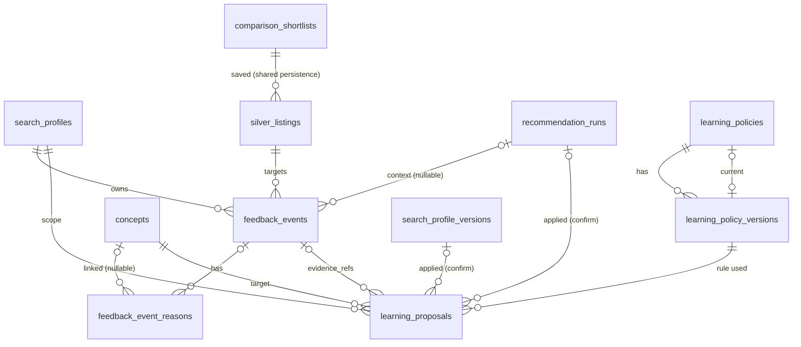

# Data Model: Feedback y aprendizaje controlado (H3.3)

**Feature**: `007-feedback-learning` | **Date**: 2026-08-07

Extends the schema of `0006_criteria_observations` (facts, compilations) and
`0007_scoring_explanations` (runs, evaluations, shortlist). New migration:
`0008_feedback_learning` (down: `0007_scoring_explanations`).

Legend: `(r)` = referenced from another table; `(u)` = unique constraint;
`(i)` = index; `(p-u)` = partial unique index.

## New ENUM types

- `feedback_event_type` (`like`, `dislike`, `save`, `dismiss`, `contacted`).
- `feedback_event_state` (`active`, `superseded`).
- `learning_proposal_state` (`pending`, `confirmed`, `rejected`, `expired`,
  `superseded`).

## New tables

### feedback_events

Append-only record of one user decision (FR-001/FR-002, R-01).

| Column | Type | Notes |
| --- | --- | --- |
| id | uuid PK | |
| profile_id | uuid FK -> search_profiles.id, RESTRICT | |
| listing_id | uuid FK -> silver_listings.id, RESTRICT | |
| run_id | uuid FK -> recommendation_runs.id, RESTRICT, nullable | present when the action targets a scored item (item key is (run_id, listing_id)); null for legacy/no-run context |
| event_type | enum feedback_event_type | like \| dislike \| save \| dismiss \| contacted |
| state | enum feedback_event_state | `active` \| `superseded` (chain marker) |
| superseded_by | uuid FK -> feedback_events.id, nullable | compensation link to the event that replaced this one (FR-004) |
| idempotency_key | varchar(200) | client key; replay with same key returns the existing event (FR-003) |
| free_feedback | text, nullable | P1 (UM-H3-027): optional free text of a like/dislike; never in events/analytics (FR-016); length validated by service |
| identity/audit mixin | | id, version, actor, source, correlation, created_at (H1.1 convention) |

Uniques: `(profile_id, idempotency_key)`; `(p-u)`
`(profile_id, listing_id) WHERE state='active'` (one decision state per
listing). Indexes: `(profile_id, listing_id, created_at)`,
`(profile_id, state)`, `(listing_id)`, `(superseded_by)`.

### feedback_event_reasons

Normalized quick-reason rows per event (R-02, FR-006).

| Column | Type | Notes |
| --- | --- | --- |
| id | uuid PK | |
| event_id | uuid FK -> feedback_events.id, CASCADE | |
| reason_key | varchar(100) | key from `contracts/feedback/v1/quick-reasons-v1.json` |
| concept_id | uuid FK -> concepts.id, RESTRICT, nullable | null when the reason is not concept-linked |
| polarity | enum polarity | positive \| negative (from the reason registry) |

Unique: `(event_id, reason_key)`; index `(concept_id)`, `(event_id)`.

### learning_policies

One row per policy key (e.g. `learning-v1`); tracks the current immutable
version, mirroring `scoring_policies` (R-05).

| Column | Type | Notes |
| --- | --- | --- |
| id | uuid PK | |
| policy_key | varchar(100) (u) | e.g. `learning-v1` |
| current_version_id | uuid FK -> learning_policy_versions.id, nullable | |
| identity/audit mixin | | |

Check: `policy_key ~ '^[a-z][a-z0-9_-]{1,99}$'`.

### learning_policy_versions

Immutable learning-rule version (FR-009, R-05).

| Column | Type | Notes |
| --- | --- | --- |
| id | uuid PK | |
| policy_id | uuid FK -> learning_policies.id, RESTRICT | |
| policy_version | int (u with policy_id) | >= 1 |
| contract_version | varchar(50) | `1` |
| payload | jsonb | min_signals, window_days, min_signal_confidence, cooldown_days, proposal_expiration_days, default_suggested_weight, default_suggested_confidence (schema `contracts/learning/v1/learning-policy-v1.json`) |
| identity/audit mixin | | |

Unique: `(policy_id, policy_version)`; index `(policy_id, created_at)`. Payload
never mutates; edits append new versions.

### learning_proposals

Suggested learning change with evidence and lifecycle (FR-009..FR-013, R-06).

| Column | Type | Notes |
| --- | --- | --- |
| id | uuid PK | |
| profile_id | uuid FK -> search_profiles.id, RESTRICT | scope per search (FR-010) |
| concept_id | uuid FK -> concepts.id, RESTRICT | the concept the signals point to |
| policy_version_id | uuid FK -> learning_policy_versions.id, RESTRICT | the rule version that produced the proposal (R-05) |
| policy_version | varchar(100) | rule version string for audit payloads |
| change | jsonb | `{kind: "preference_fact", polarity, suggested_weight, suggested_confidence, value: null}`; kind `criterion` reserved, not produced in v1 (R-06) |
| prior_fact | jsonb, nullable | snapshot of the superseded active fact `{value, weight, polarity, confidence}` captured at confirm time; feeds undo (R-09) |
| evidence_refs | jsonb | `[{"feedback_event_id": uuid}]` (FR-009, SC-005) |
| state | enum learning_proposal_state | pending \| confirmed \| rejected \| expired \| superseded |
| expires_at | timestamptz | pending expiry per policy (lazy transition, R-09) |
| superseded_by | uuid FK -> learning_proposals.id, nullable | e.g. undo marks the confirmed proposal superseded |
| applied_profile_version_id | uuid FK -> search_profile_versions.id, nullable | set on confirm (FR-012) |
| applied_run_id | uuid FK -> recommendation_runs.id, nullable | run created by the confirm (FR-014) |
| identity/audit mixin | | |

Unique: `(p-u) (profile_id, concept_id) WHERE state='pending'` (one pending
proposal per concept per search); indexes `(profile_id, state)`,
`(profile_id, created_at)`, `(concept_id)`.

No changes to `recommendation_runs`/`recommendation_items`: confirmed-learning
runs reuse `trigger='edited'` (R-08) and the existing atomic publish. No
changes to `comparison_shortlists`: the save decision writes to it (R-10).

## Relationships

## Transaction rules

- **Record feedback**: supersede active row (if any) + insert new event +
  reason rows commit together; the partial unique `(profile_id, listing_id)
  WHERE state='active'` arbitrates races (FR-003/FR-004). Replay with the same
  idempotency key returns the existing event without writing; a same-type
  active state is a no-op.
- **Save/un-save**: save commits the feedback chain AND the
  `comparison_shortlists` upsert (position = tail) in one transaction;
  un-save removes the row in the same transaction (R-10).
- **Proposal creation**: part of the record-feedback transaction (event +
  reason + proposal row when signals suffice), guarded by the pending partial
  unique and the cooldown check (R-07).
- **Confirm**: proposal state -> confirmed + applied refs commit with the
  compensating fact/compile/profile-version/run-submission sequence
  (fact -> bump version -> compile -> submit run; R-08); the run publishes
  atomically with the existing machinery (FR-014).
- **Undo**: compensating fact (pre-confirmation values) + bump/compile/run +
  proposal -> superseded, one transaction (R-09).
- **Expiry**: lazy on read/confirm; the transition to `expired` commits with
  its event (R-09).
- All reads filter by profile `owner_id` (FR-019); evidence refs never expose
  free-feedback text; the radar default view excludes dismissed via the
  active-state overlay without creating runs (FR-015).
