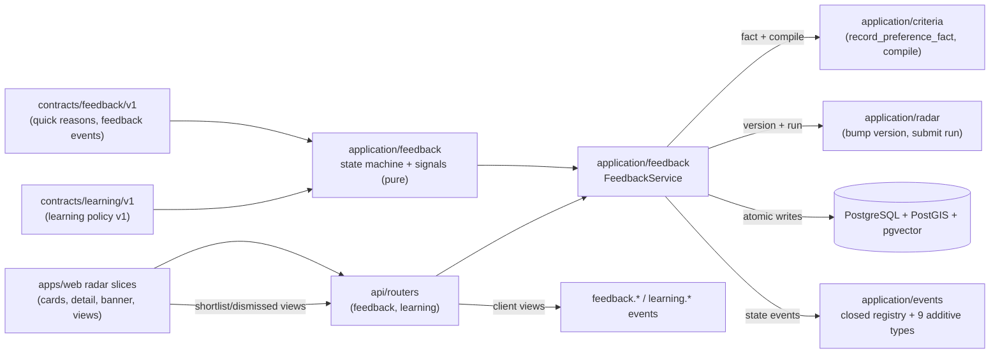

# Implementation Plan: Feedback y aprendizaje controlado

**Branch**: `main` | **Date**: 2026-08-07 | **Spec**: [spec.md](./spec.md)

**Input**: Feature specification for UM-H3-023 through UM-H3-031 (Epica H3.3 -
Feedback y aprendizaje controlado), including the clarification sessions
2026-08-07 (versioned deterministic learning policy; free feedback as
qualitative input only; only reasoned like/dislike count as signals; pending
proposals are discovered via an inline radar banner).

## Summary

A new `application/feedback` module makes every user decision (like, dislike,
save, dismiss, contacted) an immutable, append-only `feedback_events` row with
an idempotent, compensation-linked supersede chain (decision state = last
active event per (profile, listing); partial unique index arbitrates). Quick
reasons are a versioned seed contract (`quick-reasons-v1.json`) normalized in
`feedback_event_reasons` and linked to H3.1 concepts. Only reasoned
like/dislike events count as learning signals; a versioned, immutable learning
policy (`learning_policies`/`learning_policy_versions`, seed `learning-v1`)
decides sufficiency (min_signals, window, min_signal_confidence, cooldown,
expiration) and the service evaluates signals synchronously after each
recorded action, creating pending `learning_proposals` (kind
`preference_fact`) with evidence refs — 0 LLM, 0 auto-apply. Confirming a
proposal orchestrates the existing seams (`CriteriaService.record_preference_fact`
with `fact_source="learning.proposal"` -> new `RadarService.bump_profile_version`
-> `compile_profile` -> `submit_run(trigger="edited")`); undo writes a
compensating fact and re-runs; previous runs stay frozen and consultable.
Save also upserts the shared `comparison_shortlists` table (H3.3 shortlist
view = H3.2 comparator persistence), dismiss is a state overlay on the matches
endpoint (`include_dismissed=false` default, additive `decision_state`
annotation) — direct feedback never creates runs. Additive HTTP surface
(feedback POST, decision-items GET, proposals list/confirm/reject/expand/undo,
matches annotation) with deny-by-default; nine additive event types on the
closed registry (0 free-feedback text). Web: card/detail actions with
optimistic reversible states, inline proposal banner, shortlist/dismissed
views; P1 gated: free feedback capture and the price-history section from
existing `listing_changes`.

The increment adds one new application module (`application/feedback`), two
small public seams on existing services, five new tables + three ENUMs, four
contract areas, a P0 web slice + two P1 slices and no new Python dependency;
it does not build golden dataset (H3.4), chat (H4) or notifications (H5).

## Technical Context

**Language/Version**: Python `>=3.13,<3.14`; TypeScript/Next.js for the web
slices

**Primary Dependencies**: SQLAlchemy 2, GeoAlchemy2, Alembic, Psycopg 3
(all existing); no new Python runtime dependency; web uses TanStack Query +
shadcn/ui (existing, plus `alert`/`card` primitives already present)

**Storage**: PostgreSQL 17 with PostGIS + pgvector (new tables
`feedback_events`, `feedback_event_reasons`, `learning_policies`,
`learning_policy_versions`, `learning_proposals` + 3 ENUM types; reuse of
`comparison_shortlists` for the save state)

**Testing**: pytest, Testcontainers, Ruff, mypy, Alembic checks, architecture
contracts; contract conformance suites with golden fixtures (quick reasons,
learning policy, signals, feedback states, endpoints, events registry);
integration against real Postgres (immutable chains, idempotency, proposal
lifecycle, confirm/undo re-runs); web build + component tests per H2.3
convention

**Target Platform**: same runtime surfaces; a new `application/feedback`
module wired in the API composition; no new job type, no new topology

**Project Type**: modular monolith; this increment exposes product HTTP
contracts (feedback, decision items, learning proposals)

**Performance Goals**: feedback recording is synchronous and bounded per
request (plan-level p95 < 500 ms over the harness dataset); the confirm flow
reuses the `< 30 s` run publish target of H2.3 unchanged; no new background
pipeline

**Constraints**: events immutable and idempotent (FR-002/FR-003); only
reasoned like/dislike are signals (clarification); proposals never applied
without confirmation and never global (FR-010); 0 LLM in sufficiency decisions
(FR-009); free-feedback text never in events/analytics (FR-016); dismissed
hidden by default without creating runs (FR-015); deny-by-default on all new
endpoints (FR-019)

**Scale/Scope**: one new application module, six new endpoints + two additive
matches changes, five tables + three ENUMs, four contract areas, web radar/
detail updates + two new views + two P1 slices, one new harness surface
(`scripts/check-feedback.ps1`)

## Constitution Check

*GATE: evaluated before Phase 0 and re-evaluated after Phase 1.*

| Principle | Before research | After design | Evidence |
| --- | --- | --- | --- |
| Persistent radar truth | PASS | PASS | Feedback events (append-only), decision states, proposals and confirmed facts are persistent product objects tied to a search; nothing lives only in a transient response or chat (Principle I, UM-H3-023). |
| Auditable deterministic matching | PASS | PASS | Sufficiency is decided by the versioned pure learning policy over structured signals; ranking remains the H3.2 engine; 0 LLM in decisions; proposals require explicit confirmation (Principle II, FR-009/FR-010). |
| Layer boundaries | PASS | PASS | `application/feedback` is pure (contracts, registry, policy, signals, state machine, service); repositories and SQLAlchemy models are infrastructure; routers map DTOs with typed problems; the service consumes existing application seams (CriteriaService, RadarService) — no domain import of FastAPI/DB/LLM. |
| Data lineage and evidence | PASS | PASS | Every proposal references its feedback events; every confirmed fact is a compensated, versioned row in the H3.1 fact chain; runs freeze profile versions; undo is a compensating fact; events carry ids/counts only, never free text (Principle V, FR-016/FR-018). |
| Minimal verifiable scope | PASS | PASS | Scope is exactly UM-H3-023..UM-H3-031: golden dataset/regressions (H3.4), chat (H4), alerts (H5) and operator console (H6) are deferred; free feedback and price history are P1; criterion-kind proposals deferred (R-06); no operator console. |

There are no constitution violations requiring a complexity exception.

## Assumptions and Tradeoffs

- Only like/dislike events with concept-linked reasons are learning signals
  (clarification 2026-08-07); save/dismiss/contacted record state and evidence
  but never propose (FR-009).
- Sufficiency comes from the versioned `learning-v1` policy (seed values:
  min_signals 3, window 90 days, min_signal_confidence 1.0, cooldown 7 days,
  expiration 30 days, suggested weight 0.3, confidence 0.6); values are
  product curation in the seed file, refined in tasks without changing the
  contract shape.
- Proposals are `preference_fact` kind in v1 with `value=None` (adjusts
  polarity/weight/confidence without inventing values); `criterion` kind is
  reserved and deferred (R-06). Hard-filter escalations never happen
  automatically (FR-010).
- The shortlist view of H3.3 reads `comparison_shortlists` (shared persistence
  with the H3.2 P1 comparator, per spec assumption); save upserts the row,
  un-save removes it; the comparator endpoints keep their P1 gate (R-10).
- Confirmed-learning runs reuse `trigger='edited'`; the run ENUM is not
  extended (R-08). Direct feedback never creates runs (FR-015): dismissed is a
  query-time state overlay.
- Free feedback is P1 behind `feedback.free_feedback_enabled=false`; length
  limit 500 chars; 0 content reaches events/analytics (FR-016).
- Price history (UM-H3-031) is P1 and consumes the existing `listing_changes`
  data already exposed as `known_changes`; 0 trend inference (FR-017, R-11).
- Proposal expiry is lazy (on read/confirm), not a sweep job (R-09).
- The web keeps the current hand-typed `lib/radar/client.ts` convention; the
  generated client and OpenAPI are still regenerated and committed per the
  H1.5 convention.
- No new telemetry fields beyond the nine additive events; payloads carry
  ids/state/counts only (R-13).
- Web work follows the H2.3 convention: component tests + build in the
  harness; the dedicated axe e2e audit remains a H2.3 deferred follow-up.

Detailed decision records and rejected alternatives are in
[research.md](./research.md).

## Architecture



All arrows are dependency/use direction. Application code is pure of
FastAPI/SQLAlchemy/LLM clients; repositories live in infrastructure; the
confirm/undo flows orchestrate existing application services through their
public seams; routers follow `routers/explanations.py`.

## Module, Interface and Seam Design

| Module | Public Interface | Adapters / consumers | Boundary rule |
| --- | --- | --- | --- |
| Feedback contracts | `FeedbackEvent`, `DecisionState`, `QuickReason`, `LearningPolicyDoc`, `LearningProposal`, `ProposalChange`, `FeedbackError` (+ typed subclasses) | services, routers, tests; pure values | No FastAPI, SQLAlchemy, LLM or web imports |
| Quick reason registry | `load_quick_reasons_seed()`, `parse_reasons_v1()`, `validate_reasons()` | service + conformance tests | Pure; rules from `contracts/feedback/v1` |
| Learning policy registry | `load_learning_policy_seed()`, `parse_policy_v1()`, `validate_policy()`, `register_policy_version()` | service + conformance tests | Pure; append-only versions (FR-009) |
| Signal engine | `evaluate_signals(events, policy, now) -> ProposalDraft \| None` | feedback service; golden tests | Pure; min_signals/window/cooldown; 0 LLM (FR-009, R-04/R-07) |
| Feedback service | `record_feedback(...)` (idempotent, supersede, terminal guard), `list_decision_items(state)`, `get_decision_state`, `confirm_proposal`, `reject_proposal`, `expand_proposal`, `undo_proposal`, `list_proposals(state)` | routers, harness; orchestrates CriteriaService + RadarService seams | Owns decision-state uniqueness, compensation chain, proposal lifecycle, ownership checks and events |
| Feedback repositories | `FeedbackEventRepository`, `LearningPolicyRepository`, `LearningProposalRepository`, `ShortlistPort` (add/remove), `ListingReader` | SQLAlchemy + in-memory adapters | Never commit alone; partial uniques arbitrate races |
| API routers | `feedback.py` (POST feedback, GET decision-items, matches annotation), `learning.py` (proposals list/confirm/reject/expand/undo) | OpenAPI + generated TS client + `lib/radar/client.ts` additions | Typed problems, deny-by-default, action-based authorization |
| Web slices | radar cards + detail actions with optimistic state; proposal banner; shortlist/dismissed views; P1 free feedback + price history | TanStack Query against `radarApi` | No client-side scoring/decisions; a11y by convention |

Do not introduce a generic repository, a second run job type, or an
LLM/external service seam in this increment: the signal engine stays pure and
there is no new external boundary (R-07). The policy registry mirrors the
scoring policy registry of H3.2; routers mirror `explanations.py`; the
supersede chain mirrors `record_preference_fact` of H3.1.

## Readiness and Failure Isolation

No new critical dependency is added (PostgreSQL is already critical; the LLM
is absent from v1). Failure behavior:

- Feedback write race (two tabs): the partial unique
  `(profile_id, listing_id) WHERE state='active'` + idempotency-key unique
  arbitrate; the loser maps to `feedback_conflict` or returns the existing
  event (FR-003/FR-004).
- Client retry of the same action: same idempotency key returns the existing
  event; same-type active action is an idempotent no-op (FR-003).
- Contacted active + new action: typed `feedback_terminal` (FR-005).
- Confirm raced/expired: proposal row optimistic version + lazy expiry →
  `proposal_not_pending`/`proposal_expired`; 0 partial application (FR-013).
- Run submission after confirm fails mid-publish: the existing job retry and
  atomic `record_outcome` apply; the last valid run stays visible (FR-014,
  H3.2 rule).
- Double-submission of the confirm flow on retry: the run triple
  (profile, version, trigger) unique arbitrates; the fact supersede is
  idempotent per (profile, concept) (R-08).
- Cross-user/cross-search access: every read resolves ownership through the
  profile before any data (FR-019).
- Free feedback (P1) with forbidden content: captured but never emitted;
  length validated; 0 analytics leakage (FR-016).

## Configuration and Secret Boundary

No new secrets. New settings (behind `Settings`, validated at startup, safe
defaults; registered in `_known_fields`):

- `learning.policy_seed_version` (`learning-v1`) — learning policy seed to
  load at startup (mirrors `scoring.policy_seed_version`);
- `feedback.quick_reasons_seed_version` (`quick-reasons-v1`) — quick-reasons
  seed version;
- `feedback.free_feedback_enabled` (false) — P1 free-feedback capture flag;
- `feedback.max_free_feedback_length` (500) — free-feedback length limit.

Free-feedback text never enters logs, traces or events; event rows carry
ids/state/counts only (FR-018, SC-008).

## Data and Migration Design

The full schema is in [data-model.md](./data-model.md). The new revision
`0008_feedback_learning.py` (down: `0007_scoring_explanations`) creates:

1. `feedback_events`;
2. `feedback_event_reasons`;
3. `learning_policies`;
4. `learning_policy_versions`;
5. `learning_proposals`;

plus 3 ENUM types (`feedback_event_type`, `feedback_event_state`,
`learning_proposal_state`), stable constraint naming and all
uniqueness/check/index requirements. No changes to `recommendation_runs`/`recommendation_items` (confirm flows
reuse `trigger='edited'`); `comparison_shortlists` is reused as-is.

Important transaction rules:

- Record feedback: supersede active row + insert event + reason rows (+
  shortlist upsert on save) commit together; the partial unique arbitrates
  races (FR-003/FR-004, R-10).
- Proposal creation: same transaction as the triggering feedback event
  (R-07); the pending partial unique and cooldown guard duplicates (FR-011).
- Confirm: proposal state + applied refs commit with the fact/compile/version
  sequence; run submission is a separate atomic job transaction (R-08).
- Undo: compensating fact + bump/compile/run + proposal superseded, one
  transaction (FR-012, R-09).
- All reads filter by profile `owner_id` through the profile (FR-019).

Migration tests cover empty DB, previous released revision, one head,
metadata drift and the declared downgrade path, following `tests/migrations`.

## Contracts

Planning contracts:

- [feedback v1](./contracts/feedback-contract-v1.md)
- [learning policy v1](./contracts/learning-policy-v1.md)
- [product events v1 addendum](./contracts/events-addendum-v1.md)

Machine-checkable files to add: `contracts/feedback/v1/feedback-events.json`
(event shape + endpoint rules), `contracts/feedback/v1/quick-reasons-v1.json`
(curated reason seed) and `contracts/learning/v1/learning-policy-v1.json`
(policy document + seed), plus the nine additive event types registered in
`contracts/events/v1/events-registry.json`. OpenAPI changes: the feedback,
decision-items, proposals and matches-annotation endpoints with typed
problems; the TS client is regenerated and committed (`npm run api:generate
--workspace @umbral/web`).

## Job Idempotency and Recovery

No new job type. The confirm/undo flows submit the existing
`recommendation.run` job with identity
`(job_type="recommendation.run", logical_target=<profile_id>:<version_id>,
idempotency_key=...)` and at-least-once semantics; the run triple unique
prevents duplicates. The `recommendation.run` handler is unchanged: it loads
the frozen profile version, its compilation (created before submission by the
confirm flow), computes the candidate set and publishes atomically with the
H3.2 machinery (FR-014).

## Observability and Audit

Audit coverage (events are DB rows; telemetry is metadata-only):

| Operation | Durable evidence |
| --- | --- |
| feedback recorded / superseded / no-op | `feedback_events` rows (append-only chain) + `feedback.recorded.v1` |
| quick reason on an event | `feedback_event_reasons` rows |
| save / un-save | feedback chain + `comparison_shortlists` rows |
| proposal created | `learning_proposals` row + `learning.proposal_created.v1` with policy version |
| proposal confirmed | proposal row + `learning.proposal_confirmed.v1` + fact row + run row |
| proposal rejected / expanded / expired / undone | proposal row + event type per transition |
| shortlist / dismissed views | `feedback.shortlist_viewed.v1` / `feedback.dismissed_viewed.v1` (client) with counts |
| authorization decisions | existing `access_audit_events` for the new actions |

Free-feedback text, reason labels and listing text never enter default logs,
traces or events (FR-016, SC-008).

## Delivery and Recovery Topology

No new deployment topology. The five tables ride the existing migration flow;
the feedback service ships inside the API artifact (no worker changes);
routers register in the existing API; OpenAPI + the TS client are regenerated
as part of the web workspace. Backup/restore scope extends automatically via
the existing full-DB backup. P1 slices are behind
`feedback.free_feedback_enabled=false` and the existing `known_changes` data.

## Project Structure

### Documentation (this feature)

```text
specs/007-feedback-learning/
├── spec.md
├── plan.md
├── research.md
├── data-model.md
├── quickstart.md
├── contracts/
│   ├── feedback-contract-v1.md
│   ├── learning-policy-v1.md
│   └── events-addendum-v1.md
├── checklists/
│   └── requirements.md
└── tasks.md                    # created later by /speckit-tasks
```

### Source Code (repository root)

```text
contracts/
├── feedback/v1/                  # feedback-events.json,
│                                 # quick-reasons-v1.json
├── learning/v1/                  # learning-policy-v1.json
└── events/v1/                    # + 9 feedback/learning types (additive)
src/umbral/
├── application/feedback/
│   ├── contracts.py              # pure values/errors
│   ├── reasons.py                # quick reasons registry (parse/validate/seed)
│   ├── policy.py                 # learning policy parse/validate/seed
│   ├── signals.py                # evaluate_signals pure function
│   ├── state.py                  # decision-state + supersede rules (pure)
│   ├── ports.py                  # 4 repositories + listing reader
│   └── service.py                # FeedbackService: record/state/proposals
│                                 # + confirm/undo orchestration
├── application/radar/service.py  # + bump_profile_version, submit_run seams
├── infrastructure/db/
│   ├── models/feedback.py        # 5 tables + ENUMs
│   └── repositories/feedback.py  # SQLAlchemy + in-memory adapters
├── infrastructure/feedback/
│   ├── contract_loader.py        # quick-reasons + learning policy seeds
│   └── composition.py            # build_feedback_service
├── api/routers/
│   ├── feedback.py               # POST feedback, GET decision-items,
│   │                             # matches annotation
│   └── learning.py               # proposals list/confirm/reject/expand/undo
└── infrastructure/config/settings.py  # learning_* / feedback_* fields
alembic/versions/0008_feedback_learning.py
apps/web/src/
├── app/(protected)/radar/[id]/page.tsx           # card actions + banner
├── app/(protected)/radar/[id]/shortlist/page.tsx # shortlist view
├── app/(protected)/radar/[id]/dismissed/page.tsx # dismissed view
├── app/(protected)/listings/[id]/page.tsx        # detail actions + P1 slices
├── components/radar/feedback-actions.tsx         # save/dismiss/like/dislike
├── components/radar/proposal-banner.tsx          # inline pending proposal
├── lib/radar/client.ts                           # + feedback/proposals fns
└── lib/radar/events.ts                           # + view events
tests/
├── contract/test_quick_reasons.py
├── contract/test_learning_policy.py
├── contract/test_feedback_endpoints.py
├── contract/test_learning_endpoints.py
├── contract/test_events_registry.py             # + 9 types
├── unit/application/feedback/                   # state, signals, service
├── integration/feedback/                        # real DB: chains, decision
│                                                # items, proposal lifecycle
├── fixtures/feedback/                           # quick-reasons, policy,
│                                                # signals golden
├── architecture/test_feedback_boundaries.py
└── migrations/test_0008_feedback_learning.py
scripts/check-feedback.ps1                       # new harness surface (mirrors
                                                 # check-scoring.ps1)
```

**Structure Decision**: keep the accepted modular monolith layout.
`application/feedback` follows `application/criteria`/`application/scoring`
conventions; the learning policy registry mirrors the scoring policy registry;
routers mirror `explanations.py`; models/repositories follow
`infrastructure/db/models` and `repositories`; composition follows
`infrastructure/scoring/composition.py`.

## Planned Implementation Sequence

The later `/speckit-tasks` artifact must decompose these phases into
test-first, path-specific tasks. Each behavioral slice starts with the failing
contract/unit/integration test named here, then the minimum implementation,
then the full gate.

### Phase A — Contracts and pure feedback domain

- Load `contracts/feedback/v1` (event shape, quick-reasons seed) and
  `contracts/learning/v1` (learning policy document + seed); register the nine
  additive event types in the events registry.
- Implement `reasons.py`, `policy.py`, `state.py` (supersede/no-op/terminal
  rules) and `signals.py` (pure sufficiency: min_signals, window, cooldown,
  expiration).
- Golden fixtures: `tests/fixtures/feedback/` (reason seeds incl. invalid,
  policy documents incl. invalid, signal chains, state sequences).
- Conformance suites: `test_quick_reasons.py`, `test_learning_policy.py`,
  `test_events_registry.py`.
- Gate: FR-001..FR-006 and FR-009 pure rules; SC-001/SC-002 state behavior.

### Phase B — Persistence and migration

- Migration `0008_feedback_learning` + models for the five tables + ENUMs +
  partial uniques (`uq_feedback_events_active`,
  `uq_learning_proposals_pending`).
- SQLAlchemy + in-memory repositories; `SqlAlchemyShortlistRepository` gains
  `add`/`remove`; append-only policy versions.
- Gate: migration suite (empty/previous/head/drift/downgrade) and repository
  unit tests green.

### Phase C — FeedbackService core

- `record_feedback`: idempotency-key replay, same-type no-op, supersede chain
  with compensation link, contacted-terminal guard, quick-reason validation,
  save upsert into `comparison_shortlists`, proposal evaluation in the same
  transaction (FR-003..FR-011).
- `list_decision_items`, `get_decision_state`; matches annotation +
  `include_dismissed` (FR-007/FR-008, FR-015).
- Integration tests: `tests/integration/feedback/test_feedback_events.py`,
  `test_decision_items.py` (real Postgres: chains, no-ops, terminal, hidden
  dismissed, 0 runs on direct feedback).
- Gate: SC-001..SC-004.

### Phase D — Proposal lifecycle and recalculado

- `RadarService.bump_profile_version` + `submit_run` public seams (mirror
  `update_profile` internals; R-08).
- `confirm_proposal` (fact -> bump -> compile -> run "edited"),
  `reject_proposal`, `expand_proposal`, `undo_proposal` (compensating fact),
  lazy expiry; `list_proposals(state)`.
- Integration tests: `tests/integration/feedback/test_proposal_lifecycle.py`
  (confirm/undo re-runs, previous run frozen, expired/raced rejects, failed
  run keeps last valid).
- Gate: FR-012..FR-015, SC-005..SC-007.

### Phase E — API contracts

- `routers/feedback.py` (POST feedback, GET decision-items, matches
  annotation) and `routers/learning.py` (list/confirm/reject/expand/undo),
  typed problems, deny-by-default via profile ownership (FR-019).
- OpenAPI regeneration + TS client commit; `lib/radar/client.ts` additions.
- Gate: `test_feedback_endpoints.py`, `test_learning_endpoints.py` conformance
  + cross-user denial tests (SC-010).

### Phase F — Web: actions, banner, views

- Card/detail save/dismiss/like/dislike + quick reasons with optimistic
  reversible states; inline proposal banner with confirm/expand/dismiss and
  link to proposal detail (FR-005/FR-013).
- Shortlist and dismissed views (decision-items endpoint), filters, navigation
  to detail; client view events.
- Accessibility by convention (keyboard, labels, contrast).
- Gate: `npm run build --workspace @umbral/web` + component tests (SC-003,
  SC-010).

### Phase G — P1 slices: free feedback and price history

- Free feedback capture behind `feedback.free_feedback_enabled=false`;
  usage copy; 0 text in events/analytics (FR-016).
- Price/attribute history section from `known_changes` with dates and sources;
  "historial insuficiente" without trend lines (FR-017, SC-009).
- Gate: web build + component tests.

### Phase H — Harness, events and closure

- `scripts/check-feedback.ps1` wired into `check.ps1`; fixture-driven harness
  scenarios from quickstart.
- Run every functional-requirement fixture, success metric and
  `.\scripts\check.ps1` from a clean checkout; record evidence in
  `docs/runbooks/evidence/feedback-learning-acceptance.md`; update quickstart
  and the runtime-local runbook.

## Verification Commands

Target commands after implementation:

```powershell
uv sync --frozen --all-groups
uv run ruff format --check .
uv run ruff check .
uv run mypy src tests
uv run pytest
uv run alembic current --check-heads
uv run alembic check
uv run pytest tests/contract/test_quick_reasons.py tests/contract/test_learning_policy.py tests/contract/test_feedback_endpoints.py tests/contract/test_learning_endpoints.py tests/contract/test_events_registry.py tests/unit/application/feedback tests/integration/feedback
npm run api:generate --workspace @umbral/web
npm run build --workspace @umbral/web
.\scripts\check-feedback.ps1
.\scripts\check.ps1
```

No success claim is based only on a mock or a skipped surface: feedback chains,
idempotency, decision items and the proposal lifecycle (confirm/undo re-runs)
run against the real Postgres/PostGIS stack in `tests/integration/feedback`;
web surfaces are covered by build + component tests per project convention.

## Backlog and Requirement Traceability

| Backlog item | Plan ownership | Primary evidence |
| --- | --- | --- |
| UM-H3-023 feedback events inmutables | Phase A + B + C | event chain conformance + integration (FR-001/FR-002, SC-001) |
| UM-H3-024 feedback idempotente | Phase A + C | replay/no-op/supersede tests (FR-003/FR-004, SC-002) |
| UM-H3-025 guardar, descartar, razones | Phase A + F | quick-reasons conformance + web component tests (FR-005/FR-006, SC-003) |
| UM-H3-026 shortlist y descartados | Phase C + F | decision-items integration + views (FR-007/FR-008, SC-004) |
| UM-H3-027 feedback libre (P1) | Phase G | flag + 0-text-in-events checks (FR-016, SC-008) |
| UM-H3-028 proponer aprendizaje | Phase A + C + D | signals + policy conformance + lifecycle (FR-009/010/011, SC-005) |
| UM-H3-029 confirmar/deshacer/ampliar | Phase D + F | proposal lifecycle integration + banner (FR-012/FR-013, SC-006) |
| UM-H3-030 recalcular tras cambios | Phase D | confirm/undo re-runs integration (FR-014/FR-015, SC-007) |
| UM-H3-031 historial de cambios (P1) | Phase G | web history section from known_changes (FR-017, SC-009) |
| Transversal (todos) | Phase A + E + H | events registry + endpoints + harness (FR-018..FR-021, SC-008/SC-010) |

Every FR maps through these rows to at least one automated check. `tasks.md`
must preserve these mappings rather than regrouping cross-cutting checks away
from their story.

## Complexity Tracking

No constitution violation is present. The only deliberate additions beyond a
naive pass are: (a) `feedback_events` as an append-only chain with a derived
decision state and partial-unique arbitration — required by FR-001..FR-004 and
the audit guardrail, with the rejected alternative (mutable decision columns)
recorded in research R-01; (b) the versioned learning policy document
(JSONB payload validated against a versioned contract, append-only) —
required by FR-009, with the rejected alternative (flat settings) recorded in
research R-05; (c) `feedback_event_reasons` normalization for concept-linked
signals — required by FR-006 and the signal queries, with the rejected
alternative (jsonb on the event) recorded in research R-02. All have simpler
rejected alternatives documented that would violate the spec.
