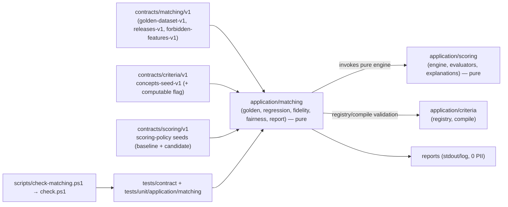

# Implementation Plan: Calidad del matching

**Branch**: `main` | **Date**: 2026-08-09 | **Spec**: [spec.md](./spec.md)

**Input**: Feature specification for UM-H3-032 through UM-H3-035 (Epica H3.4 -
Calidad del matching), including the clarification sessions 2026-08-09 (strict
regression gate: any relative order change or hard-filter difference blocks;
score deltas without order change are informational; explained changes are
declared in a versioned releases manifest whose affected cases must match the
detected diff; strict fidelity threshold: 100% supported claims, 0
unsupported, 0 contradictions).

## Summary

A new pure, test-only `application/matching` module protects the matching
stack before the conversational radar (H4) and alerts (H5) build on it:

- `contracts/matching/v1/golden-dataset-v1.json` — the versioned, immutable,
  product-reviewed golden recommendation dataset (profile criteria + listings
  + expected ranking/hard-filter expectations per case, tagged
  `hard_filter_violation`/`unknown`/`subjective_preference`/
  `price_boundary`/`legacy_no_breakdown`), validated by conformance tests.
- `application/matching/regression.py` — pure runner comparing two policy
  revisions over the golden dataset; strict gate: any relative order change or
  hard filter difference blocks unless `contracts/matching/v1/releases-v1.json`
  declares exactly the affected cases (owner + justification); score deltas
  without order change are informational.
- `application/matching/fidelity.py` — pure evaluator classifying each
  explanation claim as `supported`/`unsupported`/`contradiction` against the
  persisted H3.2 breakdown, checking uncertainty declaration, with the strict
  threshold (100% supported, 0 unsupported, 0 contradictions); legacy
  no-breakdown items are excluded.
- `contracts/matching/v1/forbidden-features-v1.json` +
  `docs/product/fairness-review-v1.md` + additive `compute_policy.computable`
  flag on the concepts seed (P1, UM-H3-035) — forbidden concepts become
  non-computable and are rejected by the compiler; a normative-phrases scan
  checks the templates.
- `scripts/check-matching.ps1` registered in `check.ps1` (mirrors
  `check-scoring.ps1`) driving all of the above with audit reports, 0 PII.

The increment adds no DB tables, no migration, no HTTP endpoints, no product
events, no web surfaces and no new Python dependency; it does not build the
chat (H4), alerts (H5) or operator consoles (H6).

## Technical Context

**Language/Version**: Python `>=3.13,<3.14`; no web/TypeScript surface

**Primary Dependencies**: SQLAlchemy 2, GeoAlchemy2, Alembic, Psycopg 3 (all
existing); no new Python runtime dependency

**Storage**: none new — the golden dataset, releases and forbidden-features
registry are versioned contract JSON files under `contracts/matching/v1/`,
validated by conformance tests; the concepts seed gains the additive
`compute_policy.computable` flag (contract change, no migration)

**Testing**: pytest (contract conformance + unit for the pure runner and
fidelity evaluator), Ruff, mypy, Alembic checks, architecture contracts,
`scripts/check-matching.ps1` registered in `check.ps1`; no integration/DB
surface required (the runner is pure over fixture data)

**Target Platform**: harness-only module; never imported by `api/` or workers

**Project Type**: modular monolith; this increment is internal verification
(0 HTTP contracts exposed)

**Performance Goals**: the full regression + fidelity run over the golden
dataset completes in CI in seconds (pure in-memory computation, tens of
cases); no new background pipeline

**Constraints**: strict regression gate (FR-004, clarification 2026-08-09);
explanations bound to the release manifest with matching case ids (FR-005);
strict fidelity threshold (FR-007); legacy no-breakdown items excluded
(FR-007); forbidden concepts rejected by the compiler (FR-008); 0 product
events, 0 endpoints, 0 migrations, 0 web surfaces (FR-011); harness reports
without PII (FR-011)

**Scale/Scope**: one pure `application/matching` module (5 pure files), four
contract files + one schema under `contracts/matching/v1/`, one additive seed
field, three conformance + two unit test surfaces, one harness script, one
fairness review document; no migration

## Constitution Check

*GATE: evaluated before Phase 0 and re-evaluated after Phase 1.*

| Principle | Before research | After design | Evidence |
| --- | --- | --- | --- |
| Persistent radar truth | PASS | PASS | The golden dataset is a versioned, immutable, product-reviewed contract; recommendations, runs and breakdowns remain the H3.2 persistent truth the evaluators read. No new product object is invented (Principle I). |
| Auditable deterministic matching | PASS | PASS | Regression runs the pure H3.2 engine over golden cases with a strict, mechanical gate; fidelity classifies claims against the persisted breakdown with 0 LLM judge; explained changes are bound to a versioned release manifest (Principle II, FR-003..FR-007). |
| Layer boundaries | PASS | PASS | `application/matching` is pure and test-only: it consumes H3.1/H3.2 contracts and pure engine pieces; it is never imported by API/workers and never touches the DB at runtime; forbidden-features enforcement reuses the existing compiler validation path (Principle III). |
| Data lineage and evidence | PASS | PASS | Every golden case traces to its profile criteria and listings; every fidelity verdict references the persisted breakdown/evidence refs; reports are auditable without PII; the fairness review documents forbidden features with justification (Principle V, FR-008/FR-011). |
| Versioned prompts, models and schemas | PASS | PASS | The golden dataset, releases and forbidden-features registries are versioned contracts; the seed `computable` flag is additive and validated; any future generative copy must pass the same fidelity evaluator (FR-012). |
| Minimal verifiable scope | PASS | PASS | Scope is exactly UM-H3-032..UM-H3-035: no DB, no endpoints, no events, no web, no new deps; chat (H4), alerts (H5) and operator consoles (H6) are deferred. |

There are no constitution violations requiring a complexity exception.

## Assumptions and Tradeoffs

- The golden dataset is a versioned contract file (R-01): self-contained cases
  (profile criteria + listings + expected ranking/hard-filter expectations)
  under `contracts/matching/v1/golden-dataset-v1.json`, reviewed by product;
  exact case count/values are curated during implementation without changing
  the schema (FR-001/FR-002).
- Regression compares the case's `baseline_score_policy_version` against a
  candidate policy revision loaded as a seed file; any relative order change
  or hard filter difference blocks unless `releases-v1.json` declares exactly
  the affected cases (R-02, clarification 2026-08-09). Score deltas without
  order change are informational.
- Fidelity is deterministic over the persisted H3.2 breakdown (R-03): claims
  are classified supported/unsupported/contradiction; uncertainty must be
  declared; strict threshold (clarification 2026-08-09). Legacy items are
  `no_breakdown` and never scored (R-04).
- Forbidden features (P1) are the versioned contract
  `forbidden-features-v1.json` + the human `fairness-review-v1.md` document +
  the additive `compute_policy.computable` seed flag enforced by the compiler
  (R-05); no new infrastructure.
- The matching module is pure harness machinery (R-06): 0 API/worker wiring,
  0 migrations, 0 endpoints, 0 product events; the harness gate is enabled by
  default and fails hard (R-07).
- The concepts seed flag is additive with default `true` when absent; existing
  conformance fixtures remain valid (contract change, not a DB migration).
- No new telemetry fields or settings beyond
  `matching.golden_dataset_version` (default `golden-dataset-v1`) and
  `matching.regression_gate_enabled` (default `true`), registered in
  `_known_fields` (R-06/R-07).
- The harness report is written to stdout and optionally to a log file; 0 PII
  (listing text, profile text) enters reports (FR-011).

Detailed decision records and rejected alternatives are in
[research.md](./research.md).

## Architecture



All arrows are dependency/use direction. `application/matching` is pure,
test-only, and never wired into the API, workers or the DB; it reuses the H3.1
registry/compiler and H3.2 engine/explanations as consumers.

## Module, Interface and Seam Design

| Module | Public Interface | Adapters / consumers | Boundary rule |
| --- | --- | --- | --- |
| Golden dataset registry | `load_golden_dataset(path)`, `validate_golden_dataset(raw) -> GoldenDataset`, `case_tags(case)` | conformance tests, regression runner | Pure; rules from `golden-dataset-v1.json` + schema |
| Releases registry | `load_releases(path)`, `validate_releases(raw, dataset)`, `declared_affected(artifact_version)` | regression runner, conformance tests | Pure; append-only; case ids must exist in dataset |
| Regression runner | `run_regression(dataset, baseline_policy, candidate_policy, releases, matcher_types) -> RegressionReport` | harness, unit tests | Pure; strict order/hard-filter gate (FR-004); score deltas informational; releases must cover the diff (FR-005) |
| Fidelity evaluator | `evaluate_fidelity(breakdown, explanation_claims) -> FidelityReport` | harness, unit tests | Pure; supported/unsupported/contradiction/uncertainty; legacy `no_breakdown`; strict threshold (FR-006/FR-007) |
| Fairness registry | `load_forbidden_features(path)`, `validate_forbidden(registry, concepts_seed)`, `scan_normative_phrases(templates, phrases)` | conformance tests, compiler integration | Pure; forbidden concepts must be `computable:false` in seed (FR-008) |
| Compiler enforcement | existing `application/criteria` compiler rejects non-computable concepts | criteria service + regression runner | Additive seed flag; reuse existing validation path (R-05) |
| Harness script | `scripts/check-matching.ps1` | `check.ps1` (matchingSurface guard) | Runs pytest surfaces + golden/regression/fidelity/fairness checks; exit code non-zero on any gate failure (R-07) |

Do not introduce a runtime service, repository, endpoint, migration or worker
for this increment: the module is verification machinery consumed by tests and
the harness only (R-06). The regression runner mirrors the pure engine calls of
`tests/contract/test_scoring_baseline.py`; the fidelity evaluator mirrors the
breakdown shape of `application/scoring/explanations.py`.

## Readiness and Failure Isolation

No new critical dependency is added. Failure behavior:

- A candidate policy revision that regresses the order of any case with no
  matching release: the gate blocks with the per-case diff and the missing
  release ids (FR-004, clarification 2026-08-09).
- A release declares cases the diff does not contain (or misses one): the gate
  blocks with the mismatch listed (FR-005).
- A golden case references a listing id missing from its listings, or a tag
  outside the known set: conformance validation fails before any run (FR-001).
- An explanation claim with no breakdown entry or one that contradicts it:
  fidelity fails with the claim-level verdicts (FR-007).
- A legacy (baseline) item without breakdown: reported `no_breakdown`, never
  fabricated reasons, never fails fidelity (FR-007 edge case).
- A compilation referencing a forbidden (non-computable) concept: rejected by
  the existing compiler path with a typed error (FR-008).
- The harness runs on a clean checkout without DB/Redis/storage: all surfaces
  are in-memory fixture-based, so no external dependency is required (R-06).

## Configuration and Secret Boundary

No new secrets. New settings (behind `Settings`, validated at startup, safe
defaults; registered in `_known_fields`):

- `matching.golden_dataset_version` (`golden-dataset-v1`) — golden dataset
  seed to load in the harness;
- `matching.regression_gate_enabled` (`true`) — hard gate on/off; defaults on
  and must not be disabled in CI (R-07).

Reports never contain listing text, profile text or free feedback; they carry
case ids, verdicts, counts and release ids only (FR-011).

## Data and Migration Design

No migration is added. Data artifacts:

1. `contracts/matching/v1/golden-dataset-v1.json` + `golden-dataset.schema.json`
   — product-reviewed cases (R-01, FR-001/FR-002).
2. `contracts/matching/v1/releases-v1.json` — append-only explained changes
   (R-02, FR-005).
3. `contracts/matching/v1/forbidden-features-v1.json` — fairness registry
   (R-05, FR-008).
4. `contracts/criteria/v1/concepts-seed-v1.json` — additive
   `compute_policy.computable` flag on forbidden concepts (default `true` when
   absent; contract change, no DB migration).

Full shapes and validation rules: [data-model.md](./data-model.md).

## Contracts

Planning contract: [matching contracts v1](./contracts/matching-contracts-v1.md)

Machine-checkable files to add: `contracts/matching/v1/golden-dataset-v1.json`
(+ schema), `contracts/matching/v1/releases-v1.json`,
`contracts/matching/v1/forbidden-features-v1.json`, and the additive
`compute_policy.computable` field in `contracts/criteria/v1/concepts-seed-v1.json`.
No OpenAPI changes (FR-011).

## Job Idempotency and Recovery

No new job type and no new worker behavior: the harness is a synchronous,
in-memory CI check. Regression and fidelity runs are pure and deterministic:
the same inputs always produce the same report (FR-003/FR-006).

## Observability and Audit

Audit coverage (reports and versioned contract files; 0 product events):

| Operation | Durable evidence |
| --- | --- |
| golden dataset version reviewed | `golden-dataset-v1.json` (reviewed_by/reviewed_at) + conformance run |
| regression pass/block | harness report: per-case verdicts, gate decision, release coverage |
| explained change declared | `releases-v1.json` entry (artifact/version/owner/justification/affected cases) |
| fidelity pass/fail | harness report: claim verdicts + aggregate threshold result |
| fairness reviewed | `forbidden-features-v1.json` + `fairness-review-v1.md` + conformance run |
| forbidden concept usage | compiler typed rejection (existing audit path) |

No new telemetry event types; the harness writes reports without PII
(FR-011).

## Delivery and Recovery Topology

No new deployment topology: nothing ships in the API, workers or web
artifacts. The contract files ride the normal repo/CI flow; the harness runs
in CI as part of `check.ps1`. Backup/restore scope is unchanged (no new
runtime data).

## Project Structure

### Documentation (this feature)

```text
specs/008-matching-quality/
├── spec.md
├── plan.md
├── research.md
├── data-model.md
├── quickstart.md
├── contracts/
│   └── matching-contracts-v1.md
├── checklists/
│   └── requirements.md
└── tasks.md                    # created later by /speckit-tasks
```

### Source Code (repository root)

```text
contracts/
├── matching/v1/
│   ├── golden-dataset-v1.json      # product-reviewed cases (FR-001/002)
│   ├── golden-dataset.schema.json  # JSON Schema for the dataset
│   ├── releases-v1.json            # append-only explained changes (FR-005)
│   └── forbidden-features-v1.json  # fairness registry (FR-008)
├── criteria/v1/concepts-seed-v1.json  # + compute_policy.computable flag
src/umbral/application/matching/
├── contracts.py                 # pure values/errors (GoldenDataset, reports)
├── golden.py                    # load/validate golden dataset
├── releases.py                  # load/validate releases
├── regression.py                # run_regression (strict gate)
├── fidelity.py                  # evaluate_fidelity (claim verdicts)
├── fairness.py                  # forbidden registry + phrase scan
└── report.py                    # audit report builder (0 PII)
docs/product/fairness-review-v1.md   # human fairness review document (P1)
scripts/check-matching.ps1       # new harness surface (mirrors check-scoring.ps1)
tests/
├── contract/test_matching_golden.py
├── contract/test_matching_regression.py
├── contract/test_matching_fidelity.py
├── contract/test_matching_fairness.py
├── contract/test_matching_harness.py
└── unit/application/matching/
    ├── test_regression.py
    └── test_fidelity.py
```

**Structure Decision**: keep the accepted modular monolith layout. The pure
module mirrors `application/scoring` conventions; contract loaders/validation
mirror `infrastructure/scoring/contract_loader.py` patterns (kept pure in the
application layer here since there is no runtime wiring); the harness mirrors
`check-scoring.ps1`; the fairness document follows
`docs/runbooks`/`docs/product` conventions.

## Planned Implementation Sequence

The later `/speckit-tasks` artifact must decompose these phases into
test-first, path-specific tasks. Each behavioral slice starts with the failing
contract/unit test named here, then the minimum implementation, then the full
gate.

### Phase A — Golden dataset contract and conformance

- Add `contracts/matching/v1/golden-dataset-v1.json` (+ schema) with curated
  cases covering all required tags and the baseline policy version.
- Implement `application/matching/golden.py` (pure load/validate) and
  `contracts.py` values.
- Conformance suite: `tests/contract/test_matching_golden.py`.
- Gate: FR-001/FR-002; SC-001.

### Phase B — Releases and strict regression runner

- Add `contracts/matching/v1/releases-v1.json` (empty/seed entries).
- Implement `releases.py` and `regression.py` (pure, invokes the H3.2 engine
  over fixture cases; strict order/hard-filter gate; score deltas
  informational; release coverage check).
- Unit tests: `tests/unit/application/matching/test_regression.py`; conformance:
  `tests/contract/test_matching_regression.py` (induced unexplained change
  blocks; declared matching release passes; mismatched case ids block).
- Gate: FR-003..FR-005; SC-002/SC-003.

### Phase C — Fidelity evaluator

- Implement `fidelity.py` (claim classification over the H3.2 breakdown;
  uncertainty declaration; legacy `no_breakdown`).
- Unit tests: `tests/unit/application/matching/test_fidelity.py`; conformance:
  `tests/contract/test_matching_fidelity.py`.
- Gate: FR-006/FR-007; SC-004.

### Phase D — Fairness registry and compiler enforcement (P1)

- Add `contracts/matching/v1/forbidden-features-v1.json` and
  `docs/product/fairness-review-v1.md`.
- Add the additive `compute_policy.computable` flag to the concepts seed and
  expose it in the H3.1 registry/compiler; reject non-computable concepts.
- Implement `fairness.py` (registry validation + normative-phrase scan over
  explanation/comparator templates).
- Conformance: `tests/contract/test_matching_fairness.py`.
- Gate: FR-008/FR-009; SC-005.

### Phase E — Harness, reports and closure

- Implement `report.py` (0 PII) and `scripts/check-matching.ps1`; register the
  `matchingSurface` guard in `check.ps1`.
- Conformance: `tests/contract/test_matching_harness.py`.
- Run every quickstart scenario and `.\scripts\check.ps1` from a clean checkout;
  record evidence in
  `docs/runbooks/evidence/matching-quality-acceptance.md`; update quickstart.
- Gate: FR-010/FR-011/FR-012; SC-006.

## Verification Commands

Target commands after implementation:

```powershell
uv sync --frozen --all-groups
uv run ruff format --check .
uv run ruff check .
uv run mypy src tests
uv run pytest
uv run alembic current --check-heads
uv run pytest tests/contract/test_matching_golden.py tests/contract/test_matching_regression.py tests/contract/test_matching_fidelity.py tests/contract/test_matching_fairness.py tests/contract/test_matching_harness.py tests/unit/application/matching
.\scripts\check-matching.ps1
.\scripts\check.ps1
```

No success claim is based only on a mock or a skipped surface: regression runs
the real H3.2 engine over the golden cases in memory; fidelity classifies real
breakdown shapes; fairness enforces the compiler rejection path. There is no
integration surface because the increment deliberately adds no runtime
machinery (R-06).

## Backlog and Requirement Traceability

| Backlog item | Plan ownership | Primary evidence |
| --- | --- | --- |
| UM-H3-032 dataset golden | Phase A | golden conformance + coverage (FR-001/FR-002, SC-001) |
| UM-H3-033 regresiones de scoring | Phase B | regression runner + releases conformance (FR-003..FR-005, SC-002/SC-003) |
| UM-H3-034 fidelidad de explicaciones | Phase C | fidelity unit + conformance (FR-006/FR-007, FR-012, SC-004) |
| UM-H3-035 fairness y lenguaje (P1) | Phase D | fairness conformance + compiler rejection (FR-008/FR-009, SC-005) |
| Transversal (todos) | Phase A + E | harness + reports (FR-010/FR-011, SC-006) |

Every FR maps through these rows to at least one automated check. `tasks.md`
must preserve these mappings rather than regrouping cross-cutting checks away
from their story.

## Complexity Tracking

No constitution violation is present. The only deliberate additions beyond a
naive pass are: (a) the golden dataset as a versioned contract file with
product review metadata — required by FR-001/FR-002, with the rejected
alternative (DB tables) recorded in research R-01; (b) the release manifest as
the mechanical "explained change" mechanism with case-id matching — required
by FR-005 and the 2026-08-09 clarification, with the rejected alternative
(free-text field) recorded in R-02; (c) the additive `compute_policy.computable`
seed flag with compiler enforcement — required by FR-008, with the rejected
alternatives (dedicated table, documentation-only) recorded in R-05. All have
simpler rejected alternatives documented that would violate the spec.
