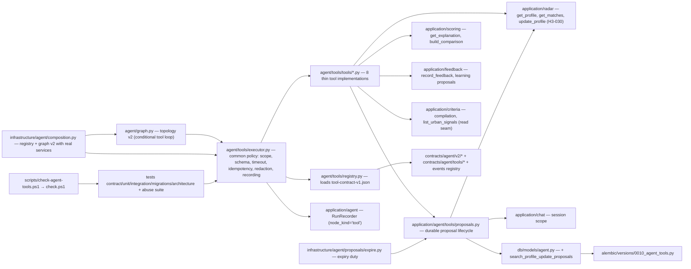

# Implementation Plan: Tools explicitas y permisos

**Branch**: `main` | **Date**: 2026-08-09 | **Spec**: [spec.md](./spec.md)

**Input**: Feature specification for UM-H4-007 through UM-H4-016 (Epica
H4.2 - Tools explicitas y permisos), including the clarification sessions
2026-08-09: (1) proposals are durable and auditable objects with lifecycle
pending/approved/rejected, expiry and single use, kept while the account
exists; (2) every profile change requires explicit confirmation
(propose → confirm → apply; 0 direct applies); (3) `find_matches` is
strictly read-only, returning persisted items of the latest published run
with explicit state when none/stale; (4) stale proposals (profile changed
since the proposal's base version) are rejected by obsolescence with a typed
error; (5) H4.2 transitions are deterministic only — approved via apply,
rejected by obsolescence or expiry; interactive rejection/editing is H4.3;
(6) the chat feedback tool covers only like/dislike with optional reasons.

## Summary

Second increment of the conversational radar (H4): the explicit, permissioned
tool surface the H4.3 behavior/UI and H4.4 evals build on. Concretely:

- A versioned **tool contract** (`contracts/agent/tools/tool-contract-v1.json`)
  declaring the 8 tools with the common contract (identity, search scope,
  input/output schemas, timeout, idempotency, confirmation, output redaction,
  FR-001..FR-004) and a **tool registry + executor** in the `agent` layer
  that enforces it uniformly and records every invocation as an
  `agent_node_runs` row with `node_kind='tool'` (R-01).
- Agent contracts **v2** (state/topology/reply): `tool_calls` in state and
  reply, a bounded tool loop (`run_tools` node, `AGENT_TOOLS_MAX_CALLS_PER_TURN`
  = 5), v1 checkpoints declared incompatible with a typed error (R-02,
  R-14). No HTTP surface (FR-025).
- A durable **SearchProfileUpdateProposal** object: new table
  `search_profile_update_proposals` in migration `0010_agent_tools`,
  propose/apply tools with deterministic lifecycle, single-use + idempotency
  replay, obsolescence via `RadarService.update_profile`'s optimistic lock,
  expiry as a scheduler maintenance duty, and two new product events
  (R-03/R-04/R-05/R-09/R-11).
- Read/feedback tools as thin delegations to existing deterministic services:
  `get_search_profile` → radar/criteria; `find_matches` → radar
  (read-only, 0 recomputation); `explain_match` → scoring;
  `compare_listings` → scoring comparison; `record_feedback` → feedback
  (like/dislike only); `search_urban_context` (P1) → new read seam in
  criteria respecting geographic precision (R-06/R-07/R-08).
- A deterministic **abuse suite** (UM-H4-016) as the increment gate: cross
  access, manipulated args, prompt injection, oversized outputs, mutation
  without confirmation — no LLM involved (R-13).
- `scripts/check-agent-tools.ps1` registered in `check.ps1`;
  `infrastructure/agent/composition.py` for the test/harness stack;
  settings `AGENT_TOOLS_*` + `AGENT_PROPOSAL_TTL_HOURS` (R-10/R-12).

## Technical Context

**Language/Version**: Python `>=3.13,<3.14`; no web/TypeScript surface

**Primary Dependencies**: existing (SQLAlchemy 2, Psycopg 3, Alembic,
Pydantic v2, `langgraph` + `langgraph-checkpoint-postgres` from H4.1,
R-01 of H4.1). No new runtime dependencies: the tool registry/executor is
plain Python over existing application services (radar, scoring, feedback,
criteria, chat) and the H4.1 run-recording infrastructure.

**Storage**: Postgres. Migration `0010_agent_tools` creates
`search_profile_update_proposals` + enum `proposal_state`. No changes to
agent runtime tables (`agent_node_runs.node_kind` already includes `'tool'`,
R-10 of H4.1). LangGraph checkpoint tables stay library-managed/excluded.

**Testing**: pytest (contract conformance for tool contract + v2 schemas +
events; unit for registry, executor, proposals, each tool; integration with
testcontainers Postgres for the proposal lifecycle, obsolescence, replay and
isolation; migrations test for 0010; architecture), Ruff, mypy, import-linter
architecture tests, Alembic drift checks, `scripts/check-agent-tools.ps1`
registered in `check.ps1` (FR-024).

**Target Platform**: modular monolith; the tool surface is driven by tests,
the harness and the graph runtime — no HTTP surface in this increment
(FR-025; chat HTTP contracts are H4.3).

**Performance Goals**: a tool call completes within
`AGENT_TOOLS_TIMEOUT_SECONDS` (default 10); the full propose→apply lifecycle
and the abuse suite complete in seconds in CI. No provider latency involved
(the abuse suite and most unit paths run with `FakeModelGateway` or no
gateway at all).

**Constraints**: uniform contract enforcement for the 8 tools (FR-001..
FR-004); deny-by-default with search scope = session profile, 0 cross access
(FR-002); output redaction with forbidden keys and item caps (FR-003); every
tool invocation recorded as a tool run (FR-004); proposals durable with
base profile version, deterministic transitions only (FR-008/FR-009,
clarifications Q1/Q2); apply requires valid proposal + explicit confirmation
+ idempotency key, replay without duplicates, obsolescence rejection
(FR-010..FR-012, clarification Q4); `find_matches` strictly read-only
(FR-013/FR-014, clarification Q3); explanations grounded in persisted
evidence (FR-015/FR-016); comparison within scope, no generative winner
(FR-017/FR-018); feedback idempotent, like/dislike only (FR-019/FR-020,
clarification Q6); urban context versioned with precision respected
(FR-021); deterministic abuse suite as gate (FR-022/FR-023); harness in
`check.ps1`, 0 HTTP/UI (FR-024/FR-025).

**Scale/Scope**: beta cohort; 8 tools; one proposal per radar change flow;
TTL default 24h; bounded tool loop (5 calls/turn); one new table, four
contract JSON files (v2 × 3 + tool contract v1), additive events registry
update, one migration, one harness script.

## Constitution Check

*GATE: evaluated before Phase 0 and re-evaluated after Phase 1.*

| Principle | Before research | After design | Evidence |
| --- | --- | --- | --- |
| Persistent radar truth | PASS | PASS | Proposals are durable product objects with lifecycle (FR-008, R-03); 0 decisions live only in the chat; `pending_action` only references the durable proposal (R-02); every tool operates on persistent objects (Principle I). |
| Auditable deterministic matching | PASS | PASS | `find_matches` returns persisted items of the latest published run (FR-013, clarification Q3); `explain_match` reuses persisted evaluations (FR-015); comparison has no generative winner (FR-018); scoring/ranking stay in the deterministic engine (Principle II). |
| Layer boundaries | PASS | PASS | Tools are explicit contracts in the `agent` layer consuming application ports (radar/scoring/feedback/criteria/chat) via the executor; 0 free DB access; `agent/tools` never imports infrastructure; architecture tests enforce it (Principle III, R-01/R-06). |
| Data lineage and observability | PASS | PASS | Every tool invocation recorded in `agent_node_runs` (`node_kind='tool'`, same correlation); proposals trace to session/profile/base version and emit product events; outputs redacted with registry forbidden keys, 0 PII (FR-003/FR-004, R-09) (Principle V). |
| Versioned prompts, models and schemas | PASS | PASS | Tool contract v1 and state/topology/reply schemas v2 are versioned machine-checkable contracts; v1 artifacts remain audited; checkpoints v1 declared incompatible with typed error, 0 silent loss (R-02); runs record versions (Principle II/V). |
| Minimal verifiable scope | PASS | PASS | Scope is exactly UM-H4-007..UM-H4-016: no HTTP chat contracts, no web, no provider commitment, no intent compilation (H4.3), no evals/costs (H4.4); the graph gains only the bounded tool loop the tools require. |

There are no constitution violations requiring a complexity exception.

## Assumptions and Tradeoffs

- The tool execution seam is an explicit registry + executor in `agent/tools`
  (R-01); LangGraph's ToolNode is rejected (provider-coupled schemas, harder
  versioning/redaction). Intent compilation to `tool_calls` stays H4.3; the
  loop is testable now with scripted `tool_calls` from the gateway.
- Agent contracts v2 are additive files; v1 stays intact as audited version;
  v1 checkpoints are declared incompatible (typed `AgentStateIncompatible`),
  consistent with H4.1 FR-009 and the short checkpoint window (R-02).
- `apply_search_profile_update` delegates profile versioning + recomputation
  to `RadarService.update_profile` (H3-030 path): optimistic lock on
  `base_profile_version` IS the obsolescence check; no duplicated
  versioning/run logic (R-04).
- Idempotency of apply is anchored on the proposal's
  `applied_idempotency_key` with a partial unique index (R-05); replay with
  the same key returns the recorded result — no separate fingerprint table.
- Proposal lifecycle is deterministic (clarification Q2): approved only via
  apply; rejected only by obsolescence or expiry (maintenance duty,
  `AGENT_PROPOSAL_TTL_HOURS` default 24, R-11). Interactive
  rejection/editing is H4.3.
- `find_matches` is read-only (clarification Q3): 0 jobs triggered, 0
  computation; results depend on runs published by the existing machinery
  (profile edits already submit runs, H3-030).
- The chat feedback tool covers like/dislike with optional reasons only
  (clarification Q6); save/dismiss/contacted remain in the structured UI.
- Tool invocations emit no product events; their audit trail is
  `agent_node_runs` with `node_kind='tool'` (R-09, mirroring H4.1 R-07 for
  graph runs). Proposal creation/application emit the two new events
  (DoD #4).
- `search_urban_context` is P1 but included (backlog increment definition);
  it needs the small read seam `list_urban_signals` in application/criteria
  (R-08) — the repository port already exists.
- The events registry update is additive; version fields follow the actual
  file state at implementation time (today `contract_version "1"` with the
  chat types present). Conformance tests pin the accepted set.
- Redaction limits (max items per output, forbidden keys reuse) are
  settings/policy values (`AGENT_TOOLS_OUTPUT_MAX_ITEMS`, registry
  `forbidden_keys`), not spec-level promises beyond "0 PII / bounded".

Detailed decision records and rejected alternatives are in
[research.md](./research.md).

## Architecture



All arrows are dependency/use direction. `agent/tools` is the explicit
permissioned surface; `application/agent/tools` holds the durable proposal
service; tools delegate to existing application services; nothing in
`application` or `domain` imports langgraph (architecture test).

## Module, Interface and Seam Design

| Module | Public Interface | Adapters / consumers | Boundary rule |
| --- | --- | --- | --- |
| `contracts/agent/tools/tool-contract-v1.json` | 8 tool declarations (schema, flags, limits) | `agent/tools/registry.py`, conformance tests | Single source of truth for the tool surface (FR-001) |
| `agent/tools/registry.py` | `load_tool_contract(...) -> ToolContract`, `get_tool(name)`, `validate_args(tool, args)`, `apply_redaction(tool, output)` | executor, conformance tests | Contract-driven; unknown tools rejected |
| `agent/tools/executor.py` | `execute_tool(*, user_id, session_id, search_profile_id, tool, args, confirmation, idempotency_key) -> ToolResult` | `graph.py` (`run_tools`), abuse suite | Validates identity/scope/schema/timeout/idempotency/redaction; records one `NodeRun(node_kind='tool')` per call (FR-001..FR-004) |
| `agent/tools/tools/*.py` | 8 thin implementations delegating to application services | executor | 0 infra imports; 0 free DB access (R-06..R-08) |
| `application/agent/tools/proposals.py` | `propose(change, scope) -> Proposal`, `apply(proposal_id, confirmation, idempotency_key, scope) -> AppliedProposal`, `get(id, scope)`, `expire(ttl)` | tools, expiry duty | Durable lifecycle (pending/approved/rejected), single use, base version, obsolescence via radar optimistic lock; emits proposal events (R-03/R-04/R-05/R-11) |
| `application/criteria` | + `list_urban_signals(listing_id) -> signals` (read seam) | search_urban_context tool | Respects `_authorized_geometry`; 0 geometry beyond precision (R-08) |
| `agent/graph.py` (v2) | `build_topology_v2(gateway, conversation, recorder, saver, executor, clock, versions, reply_schema) -> AgentGraph` | runtime, composition, tests | Matches `graph-topology-v2.json`; conditional tool loop bounded (R-14) |
| `infrastructure/agent/composition.py` | `build_tool_registry(services)`, `build_agent_stack_v2(...)` | tests, harness | Real services wired; 0 HTTP (R-12, FR-025) |
| `infrastructure/agent/proposals/expire.py` | `expire_search_profile_proposals(ttl_hours) -> count` | `workers/scheduler.py` maintenance | Idempotent; never touches the profile (R-11) |
| `scripts/check-agent-tools.ps1` | pytest surfaces + contract conformance + abuse suite | `check.ps1` | Fails hard on any failure (FR-024) |

Do not introduce HTTP endpoints, web components, worker jobs for tools or
intent compilation in this increment (FR-025; H4.3). The graph is composed
for tests/harness via `infrastructure/agent/composition.py`; production
composition wiring starts in H4.3.

## Readiness and Failure Isolation

New critical dependency: none (Postgres + existing services). Failure
behavior:

- Tool timeout (`AGENT_TOOLS_TIMEOUT_SECONDS`): typed error in `tool_results`,
  the turn continues with a grounded reply; the tool run row records the
  failure (FR-004).
- Out-of-schema args / unknown tool: rejected before execution, typed error,
  0 effects (FR-002).
- Cross-user access (manipulated ids on any of the 8 tools): denied by the
  executor's scope check before any service call; abuse suite proves 100%
  denial (FR-002, FR-022).
- Apply on a stale proposal (`base_profile_version` != current): the radar
  optimistic lock raises `ConcurrencyConflict`; the proposal is marked
  `rejected('obsolete')` with a typed error; 0 effects (clarification Q4,
  R-04).
- Apply replay with the same idempotency key: partial unique index + service
  check return the recorded result; 0 duplicate versions/runs/events
  (FR-012, R-05).
- Expired proposals: the maintenance duty marks them `rejected('expired')`;
  apply also validates `expires_at` (double guard) (FR-009, R-11).
- A tool failing mid-turn: the turn does not fail wholesale — `tool_results`
  carries the typed error and the reply declares the failure; the run reaches
  a terminal state with error summary (FR-004).
- Model output with invalid `tool_calls`: rejected/retried bounded
  (`AGENT_MODEL_MAX_RETRIES`); 0 invalid calls reach the executor (FR-011).
- v1 checkpoint on resume: declared incompatible with
  `AgentStateIncompatible`; history remains intact (R-02).

## Configuration and Secret Boundary

No new secrets. New settings (flat env vars behind `Settings`, validated at
startup, safe defaults; registered in `_known_fields` + config tests):

- `AGENT_TOOLS_STATE_SCHEMA_VERSION` (2) — state schema version;
- `AGENT_TOOLS_TOPOLOGY_VERSION` (2) — topology version;
- `AGENT_TOOLS_CONTRACT_VERSION` (`v1`) — tool contract version;
- `AGENT_TOOLS_MAX_CALLS_PER_TURN` (5) — bounded tool loop;
- `AGENT_TOOLS_TIMEOUT_SECONDS` (10) — per-tool timeout;
- `AGENT_TOOLS_OUTPUT_MAX_ITEMS` (20) — redaction cap for list outputs;
- `AGENT_PROPOSAL_TTL_HOURS` (24) — proposal expiry window (R-10/R-11).

Tool outputs, tool run rows, event payloads and logs never contain free
conversation text, geometry beyond precision or forbidden keys from the
events registry (FR-003).

## Data and Migration Design

Migration `0010_agent_tools` creates one table (shape and validation rules
in [data-model.md](./data-model.md)):

1. `search_profile_update_proposals` — durable proposal: session + profile
   FKs, `base_profile_version`, `diff`/`impact` JSONB, `state`
   (`proposal_state`: pending/approved/rejected), `expires_at`,
   `applied_idempotency_key` (partial unique), `rejection_reason`
   (obsolete/expired), actor + audit mixin.

No changes to agent runtime tables: `agent_node_runs.node_kind` already
includes `'tool'` (0009, R-10 of H4.1); LangGraph checkpoint tables stay
library-managed and excluded from Alembic.

## Contracts

Planning contract: [agent tools contracts v1](./contracts/agent-tools-contracts-v1.md)

Machine-checkable files to add: `contracts/agent/tools/tool-contract-v1.json`,
`contracts/agent/v2/state-schema-v2.json`,
`contracts/agent/v2/graph-topology-v2.json`,
`contracts/agent/v2/reply-schema-v2.json`; additive update to
`contracts/events/v1/events-registry.json`
(`search_profile.update_proposed.v1`, `search_profile.update_applied.v1`).
No OpenAPI changes (FR-025). The `contracts/agent/v1/*` files remain
untouched (audited prior version, R-02).

## Job Idempotency and Recovery

No new RQ job type. New scheduler maintenance duty
`expire_search_profile_proposals` in `workers/scheduler.py` (recovery-first
order, next to `purge_agent_checkpoints`): marks pending proposals with
`expires_at` past as `rejected('expired')`; idempotent (running twice is a
no-op), never touches the profile (R-11).

Recovery: an apply interrupted after the profile was versioned but before
the proposal was marked approved is covered by replay with the same
idempotency key (R-05) — the service reconciles from the proposal row; the
partial unique index prevents double applies.

## Observability and Audit

Audit coverage:

| Operation | Durable evidence |
| --- | --- |
| proposal created | `search_profile_update_proposals` row + `search_profile.update_proposed.v1` event |
| proposal applied | proposal `approved` + profile version + run (H3-030) + `search_profile.update_applied.v1` event |
| proposal rejected (obsolete/expired) | proposal `rejected` + `rejection_reason` (typed) |
| tool invocation | `agent_node_runs` row with `node_kind='tool'`, status, latency, error_summary, same correlation |
| feedback from chat | `feedback_events` row + `feedback.recorded.v1` (existing) + optional learning proposal |
| expiry duty | scheduler log + report (ids/counts only) |

No new telemetry event types beyond the two proposal events; no PII in
payloads, tool results or run summaries (FR-003, FR-018).

## Delivery and Recovery Topology

No new deployment topology: no API, worker job or web artifacts. Migration
`0010` runs through the standard Alembic path; the new table falls under the
existing Postgres backup policy (H1.12); checkpoint tables remain
recreatable state. `scripts/check-agent-tools.ps1` is registered in
`check.ps1` with surface detection on `src\umbral\agent\tools` +
`tests\contract\test_agent_tools_contract.py`.

## Project Structure

### Documentation (this feature)

```text
specs/010-agent-tools/
├── spec.md
├── plan.md
├── research.md
├── data-model.md
├── quickstart.md
├── contracts/
│   └── agent-tools-contracts-v1.md
├── checklists/
│   └── requirements.md
└── tasks.md                    # created later by /speckit-tasks
```

### Source Code (repository root)

```text
contracts/
├── agent/tools/tool-contract-v1.json     # 8 tools, common contract (FR-001)
├── agent/v2/
│   ├── state-schema-v2.json              # + tool_calls/tool_results shapes (R-02)
│   ├── graph-topology-v2.json            # conditional tool loop, tools list
│   └── reply-schema-v2.json              # + tool_calls (0..5)
└── events/v1/events-registry.json        # + update_proposed/update_applied
src/umbral/agent/tools/
├── registry.py                   # contract loading, arg validation, redaction
├── executor.py                   # common policy + tool run recording
└── tools/
    ├── get_search_profile.py
    ├── propose_search_profile_update.py
    ├── apply_search_profile_update.py
    ├── find_matches.py
    ├── explain_match.py
    ├── compare_listings.py
    ├── record_feedback.py
    └── search_urban_context.py
src/umbral/application/agent/tools/
├── contracts.py                 # Proposal, ProposalChange values + errors
├── ports.py                     # ProposalRepository, scope readers
└── proposals.py                 # propose/apply/get/expire lifecycle (R-03..R-05)
src/umbral/application/criteria/service.py   # + list_urban_signals (R-08)
src/umbral/infrastructure/agent/
├── composition.py               # build_tool_registry + stack v2 (R-12)
└── proposals/
    ├── repository.py            # SqlAlchemyProposalRepository
    └── expire.py                # expire_search_profile_proposals (R-11)
src/umbral/infrastructure/db/models/agent.py  # + SearchProfileUpdateProposalRow
src/umbral/infrastructure/db/repositories/agent.py  # + proposal repo
alembic/versions/0010_agent_tools.py
workers/scheduler.py             # + expire_search_profile_proposals duty
scripts/check-agent-tools.ps1    # new harness surface
tests/
├── contract/
│   ├── test_agent_tools_contract.py
│   ├── test_agent_state_schema_v2.py
│   ├── test_agent_graph_topology_v2.py
│   ├── test_agent_reply_schema_v2.py
│   ├── test_agent_tool_events.py
│   └── test_agent_tools_harness.py
├── unit/agent/tools/
│   ├── test_registry.py
│   ├── test_executor.py
│   ├── test_propose.py
│   ├── test_apply.py
│   ├── test_find_matches.py
│   ├── test_explain_match.py
│   ├── test_compare_listings.py
│   ├── test_record_feedback.py
│   ├── test_search_urban_context.py
│   └── test_abuse_suite.py              # gate, deterministic (R-13)
├── unit/application/agent/tools/test_proposals.py
├── unit/infrastructure/agent/tools/test_expire.py
├── integration/agent/tools/
│   ├── test_proposal_lifecycle.py
│   ├── test_proposal_obsolescence.py
│   ├── test_proposal_replay.py
│   ├── test_tools_isolation.py
│   └── test_graph_tool_loop.py
├── migrations/test_0010_agent_tools.py
├── architecture/test_agent_boundaries.py    # extended: agent/tools layer
└── unit/config/test_agent_settings.py       # + AGENT_TOOLS_*, AGENT_PROPOSAL_TTL_HOURS
```

**Structure Decision**: keep the modular monolith layout. `agent/tools`
mirrors the accepted `agent` layer conventions (contract-driven registry
like the criteria concept registry, R-01); `application/agent/tools`
mirrors `application/<domain>` (contracts/ports/service); the proposal
repository mirrors `SqlAlchemy*Repository` adapters; the harness mirrors
`check-*.ps1` and is registered in `check.ps1` by surface detection.

## Planned Implementation Sequence

The later `/speckit-tasks` artifact must decompose these phases into
test-first, path-specific tasks. Each behavioral slice starts with the
failing contract/unit test named here, then the minimum implementation,
then the full gate.

### Phase A — Tool contract, registry and executor

- `contracts/agent/tools/tool-contract-v1.json` + loader
  (`infrastructure/agent/tools/contract_loader.py`, registry pattern);
  `agent/tools/registry.py` (validate_args, apply_redaction with registry
  forbidden keys + `AGENT_TOOLS_OUTPUT_MAX_ITEMS`).
- `agent/tools/executor.py`: scope check (user + session profile),
  schema validation, timeout, idempotency flags, confirmation flag,
  `NodeRun(node_kind='tool')` recording via the H4.1 `RunRecorder`.
- Settings `AGENT_TOOLS_*` + config tests.
- Tests: `tests/contract/test_agent_tools_contract.py`,
  `tests/unit/agent/tools/test_registry.py`,
  `tests/unit/agent/tools/test_executor.py`.
- Gate: FR-001..FR-004; SC-001.

### Phase B — Durable proposal lifecycle (propose/apply)

- Migration `0010_agent_tools` (table + enum) + model + repository.
- `application/agent/tools` contracts/ports/proposals.py: propose (diff
  validated against the profile/policy path of `RadarService.update_profile`,
  impact, base version, TTL), apply (validations + `update_profile(
  expected_version=base)`, single use, idempotency replay, obsolescence via
  `ConcurrencyConflict`), get (scoped), expire.
- `agent/tools/tools/propose_search_profile_update.py` +
  `apply_search_profile_update.py`; events
  `search_profile.update_proposed.v1` / `search_profile.update_applied.v1`
  + registry update.
- `infrastructure/agent/proposals/expire.py` + scheduler duty.
- Tests: `tests/unit/application/agent/tools/test_proposals.py`,
  `tests/integration/agent/tools/test_proposal_lifecycle.py`,
  `tests/integration/agent/tools/test_proposal_obsolescence.py`,
  `tests/integration/agent/tools/test_proposal_replay.py`,
  `tests/unit/infrastructure/agent/tools/test_expire.py`,
  `tests/migrations/test_0010_agent_tools.py`,
  `tests/contract/test_agent_tool_events.py`.
- Gate: FR-007..FR-012; SC-003, SC-004.

### Phase C — Read/explain tools

- `get_search_profile` (radar get_profile + criteria latest_compilation +
  state), `find_matches` (radar get_matches, read-only, explicit empty/stale
  state), `explain_match` (scoring get_explanation), `compare_listings`
  (scoring build_comparison, scope + limit).
- Tests: `tests/unit/agent/tools/test_get_search_profile.py` (inside
  test_find_matches/test_explain_match/test_compare_listings per tool),
  `tests/integration/agent/tools/test_tools_isolation.py` (cross access).
- Gate: FR-005, FR-006, FR-013..FR-018; SC-002, SC-005, SC-006.

### Phase D — Feedback and urban context tools

- `record_feedback` (feedback service, like/dislike + reason_keys +
  idempotency_key, learning proposal in result, out-of-contract types
  rejected) and `search_urban_context` (P1) + the `list_urban_signals` read
  seam in `application/criteria`.
- Tests: `tests/unit/agent/tools/test_record_feedback.py`,
  `tests/unit/agent/tools/test_search_urban_context.py`.
- Gate: FR-019..FR-021; SC-007, SC-008.

### Phase E — Topology v2 and composition

- `contracts/agent/v2/*` (state/topology/reply) + `agent/graph.py`
  `build_topology_v2` with the conditional tool loop (`run_tools`),
  `AGENT_TOOLS_MAX_CALLS_PER_TURN` bound, v1 checkpoints declared
  incompatible; `infrastructure/agent/composition.py`.
- Tests: `tests/contract/test_agent_state_schema_v2.py`,
  `tests/contract/test_agent_graph_topology_v2.py`,
  `tests/contract/test_agent_reply_schema_v2.py`,
  `tests/integration/agent/tools/test_graph_tool_loop.py`.
- Gate: FR-004 (recording via loop), FR-005; SC-001.

### Phase F — Abuse suite, harness and closure

- `tests/unit/agent/tools/test_abuse_suite.py` (deterministic gate:
  cross access, manipulated args, injection, oversized outputs, mutation
  without confirmation) + `tests/architecture/test_agent_boundaries.py`
  extension (agent/tools consumes only application ports).
- `scripts/check-agent-tools.ps1` + registration in `check.ps1`;
  `tests/contract/test_agent_tools_harness.py`.
- Run every quickstart scenario and `.\scripts\check.ps1` from a clean
  checkout; record evidence in
  `docs/runbooks/evidence/agent-tools-acceptance.md`; update quickstart.
- Gate: FR-022..FR-025; SC-009, SC-010.

## Verification Commands

Target commands after implementation:

```powershell
uv sync --frozen --all-groups
uv run ruff format --check .
uv run ruff check .
uv run mypy src tests
uv run pytest
uv run alembic current --check-heads
uv run pytest tests/contract/test_agent_tools_contract.py tests/contract/test_agent_state_schema_v2.py tests/contract/test_agent_graph_topology_v2.py tests/contract/test_agent_reply_schema_v2.py tests/contract/test_agent_tool_events.py tests/contract/test_agent_tools_harness.py tests/unit/agent/tools tests/unit/application/agent/tools tests/unit/infrastructure/agent/tools tests/integration/agent/tools tests/migrations/test_0010_agent_tools.py tests/architecture/test_agent_boundaries.py tests/unit/config/test_agent_settings.py
.\scripts\check-agent-tools.ps1
.\scripts\check.ps1
```

No success claim is based only on a mock or a skipped surface: the proposal
lifecycle, obsolescence and replay proofs run against the real Postgres
(testcontainers) with the partial unique index; the abuse suite is fully
deterministic (no LLM); the tool loop runs against the real graph with the
Postgres checkpointer; migration 0010 is verified up and down.

## Backlog and Requirement Traceability

| Backlog item | Plan ownership | Primary evidence |
| --- | --- | --- |
| UM-H4-007 contrato y politica comun | Phase A + E | tool contract + registry + executor + harness (FR-001..FR-004, SC-001) |
| UM-H4-008 get_search_profile | Phase C | tool + isolation tests (FR-005/FR-006, SC-002) |
| UM-H4-009 propose_search_profile_update | Phase B | proposals service + propose tool + events (FR-007..FR-009, SC-003) |
| UM-H4-010 apply_search_profile_update | Phase B | apply tool + obsolescence/replay integration (FR-010..FR-012, SC-004) |
| UM-H4-011 find_matches | Phase C | tool + read-only empty/stale state (FR-013/FR-014, SC-005) |
| UM-H4-012 explain_match | Phase C | tool over persisted evaluations (FR-015/FR-016, SC-005) |
| UM-H4-013 compare_listings | Phase C | tool + scope/limit validation (FR-017/FR-018, SC-006) |
| UM-H4-014 record_feedback | Phase D | tool + idempotency/learning tests (FR-019/FR-020, SC-007) |
| UM-H4-015 search_urban_context | Phase D | tool + criteria read seam (FR-021, SC-008) |
| UM-H4-016 aislamiento y abuso | Phase F | abuse suite + architecture + harness (FR-022/FR-023, SC-009) |
| Transversal (todos) | Phase A + F | harness + architecture + events (FR-024/FR-025, SC-010) |

Every FR maps through these rows to at least one automated check. `tasks.md`
must preserve these mappings rather than regrouping cross-cutting checks
away from their story.

## Complexity Tracking

No constitution violation is present. The only deliberate additions beyond a
naive pass are: (a) the versioned tool contract + registry + executor —
required by FR-001..FR-004 and the constitution (explicit permissioned
tools), with LangGraph ToolNode and direct-service-calls rejected in R-01;
(b) agent contracts v2 with the bounded tool loop — the minimal seam H4.3
needs and the only way to prove E2E tool execution, with in-place v1
mutation rejected in R-02; (c) the durable proposal table with base version
and partial unique idempotency — required by clarifications Q1/Q4/Q5 and
FR-008/FR-010/FR-012, with checkpoint-only and fingerprint-table
alternatives rejected in R-03/R-05; (d) apply delegating to the radar
optimistic lock — zero duplicated versioning logic, rebase rejected in R-04;
(e) the expiry maintenance duty — required by clarification Q2, with
lazy-only expiry rejected in R-11; (f) the deterministic abuse suite as
gate — required by FR-022/FR-023, with LLM evals deferred to H4.4 in R-13.
All have simpler rejected alternatives documented that would violate the
spec or the constitution.
