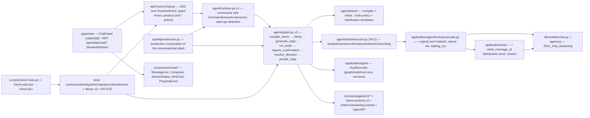

# Implementation Plan: Comportamiento conversacional y UI

**Branch**: `main` | **Date**: 2026-08-10 | **Spec**: [spec.md](./spec.md)

**Input**: Feature specification for UM-H4-017 through UM-H4-025 (Epica
H4.3 - Comportamiento conversacional y UI), including the clarification
sessions 2026-08-10: (1) creation of searches from the chat is OUT of
scope — no active radar leads to a grounded redirect to structured
onboarding (H2.5); (2) editing a pending proposal creates a NEW derived
proposal and the original transitions to `rejected('edited')` (0 rewrites,
single use and full traceability preserved); (3) the chat lives as a single
panel integrated in the radar page — it resumes the latest session of the
radar or creates one, and allows starting a new conversation from the same
panel; 0 dedicated routes and 0 session picker.

## Summary

Third increment of the conversational radar (H4): intent compilation,
clarifications, human-in-the-loop, grounded replies, chat streaming
contracts and the web chat UI. Concretely:

- Agent contracts **v3** (`state/topology/reply`) + **intent schema v3**
  with a deterministic intent→allowed-tools policy; `compile_intent` node
  at graph start; v2 checkpoints declared incompatible (R-01/R-02).
- Clarification loop in state with deterministic question templates and a
  bounded rounds policy (`AGENT_CLARIFICATION_*`) (R-03).
- HITL via LangGraph `interrupt` + `Command(resume)`: proposal decisions
  are explicit API operations (approve/reject/edit) resuming the SAME run;
  interactive reject (`rejected('user')` + note) and edit (derived proposal,
  `rejected('edited')` + `superseded_by_proposal_id`) on the durable
  proposal (R-04/R-05).
- Streaming contracts: new `api/routers/chat.py` (sessions, messages SSE,
  resume SSE, decision SSE, history cursor, update-proposals list),
  typed errors, `product.chat.*` access actions, SSE over `RuntimeEvent`
  with deterministic reply chunking; idempotent send via
  `chat_messages.client_message_id` (R-06/R-07/R-08).
- Production composition of the conversational runtime in
  `api/dependencies.py` (closes the H4.1 deferred item) verified by an
  API-level E2E test over the full flow (R-10).
- Web chat: `ChatPanel` (single panel in the radar page, Q3), message
  list/scroller with jump-to-latest, composer (Enter/Shift+Enter), stream
  status with live regions, mini-cards and proposal cards driving the
  decision endpoint; BFF route handlers + `forwardStream`; reconnection
  via resume with 0 duplicates; first-fragment/error telemetry (R-11..R-15).
- 0 new product events; audit in rows + runs (R-16). Migration
  `0011_chat_streaming` alters two tables (R-05/R-06). Harness:
  `scripts/check-chat.ps1` registered in `check.ps1` (FR-041).

## Technical Context

**Language/Version**: Python `>=3.13,<3.14`; TypeScript/React on
`apps/web` (Next.js App Router, shadcn/ui vega style, Tailwind v4,
TanStack Query present but unused in pages).

**Primary Dependencies**: existing (SQLAlchemy 2, Psycopg 3, Alembic,
Pydantic v2, `langgraph>=1.2.10` + `langgraph-checkpoint-postgres` with
`interrupt`/`Command` support, H4.1 runtime, H4.2 tools/executor/proposals,
radar/scoring/feedback/criteria services). No new runtime dependencies:
SSE is plain FastAPI `StreamingResponse`; the web side adds shadcn
primitives via the registry CLI and no new npm packages.

**Storage**: Postgres. Migration `0011_chat_streaming` alters
`chat_messages` (+ `client_message_id`, partial unique) and
`search_profile_update_proposals` (+ `rejection_note`,
`superseded_by_proposal_id`, extended `rejection_reason` if constrained).
LangGraph checkpoint tables stay library-managed/excluded.

**Testing**: pytest (contract conformance for v3 schemas, intent policy,
streaming events, chat HTTP; unit for intent compilation, clarification
policy, HITL resolution, proposals transitions, runtime resume, SSE
serialization; integration with testcontainers Postgres for the full
decision lifecycle, replay, idempotent send, isolation; migrations test
0011; API E2E via TestClient with the real composition and fake gateway;
architecture), Ruff, mypy, import-linter, Alembic drift checks; web: vitest
component tests for chat components, a11y tests, `api:check` for the
regenerated client; `scripts/check-chat.ps1` + `check-web.ps1` registered
in `check.ps1` (FR-041/FR-042).

**Target Platform**: modular monolith; the conversational runtime is now
wired into the API composition root and served through the web BFF. SSE
transport; no WebSockets (R-07).

**Performance Goals**: a chat turn streams its first fragment within
`AGENT_MODEL_TIMEOUT_SECONDS` + tool budget; the full propose→interrupt→
decision→apply lifecycle completes in seconds in CI (fake gateway); the web
measures first-fragment latency and stream errors (FR-043, R-15); budgets
are fixed in H6-017, not here.

**Constraints**: 9 backlog items with 43 FRs: intent compiled to allowed
actions with 0 SQL/ranking/mutations (FR-001..FR-005); clarifications for
high-impact params with bounded rounds (FR-006..FR-010); HITL on the same
checkpoint with 0 repeated effects, interactive reject/edit semantics from
clarification Q2 (FR-011..FR-016); grounded replies with validated refs
(FR-017..FR-020); typed streaming contracts with permissions (FR-021..
FR-025); accessible contextual panel, single entry point (FR-026..FR-030,
Q3); mini-cards + proposal cards persistent, banner parity (FR-031..
FR-034); reconnection/interruption states with 0 duplicates (FR-035..
FR-038); contextual entry in detail/comparator (FR-039/FR-040, P1);
harness + production composition + telemetry (FR-041..FR-043).

**Scale/Scope**: beta cohort; one chat panel per radar; bounded tool loop
(5 calls/turn), clarification rounds (2), reply refs (10), chunks (8
words); one migration altering 2 tables; 4 new contract JSON files (v3 × 3
+ intent v3) + 1 streaming-events contract; ~7 new HTTP paths; one harness
script.

## Constitution Check

*GATE: evaluated before Phase 0 and re-evaluated after Phase 1.*

| Principle | Before research | After design | Evidence |
| --- | --- | --- | --- |
| Persistent radar truth | PASS | PASS | Chat is a panel over persistent sessions/messages; proposals stay durable with interactive transitions and edit chain (R-05); mini-cards render persistent listings; 0 decisions live only in the chat (Principle I). |
| Auditable deterministic matching | PASS | PASS | Intent compiled to allowed tools with deterministic policy enforcement (R-02); refs validated against scope at persist (R-14); ranking/scoring stay in the engine; HITL decisions are explicit operations, 0 LLM-parsed mutations (R-04) (Principle II). |
| Layer boundaries | PASS | PASS | `agent` v3 consumes application ports; the chat router translates errors only; web touches only the BFF; architecture tests keep `application`/`domain` free of langgraph/FastAPI (Principle III). |
| Data lineage and observability | PASS | PASS | Decisions/rejections audited in proposal rows + node/graph runs with correlation (R-16); rejection notes never leak to events/redaction (R-05); first-fragment/stream-error telemetry with safe fields (R-15) (Principle V). |
| Versioned prompts, models and schemas | PASS | PASS | Contracts v3 + intent schema v3 machine-checkable; v2 checkpoints declared incompatible with typed error (R-01); prompt versions for intent/reply (R-02); streaming events contract versioned (R-07) (Principle II/V). |
| Minimal verifiable scope | PASS | PASS | Exactly UM-H4-017..UM-H4-025 + the deferred production composition (FR-042); 0 creation flows (Q1), 0 notification/proactivity (H5), 0 evals (H4.4); SSE over the existing runtime, 0 WebSockets, 0 new product events (R-07/R-16). |

There are no constitution violations requiring a complexity exception.

## Assumptions and Tradeoffs

- The intent→tools policy is enforced in code, not prompt (R-02): the
  model may only emit `tool_calls` allowed for the compiled intent; this is
  the deterministic guardrail behind FR-002 and extends the H4.2 abuse
  suite without regressions.
- Clarifications live in checkpoint state with deterministic templates
  (R-03): no new interrupt machinery; each user message is a new turn and
  the answer integrates on the following turn (H4.1 semantics). The rounds
  budget prevents loops.
- HITL decisions are explicit contract operations (R-04): free-text
  approval parsing is rejected for determinism and security; while a
  decision is pending the composer is replaced by the proposal card and
  sends return `chat.decision_pending`.
- Edit = derived proposal (clarification Q2, R-05): the original row is
  never rewritten; `superseded_by_proposal_id` keeps the chain auditable;
  derived proposals emit the existing `update_proposed` event and require a
  fresh confirmation (new interrupt).
- Streaming is SSE over `RuntimeEvent` with deterministic word-boundary
  chunking (R-07): the provider is request/response (H4.1); true token
  streaming is deferred to the provider ADR (H4.4). The event contract is
  provider-agnostic.
- The waiting window for a HITL decision equals the proposal TTL
  (`AGENT_PROPOSAL_TTL_HOURS`, H4.2): the interrupted run and the pending
  proposal expire together; the resume paths reconcile with typed errors.
- Message send idempotency anchors on `chat_messages.client_message_id`
  with a partial unique index (R-06), mirroring H4.2/H3.3 patterns; no
  fingerprint table.
- The web keeps its manual-fetch convention (R-11): TanStack Query stays
  inert; the chat hook owns SSE parsing, dedupe and resume.
- Production composition (R-10) wires the stack in `api/dependencies.py`;
  the API E2E test proves the full HTTP flow with testcontainers + fake
  gateway; real provider behavior remains behind the managed gateway
  (H4.1) and the provider ADR (H4.4).
- The update-proposals list returns `session_id` + `waiting_run_id` so the
  radar banner and the chat panel share the SAME decision surface (R-09).
- 0 new product events (R-16): interactive transitions are row + run
  audit, consistent with H4.2 R-09.

Detailed decision records and rejected alternatives are in
[research.md](./research.md).

## Architecture



All arrows are dependency/use direction. `agent/*` v3 stays a thin
conversational layer over application ports; `application` and `domain`
never import langgraph/FastAPI/SSE (architecture tests); the web only
reaches the private API through the BFF.

## Module, Interface and Seam Design

| Module | Public Interface | Adapters / consumers | Boundary rule |
| --- | --- | --- | --- |
| `contracts/agent/v3/*.json` + `intent-schema-v3.json` | state/topology/reply/intent contracts | graph v3, conformance tests | Single source of truth for the v3 surface (FR-001/FR-005) |
| `contracts/chat/v1/streaming-events-v1.json` | SSE event types + payloads | chat router, web hook, conformance tests | Wire contract of the streaming surface (R-07) |
| `agent/intent/compiler.py` | `compile(message, profile_snapshot) -> IntentCompilation` | graph v3 (`compile_intent`), tests | Structured output via gateway; policy `allowed_tools` enforced downstream (R-02) |
| `agent/intent/policy.py` | `validate_tool_calls(intent, calls) -> list[Violation]` | `run_tools` v3, abuse suite | Deterministic: violations → typed error, 0 execution (R-02) |
| `agent/intent/clarification.py` | `decide(params, profile, rounds) -> ClarificationPlan`, `render_question(plan)` | graph v3 (`clarify`), tests | Deterministic templates; bounded rounds (R-03) |
| `agent/runtime.py` (v3) | `run_turn(..., decision=None)`, resume with `Command(resume=...)`, interrupt detection + `InterruptWaiting` event | chat router, tests | Claims per session; 0 parallel; interrupts surfaced, never swallowed (R-04) |
| `agent/graph.py` (v3) | `build_topology_v3(...)` matching `graph-topology-v3.json` | runtime, composition, tests | compile_intent/clarify/require_confirmation/resolve_decision nodes (R-01) |
| `application/agent/tools/proposals.py` | + `reject(proposal_id, reason, note, scope)`, `derive(proposal_id, change, scope)`, `list(profile_id, state, scope)`, `waiting_run(proposal_id)` | resolve_decision, router list, banner | Interactive transitions + edit chain; 0 mutation of originals (R-05/R-09) |
| `application/chat/service.py` | `append_user_message(..., client_message_id=None)` idempotent replay; `list_sessions(profile_id)` | chat router, panel | Partial unique index enforces replay (R-06/R-08) |
| `api/routers/chat.py` | 7 endpoints (SSE + JSON), `_problem_for(ChatError|AgentError)` | BFF, OpenAPI export, tests | 0 business logic; access actions `product.chat.*` (R-08) |
| `api/dependencies.py` | + conversational stack (gateway, saver, executor, graph v3, runtime) | app composition root, E2E tests | Closes H4.1 deferred item (R-10, FR-042) |
| `lib/chat/client.ts` + `use-chat-stream.ts` (web) | sessions/history/send/resume/decision + state hook (SSE, dedupe, states) | ChatPanel | 0 direct private-API calls (R-11/R-13) |
| `components/chat/*` (web) | ChatPanel, MessageList, MessageItem, Composer, StreamStatus, MiniCard, ProposalCard | radar/[id], listings/[id], compare | Q3 single panel; keyboard + screen reader (R-11) |
| `src/app/api/radar/chat/*` (web BFF) | route handlers + `forwardStream` | browser client | Proxies 1:1; SSE piped un-buffered (R-12) |
| `scripts/check-chat.ps1` | pytest surfaces + conformance + abuse v3 + API E2E | `check.ps1` | Fails hard on any failure (FR-041) |

No creation flows (Q1), no notifications (H5), no evals (H4.4), no
WebSockets (R-07) in this increment.

## Readiness and Failure Isolation

New critical dependency: none (Postgres + existing services + langgraph
interrupt support, already in the pinned version). Failure behavior:

- Tool call outside the intent policy: rejected deterministically in
  `run_tools` v3 (typed error in `tool_results`, 0 execution), the reply
  declares the limit; abuse suite v3 proves 100% enforcement (R-02).
- Low-confidence high-impact parameters: clarification fires before any
  proposal; rounds exhausted → grounded refusal + structured UI (R-03).
- Interrupt waiting: run `interrupted`, `chat.decision_pending` on new
  sends, decision endpoint resumes the same run; decision mismatched with
  the waiting proposal → `agent.decision_mismatch`, 0 effects (R-04).
- Proposal expired while waiting: apply/decision path validates
  `expires_at` (H4.2 double guard) and the maintenance duty closes the row;
  the resume surfaces the typed proposal error, 0 effects (R-05).
- Apply replay / decision replay with the same idempotency key: recorded
  result returned, 0 duplicate versions/runs/events (H4.2 R-05).
- Message send replay: `client_message_id` partial unique index returns the
  recorded message, 0 duplicate turns (R-06).
- Client disconnect mid-stream: SSE closes; resume re-claims the last
  interrupted run and re-emits remaining events; 0 partial messages
  persisted (H4.1), 0 duplicated effects (R-13).
- Ref not resolvable or foreign at persist: bounded retry, then the reply
  persists declaring missing evidence; 0 broken/foreign citations (R-14).
- v2 checkpoint on resume: `AgentStateIncompatible` typed error, history
  intact (R-01).
- Model invalid output: rejected/retried bounded (H4.1); 0 invalid content
  reaches state.

## Configuration and Secret Boundary

No new secrets. New settings (flat env vars behind `Settings`, validated at
startup, safe defaults, registered in `_known_fields` + config tests):

- `AGENT_CHAT_STATE_SCHEMA_VERSION` (3) — v3 state schema;
- `AGENT_CHAT_TOPOLOGY_VERSION` (3) — v3 topology;
- `AGENT_INTENT_SCHEMA_VERSION` (`intent-v3`) — intent contract version;
- `AGENT_INTENT_PROMPT_VERSION` (`agent-intent-v1`) — intent prompt;
- `AGENT_REPLY_PROMPT_VERSION` (`agent-reply-v2`) — grounded reply prompt;
- `AGENT_CLARIFICATION_MIN_CONFIDENCE` (0.6) — clarification trigger;
- `AGENT_CLARIFICATION_MAX_ROUNDS` (2) — clarification budget;
- `AGENT_REPLY_MAX_REFS` (10) — grounded ref cap per reply;
- `AGENT_REPLY_CHUNK_WORDS` (8) — deterministic reply chunking.

Stream payloads, event data, run summaries and logs never contain free
conversation text, rejection notes, geometry beyond precision or forbidden
keys (events registry); the web telemetry emits only safe fields (R-15).

## Data and Migration Design

Migration `0011_chat_streaming` alters two tables (shapes and validation
rules in [data-model.md](./data-model.md)):

1. `chat_messages` — + `client_message_id` (UUID nullable) with partial
   unique `uq_chat_messages_session_client (session_id,
   client_message_id) WHERE client_message_id IS NOT NULL` (idempotent
   send, R-06).
2. `search_profile_update_proposals` — + `rejection_note` (string nullable,
   <=200), + `superseded_by_proposal_id` (FK self, nullable) with
   `ix_proposals_superseded_by`; `rejection_reason` domain extended to
   `{obsolete, expired, user, edited}` (DDL only if the column is
   constrained; R-05).

LangGraph checkpoint tables stay library-managed and excluded from Alembic
(H4.1 R-03). The v3 intent/clarification/interrupt state lives in
checkpoints (operational), never in app tables (principle I).

## Contracts

Planning contract: [chat streaming contracts v1](./contracts/chat-streaming-contracts-v1.md)

Machine-checkable files to add: `contracts/agent/v3/state-schema-v3.json`,
`contracts/agent/v3/graph-topology-v3.json`,
`contracts/agent/v3/reply-schema-v3.json`,
`contracts/agent/v3/intent-schema-v3.json`,
`contracts/chat/v1/streaming-events-v1.json`; additive OpenAPI update
(chat paths, update-proposals path, schemas, Problem responses). 0 changes
to `contracts/events/v1/events-registry.json` (R-16). The v1/v2 agent
contract files remain untouched (audited prior versions, R-01).

## Job Idempotency and Recovery

No new RQ job type and no new scheduler duty: proposal expiry and
checkpoint purge already run (`scheduler_once`, H4.2/H4.1). Recovery paths:

- A decision applied after profile versioning but before the run
  completed: replay with the same idempotency key reconciles from the
  proposal row (H4.2 R-05); the partial unique index prevents double
  applies.
- A resume interrupted again mid-stream: the run keeps its claim; resume
  re-attaches and re-emits remaining events (R-13).
- An interrupt whose proposal expired while the client was offline: the
  decision path returns the typed proposal error and the row is closed by
  the maintenance duty; the UI surfaces the expired proposal and offers a
  new refine (R-05).

## Observability and Audit

Audit coverage:

| Operation | Durable evidence |
| --- | --- |
| intent compiled | graph run (schema/prompt versions, intent, confidence, clarification decision) |
| clarification asked/answered | graph run + message rows (question/answer), rounds in checkpoint |
| proposal decision (approve) | proposal `approved` + apply path (H4.2) + run resume recorded |
| proposal rejected by user | proposal `rejected('user')` + `rejection_note` + run |
| proposal edited | original `rejected('edited')` + `superseded_by_proposal_id` + derived `pending` + `update_proposed.v1` event |
| message send (replay) | `chat_messages` row + `chat.message_created.v1` once |
| chat HTTP operation | access log (authorize), request/correlation headers |
| web first-fragment / stream error | telemetry events (safe fields, R-15) |

No new telemetry event types on the backend; no PII in payloads, run
summaries or logs (FR-003, R-05/R-15/R-16).

## Delivery and Recovery Topology

The API gains the conversational runtime in its composition root (R-10):
the `api` service now owns the gateway + checkpointer + graph v3 +
runtime; `web` serves the chat through the BFF with un-buffered SSE; the
`worker`/`scheduler` services keep the existing purge/expire duties. No new
services or ports; migration `0011` runs through the standard Alembic path;
Postgres backup policy unchanged (H1.12); checkpoint tables remain
recreatable state. `scripts/check-chat.ps1` is registered in `check.ps1`
with surface detection on `src\umbral\api\routers\chat.py` +
`tests\contract\test_chat_streaming_contract.py`.

## Project Structure

### Documentation (this feature)

```text
specs/011-conversational-ui/
├── spec.md
├── plan.md
├── research.md
├── data-model.md
├── quickstart.md
├── contracts/
│   └── chat-streaming-contracts-v1.md
├── checklists/
│   └── requirements.md
└── tasks.md                    # created later by /speckit-tasks
```

### Source Code (repository root)

```text
contracts/
├── agent/v3/
│   ├── state-schema-v3.json              # + intent/clarification/pending_action
│   ├── graph-topology-v3.json            # compile_intent/clarify/HITL nodes, interrupts
│   ├── reply-schema-v3.json              # refs entity enum + cap
│   └── intent-schema-v3.json             # intents, parameters, allowed_tools policy
├── chat/v1/streaming-events-v1.json      # SSE event types + payloads
└── openapi/v1/openapi.json               # + chat paths (additive, re-exported)
src/umbral/agent/
├── intent/compiler.py        # structured intent output (prompt agent-intent-v1)
├── intent/policy.py          # allowed_tools enforcement (deterministic)
├── intent/clarification.py   # trigger policy + deterministic question templates
├── graph.py                  # v3 topology (compile_intent, clarify, require_confirmation, resolve_decision)
├── runtime.py                # v3: interrupt detection, Command(resume), decision param
└── events.py                 # + InterruptWaiting event
src/umbral/application/agent/tools/
├── contracts.py              # + ProposalRejectionReason user/edited, ProposalSummary
├── ports.py                  # + list/waiting_run ports
└── proposals.py              # + reject, derive, list, waiting_run (R-05/R-09)
src/umbral/application/chat/
├── contracts.py              # + context on user message content
├── ports.py                  # + list_sessions
└── service.py                # + client_message_id idempotent send, list_sessions
src/umbral/api/
├── dependencies.py           # + conversational stack composition (R-10)
└── routers/chat.py           # sessions/messages/resume/decision + update-proposals list
src/umbral/domain/identity/policy.py      # + product.chat.* actions
src/umbral/infrastructure/db/models/chat.py       # + client_message_id
src/umbral/infrastructure/db/models/agent.py      # + rejection_note, superseded_by_proposal_id
alembic/versions/0011_chat_streaming.py
apps/web/src/
├── lib/chat/client.ts        # chatApi (sessions/history/send/resume/decision)
├── lib/chat/use-chat-stream.ts  # SSE hook: states, dedupe, resume (R-11/R-13)
├── lib/radar/server.ts       # + forwardStream (un-buffered SSE proxy)
├── components/chat/
│   ├── chat-panel.tsx        # single panel, Q3
│   ├── message-list.tsx      # scroller, jump-to-latest, pagination
│   ├── message-item.tsx      # bubble per role, refs → MiniCard
│   ├── composer.tsx          # Enter/Shift+Enter, states
│   ├── stream-status.tsx     # live region states
│   ├── mini-card.tsx         # listing ref → radar/detail link
│   └── proposal-card.tsx     # diff + approve/edit/reject → decision
├── components/radar/proposal-banner.tsx  # + agent update-proposals parity (FR-033)
└── app/api/radar/chat/**/route.ts        # BFF: sessions, messages, resume, decision
scripts/check-chat.ps1        # new harness surface
tests/
├── contract/
│   ├── test_agent_state_schema_v3.py
│   ├── test_agent_graph_topology_v3.py
│   ├── test_agent_reply_schema_v3.py
│   ├── test_agent_intent_schema_v3.py
│   ├── test_chat_streaming_contract.py
│   └── test_chat_http_contract.py
├── unit/agent/
│   ├── intent/test_compiler.py, test_policy.py, test_clarification.py
│   ├── test_runtime_v3.py    # interrupts + resume
│   └── test_abuse_suite_v3.py
├── unit/application/agent/tools/test_proposal_transitions.py
├── unit/application/chat/test_message_idempotency.py
├── integration/chat/
│   ├── test_hitl_lifecycle.py    # propose → interrupt → approve/reject/edit
│   ├── test_edit_chain.py
│   ├── test_send_replay.py
│   └── test_streaming_router.py  # SSE over TestClient
├── integration/api/test_chat_e2e.py    # real composition + fake gateway (R-10)
├── migrations/test_0011_chat_streaming.py
├── architecture/test_agent_boundaries.py   # extended: v3 layer + api router
└── unit/config/test_agent_settings.py      # + AGENT_CHAT_*/AGENT_CLARIFICATION_*...
apps/web/src/**/*.test.tsx     # vitest: chat-panel, message-list, composer, proposal-card
```

**Structure Decision**: keep the modular monolith layout. `agent/intent`
mirrors the contract-driven pattern of `agent/tools` (H4.2); the chat
router mirrors `api/routers/*` with `_problem_for`; the web chat follows
the `components/radar` + `lib/radar` conventions; the BFF mirrors the
existing `/api/radar/*` handlers; the harness mirrors `check-*.ps1` and is
registered by surface detection.

## Planned Implementation Sequence

The later `/speckit-tasks` artifact must decompose these phases into
test-first, path-specific tasks. Each behavioral slice starts with the
failing contract/unit test named here, then the minimum implementation,
then the full gate.

### Phase A — Contracts v3, intent compilation and clarification

- `contracts/agent/v3/*` + `intent-schema-v3.json`; `agent/intent/`
  (compiler, policy, clarification templates); `compile_intent` and
  `clarify` nodes in graph v3; settings `AGENT_CHAT_*`,
  `AGENT_INTENT_*`, `AGENT_CLARIFICATION_*`.
- Tests: `test_agent_state_schema_v3.py`, `test_agent_graph_topology_v3.py`,
  `test_agent_intent_schema_v3.py`, `test_compiler.py`, `test_policy.py`,
  `test_clarification.py`.
- Gate: FR-001..FR-005 (intent), FR-006..FR-010; SC-001, SC-002.

### Phase B — HITL: interrupts, decision resolution, proposal transitions

- Migration `0011_chat_streaming` (proposal columns); proposals service
  `reject`/`derive`/`list`/`waiting_run`; graph nodes
  `require_confirmation` (interrupt) and `resolve_decision`; runtime v3
  (`Command(resume=...)`, interrupt detection, `InterruptWaiting` event);
  `pending_action` cross-check.
- Tests: `test_runtime_v3.py`, `test_proposal_transitions.py`,
  `test_hitl_lifecycle.py`, `test_edit_chain.py`,
  `tests/migrations/test_0011_chat_streaming.py`.
- Gate: FR-011..FR-016; SC-003.

### Phase C — Grounded replies

- `reply-schema-v3` refs entity enum + cap; `persist_reply` v3 resolves
  refs against the session scope (bounded retry + missing-evidence
  declaration); reply prompt `agent-reply-v2`; `AGENT_REPLY_MAX_REFS`.
- Tests: contract reply v3, unit ref validation, integration grounded
  cases (missing data, foreign ref).
- Gate: FR-017..FR-020; SC-004.

### Phase D — Chat streaming HTTP contract

- `api/routers/chat.py` (7 endpoints), `_problem_for` translations,
  `product.chat.*` actions in policy.py, `chat_messages.client_message_id`
  + idempotent send + `list_sessions`, `streaming-events-v1.json`, SSE
  serialization over `RuntimeEvent`, OpenAPI re-export + client regen.
- Tests: `test_chat_streaming_contract.py`, `test_chat_http_contract.py`,
  `test_message_idempotency.py`, `test_streaming_router.py`,
  access/isolation cases (manipulated ids).
- Gate: FR-021..FR-025; SC-005.

### Phase E — Reply chunking and production composition

- Deterministic reply chunking (`AGENT_REPLY_CHUNK_WORDS`);
  `api/dependencies.py` conversational stack (R-10);
  `tests/integration/api/test_chat_e2e.py` full HTTP flow.
- Gate: FR-042; SC-010 (composition leg).

### Phase F — Web chat panel

- `lib/chat/*`, `components/chat/*` (panel, list, item, composer,
  stream-status), BFF routes + `forwardStream`, shadcn primitives via
  registry; vitest component tests (keyboard, roles, live regions).
- Gate: FR-026..FR-030; SC-006.

### Phase G — Mini-cards, proposal cards and banner parity

- `MiniCard` (listing refs → detail links), `ProposalCard` (diff +
  approve/edit/reject), `update-proposals` list endpoint consumption in
  `ProposalBanner` (FR-033 parity, same decision surface).
- Tests: component tests + integration for the list endpoint.
- Gate: FR-031..FR-034; SC-007.

### Phase H — Reconnection, interruption and error states

- SSE reconnect + resume flow in the hook; states rendering
  (enviando/ejecutando/esperando confirmacion/reanudando/fallo/completado);
  retry idempotent; second-tab `execution_in_progress` handling;
  first-fragment/stream-error telemetry (FR-043).
- Tests: hook unit tests (fake stream), component tests.
- Gate: FR-035..FR-038; FR-043; SC-008.

### Phase I — Contextual entry in detail/comparator (P1)

- `context` on user message content; entry components in
  `listings/[id]` and `compare`; scope preservation + citations back to
  the correct view.
- Tests: unit (content contract), integration (context turn), web
  component tests.
- Gate: FR-039/FR-040; SC-009.

### Phase J — Abuse suite v3, harness and closure

- `test_abuse_suite_v3.py` (deterministic: intent policy violations,
  clarification bypass, decision abuse, send replay, cross access on chat
  endpoints, decision without waiting interrupt); architecture boundary
  extension; `scripts/check-chat.ps1` + registration in `check.ps1`;
  full `check.ps1` from a clean checkout; evidence in
  `docs/runbooks/evidence/conversational-ui-acceptance.md`.
- Gate: FR-041, FR-043; SC-010.

## Verification Commands

Target commands after implementation:

```powershell
uv sync --frozen --all-groups
uv run ruff format --check .
uv run ruff check .
uv run mypy src tests
uv run pytest
uv run alembic current --check-heads
uv run pytest tests/contract/test_agent_state_schema_v3.py tests/contract/test_agent_graph_topology_v3.py tests/contract/test_agent_reply_schema_v3.py tests/contract/test_agent_intent_schema_v3.py tests/contract/test_chat_streaming_contract.py tests/contract/test_chat_http_contract.py tests/unit/agent/intent tests/unit/agent/test_runtime_v3.py tests/unit/agent/test_abuse_suite_v3.py tests/unit/application/agent/tools/test_proposal_transitions.py tests/unit/application/chat/test_message_idempotency.py tests/integration/chat tests/integration/api/test_chat_e2e.py tests/migrations/test_0011_chat_streaming.py tests/architecture/test_agent_boundaries.py tests/unit/config/test_agent_settings.py
.\scripts\check-chat.ps1
npm --workspace @umbral/web run api:check
npm --workspace @umbral/web run lint
npm --workspace @umbral/web run typecheck
npm --workspace @umbral/web run test
.\scripts\check.ps1
```

No success claim is based only on a mock or a skipped surface: the HITL
lifecycle, edit chain, send replay and isolation run against the real
Postgres (testcontainers); the SSE streaming is exercised over the real
router (TestClient); the E2E boots the real composition with the fake
gateway; migration 0011 is verified up and down; the web chat is covered by
vitest component tests and the a11y e2e surface.

## Backlog and Requirement Traceability

| Backlog item | Plan ownership | Primary evidence |
| --- | --- | --- |
| UM-H4-017 compilar intencion | Phase A | intent contract + compiler + policy (FR-001..FR-005, SC-001) |
| UM-H4-018 aclaraciones alto impacto | Phase A | clarification policy + templates (FR-006..FR-010, SC-002) |
| UM-H4-019 human-in-the-loop | Phase B + D | interrupts + decision endpoint + transitions (FR-011..FR-016, SC-003) |
| UM-H4-020 respuestas grounded | Phase C | reply v3 + ref validation (FR-017..FR-020, SC-004) |
| UM-H4-021 contratos chat streaming | Phase D | chat router + SSE + errors + access (FR-021..FR-025, SC-005) |
| UM-H4-022 chat contextual accesible | Phase F | panel + components + a11y (FR-026..FR-030, SC-006) |
| UM-H4-023 acciones y mini-cards | Phase G | mini-cards + proposal cards + banner (FR-031..FR-034, SC-007) |
| UM-H4-024 reconexion e interrupcion | Phase H | resume + states + telemetry (FR-035..FR-038, FR-043, SC-008) |
| UM-H4-025 entrada contextual | Phase I | context content + entries (FR-039/FR-040, SC-009) |
| Transversal (todos) | Phase E + J | composition + harness + abuse v3 (FR-041..FR-043, SC-010) |

Every FR maps through these rows to at least one automated check. `tasks.md`
must preserve these mappings rather than regrouping cross-cutting checks
away from their story.

## Complexity Tracking

No constitution violation is present. The only deliberate additions beyond
a naive pass are: (a) the v3 contracts + intent schema with the
intent→tools policy — required by FR-001/FR-002 and the constitution, with
prompt-only tool selection and per-intent routing rejected in R-01/R-02;
(b) the clarification loop with deterministic templates — required by
FR-006..FR-010, with interrupt-based clarification and LLM-generated
questions rejected in R-03; (c) HITL via LangGraph interrupts with
explicit decision operations — required by FR-011..FR-016, with
free-text approval parsing rejected in R-04; (d) the derived-proposal edit
chain — required by clarification Q2 and FR-014, with in-place mutation
rejected in R-05; (e) SSE over RuntimeEvent with deterministic chunking —
required by FR-021/FR-026, with WebSockets and provider streaming rejected
in R-07; (f) idempotent send via `client_message_id` — required by FR-024,
with fingerprint tables rejected in R-06; (g) the production composition in
`api/dependencies.py` — required by FR-042 (deferred from H4.1), R-10; (h)
the web chat panel with its own SSE hook — required by Q3 and FR-026..
FR-030, with TanStack Query adoption and dedicated routes rejected in
R-11. All have simpler rejected alternatives documented that would violate
the spec or the constitution.
