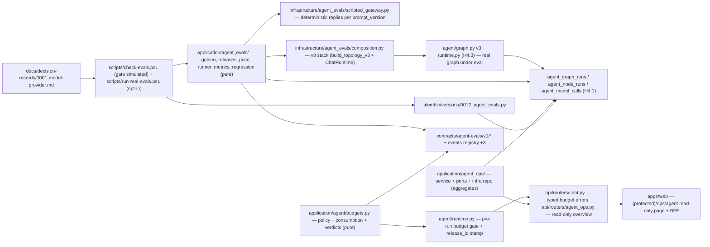

# Implementation Plan: Evals, costos y operacion del agente

**Branch**: `main` | **Date**: 2026-08-10 | **Spec**: [spec.md](./spec.md)

**Input**: Feature specification for UM-H4-026 through UM-H4-030 (Epica
H4.4 - Evals, costos y operacion), closing milestone `conversational-radar`
(UM-H4-001..UM-H4-030), plus the deferred ADR of model provider assigned to
H4.4 in the H4.1/H4.2/H4.3 acceptance notes. Clarifications 2026-08-10:
Q1 the ADR IS included as a deliverable wired to the harness; Q2 the eval
gate is strict on deterministic signals (tool selection, args, grounding,
confirmation, outcome — any deviation blocks, 0 tolerance, H3.4
convention) with policy thresholds for cost/latency; Q3 exhausted budgets
apply hard recoverable blocking (typed state, clear message, window or
explicit action, 0 model degradation); Q4 evals are hybrid — the harness/CI
gate runs a deterministic simulated adapter (reproducible, 0 cost), the
real provider runs in a separate scheduled cost-capped flow; Q5 the golden
dataset has >=3 curated cases per family (21 total, versioned and
expandable); Q6 release activation is hybrid — automatic for
code/topology/schema changes, explicit operator approval (with the eval
report as evidence) for prompt/model changes.

## Summary

Final increment of the conversational radar (H4). Concretely:

- Golden conversation dataset: `contracts/agent-evals/v1/conversations-golden-v1.json` (+ schema) with 21 curated cases (7 families x >=3), reviewed by product, 0 PII; pure parser in `application/agent_evals/golden.py` (R-01/R-02).
- Eval runner over the REAL v3 stack with a deterministic scripted gateway (per-`prompt_version` scripted replies, extending `FakeModelGateway`); per-case metrics derived from recorded runs (tool selection, args vs tool contract, grounding refs vs persisted evidence, confirmation compliance, outcome class) and cost = ModelCall tokens x price table of the release (R-03/R-04/R-05).
- Graph releases: append-only `contracts/agent-evals/v1/graph-releases-v1.json` (immutable entries, components versions, `affected_case_ids`, hybrid activation with `approved_by` for prompt/model changes); runs stamp `release_id` (new column); revert = new `reverted` entry, 0 run mutation (R-06).
- Regression gate strict on deterministic signals with policy thresholds for cost/latency; typed error `agent_evals.regression_blocked`; declared affected cases must match detected diff exactly (H3.4 convention) (R-07).
- Migration `0012_agent_evals`: `agent_eval_suites` + `agent_eval_case_results` + `agent_graph_runs.release_id`; closed inventory in `check-migrations.ps1` updated (R-08).
- Budgets and rate limits: pure logic in `application/agent/budgets.py`; consumption computed from recorded runs x price table (0 derived-state table); enforcement pre-run in `ChatRuntime` and per-user concurrency in the router; hard recoverable blocking (Q3); new events `agent.budget_warning.v1`, `agent.budget_exhausted.v1`, `agent.rate_limit_exceeded.v1` (R-09).
- Agent ops dashboard (P1): read-only internal endpoint `api/routers/agent_ops.py` (access action `product.agent_ops.read`) + minimal web page `(protected)/ops/agent`; aggregates from run/eval tables, 0 PII, `data_as_of` (R-10).
- ADR of model provider: `docs/decision-records/0001-model-provider.md` + `tests/contract/test_model_provider_adr.py` (R-11).
- Harness: `scripts/check-evals.ps1` registered in `check.ps1` (gate in simulated fidelity); `scripts/run-real-evals.ps1` opt-in scheduled real-provider flow outside CI (Q4/R-12).

## Technical Context

**Language/Version**: Python `>=3.13,<3.14`; TypeScript/React on
`apps/web` (Next.js App Router, shadcn/ui vega style, Tailwind v4).

**Primary Dependencies**: existing — SQLAlchemy 2, Psycopg 3, Alembic,
Pydantic v2, `langgraph>=1.2.10` + checkpointer Postgres, H4.1 runtime/run
registry (GraphRun/NodeRun/ModelCall with versions, tokens, latency,
correlation), H4.2 tools (contract, executor, proposals), H4.3 v3 stack
(topology, intent, HITL, grounded replies), H3.4 matching golden/releases/
regression as the convention reference. No new runtime dependencies: the
scripted gateway extends the existing fake; the dashboard aggregates
existing tables.

**Storage**: Postgres. Migration `0012_agent_evals` adds
`agent_eval_suites`, `agent_eval_case_results` and
`agent_graph_runs.release_id` (string nullable). Datasets/releases/price
tables live as published versioned contracts (H3.4 convention), not DB
tables. LangGraph checkpoint tables stay library-managed/excluded.

**Testing**: pytest — contract conformance for the three new JSON contracts
and the ADR; unit for golden/releases/price parsing, metrics, regression
gate, budgets, ops aggregation; integration with testcontainers Postgres
(full v3 stack + scripted gateway, eval suite persistence, budget
enforcement, migration 0012 up/down, isolation); architecture boundaries
(`application/agent_evals` and `application/agent_ops` pure, pinned by
import-linter + AST tests); config tests for `AGENT_EVALS_*`/`AGENT_BUDGET_*`;
web: vitest for the ops page; `scripts/check-evals.ps1` + registration in
`check.ps1` (FR-020).

**Target Platform**: modular monolith. The eval stack composes itself
(`infrastructure/agent_evals/composition.py`, mirroring
`infrastructure/agent/composition.py` and the H4.3 test stacks) — it does
NOT depend on the API wiring gap (the API still leaves agent runtime deps
unwired; out of scope, already tracked in H4.3 deferrals).

**Performance Goals**: the gate suite (21 cases x 2 releases) completes in
seconds under the deterministic adapter in CI; cost/latency thresholds are
policy settings (`AGENT_EVALS_COST_THRESHOLD_PCT`,
`AGENT_EVALS_LATENCY_THRESHOLD_MS`); budget enforcement adds 0 round-trips
(consumption computed from already-persisted runs).

**Constraints**: 5 backlog items + ADR with 22 FRs: golden dataset 7
families >=3 cases, 0 PII, product-reviewed (FR-001..FR-004); evals
measuring tool selection/args/grounding/confirmation/outcome/cost per case,
reproducible, strict gate on deterministic signals with thresholds (FR-005..
FR-008); releases immutable, runs reference their release, compare/revert
without mutating runs, hybrid activation (FR-009..FR-011); budgets per
user/session with warning, hard recoverable blocking, typed concurrency
limits, auditable events (FR-012..FR-016); read-only ops dashboard, 0 PII,
data freshness (FR-017..FR-019); harness + 0 changes to matching/scoring/
chat except via releases (FR-020/FR-021); ADR deliverable wired to the
harness (FR-022).

**Scale/Scope**: beta cohort; 21 golden cases; 3 new JSON contracts + 3
new event types; migration 0012 (2 tables + 1 column); one ops endpoint +
one web page; one harness script + one opt-in real-evals script.

## Constitution Check

*GATE: evaluated before Phase 0 and re-evaluated after Phase 1.*

| Principle | Before research | After design | Evidence |
| --- | --- | --- | --- |
| Persistent radar truth | PASS | PASS | Evals and releases protect chat behavior over persistent objects (proposals, feedback, explanations, runs); suites and case results persist in `agent_eval_suites`/`agent_eval_case_results`; runs keep their `release_id` forever (R-06/R-08) (Principle I). |
| Auditable deterministic matching | PASS | PASS | Gate strict on deterministic signals derived from recorded runs, 0 LLM-judged verdicts (R-04/R-07); releases declare affected cases matched exactly against the detected diff (H3.4 convention); 0 ranking/effects from generative output (Principle II). |
| Layer boundaries | PASS | PASS | `application/agent_evals` and `application/agent_ops` are pure (ports + services); infra repos and the scripted gateway live in `infrastructure/agent_evals`; the eval stack composes the v3 graph via ports (gateway, recorder); import-linter + AST boundary tests (R-03/R-10/R-12) (Principle III). |
| Data lineage and observability | PASS | PASS | Every suite, case result and release is versioned and correlated to runs; cost derives from ModelCall tokens x price table (recomputable, R-05); dashboard aggregates 0 PII with `data_as_of`; new budget events carry no PII (R-09/R-10) (Principle V). |
| Versioned prompts, models and schemas | PASS | PASS | Releases bundle prompt/model/schema/topology/price-table versions immutably; runs stamp `release_id`; revert never mutates prior runs; prompt/model changes require operator approval (Q6, R-06) (Principle II/V). |
| Minimal verifiable scope | PASS | PASS | Exactly UM-H4-026..UM-H4-030 + the ADR deferral (Q1); 0 changes to matching/scoring/ingestion/chat except via versioned releases (FR-021); 0 new infra (no metrics stack, no vector DB, no microservices); 2 tables + 1 column is the minimum persistence (R-08/R-10/R-11) (Principle IV). |

There are no constitution violations requiring a complexity exception.

## Assumptions and Tradeoffs

- The golden dataset mirrors the H3.4 convention (published versioned JSON,
  product-reviewed, coverage tags) (R-01): 21 curated cases is the Q5
  baseline, expandable versioned; 0 PII, synthetic/redacted CABA data.
- Evals run the REAL v3 stack with a deterministic scripted gateway (R-03):
  scripted replies keyed by `prompt_version` (extending `FakeModelGateway`);
  the gate is reproducible and 0-cost (Q4); real-provider evals are a
  separate opt-in flow with a bounded eval budget (R-12).
- Metrics derive from persisted runs, never from free text (R-04): this is
  what makes the gate deterministic and constitution-aligned; LLM-as-judge
  is rejected for verdicts.
- Cost is derived, not stored (R-05): ModelCall tokens x price-table of
  the release; recomputable and auditable; no consumption table (R-09).
- Releases are an append-only JSON registry (R-06): immutability is
  structural, diffable and versioned; activation is hybrid (Q6) with
  `approved_by` + `approval_evidence` when prompts/models change; the
  runtime stamps `agent_graph_runs.release_id` from
  `AGENT_GRAPH_RELEASE_ID`.
- Budget enforcement points are pre-run (ChatRuntime) and router-level
  concurrency (R-09): an in-flight run cannot exceed token caps silently —
  the runtime cuts it with a typed state; recovery is the window or an
  explicit action (Q3); 0 model degradation.
- The dashboard is an internal read-only ops surface (R-10): P1, minimal —
  one endpoint + one web page, aggregates over existing tables, 0 PII,
  `data_as_of`; no new metrics stack.
- The ADR is a versioned document deliverable, not code (R-11): decision,
  risks, monitoring; it feeds the price table and budgets; local provider
  stays `"fake"` (`AGENT_MODEL_PROVIDER`).
- The eval stack composes itself and does not depend on the API wiring gap
  for the chat (out of scope, tracked in H4.3 deferrals); the API keeps its
  current behavior.
- 3 new events (`agent.budget_*`, `agent.rate_limit_exceeded`) are the
  FR-016 audit requirement; 0 other new product events.

Detailed decision records and rejected alternatives are in
[research.md](./research.md).

## Architecture



All arrows are dependency/use direction. `application/agent_evals` and
`application/agent_ops` stay pure (import-linter + AST pins); infra owns
gateway/composition/repos; the web reaches the ops endpoint only through
the BFF; 0 changes to matching/scoring/ingestion/chat behavior except via
versioned releases.

## Module, Interface and Seam Design

| Module | Public Interface | Adapters / consumers | Boundary rule |
| --- | --- | --- | --- |
| `contracts/agent-evals/v1/*.json` (+ schema) | golden dataset, releases registry, price table | parsers, conformance tests | Single source of truth; immutable per version (R-01/R-06/R-07) |
| `application/agent_evals/golden.py` | `parse_golden_dataset(data, *, require_coverage=True) -> GoldenDataset` | runner, conformance | 7 families x >=3 cases, 0 PII, unknown ids rejected (R-01/R-02) |
| `application/agent_evals/releases.py` | `parse_releases(known_case_ids=...)`, `active_release(...)`, `activation_rule(...)` | regression, harness | Append-only; hybrid activation Q6; mismatch typed (R-06) |
| `application/agent_evals/price.py` | `parse_price_table(...)`, `case_cost(model_calls, table)` | metrics, budgets | Derives cost; recomputable (R-05) |
| `application/agent_evals/runner.py` | `run_suite(*, dataset, release, gateway, stack_factory, recorder, repo) -> SuiteResult` | regression, harness | Runs the real v3 stack per case; extracts metrics from recorded runs (R-03/R-04) |
| `application/agent_evals/metrics.py` | `tool_selection_ok`, `args_valid`, `grounding_ok`, `confirmation_ok`, `outcome_ok`, `case_cost`, `case_latency` | runner, regression | Deterministic from runs + tool contract; 0 text parsing (R-04) |
| `application/agent_evals/regression.py` | `run_regression(*, baseline, candidate, releases) -> RegressionReport`; `AgentEvalsBlocked` | harness, ops dashboard | Strict deterministic signals + thresholds; declared==detected (R-07) |
| `infrastructure/agent_evals/scripted_gateway.py` | `ScriptedModelGateway(prompt_scripts)` | composition, runner | Deterministic replies per `prompt_version`; records calls (Q4/R-03) |
| `infrastructure/agent_evals/composition.py` | `build_eval_stack_v3(gateway, recorder, ...) -> ChatRuntime` | runner, harness | Composes the v3 stack with real services (R-03/R-12) |
| `infrastructure/agent_evals/repositories.py` | `SqlAlchemyEvalSuiteRepository`, `SqlAlchemyEvalCaseResultRepository` | runner, ops | Persists suites/results; 0 PII (R-08) |
| `application/agent/budgets.py` | `BudgetPolicy`, `evaluate_budget(policy, consumption, now) -> ok|warning|exhausted`, `compute_consumption(...)` | runtime, router, tests | Pure; consumption from runs x price table (R-09) |
| `agent/runtime.py` (+ budget gate) | pre-run `evaluate_budget` → typed `agent.budget_*`; stamps `release_id` on GraphRun | chat router, tests | Hard recoverable blocking; 0 degradation (Q3/R-09) |
| `api/routers/agent_ops.py` | `GET /api/v1/agent/ops/overview` (read-only) | web BFF, tests | `product.agent_ops.read`; aggregates, `data_as_of`, 0 PII (R-10) |
| `application/agent_ops/` | `OpsOverviewService` (ports + service), `OpsDashboardReport` | router, infra repo | Pure aggregation contract; 0 mutations (R-10) |
| `apps/web — (protected)/ops/agent` | read-only ops page + BFF handler | operators | 0 PII, 0 mutations, data freshness shown (R-10) |
| `docs/decision-records/0001-model-provider.md` | ADR versioned (5 criteria, decision, risks, monitoring) | `test_model_provider_adr.py`, harness | Deliverable Q1; feeds price table and budgets (R-11) |
| `scripts/check-evals.ps1` | contract + unit + integration + migration 0012 + architecture | `check.ps1` (surface detection) | Gate runs simulated; fails hard (FR-020/R-12) |
| `scripts/run-real-evals.ps1` | opt-in scheduled real-provider suite, cost-capped | operators | Outside CI; eval budget bounded (Q4/R-12) |

No changes to matching, scoring, ingestion or chat behavior except through
versioned releases (FR-021); no new infra (no metrics stack).

## Readiness and Failure Isolation

New critical dependency: none (Postgres + existing services + the v3 stack
already in place; the scripted gateway extends the existing fake).
Failure behavior:

- Dataset/release/price contract invalid (unknown family, duplicate id,
  unknown tool, release referencing unknown case): parser rejects with
  typed errors; conformance tests fail the harness (R-01/R-06/R-07).
- Gate deviation on a deterministic signal (tool selection, args,
  grounding, confirmation, outcome): `AgentEvalsBlocked` with per-case
  reasons; the harness fails; the release stays `pending` (R-07).
- Declared affected cases mismatch detected diff: `agent_evals.release_mismatch` blocks (H3.4 convention) (R-07).
- Release touching prompts/models without operator approval: `activation_rule` rejects activation; stays `pending` (Q6).
- Revert during in-flight runs: runs started finish under their stamped
  release; new runs use the reverted release; 0 mutation (R-06).
- Budget exhausted mid-run: the runtime cuts the turn with a typed
  `agent.budget_exhausted` state; the user recovers via window or explicit
  action (Q3/R-09); 0 partial replies persisted (H4.1).
- Concurrency cap exceeded per user: typed `agent.rate_limit_exceeded`,
  0 queue, 0 parallel runs (H4.1 + R-09).
- Eval suite interrupted (process crash): the suite row stays `running`;
  rerun creates a fresh suite (idempotent by design); 0 partial case
  results treated as final.
- Real-provider eval flow over budget: the script enforces the eval budget
  cap and exits with a typed summary (Q4/R-12).
- Dashboard aggregation over stale/missing runs: `data_as_of` shown; 0
  figures presented as live without a timestamp (FR-018).

## Configuration and Secret Boundary

No new secrets. New settings (flat env vars behind `Settings`, validated at
startup, safe defaults, registered in `_known_fields` + config tests):

- `AGENT_EVALS_DATASET_VERSION` (`conversations-golden-v1`) — golden dataset;
- `AGENT_EVALS_RELEASES_VERSION` (`graph-releases-v1`) — releases registry;
- `AGENT_EVALS_PRICE_TABLE_VERSION` (`price-table-v1`) — price table;
- `AGENT_EVALS_GATE_ENABLED` (true) — regression gate on/off (harness);
- `AGENT_EVALS_COST_THRESHOLD_PCT` (20) — cost delta threshold (Q2);
- `AGENT_EVALS_LATENCY_THRESHOLD_MS` (1500) — latency delta threshold (Q2);
- `AGENT_GRAPH_RELEASE_ID` (`graph-release-001`) — release stamped on runs;
- `AGENT_BUDGET_WINDOW_HOURS` (24) — recovery window (Q3);
- `AGENT_BUDGET_SESSION_TOKEN_CAP` (150000) — tokens per session;
- `AGENT_BUDGET_USER_TOKEN_CAP` (500000) — tokens per user per window;
- `AGENT_BUDGET_SESSION_TOOL_CALL_CAP` (40) — tool calls per session;
- `AGENT_BUDGET_USER_COST_CAP_USD` (5.0) — cost per user per window;
- `AGENT_BUDGET_USER_CONCURRENCY_CAP` (2) — parallel runs per user;
- `AGENT_BUDGET_WARNING_RATIO` (0.8) — warning threshold before exhaustion.

Dataset, releases, price table and eval report payloads never contain
conversation text, PII or forbidden keys (events registry); budget events
carry only `session_id` and `limit_kind` (R-09); the dashboard exposes only
aggregates and metadata (FR-018).

## Data and Migration Design

Migration `0012_agent_evals` (shapes and validation rules in
[data-model.md](./data-model.md)):

1. `agent_eval_suites` — suite-level row (dataset_version,
   baseline_release_id, candidate_release_id nullable, gateway_fidelity
   enum `simulated|real`, status `running|passed|blocked`,
   blocked_reasons JSONB nullable, metrics JSONB, timestamps).
2. `agent_eval_case_results` — per-case row (FK to suite CASCADE, case_id,
   boolean deterministic signals, cost_usd numeric(10,4), latency_ms,
   verdict enum, reason nullable).
3. `agent_graph_runs` — + `release_id` (string nullable, stamped by the
   runtime from `AGENT_GRAPH_RELEASE_ID`; 0 backfill mutation).

LangGraph checkpoint tables stay library-managed/excluded (H4.1). The
closed table inventory asserted by `check-migrations.ps1` is updated. The
golden dataset/releases/price table live as published contracts, not DB
tables (H3.4 convention).

## Contracts

Planning contract: [agent evals contracts v1](./contracts/agent-evals-contracts-v1.md)

Machine-checkable files to add: `contracts/agent-evals/v1/conversations-golden-v1.json`,
`conversations-golden.schema.json`, `graph-releases-v1.json`,
`price-table-v1.json`; `contracts/events/v1/events-registry.json` +
3 event types (`agent.budget_warning.v1`, `agent.budget_exhausted.v1`,
`agent.rate_limit_exceeded.v1`) — the only registry addition (R-09);
additive OpenAPI update (agent ops path + schemas + Problem responses).
Existing `contracts/agent/v3/*` and `contracts/matching/v1/*` remain
untouched.

## Job Idempotency and Recovery

No new RQ job type and no new scheduler duty: budget consumption is
computed from persisted runs (R-09), eval suites rerun idempotently, and
the real-provider eval flow is a CLI script (not a queue job). Recovery
paths:

- Eval suite crash mid-run: rerun creates a fresh suite; 0 partial results
  treated as final.
- Budget recovery: window reset (default 24h) or explicit action; typed
  states reconcile the same as H4.1/H4.3 resume paths (Q3).
- Release activation rejected (gate block or missing approval): stays
  `pending`; new runs keep the previously active release (R-06).
- Revert applied while runs in flight: runs keep their stamped release; 0
  mutation (R-06).
- Real-provider eval flow interrupted: the script re-enters and completes
  only the remaining cases within the eval budget cap (R-12).

## Observability and Audit

Audit coverage:

| Operation | Durable evidence |
| --- | --- |
| eval suite run (simulated/real) | `agent_eval_suites` row (versions, fidelity, status, metrics, blocked_reasons) |
| case result | `agent_eval_case_results` per-case signals + verdict + cost |
| regression gate decision | suite `blocked` + reasons; release activation fields |
| release created/activated/reverted | append-only `graph-releases-v1.json` entry (owner, approval, motive) |
| run → release link | `agent_graph_runs.release_id` stamped, never mutated |
| budget warning / exhaustion / rate limit | events `agent.budget_*.v1` / `agent.rate_limit_exceeded.v1` (no PII) |
| ops overview read | access log (authorize), request/correlation headers |
| cost per case/suite | derived from `agent_model_calls` x price table (recomputable) |

No PII in datasets, reports, events or dashboard payloads (FR-003, FR-016,
FR-018).

## Delivery and Recovery Topology

The eval stack is composed in `infrastructure/agent_evals/composition.py`
(no API wiring dependency); `api/routers/agent_ops.py` is the only new HTTP
surface (read-only, ops access action); `web` serves the ops page through
the existing BFF pattern; migration `0012` runs through the standard Alembic
path; Postgres backup policy unchanged (H1.12); checkpoint tables remain
recreatable state. `scripts/check-evals.ps1` is registered in `check.ps1`
with surface detection on `src\umbral\application\agent_evals` +
`tests\contract\test_agent_evals_golden.py`; `scripts/run-real-evals.ps1`
stays out of `check.ps1` (Q4).

## Project Structure

### Documentation (this feature)

```text
specs/012-graph-evals-ops/
├── spec.md
├── plan.md
├── research.md
├── data-model.md
├── quickstart.md
├── contracts/
│   └── agent-evals-contracts-v1.md
├── checklists/
│   └── requirements.md
└── tasks.md                    # created later by /speckit-tasks
```

### Source Code (repository root)

```text
contracts/
├── agent-evals/v1/
│   ├── conversations-golden-v1.json        # 21 cases, 7 families
│   ├── conversations-golden.schema.json
│   ├── graph-releases-v1.json              # append-only releases registry
│   └── price-table-v1.json                 # per model_version prices
├── events/v1/events-registry.json          # + agent.budget_*, rate_limit_exceeded
└── openapi/v1/openapi.json                 # + agent ops path (additive)
docs/decision-records/0001-model-provider.md # ADR deliverable (Q1, R-11)
src/umbral/application/agent_evals/
├── contracts.py              # dataclasses + AgentEvalsBlocked
├── golden.py                 # parse golden dataset (7 familias x >=3, 0 PII)
├── releases.py               # parse releases + activation rule (Q6)
├── price.py                  # parse price table + case_cost
├── runner.py                 # run_suite over real v3 stack (R-03)
├── metrics.py                # per-case deterministic metrics (R-04)
└── regression.py             # strict gate + thresholds (R-07)
src/umbral/application/agent_ops/
├── contracts.py              # OpsDashboardReport (data_as_of)
├── ports.py                  # OpsRunRepository
└── service.py                # OpsOverviewService (aggregates, 0 PII)
src/umbral/application/agent/
├── budgets.py                # BudgetPolicy + evaluate_budget (pure, R-09)
└── contracts.py              # + AgentBudgetExhausted/Warning, AgentRateLimitExceeded
src/umbral/agent/
└── runtime.py                # + pre-run budget gate, release_id stamp
src/umbral/infrastructure/agent_evals/
├── scripted_gateway.py       # deterministic replies per prompt_version (Q4)
├── composition.py            # build_eval_stack_v3 (real stack under eval)
└── repositories.py           # SqlAlchemyEvalSuiteRepository, EvalCaseResultRepository
src/umbral/infrastructure/agent/
└── budgets.py                # consumption from runs x price table (R-09)
src/umbral/api/
├── dependencies.py           # + agent_ops service composition (read-only)
├── routers/agent_ops.py      # GET /api/v1/agent/ops/overview (product.agent_ops.read)
└── routers/chat.py           # + typed budget error mapping (agent.budget_*)
src/umbral/domain/identity/policy.py      # + product.agent_ops.read
src/umbral/infrastructure/db/models/agent_evals.py  # + suites + case results + release_id
alembic/versions/0012_agent_evals.py
apps/web/src/
├── lib/agent-ops/client.ts   # overview fetch
├── app/(protected)/ops/agent/page.tsx     # read-only ops view
└── app/api/agent/ops/overview/route.ts    # BFF
scripts/check-evals.ps1        # new harness surface (gate simulated)
scripts/run-real-evals.ps1     # opt-in real-provider flow, cost-capped (Q4)
tests/
├── contract/
│   ├── test_agent_evals_golden.py
│   ├── test_agent_evals_releases.py
│   ├── test_agent_evals_price.py
│   ├── test_agent_evals_regression.py
│   └── test_model_provider_adr.py
├── unit/application/agent_evals/
│   ├── test_golden.py, test_releases.py, test_price.py
│   ├── test_runner.py, test_metrics.py, test_regression.py
├── unit/application/agent/test_budgets.py
├── unit/application/agent_ops/test_service.py
├── integration/agent_evals/
│   ├── conftest.py           # postgres + alembic + build_eval_stack_v3
│   ├── test_suite_lifecycle.py    # run suite → passed/blocked persisted
│   ├── test_agent_budgets.py      # warning/exhaustion/recovery/concurrency
│   └── test_run_release_stamp.py  # release_id on runs, 0 mutation
├── integration/agent_ops/test_overview.py   # aggregates match source records
├── migrations/test_0012_agent_evals.py
├── architecture/test_agent_evals_boundaries.py
├── unit/config/test_agent_settings.py   # + AGENT_EVALS_*/AGENT_BUDGET_*
└── unit/workers/test_cli.py             # + run-real-evals surface reference
```

**Structure Decision**: keep the modular monolith layout. `application/agent_evals`
mirrors `application/matching` (golden/releases/regression convention);
`infrastructure/agent_evals` mirrors `infrastructure/agent`; budgets extend
the existing `application/agent` service layer; the ops router mirrors
`api/routers/*` with `_problem_for`; the web ops page follows the BFF
pattern; the harness mirrors `check-*.ps1` registered by surface detection.

## Planned Implementation Sequence

The later `/speckit-tasks` artifact must decompose these phases into
test-first, path-specific tasks. Each behavioral slice starts with the
failing contract/unit test named here, then the minimum implementation,
then the full gate.

### Phase A — Contracts and golden dataset

- `contracts/agent-evals/v1/conversations-golden-v1.json` (+ schema),
  `graph-releases-v1.json`, `price-table-v1.json`; `application/agent_evals/`
  (contracts, golden, releases, price); settings `AGENT_EVALS_*` versions.
- Tests: `test_agent_evals_golden.py`, `test_agent_evals_releases.py`,
  `test_agent_evals_price.py`, `test_golden.py`, `test_releases.py`,
  `test_price.py`.
- Gate: FR-001..FR-004; SC-001.

### Phase B — Eval runner and metrics over the real stack

- `scripted_gateway.py` (deterministic per `prompt_version`, Q4);
  `composition.py` (`build_eval_stack_v3` over the real v3 stack);
  `runner.py` (per-case turns, records runs); `metrics.py` (tool
  selection, args vs tool contract, grounding refs, confirmation
  compliance, outcome class, cost from ModelCall x price table).
- Tests: `test_runner.py`, `test_metrics.py`; integration
  `test_suite_lifecycle.py` (Postgres, real stack).
- Gate: FR-005..FR-007; SC-002 (metrics leg).

### Phase C — Regression gate, releases lifecycle, persistence

- `regression.py` (strict deterministic signals + cost/latency thresholds +
  declared-affected match, `AgentEvalsBlocked`); activation rule (Q6) in
  `releases.py`; migration `0012_agent_evals` (suites, case results,
  `agent_graph_runs.release_id`); infra repositories; runtime stamps
  `release_id`.
- Tests: `test_regression.py`, `test_agent_evals_regression.py` (gate
  blocks/passes, mismatch), `test_run_release_stamp.py`,
  `tests/migrations/test_0012_agent_evals.py`, boundary architecture.
- Gate: FR-008..FR-011; SC-002 (gate leg), SC-003.

### Phase D — Budgets and rate limits

- `application/agent/budgets.py` (policy, consumption from runs x price
  table, verdicts); infra consumption reader; runtime pre-run gate with
  typed states; router mapping; events registry +3;
  settings `AGENT_BUDGET_*`.
- Tests: `test_budgets.py` (unit + integration: warning, exhaustion,
  mid-run cut, window recovery, concurrency, manipulated ids), config
  tests.
- Gate: FR-012..FR-016; SC-004.

### Phase E — Agent ops dashboard (P1)

- `application/agent_ops/` (service + ports), infra aggregation repo,
  `api/routers/agent_ops.py` (read-only, `product.agent_ops.read`),
  web page `(protected)/ops/agent` + BFF.
- Tests: `test_service.py`, `test_overview.py` (aggregates match source
  records, 0 PII, data_as_of), web vitest.
- Gate: FR-017..FR-019; SC-005.

### Phase F — ADR of model provider

- `docs/decision-records/0001-model-provider.md` (5 criteria with eval
  evidence, decision, risks, monitoring); `tests/contract/test_model_provider_adr.py`.
- Gate: FR-022; SC-006.

### Phase G — Harness, real-evals flow and closure

- `scripts/check-evals.ps1` (contract + unit + integration + migration +
  architecture; gate simulated) + registration in `check.ps1`;
  `scripts/run-real-evals.ps1` (opt-in, cost-capped, outside CI);
  full `check.ps1` from a clean checkout; evidence in
  `docs/runbooks/evidence/graph-evals-ops-acceptance.md`.
- Gate: FR-020, FR-021; SC-007.

## Verification Commands

Target commands after implementation:

```powershell
uv sync --frozen --all-groups
uv run ruff format --check .
uv run ruff check .
uv run mypy src tests
uv run pytest
uv run alembic current --check-heads
uv run pytest tests/contract/test_agent_evals_golden.py tests/contract/test_agent_evals_releases.py tests/contract/test_agent_evals_price.py tests/contract/test_agent_evals_regression.py tests/contract/test_model_provider_adr.py tests/unit/application/agent_evals tests/unit/application/agent/test_budgets.py tests/unit/application/agent_ops tests/integration/agent_evals tests/integration/agent_ops/test_overview.py tests/migrations/test_0012_agent_evals.py tests/architecture/test_agent_evals_boundaries.py tests/unit/config/test_agent_settings.py
.\scripts\check-evals.ps1
npm --workspace @umbral/web run api:check
npm --workspace @umbral/web run lint
npm --workspace @umbral/web run typecheck
npm --workspace @umbral/web run test
.\scripts\check.ps1
```

No success claim is based only on a mock or a skipped surface: the eval
suite runs the real v3 stack over real Postgres (testcontainers) with the
deterministic scripted gateway (Q4); the gate verdicts derive from
persisted runs; migration 0012 is verified up/down with the closed
inventory updated; budget exhaustion/recovery is exercised end-to-end; the
real-provider flow is opt-in via `run-real-evals.ps1` with a bounded eval
budget.

## Backlog and Requirement Traceability

| Backlog item | Plan ownership | Primary evidence |
| --- | --- | --- |
| UM-H4-026 dataset golden conversaciones | Phase A | contracts + golden parser (FR-001..FR-004, SC-001) |
| UM-H4-027 evals del graph | Phase B + C | runner + metrics + gate (FR-005..FR-008, SC-002) |
| UM-H4-028 releases versionadas y revertibles | Phase C | releases registry + activation + release_id (FR-009..FR-011, SC-003) |
| UM-H4-029 presupuestos y rate limits | Phase D | budgets + runtime gate + events (FR-012..FR-016, SC-004) |
| UM-H4-030 dashboard del agente | Phase E | ops service + router + page (FR-017..FR-019, SC-005) |
| ADR proveedor de modelo (diferido) | Phase F | ADR + contract test (FR-022, SC-006) |
| Transversal (todos) | Phase C + G | migration + harness + boundaries (FR-020, FR-021, SC-007) |

Every FR maps through these rows to at least one automated check. `tasks.md`
must preserve these mappings rather than regrouping cross-cutting checks
away from their story.

## Complexity Tracking

No constitution violation is present. The only deliberate additions beyond
a naive pass are: (a) the golden conversation dataset with per-case
expectations — required by FR-001..FR-004 and Q5, with free transcripts +
LLM-judge rejected in R-02; (b) the eval runner over the real v3 stack with
a deterministic scripted gateway — required by FR-005..FR-007 and Q4, with
node-level simulation and gate-on-real-provider rejected in R-03; (c)
metrics derived from persisted runs — required by FR-005/FR-006 and the
constitution, with text parsing/LLM judging rejected in R-04; (d) the
append-only releases registry with hybrid activation — required by
FR-009..FR-011 and Q6, with DB-stored releases rejected in R-06; (e) the
strict deterministic gate with policy thresholds — required by Q2 and the
H3.4 convention, with soft gates rejected in R-07; (f) derived cost via
price table — required by FR-005 and FR-012, with stored cost columns
rejected in R-05/R-09; (g) budget enforcement in the runtime with hard
recoverable blocking — required by FR-012..FR-016 and Q3, with soft
degradation rejected in R-09; (h) the read-only ops dashboard — required by
UM-H4-030 (P1) and FR-017..FR-019, with user-facing dashboards and new
metrics stacks rejected in R-10; (i) the ADR deliverable — required by Q1
and FR-022, R-11; (j) the opt-in real-provider eval flow — required by Q4
and FR-007, R-12. All have simpler rejected alternatives documented that
would violate the spec or the constitution.
