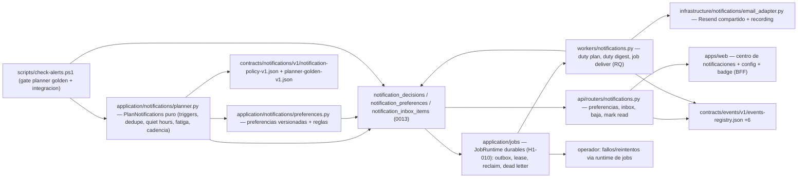

# Implementation Plan: Notificaciones y alertas proactivas

**Branch**: `main` | **Date**: 2026-08-11 | **Spec**: [spec.md](./spec.md)

**Input**: Feature specification for UM-H5-001 through UM-H5-020 (Hito H5 -
Proactividad controlada). Clarifications 2026-08-11: Q1 cadencia hibrida
(price drop y new match con score sobre el umbral inmediatos; digest diario
9:00 para el resto, UM-H5-009 pasa a P0); Q2 el email contiene solo la
oportunidad con razones/riesgos/fuente/CTA/baja; Q3 canales email + inbox
web con una sola fuente de verdad.

## Summary

- Preferencias de notificacion versionadas por usuario/busqueda (canales,
  timezone, quiet hours, frecuencia, umbral, estado) en
  `application/notifications/` (puro) + tabla `notification_preferences`
  (R-01) y configuracion web accesible (UM-H5-001/002).
- Planner deterministico y puro: `PlanNotifications(items, historial,
  preferencias, policy) -> decisiones con razon/codigo`; triggers new_match
  y price_drop; gates de dedupe, quiet hours y fatiga; cadencia hibrida
  (immediate/digest) (R-02). Dataset golden
  `contracts/notifications/v1/planner-golden-v1.json` + politica versionada
  `notification-policy-v1.json` (misma convencion H3.4/H4.4).
- Decisiones persistidas en `notification_decisions` con dedupe
  (`duplicate_of_id`), policy/preferences versionadas y estado transicional;
  el duty `notifications.digest` agrupa pending_digest sin alterar scores
  (UM-H5-003..010).
- Entrega via el runtime de jobs durables existente (H1-010): decision +
  job `notifications.deliver` atomicos; worker RQ idempotente con provider
  message id; scheduler reclaim/retry/dead-letter ya operativos (R-03,
  FR-H5-011/012).
- Adapter de email compartiendo el cliente Resend del ADR 0003 con sender
  propio y fake recording local; templates grounded solo con campos de la
  decision (R-04, FR-H5-013/014).
- Inbox web (API `api/routers/notifications.py` + pagina protegida) con la
  misma fuente de verdad; baja por token HMAC expirable sin login
  (R-05/R-06, FR-H5-015..017).
- Eventos +6 en el registry; vistas/acciones via API (0 pixel);
  instrumentacion de precision percibida (R-07, FR-H5-019).
- Operador: fallos/reintentos consultables desde el runtime de jobs
  existente; E2E de alertas (FR-H5-020). Harness `scripts/check-alerts.ps1`
  registrado en `check.ps1`.

## Technical Context

**Language/Version**: Python `>=3.13,<3.14`; TypeScript/React en `apps/web`
(Next.js App Router, shadcn/ui, Tailwind v4).

**Primary Dependencies**: existentes — SQLAlchemy 2, Psycopg 3, Alembic,
Pydantic v2, runtime de jobs durables (H1-010: `job_executions`, scheduler,
RQ worker), identity/email Resend (ADR 0003 + fake recording), radar
(recommendation_runs/items, H2.3/H3.2), events registry, settings con
inventario cerrado. 0 dependencias runtime nuevas (HMAC y zoneinfo son
stdlib).

**Storage**: Postgres. Migracion `0013_notifications`: 3 tablas
(`notification_preferences`, `notification_decisions`,
`notification_inbox_items`); la entrega usa `job_executions` existente. La
politica y el dataset golden viven como contratos versionados (H3.4).

**Testing**: pytest — contract conformance (planner golden, politica,
events +6); unit puro para planner (casos golden), preferencias, fatiga,
quiet hours, digest, token; integracion con testcontainers Postgres
(planner E2E con items reales, outbox atomico, worker entrega con fallos
simulados, migracion 0013 up/down, isolation); arquitectura
(`application/notifications` puro, import-linter + AST); web: vitest para
el centro de notificaciones; `scripts/check-alerts.ps1` + registro en
`check.ps1`.

**Target Platform**: monolito modular. El duty de plan/digest y el worker
deliver se componen en `workers/` (misma convencion que identity/radar);
el API expone preferencias/inbox/baja; la web consume via BFF.

**Performance Goals**: planner puro (0 red, 0 DB en la funcion de decision);
el duty de plan procesa items nuevos del ultimo run publicado con un limite
por pasada; la entrega email no bloquea el request (job); latencia del
inbox < 200ms en beta.

**Constraints**: 20 stories: preferencias versionadas y configurables
(FR-H5-001/002); planner puro con triggers/dedupe/quiet hours/fatiga/digest
y decisiones persistidas (FR-H5-003..010); outbox atomico y worker
idempotente (FR-H5-011/012); email grounded (FR-H5-013/014); inbox y baja
(FR-H5-015..017); operacion e instrumentacion (FR-H5-018..020). NFR: 0
duplicados, 0 entregas fuera de quiet hours, 0 afirmaciones no soportadas,
0 PII en eventos.

**Scale/Scope**: cohorte beta; 3 tablas; 2 duties (plan, digest) + 1 job de
entrega; 6 eventos; 1 endpoint API (3 recursos) + 1 pagina web + badge;
2 contratos JSON nuevos; 1 harness.

## Constitution Check

*GATE: evaluado antes de Phase 0 y re-evaluado despues de Phase 1.*

| Principle | Before research | After design | Evidence |
| --- | --- | --- | --- |
| Persistent radar truth | PASS | PASS | Cada notificacion es una `notification_decision` persistente vinculada a su recommendation item y busqueda; el inbox web y el email muestran la misma decision; 0 oportunidades que viven solo en el email (Principio I). |
| Auditable deterministic matching | PASS | PASS | El planner es puro, deterministico y gated por dataset golden; 0 LLM en la decision de notificar; dedupe/quiet hours/fatiga por reglas versionadas con razon/codigo (Principio II). |
| Layer boundaries | PASS | PASS | `application/notifications` puro (planner, preferencias, ports); infra (repos, email adapter, workers) en infraestructura; dominio sin FastAPI/DB/Resend (Principio III). |
| Data lineage and observability | PASS | PASS | Decisiones con policy/preferences/item versionados y correlacion; eventos +6 sin PII; entrega con provider message id trazable (Principio V). |
| Versioned prompts, models and schemas | PASS | PASS | Politica de notificacion versionada e inmutable; preferencias versionadas; dataset golden versionado; 0 codigo sin version en la decision (Principio II/V). |
| Minimal verifiable scope | PASS | PASS | Exactamente UM-H5-001..020; 0 cambios a matching/scoring/ingesta/chat; reutiliza el runtime de jobs y el cliente Resend existentes; 3 tablas es el minimo (Principio IV). |

No hay violaciones que requieran excepcion de complejidad.

## Assumptions and Tradeoffs

- El outbox transaccional reutiliza `job_executions` (H1-010): decision +
  job atomicos; lease/reintentos/dead-letter ya operativos; el E2E verifica
  que un fallo de proveedor no pierde ni duplica (R-01/R-03).
- El email reutiliza el cliente Resend del ADR 0003 con sender propio y
  fake recording local; la redaccion del template recibe solo los campos de
  la decision persistida (0 afirmaciones libres) (R-04).
- La cadencia hibrida se implementa en el planner (immediate vs digest) y el
  duty `notifications.digest` materializa el agrupamiento diario; el digest
  no altera scores ni razones individuales (Q1/R-02).
- El token de baja es HMAC con expiracion y version de preferencias en la
  firma: sin tabla, inservible tras un cambio de preferencias (R-06).
- Vistas y acciones se emiten desde la web (inbox y CTAs del email que
  aterrizan en la web); 0 pixel de tracking (R-07).
- El duty de plan corre con el scheduler simple existente; los workers RQ
  entregan con el mismo mecanismo que identity.magic_link.issue.
- Defaults: timezone America/Argentina/Buenos_Aires, quiet hours 22-08,
  cooldown de fatiga 6h, digest 9:00, umbral de score por politica.
- La fatiga global multi-busqueda se suma con politica documentada (edge
  case del spec).

Detalle de decisiones y alternativas en [research.md](./research.md).

## Architecture

Todas las flechas son dependencia/uso. `application/notifications` queda
puro (import-linter + AST); infra posee repos/adapters/workers; la web
alcanza el API via BFF; 0 cambios a matching/scoring/ingesta/chat.

## Module, Interface and Seam Design

| Module | Public Interface | Adapters / consumers | Boundary rule |
| --- | --- | --- | --- |
| `contracts/notifications/v1/*.json` | policy versionada, planner golden | planner, conformance tests | Inmutable por version; 0 PII |
| `application/notifications/planner.py` | `PlanNotifications(items, history, prefs, policy, now) -> tuple[Decision,...]` | duties, tests | Puro: 0 red/DB/LLM |
| `application/notifications/preferences.py` | `validate_preferences(...)`, `bump_version(...)`, `unsubscribe_token(...)` | API, planner | Reglas puras; zoneinfo validado |
| `application/notifications/contracts.py` | Decision, reason codes, estados | planner, repos | Tipos compartidos sin infra |
| `application/notifications/ports.py` | `PreferenceRepository`, `DecisionRepository`, `InboxRepository`, `NotificationEmailPort` | infra | Protocolos; SDK no cruza |
| `infrastructure/notifications/repositories.py` | SqlAlchemy repos (prefs, decisions, inbox) | API, duties, tests | 0 PII en payloads |
| `infrastructure/notifications/email_adapter.py` | `ResendNotificationEmailAdapter`, `RecordingNotificationEmailAdapter` | deliver, tests | Mismo cliente Resend del ADR 0003; redaccion solo desde decision |
| `workers/notifications.py` | `build_notifications_registry(services)` → duties `notifications.plan`/`notifications.digest` + job `notifications.deliver` | `workers/composition.py` | Se compone explicitamente (0 imports dinamicos) |
| `api/routers/notifications.py` | preferencias GET/PUT, inbox GET/PATCH, baja POST | web BFF, tests | `product.notifications.*`; ownership estricto |
| `apps/web` | centro de notificaciones + config de alertas + badge | usuarios | Mismos datos que el email |
| `scripts/check-alerts.ps1` | contract + unit + integracion + migracion 0013 + arquitectura | `check.ps1` | Gate planner golden estricto |

## Readiness and Failure Isolation

Nueva dependencia critica: ninguna (Postgres + Resend ya operativos + runtime
de jobs durables). Fallos:

- Item sin recommendation run publicado: el duty de plan no genera
  decisiones (0 calculos ad-hoc).
- Planner golden que no cumple la entrada: el harness falla; la politica
  queda en su version anterior.
- Proveedor de email caido: el job queda en error con causa tipificada, el
  scheduler reintenta con backoff acotado y agota en dead-letter consultable;
  la decision no se pierde ni duplica (R-01).
- Worker muerto a mitad de entrega: reclaim del scheduler reenvia; el
  provider message id evita duplicados (R-03).
- Quiet hours: la decision queda `postponed` con razon y se materializa al
  abrirse la ventana; 0 entregas fuera de ventana (NFR-H5-002).
- Token de baja vencido o reutilizado: rechazo tipificado y evento; 0
  cambios de preferencias (FR-H5-017).
- Inbox sin datos: estado vacio accesible con explicacion.
- Timezone invalida en preferencias: rechazo en validacion con error
  accionable; nunca falla el planner.

## Configuration and Secret Boundary

Sin secretos nuevos (reutiliza `RESEND_API_KEY`). Nuevos settings (env vars
planas en `Settings`, inventario cerrado + tests de config):

- `NOTIFICATIONS_ENABLED` (true) — master switch de duties/delivery;
- `NOTIFICATIONS_POLICY_VERSION` (`notification-policy-v1`) — politica;
- `NOTIFICATIONS_PLANNER_DATASET_VERSION` (`planner-golden-v1`);
- `NOTIFICATIONS_EMAIL_FROM` — sender propio de alertas;
- `NOTIFICATIONS_DIGEST_JOB_TYPE` (`notifications.digest`) — duty;
- `NOTIFICATIONS_PLAN_JOB_TYPE` (`notifications.plan`) — duty;
- `NOTIFICATIONS_DELIVER_JOB_TYPE` (`notifications.deliver`) — job RQ;
- `NOTIFICATIONS_UNSUBSCRIBE_TTL_HOURS` (24) — expiracion del token;
- `NOTIFICATIONS_DEFAULT_TIMEZONE` (`America/Argentina/Buenos_Aires`).

Payloads de eventos y decisiones: 0 PII (solo ids, reason_code, versiones);
el contenido del email solo viaja por el adapter autorizado.

## Data and Migration Design

Migracion `0013_notifications` (shapes en [data-model.md](./data-model.md)):

1. `notification_preferences` — preferencias versionadas por
   usuario/busqueda (canales, timezone, quiet hours, digest, umbral, estado,
   version).
2. `notification_decisions` — decisiones del planner con trigger,
   reason_code, versiones de policy/preferences, dedupe
   (`duplicate_of_id`), estados y provider_message_id.
3. `notification_inbox_items` — vista 1:1 de la decision con read/acted.

Indices parciales para 0 duplicados por `(recommendation_item_id, trigger)`.
La entrega reutiliza `job_executions` (sin tabla de outbox propia). El
inventario cerrado de `check-migrations.ps1` se actualiza.

## Contracts

Planning contract: [notifications contracts v1](./contracts/notifications-contracts-v1.md)

Machine-checkable files a agregar:
`contracts/notifications/v1/notification-policy-v1.json`,
`planner-golden-v1.json`; `contracts/events/v1/events-registry.json` +6
(`notification.decision_created.v1`, `notification.delivered.v1`,
`notification.delivery_failed.v1`, `notification.viewed.v1`,
`notification.acted.v1`, `notification.unsubscribed.v1`); OpenAPI aditivo
(preferencias, inbox, baja). Contratos existentes intactos.

## Job Idempotency and Recovery

- `notifications.plan` (duty): procesa items nuevos del ultimo run publicado
  por busqueda con limite por pasada; 0 duplicados por el indice parcial;
  reintentable sin efectos (las decisiones son idempotentes por item+trigger).
- `notifications.digest` (duty): agrupa pending_digest vencidos; cada
  decision pasa a pending_delivery una sola vez (estado transicional).
- `notifications.deliver` (job RQ): entrega una decision; lease del runtime;
  reintento con backoff; dead-letter tras agotar; provider message id para
  idempotencia con el proveedor.
- Recuperacion: reclaim del scheduler reenvia jobs expirados; 0 perdida y 0
  duplicacion verificados en el E2E con fallos simulados (FR-H5-020).

## Observability and Audit

| Operation | Durable evidence |
| --- | --- |
| decision del planner | fila `notification_decisions` con policy/preferences/item versionados |
| entrega | provider_message_id + evento `notification.delivered.v1` |
| fallo de entrega | job error tipificado + evento `notification.delivery_failed.v1` |
| vista / accion | `notification_inbox_items` + eventos viewed/acted |
| baja desde email | preferencia versionada + evento `notification.unsubscribed.v1` |
| configuracion de preferencias | version bump + evento `notification.preferences_updated.v1`? (solo si el registry lo requiere; minimo: version en tabla) |

0 PII en eventos y payloads.

## Delivery and Recovery Topology

Los duties y el job se componen en `workers/notifications.py` y se registran
en `workers/composition.py` (misma convencion que identity/radar); el
scheduler los llama con los limites existentes; la migracion 0013 corre por
Alembic; el API se monta en `api/main.py` con el patron de routers; la web
usa la pagina protegida + BFF; `scripts/check-alerts.ps1` se registra en
`check.ps1` con deteccion de superficie (`src\umbral\application\
notifications` + contract tests).

## Project Structure

### Documentation (this feature)

- `specs/013-proactive-alerts/spec.md`, `plan.md`, `research.md`,
  `data-model.md`, `quickstart.md`, `contracts/notifications-contracts-v1.md`,
  `checklists/requirements.md`.

### Source Code (repository root)

- `src/umbral/application/notifications/` — planner, preferences, contracts,
  ports (puro).
- `src/umbral/infrastructure/notifications/` — repositories, email adapter.
- `src/umbral/workers/notifications.py` — duties + job + registry builder.
- `src/umbral/api/routers/notifications.py` — superficie HTTP.
- `apps/web/` — centro de notificaciones, config de alertas, badge.
- `alembic/versions/0013_notifications.py`.
- `contracts/notifications/v1/*.json`, `contracts/events/v1/events-registry.json` (+6).
- `scripts/check-alerts.ps1` (+ registro en `check.ps1`).
- Tests: contract (planner golden, politica, events), unit
  (`application/notifications`), integracion (planner E2E, entrega, baja,
  migracion 0013), arquitectura, config, web vitest.

## Planned Implementation Sequence

### Phase A - Contratos y golden del planner

Policy versionada + dataset golden (casos new_match/price_drop/duplicado/
quiet_hours/fatiga/digest) + parser puro + contract tests.

**Verificacion**: `pytest tests/contract/test_notifications_*` verde.

### Phase B - Planner puro y preferencias

`application/notifications` (planner, preferencias, ports, contratos) con
unit tests sobre el golden (gate estricto).

**Verificacion**: unit del planner 100% verde contra el dataset golden.

### Phase C - Persistencia y migracion 0013

3 tablas + repos + indice parcial de dedupe + inventario de
`check-migrations.ps1`.

**Verificacion**: migracion up/down + integracion con Postgres/testcontainers.

### Phase D - Duties y entrega

Duties plan/digest + job deliver + adapter email (Resend/recording) +
registro en `workers/composition.py`; E2E con fallos simulados (0 perdida,
0 duplicados, quiet hours, fatiga).

**Verificacion**: `check-alerts.ps1` (integracion) verde.

### Phase E - API, inbox web y baja

Router de notificaciones + centro web + config de alertas + badge + token de
baja + eventos +6.

**Verificacion**: API integration + vitest web + E2E de baja.

### Phase F - Harness y cierre

`scripts/check-alerts.ps1` registrado en `check.ps1`; evidencia de
aceptacion; backlog H5 cerrado.

**Verificacion**: `.\scripts\check.ps1` completo verde.
