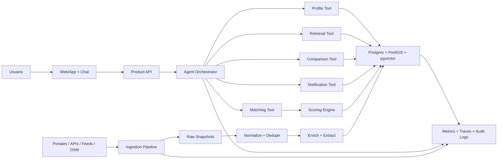
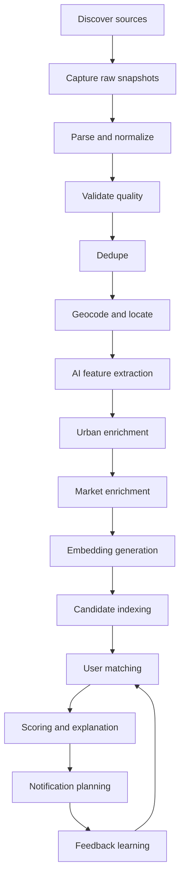
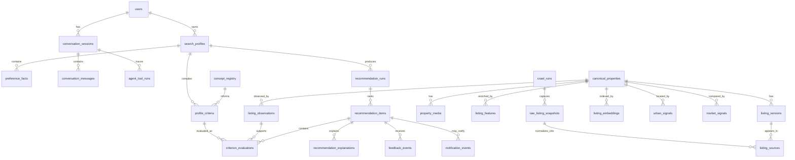

# Umbral: vision y arquitectura de producto

Fecha: 2026-07-27

Estado: borrador fundacional

## Resumen ejecutivo

Umbral deberia evolucionar desde un MVP/PoC de recomendaciones inmobiliarias por bot hacia un producto serio de busqueda asistida: un radar personal de vivienda que monitorea el mercado por el usuario, entiende preferencias humanas dificiles de filtrar y recomienda solo oportunidades relevantes con razones claras.

La direccion recomendada no es construir simplemente "un chat inmobiliario". El chat deberia ser una interfaz flexible para expresar intencion, refinar preferencias y pedir explicaciones. El producto real deberia combinar:

- un perfil vivo de busqueda;
- un motor de matching deterministico, versionado y auditable;
- una capa de datos inmobiliarios y urbanos enriquecida;
- notificaciones proactivas de alta precision;
- una experiencia visual para comparar, decidir y aprender.

La IA deberia operar como orquestador y extractor de significado, no como la unica fuente de verdad. El ranking final y las decisiones de notificacion deben ser reproducibles, observables y explicables.

## Problema validado

El prototipo valido cuatro hipotesis importantes:

1. Los usuarios no quieren scrollear cientos de paginas de inmuebles.
2. Valoran recibir alertas cuando aparece algo nuevo y relevante.
3. Valoran dar feedback rapido sobre recomendaciones.
4. Necesitan expresar criterios subjetivos que los portales no modelan bien, por ejemplo cocina grande, buena luz, cafes cercanos, silencio o buena conexion al trabajo.

La oportunidad esta en transformar la busqueda inmobiliaria de una tarea manual, ansiosa y repetitiva en un sistema de monitoreo continuo con criterio personal.

## Posicionamiento de producto

Propuesta:

> Decime como queres vivir. Umbral vigila el mercado por vos y te avisa solo cuando aparece algo que vale tu atencion, con razones claras.

Umbral no deberia prometer "encontrar el departamento perfecto". Deberia prometer reducir ruido, explicar tradeoffs y ayudar al usuario a decidir mejor.

## Principios de diseno

### 1. Chat como interfaz, no como producto completo

La conversacion sirve para expresar intencion, actualizar el perfil y pedir ayuda. Pero la decision inmobiliaria es visual, geografica y comparativa. El producto necesita una UI estructurada con:

- cards de propiedades;
- mapa;
- shortlist;
- comparaciones;
- historial;
- preferencias editables;
- explicaciones;
- alertas y cambios.

### 2. Matching auditable

El agente no debe inventar rankings. El ranking debe salir de un motor deterministico que reciba features versionadas y devuelva scores reproducibles.

Cada recomendacion debe poder responder:

- que perfil del usuario se uso;
- que snapshot del inmueble se uso;
- que version del scoring se uso;
- que evidencia respaldo la explicacion;
- por que se notifico o no se notifico.

### 3. Perfil vivo

El producto debe mantener un brief vivo de busqueda por usuario. Ese perfil combina filtros duros, preferencias blandas, tolerancias, restricciones, feedback y aprendizajes.

Ejemplos:

- "maximo USD 900 total";
- "priorizar cocina grande";
- "evitar unidades oscuras";
- "acepto 15 minutos mas de viaje si baja mucho el precio";
- "me interesan cafes lindos cerca, pero no bares ruidosos";
- "cuando digo luminoso me importan ventanales, orientacion y piso alto".

### 4. Evidencia sobre fluidez

La IA puede redactar respuestas, pero debe citar datos internos. Si no hay evidencia suficiente, debe decirlo.

Ejemplo:

- Correcto: "Parece buena para cocinar porque la descripcion menciona cocina separada y las fotos muestran mesada amplia. Confianza media."
- Incorrecto: "Es ideal para cocinar" sin fuente o evidencia.

### 5. Proactividad con control

Las notificaciones son una ventaja central, pero tambien pueden cansar. Debe existir un planner de notificaciones que considere:

- score minimo;
- novedad;
- urgencia;
- fatiga;
- horario;
- canal preferido;
- diversidad de recomendaciones;
- cambios relevantes como baja de precio.

## Experiencia y flujo principal

La experiencia principal no deberia ser un chat puro. Umbral deberia organizarse alrededor de busquedas activas. Cada busqueda es un radar independiente con criterios, resultados, guardados, descartes, alertas y conversacion contextual.

Modelo mental:

```text
Usuario
  -> Mis busquedas
      -> Busqueda A: "Alquiler para mudarme solo"
          -> Radar
          -> Guardados
          -> Mapa
          -> Brief / criterios
          -> Chat contextual
      -> Busqueda B: "Compra inversion"
          -> Radar propio
          -> Criterios propios
          -> Alertas propias
```

El chat puede mostrar listings embebidos como mini-cards, pero los listings no deben vivir solo en la conversacion. Todo inmueble mencionado por el agente debe existir tambien como objeto persistente dentro de la busqueda activa.

Regla de producto:

> El chat maneja y explica el radar. El radar guarda y organiza las oportunidades.

### Flujo principal

1. Crear busqueda.

El usuario puede empezar con lenguaje natural:

```text
Busco alquiler en CABA, maximo USD 900, cocina grande, cerca de cafes y bien conectado a Retiro.
```

Mientras conversa, la UI va construyendo un brief vivo:

```text
Presupuesto: hasta USD 900
Zonas: Palermo, Colegiales, Belgrano
Importante: cocina grande, buena conexion a Retiro
Preferencias blandas: cafes cerca, luminoso
Evitar: ruido alto, interiores oscuros
```

El usuario puede corregir por chat o tocando controles estructurados.

2. Confirmar radar.

Cuando el brief tiene suficiente informacion, la app crea una busqueda activa con:

- nombre;
- criterios;
- umbral de alerta;
- frecuencia;
- canal de notificacion;
- estado activo, pausado o archivado.

3. Revisar radar.

La pantalla principal de una busqueda debe ser un radar persistente, no un historial de chat. Secciones esperadas:

- nuevos matches;
- alta prioridad;
- para revisar;
- bajaron de precio;
- guardados;
- descartados.

4. Evaluar listings.

Cada card de listing debe ser una unidad de decision:

```text
Foto | Precio total | Barrio | m2 | ambientes
Match: 87

Por que matchea:
- Cocina probablemente amplia
- Buen viaje a Retiro
- Cafes cerca

Riesgos:
- Confianza media sobre ruido
- Expensas no claras

[Guardar] [No me gusta] [Comparar] [Preguntar]
```

5. Conversar sobre resultados.

El chat debe ser contextual a la busqueda activa y permitir acciones como:

- "Comparame estos tres";
- "Por que me recomendaste este?";
- "No me gusta porque parece viejo";
- "Mostrame solo los que tengan cocina separada";
- "Abrime un poco la zona hacia Villa Crespo";
- "No me avises mas por monoambientes".

6. Aprender con control.

Cada accion de feedback deberia ensenar algo, pero con confirmacion visible:

```text
Entendido: voy a penalizar propiedades con estetica antigua en esta busqueda.
[Deshacer] [Aplicar tambien a otras busquedas]
```

### Navegacion principal

Desktop:

```text
---------------------------------------------------------
| Busquedas       | Radar / Lista / Mapa      | Asistente |
|-----------------|---------------------------|-----------|
| Alquiler actual | Nuevos matches            | Chat      |
| Compra inversion| Cards de propiedades      | Brief     |
| Pausadas        | Comparador / detalle      | Acciones  |
---------------------------------------------------------
```

Mobile:

```text
[Selector de busqueda]
[Tabs: Radar | Guardados | Mapa | Chat | Brief]
```

### Multiples busquedas activas

Soportar multiples busquedas es importante desde el modelo conceptual, aunque la V1 pueda limitar cantidad o profundidad.

Ejemplos:

- alquiler para mudarme ahora;
- compra como inversion;
- depto para un familiar;
- busqueda aspiracional;
- busqueda realista con presupuesto ajustado;
- opciones si amplio zonas.

Cada busqueda debe tener:

- criterios propios;
- listings propios;
- guardados propios;
- descartes propios;
- alertas propias;
- conversacion contextual propia;
- recommendation runs propios.

Puede existir memoria global del usuario, pero no debe pisar automaticamente criterios especificos de cada busqueda.

Ejemplo:

```text
Preferencia global:
"Suele preferir lugares luminosos y modernos."

Busqueda A:
"Alquiler max USD 900, cerca de Retiro."

Busqueda B:
"Compra hasta USD 120k, priorizar renta."
```

### Ubicacion de los listings

Usar ambas superficies, con jerarquia clara:

| Lugar | Funcion |
| --- | --- |
| Chat | Conversar, explicar, refinar, comparar y pedir acciones |
| Radar/Listings | Revisar oportunidades nuevas |
| Guardados | Mantener shortlist persistente |
| Mapa | Entender ubicacion y contexto urbano |
| Brief | Ver y editar criterios de la busqueda |
| Detalle de listing | Decidir con evidencia completa |

Los listings pueden aparecer en el chat como respuestas accionables, pero la fuente de verdad visual debe ser el radar/lista/mapa de la busqueda. Si quedan solo en el chat, el producto reemplaza el scroll infinito de portales por scroll infinito de conversaciones.

### Detalle de listing

Al abrir una propiedad, la vista de detalle deberia incluir:

- resumen;
- por que matchea;
- riesgos y dudas;
- mapa y entorno;
- comparables;
- historial de precio;
- fuente original;
- notas y feedback.

Tambien deberia incluir un input contextual:

```text
Preguntale algo a Umbral sobre este depto.
```

Ejemplos:

- "Esta caro?";
- "Que dudas deberia preguntarle a la inmobiliaria?";
- "Comparalo con el de Palermo";
- "Por que decis que tiene buena cocina?".

### Recomendacion de UX

El core UX deberia ser:

> Busquedas activas + radar persistente + chat contextual.

Esto evita dos extremos debiles:

- un chat puro, malo para comparar y volver a oportunidades;
- una app inmobiliaria clasica con un chat pegado sin capacidad real de modificar el sistema.

La pantalla mas importante es el radar de una busqueda activa. El chat es la forma natural de manejarlo.

### Mockup conceptual


## Arquitectura conceptual



## Componentes principales

### Product UI

Responsabilidades:

- chat conversacional;
- exploracion visual de matches;
- mapa;
- comparador;
- shortlist;
- preferencias;
- feedback;
- configuracion de alertas.

Tecnologias recomendadas:

- Next.js App Router;
- TypeScript y TanStack Query;
- shadcn/ui con Tailwind y tokens semanticos;
- MapLibre para mapas;
- Playwright para tests end-to-end.

### Product API

Responsabilidades:

- autenticar usuario;
- exponer perfil, matches, feedback y conversaciones;
- coordinar requests al agente;
- resolver permisos y rate limits;
- servir datos versionados a la UI.

Tecnologias recomendadas:

- Python + FastAPI;
- Pydantic para contratos;
- SQLAlchemy o SQLModel;
- OpenTelemetry para trazas;
- Sentry para errores.

### Agent Orchestrator

Responsabilidades:

- entender intent del usuario;
- convertir lenguaje natural en acciones estructuradas;
- pedir aclaraciones cuando sea necesario;
- llamar herramientas internas;
- explicar resultados usando evidencia;
- actualizar preferencias;
- registrar tool runs.

El agente debe tener herramientas explicitas, no acceso libre e irrestricto a la base.

Tools iniciales:

- `get_search_profile(user_id)`;
- `update_search_profile(user_id, patch)`;
- `find_matches(user_id, constraints)`;
- `explain_match(user_id, listing_id)`;
- `compare_listings(user_id, listing_ids)`;
- `record_feedback(user_id, listing_id, feedback)`;
- `search_market_context(location, filters)`;
- `search_urban_context(lat, lon, preferences)`.

Framework adoptado para la beta:

Usar LangGraph con un grafo acotado, state schema versionado, checkpointer
Postgres, streaming e interrupciones human-in-the-loop. Los checkpoints
persisten estado de ejecucion conversacional, pero no reemplazan los objetos de
producto. Cada nodo solo puede llamar tools internas explicitas y las tools
mutantes deben ser idempotentes.

### Scoring Engine

Responsabilidades:

- aplicar hard filters;
- calcular score final;
- producir criterios explicables;
- usar pesos versionados;
- incorporar feedback de manera interpretable;
- separar evidencia fuerte de inferencias.

No debe depender del LLM en tiempo de ranking. Puede consumir features extraidas por IA previamente, pero el calculo debe ser puro y testeable.

Ejemplo de criterios:

- affordability;
- location fit;
- commute fit;
- urban fit;
- property quality;
- semantic preference fit;
- market value;
- feedback fit;
- confidence penalty.

## Motor de matching hibrido

El matching no deberia ser ni puramente LLM ni puramente codigo con miles de reglas hardcodeadas. La arquitectura recomendada es hibrida:

- el LLM interpreta lenguaje natural, extrae observaciones y ayuda con criterios subjetivos;
- embeddings ayudan a encontrar similitud semantica y ejemplos parecidos;
- codigo deterministico filtra, evalua, puntua, ordena y decide si notificar.

La regla central:

> El LLM observa e interpreta. El motor de matching decide.

### Separacion de responsabilidades

Hay tres objetos distintos que no conviene mezclar:

1. Observaciones del inmueble: senales sobre una propiedad.
2. Criterios del usuario: preferencias ejecutables dentro de un perfil.
3. Evaluaciones de match: resultado de cruzar una observacion o dato con un criterio.

Ejemplo:

```text
Usuario:
"Quiero una cocina grande porque cocino mucho"

Criterio del usuario:
matcher_type = semantic_feature
target_concepts = ["large kitchen", "counter space", "storage", "separate kitchen"]
weight = 0.85

Observacion del inmueble:
concept = kitchen_size
value = probably_large
score = 0.76
confidence = 0.68

Evaluacion:
match_score = 0.76
confidence = 0.68
reason = "La descripcion menciona cocina comedor y las fotos muestran mesada amplia."
```

### De donde salen esos registros

Los registros no salen de archivos JSON escritos a mano. El sistema los produce en distintos momentos y los guarda en Postgres.

Cuando habla el usuario:

```text
mensaje del usuario
-> agente o preference compiler
-> criterio estructurado
-> tabla profile_criteria
```

Cuando entra un listing:

```text
raw listing
-> normalizacion
-> extractor de features con reglas, LLM y/o vision
-> observaciones estructuradas
-> tabla listing_observations
```

Cuando se corre matching:

```text
profile_criteria + listing_observations + datos numericos/geograficos
-> scoring engine
-> recommendation_items + criterion_evaluations
```

### Concept registry

Conviene tener un `concept_registry`, pero no como una lista cerrada de todo lo que puede existir. Debe funcionar como un diccionario de capacidades conocidas.

Ejemplo:

```text
concept_key: nearby_gym
aliases: ["gimnasio", "gym", "fitness", "entrenar"]
matcher_type: geo_proximity
data_source: urban_pois
default_preferred_radius_meters: 800
default_max_radius_meters: 1500
precompute_policy: on_demand
```

El registry sirve para:

- mapear lenguaje natural a evaluadores existentes;
- definir defaults razonables;
- saber que fuente de datos usar;
- decidir si una senal se precomputa o se calcula on-demand;
- promover criterios frecuentes a features mas cuidadas.

### Conceptos curados vs criterios dinamicos

No todos los conceptos tienen que estar predefinidos desde el dia 1.

Conceptos frecuentes y valiosos:

- se curan;
- se documentan;
- se testean;
- se precomputan para muchos listings.

Ejemplos:

- `kitchen_size`;
- `natural_light`;
- `noise_risk`;
- `style_modernity`;
- `transit_access`;
- `walkability`;
- `market_value`.

Conceptos nuevos o particulares:

- se guardan como criterios dinamicos del perfil;
- se mapean a un matcher generico;
- se evaluan solo para candidatos relevantes;
- se cachean si son utiles.

Ejemplos:

- "cerca de un gimnasio";
- "cerca de una bicicleteria";
- "que no este sobre avenida";
- "bueno para hacer home office";
- "que se sienta aireado";
- "que no tenga estetica vieja".

### Caso: cerca de un gimnasio

Si un usuario nuevo dice:

> Quiero un depto que este cerca de un gimnasio.

El sistema no necesita tener una columna `near_gym_score`. El flujo seria:

```text
1. El agente interpreta la frase como una preferencia urbana.
2. Busca en concept_registry si existe un concepto cercano.
3. Si existe, usa sus defaults.
4. Si no existe, intenta mapearlo a matcher_type = geo_proximity con target_entity = gym.
5. Si falta informacion, pregunta que significa "cerca".
6. Guarda el criterio en profile_criteria.
7. El matching engine evalua distancia a gimnasios para los candidatos.
8. Guarda el resultado en criterion_evaluations.
```

Registro conceptual:

```text
profile_criteria
- natural_language: "cerca de un gimnasio"
- matcher_type: geo_proximity
- target_entity: gym
- preferred_radius_meters: 800
- max_radius_meters: 1500
- weight: 0.65
- confidence: 0.90
```

Evaluacion:

```text
listing A: gimnasio a 240m -> score alto
listing B: gimnasio a 950m -> score medio
listing C: sin gimnasio cercano -> score bajo
```

Esto es deterministico una vez interpretada la preferencia: calcular distancias y aplicar una curva de score no requiere LLM.

### Caso: cocina grande

"Cocina grande" es mas subjetivo. No alcanza con una distancia o un numero.

El sistema deberia combinar:

- texto del anuncio;
- fotos;
- plano si existe;
- m2 totales;
- distribucion;
- ejemplos que le gustaron al usuario;
- ejemplos que rechazo.

El LLM o modelo de vision puede producir una observacion:

```text
listing_observations
- concept: kitchen_size
- value: probably_large
- score: 0.76
- confidence: 0.68
- evidence: ["descripcion menciona cocina comedor", "foto 4 muestra mesada en L"]
- method: llm_vision_text_extractor_v1
```

El scoring engine no pregunta de nuevo al LLM para decidir. Lee esa observacion, aplica el peso del usuario y ajusta por confianza.

### Caso: estetica moderna

"Moderno" tampoco significa lo mismo para todos.

Para ese tipo de criterio conviene usar:

- tags curados: moderno, minimalista, reciclado, clasico, industrial;
- embeddings visuales o multimodales;
- similitud con propiedades que el usuario guardo;
- distancia contra propiedades que descarto por estetica;
- LLM judge solo para top-K cuando haya ambiguedad.

La evaluacion deberia guardar evidencia y confianza. Si el sistema no tiene fotos suficientes, debe decirlo y bajar confianza.

### Precomputado vs on-demand

No conviene precomputar todos los criterios posibles para todos los listings.

Precomputar:

- senales frecuentes;
- senales baratas;
- senales usadas por muchos usuarios;
- senales necesarias para exploracion general.

Calcular on-demand:

- preferencias raras;
- criterios nuevos;
- criterios caros;
- juicios subjetivos que solo importan para un usuario;
- evaluaciones sobre top-K candidatos.

Cachear:

- resultados caros;
- criterios que empiezan a repetirse;
- evaluaciones usadas en recomendaciones enviadas.

Promover a concepto curado:

- si muchos usuarios piden lo mismo;
- si impacta likes/contactos;
- si mejora precision de notificaciones;
- si se puede medir con buena evidencia.

### Tipos genericos de matcher

Para evitar miles de criterios hardcodeados, el sistema deberia tener pocos evaluadores genericos:

- `numeric_range`: precio, m2, ambientes, expensas.
- `categorical`: barrio, mascotas, balcon, amenities.
- `geo_proximity`: distancia a POIs o puntos del usuario.
- `commute_time`: tiempo hacia trabajo, facultad u otros destinos.
- `semantic_feature`: similitud entre preferencia y descripcion/features.
- `visual_style`: similitud estetica en fotos.
- `positive_example_similarity`: parecido a propiedades que gustaron.
- `negative_example_similarity`: parecido a propiedades descartadas.
- `market_value`: precio contra comparables.
- `evidence_required`: requisito de evidencia minima.

El LLM elige o sugiere el `matcher_type`, pero el backend valida que sea uno permitido.

### Algoritmo recomendado

Orden de ejecucion:

1. Compilar el perfil del usuario en criterios ejecutables.
2. Aplicar hard filters deterministicas.
3. Generar candidatos con SQL, geo, full-text y embeddings.
4. Evaluar criterios precomputados.
5. Calcular criterios on-demand solo para candidatos relevantes.
6. Guardar evaluaciones importantes.
7. Calcular score final versionado.
8. Aplicar penalizaciones por baja confianza, duplicados, vistos y fatiga.
9. Generar explicacion desde evidencia.
10. Notificar solo si score y confianza superan umbrales.

Formula conceptual:

```text
final_score =
  hard_filter_gate
  * weighted_sum(criterion_match_scores)
  * confidence_factor
  + market_opportunity_bonus
  + freshness_bonus
  - already_seen_penalty
  - fatigue_penalty
```

Importante: desconocido no debe ser igual a malo. Si no hay evidencia sobre una cocina, el sistema baja confianza, pero no deberia penalizar igual que si detecto claramente una cocina chica.

### Guardado recomendado

Tablas principales:

- `concept_registry`: capacidades conocidas y sus defaults.
- `profile_criteria`: criterios ejecutables del perfil de busqueda.
- `listing_observations`: observaciones extraidas de cada listing.
- `criterion_evaluations`: resultado de cruzar criterio con listing.
- `recommendation_items`: resultado final rankeado.
- `recommendation_explanations`: explicaciones mostradas al usuario.

Partes estructuradas como `concept`, `matcher_type`, `score`, `weight` y `confidence` deberian ser columnas normales. Partes flexibles como aliases, evidencia, parametros especificos y metadata pueden ser `jsonb`.

### Retrieval Layer

Responsabilidades:

- busqueda semantica sobre listings;
- busqueda full-text;
- recuperacion de evidencia;
- RAG documental;
- memoria semantica de usuario.

Tipos de retrieval:

- listing retrieval: anuncios y features;
- user memory retrieval: preferencias y feedback historico;
- document retrieval: guias, contratos, politicas, knowledge base;
- market retrieval: comparables y cambios historicos.

RAG debe traer contexto, no decidir.

### Notification Planner

Responsabilidades:

- decidir si una recomendacion merece interrumpir al usuario;
- agrupar novedades;
- evitar duplicados;
- respetar frecuencia;
- adaptar canal y horario;
- medir engagement.

Canales posibles:

- email;
- Telegram;
- WhatsApp;
- push web/app;
- resumen semanal.

Para V1, Telegram o email alcanzan. WhatsApp puede ser potente, pero agrega friccion operativa y costos.

## Arquitectura de datos

La base deberia seguir una arquitectura medallion:

- Bronze: datos crudos e inmutables.
- Silver: entidades normalizadas y deduplicadas.
- Gold: features, senales, scores, recomendaciones y aprendizaje.

### Bronze

Guarda lo capturado sin perder informacion.

Tablas/objetos:

- `crawl_runs`
- `source_pages`
- `raw_listing_snapshots`
- `raw_listing_assets`

Campos importantes:

- `source`;
- `source_url`;
- `external_id`;
- `captured_at`;
- `raw_payload_uri`;
- `raw_html_uri`;
- `content_hash`;
- `parser_version`;
- `crawl_run_id`.

Storage recomendado:

- Postgres para metadata;
- S3/R2/MinIO para HTML, JSON pesado, screenshots e imagenes.

### Silver

Normaliza y deduplica.

Tablas:

- `canonical_properties`
- `listing_versions`
- `listing_sources`
- `property_locations`
- `property_media`
- `dedupe_links`

Conceptos:

- `canonical_property`: la propiedad real o entidad consolidada;
- `listing_version`: una version observada en un portal;
- `listing_source`: portal/fuente que publico esa version;
- `dedupe_link`: relacion entre snapshots/listings que parecen ser la misma propiedad.

Campos clave:

- precio normalizado;
- moneda original;
- expensas;
- costo total estimado;
- superficie cubierta;
- superficie total;
- ambientes;
- dormitorios;
- direccion aproximada;
- lat/lon;
- barrio;
- estado del anuncio;
- fecha de publicacion estimada;
- fecha de ultima vista.

### Gold

Agrega inteligencia util para producto.

Tablas:

- `listing_features`
- `listing_observations`
- `listing_embeddings`
- `urban_signals`
- `market_signals`
- `concept_registry`
- `profile_criteria`
- `recommendation_runs`
- `recommendation_items`
- `criterion_evaluations`
- `recommendation_explanations`
- `feedback_events`
- `notification_events`

Features posibles:

- luminosidad inferida;
- silencio inferido;
- cocina grande;
- ventilacion;
- estado general;
- calidad de fotos;
- amenities;
- orientacion si aparece;
- piso;
- vista;
- ruido potencial;
- conectividad;
- walkability;
- cercania a cafes;
- cercania a espacios verdes;
- precio por m2;
- desvio contra comparables.

Cada feature deberia guardar:

- `value`;
- `confidence`;
- `evidence`;
- `source`;
- `computed_version`;
- `computed_at`.

## Modelo de usuario

### Search profile

Tabla: `search_profiles`

Representa el brief vivo.

Campos:

- `id`;
- `user_id`;
- `status`;
- `target_operation`;
- `target_locations`;
- `budget_min`;
- `budget_max`;
- `currency`;
- `rooms_min`;
- `rooms_max`;
- `size_min_m2`;
- `pets_required`;
- `move_in_window`;
- `notification_policy`;
- `created_at`;
- `updated_at`.

### Preference facts

Tabla: `preference_facts`

Modelo flexible para preferencias aprendidas.

Campos:

- `id`;
- `search_profile_id`;
- `key`;
- `value`;
- `weight`;
- `polarity`;
- `confidence`;
- `source_type`;
- `source_id`;
- `valid_from`;
- `valid_to`;
- `created_at`.

Ejemplos:

| key | value | weight | polarity | source |
| --- | --- | --- | --- | --- |
| kitchen_size | large | 0.85 | positive | onboarding |
| noise_risk | low | 0.75 | positive | feedback |
| internal_unit | true | 0.70 | negative | feedback |
| cafes_nearby | high | 0.55 | positive | chat |

### Profile criteria

Tabla: `profile_criteria`

Representa criterios ejecutables derivados del perfil vivo. Puede nacer de onboarding, chat, feedback o edicion manual.

Diferencia con `preference_facts`:

- `preference_facts` guarda memoria semantica e historial de lo que el sistema sabe del usuario.
- `profile_criteria` guarda instrucciones evaluables por el motor de matching.

Campos:

- `id`;
- `search_profile_id`;
- `natural_language`;
- `matcher_type`;
- `concept_key`;
- `target_concepts`;
- `target_entity`;
- `parameters`;
- `polarity`;
- `weight`;
- `strictness`;
- `confidence`;
- `source_type`;
- `source_id`;
- `created_at`;
- `updated_at`.

Ejemplo:

| natural_language | matcher_type | target_entity | parameters | weight |
| --- | --- | --- | --- | --- |
| cerca de un gimnasio | geo_proximity | gym | {"preferred_radius_meters":800} | 0.65 |
| cocina grande porque cocino mucho | semantic_feature | kitchen_size | {"target_concepts":["counter space","storage"]} | 0.85 |
| que no tenga estetica vieja | visual_style | old_style | {"polarity":"negative"} | 0.70 |

### Feedback events

Tabla: `feedback_events`

El feedback debe ser evento, no solo estado final.

Campos:

- `user_id`;
- `search_profile_id`;
- `canonical_property_id`;
- `listing_version_id`;
- `recommendation_item_id`;
- `feedback_type`;
- `reason`;
- `free_text`;
- `metadata`;
- `created_at`.

Tipos:

- `like`;
- `dislike`;
- `save`;
- `dismiss`;
- `contacted`;
- `visited`;
- `applied`;
- `notified_but_ignored`.

Razones de dislike:

- `too_expensive`;
- `bad_location`;
- `too_small`;
- `dark`;
- `noisy`;
- `bad_layout`;
- `bad_condition`;
- `already_seen`;
- `not_my_style`;
- `missing_requirement`;
- `other`.

## Embeddings

Usar embeddings, pero con limites claros.

Embeddings recomendados:

- `listing_text_embedding`: titulo + descripcion + features.
- `listing_vibe_embedding`: descripcion sintetica de experiencia de vida.
- `user_preference_embedding`: brief del usuario.
- `feedback_embedding`: razones historicas de feedback.
- `neighborhood_embedding`: descripcion de zonas y subzonas.
- `document_embedding`: docs de ayuda, contratos, politicas, guias.

Uso correcto:

1. Candidate generation.
2. Busqueda semantica.
3. Memoria de preferencias.
4. Agrupacion de feedback.
5. RAG de evidencia.

Uso incorrecto:

1. Ranking final opaco.
2. Decisiones de notificacion sin explicacion.
3. Sustituir hard filters.
4. Mezclar datos no versionados con recomendaciones auditables.

Storage recomendado:

- Postgres + pgvector al inicio.
- Evaluar Qdrant, Weaviate u OpenSearch solo si aparecen necesidades claras de escala, busqueda hibrida avanzada o aislamiento operacional.

## RAG

RAG debe ser una herramienta de recuperacion, no una capa magica.

### RAG documental

Fuentes:

- guias de alquiler/compra;
- preguntas frecuentes;
- politicas internas;
- contratos modelo;
- explicaciones de criterios;
- documentacion de fuentes.

Uso:

- responder dudas;
- explicar terminos;
- asistir en decision;
- generar preguntas para inmobiliarias.

### RAG de usuario

Fuentes:

- conversaciones previas;
- feedback;
- propiedades guardadas;
- propiedades descartadas;
- cambios manuales de preferencias.

Uso:

- recordar criterios;
- detectar contradicciones;
- proponer ajustes;
- explicar aprendizaje.

### RAG de listings

Fuentes:

- descripcion;
- fotos analizadas;
- features extraidas;
- urban signals;
- comparables;
- snapshots.

Uso:

- justificar recomendaciones;
- comparar opciones;
- responder preguntas puntuales.

## Pipeline de datos



### 1. Discover sources

Encuentra nuevas paginas, busquedas, feeds o APIs.

Fuentes posibles:

- portales inmobiliarios;
- feeds de inmobiliarias;
- APIs comerciales;
- cargas manuales;
- OpenStreetMap para contexto urbano;
- fuentes publicas de transporte o datos urbanos.

### 2. Capture raw snapshots

Guarda lo original antes de transformarlo.

Objetivo:

- reproducibilidad;
- debugging;
- reparsing futuro;
- auditoria;
- comparar cambios de precio y contenido.

### 3. Parse and normalize

Convierte datos heterogeneos en un esquema comun.

Validaciones:

- precio parseable;
- moneda;
- superficie plausible;
- barrio o coordenadas;
- fuente;
- URL;
- hash de contenido.

### 4. Dedupe

Detecta propiedades repetidas entre fuentes o publicaciones.

Senales:

- mismo external id;
- URL canonica;
- direccion aproximada;
- precio;
- m2;
- fotos similares;
- texto similar;
- inmobiliaria;
- coordenadas.

La deduplicacion debe guardar confianza y evidencia. No debe fusionar destructivamente sin trazabilidad.

### 5. Geocode and locate

Ubica la propiedad. Si no hay direccion exacta, guardar granularidad.

Niveles:

- exact address;
- block;
- neighborhood centroid;
- approximate area;
- unknown.

### 6. AI feature extraction

Extrae atributos cualitativos desde texto e imagenes.

Ejemplos:

- "cocina separada";
- "cocina grande";
- "luminoso";
- "contrafrente";
- "piso alto";
- "balcon";
- "estado reciclado";
- "poca evidencia fotografica".

La salida debe ser estructurada:

- feature;
- value;
- confidence;
- evidence;
- source fragment;
- model;
- prompt version.

### 7. Urban enrichment

Calcula senales urbanas.

Ejemplos:

- cafes cercanos;
- transporte;
- espacios verdes;
- ruido potencial;
- conectividad;
- caminabilidad;
- distancia a puntos del usuario.

Tecnologia:

- PostGIS;
- snapshots de OpenStreetMap;
- Overpass/Nominatim con cuidado de politicas y cache;
- jobs periodicos de actualizacion.

### 8. Market enrichment

Compara contra mercado.

Senales:

- precio por m2;
- percentil por zona;
- comparables cercanos;
- descuento o sobreprecio;
- cambio de precio;
- dias publicado;
- repeticion en portales.

### 9. Embedding generation

Genera embeddings despues de normalizar y extraer features, no sobre raw HTML.

### 10. Match users

Genera candidatos por usuario.

Orden recomendado:

1. Hard filters.
2. Busqueda hibrida full-text/vector.
3. Reglas de exclusiones.
4. Scoring deterministico.
5. Ranking final.
6. Diversidad y fatiga.

### 11. Score and explain

Calcula score y explicacion.

La explicacion debe venir de criterios concretos:

- "Cumple presupuesto";
- "Muy buena conectividad";
- "Riesgo de ruido medio";
- "Cocina probablemente grande por evidencia en texto/fotos";
- "Precio 8% por debajo de comparables".

### 12. Notify

Solo notificar cuando haya razon suficiente.

Tipos:

- match excepcional;
- baja de precio;
- nuevo listing que cumple algo muy especifico;
- resumen diario/semanal;
- alerta de oportunidad con escasez.

## Orquestacion

Hay dos tipos de orquestacion y conviene no mezclarlos:

### Orquestacion conversacional

Coordina al agente y sus tools durante una conversacion.

Opciones:

- OpenAI Agents SDK;
- LangGraph;
- loop propio sobre Responses API.

### Orquestacion de datos

Coordina jobs de ingestion, enriquecimiento, backfills y scoring.

Opciones:

- Dagster;
- Prefect;
- Airflow;
- cron + workers para V0.

Decision recomendada:

- V1 producto: FastAPI + workers + scheduler simple o Dagster.
- V1 agente: LangGraph con checkpointer Postgres, tools explicitas y
  human-in-the-loop para cambios ambiguos o sensibles.
- Escalar a Temporal si hay workflows criticos con garantias fuertes.

## Stack recomendado para V1

### Aplicacion

- Backend: Python + FastAPI.
- Frontend: Next.js App Router + TypeScript + shadcn/ui + Tailwind + TanStack Query.
- Auth: beta cerrada por invitacion y magic link; el proveedor se integra
  detras de un adapter.
- DB: Postgres.
- Geo: PostGIS.
- Vector: pgvector.
- Cache/queue: Redis.
- Workers: Celery, RQ, Arq o Dramatiq.
- Object storage: S3, Cloudflare R2 o MinIO.

### Datos

- Orquestacion: Dagster si se prioriza lineage y backfills; Prefect si se prioriza simplicidad.
- Scraping/crawling: Playwright para fuentes dinamicas, HTTP parsers para fuentes simples.
- Data validation: Pydantic + Great Expectations o checks propios.
- Geospatial: PostGIS.

### IA

- Agent runtime: LangGraph con persistencia Postgres.
- Modelo generativo: abstraccion provider-agnostic desde el inicio.
- Embeddings: proveedor configurable.
- Structured outputs: Pydantic/JSON schema.
- Eval: dataset de conversaciones, dataset de recommendations y golden explanations.

### Observabilidad

- Logs estructurados;
- OpenTelemetry;
- Sentry;
- dashboards de ingestion;
- dashboards de conversion;
- trazas de agent tool runs;
- auditoria de recomendaciones.

## Modelo logico de base de datos



## Contratos internos importantes

### Match result

```json
{
  "recommendation_item_id": "rec_item_123",
  "canonical_property_id": "prop_456",
  "listing_version_id": "listing_789",
  "score": 87,
  "score_version": "scoring_v1",
  "profile_snapshot_id": "profile_snapshot_abc",
  "feature_snapshot_id": "feature_snapshot_def",
  "criteria": [
    {
      "name": "budget_fit",
      "score": 92,
      "weight": 0.22,
      "reason": "Dentro del presupuesto total estimado."
    },
    {
      "name": "kitchen_fit",
      "score": 81,
      "weight": 0.18,
      "reason": "Texto y fotos sugieren cocina separada y mesada amplia.",
      "confidence": 0.72
    }
  ],
  "should_notify": true,
  "notification_reason": "Nuevo match fuerte en criterio de cocina y conectividad."
}
```

### Agent tool run

```json
{
  "tool_run_id": "toolrun_123",
  "conversation_session_id": "conv_456",
  "tool_name": "find_matches",
  "input": {
    "user_id": "user_1",
    "limit": 5
  },
  "output_summary": {
    "count": 5,
    "top_score": 91
  },
  "status": "success",
  "started_at": "2026-07-27T15:00:00Z",
  "completed_at": "2026-07-27T15:00:02Z"
}
```

## Seguridad, privacidad y confianza

Principios:

- guardar solo lo necesario;
- separar PII de datos de matching cuando sea posible;
- auditar accesos;
- no exponer SQL libre al agente;
- no permitir tools destructivas sin permisos explicitos;
- versionar prompts y modelos;
- registrar explicaciones y tool runs;
- permitir borrar datos del usuario.

Riesgos particulares:

- inferencias sensibles sobre zonas;
- sesgos geograficos;
- datos inmobiliarios incorrectos;
- scraping fragil;
- alucinaciones en explicaciones;
- notificaciones excesivas.

Mitigaciones:

- scoring deterministico;
- confianza por feature;
- mostrar incertidumbre;
- snapshots crudos;
- tests de ranking;
- evals de explicaciones;
- reglas de fairness y lenguaje cuidadoso;
- limites de frecuencia.

## Roadmap recomendado

### Fase 0: Descubrimiento de producto

Objetivo: confirmar la propuesta de valor madura.

Entregables:

- entrevistas con usuarios;
- mapa de jobs-to-be-done;
- prototipo clickable;
- definicion de perfil vivo;
- definicion de explicaciones;
- criterios de notificacion.

### Fase 1: Core data foundation

Objetivo: construir base auditable.

Entregables:

- raw snapshots;
- modelo bronze/silver/gold;
- normalizacion;
- dedupe basico;
- Postgres + PostGIS + pgvector;
- pipeline reproducible;
- dashboard de ingestion.

### Fase 2: Matching explicable

Objetivo: ranking confiable.

Entregables:

- scoring engine v1;
- tests de scoring;
- perfiles de usuario;
- feedback events;
- recommendation runs;
- explicaciones versionadas.

### Fase 3: Conversational radar

Objetivo: interfaz agente + UI.

Entregables:

- chat con tool calling;
- actualizacion de preferencias por lenguaje natural;
- comparador;
- shortlist;
- feedback rapido;
- historial de razonamientos.

### Fase 4: Proactividad

Objetivo: alertas de alto valor.

Entregables:

- notification planner;
- alertas de nuevos matches;
- alertas de baja de precio;
- resumen periodico;
- fatiga y preferencias de canal.

### Fase 5: Mercado y defensibilidad

Objetivo: ampliar ventaja de datos.

Entregables:

- comparables;
- tendencias;
- partnerships o feeds;
- calidad de fuentes;
- cobertura multiportal;
- evaluacion de monetizacion.

## Decisiones cerradas para la beta

1. Mercado inicial: alquiler residencial en CABA.
2. Producto: web app con Next.js App Router y shadcn/ui.
3. Canales de alerta: inbox web y email.
4. Fuente de datos: importacion controlada; scraping y publicacion directa
   quedan en el roadmap posterior.
5. Orquestador conversacional: LangGraph.
6. Acceso: beta cerrada por invitacion y magic link.
7. Criterio principal: precision percibida de recomendaciones notificadas.

## Decisiones abiertas

1. Proveedor de identidad y email para la beta.
2. Orquestador de data si el scheduler simple deja de alcanzar.
3. Monetizacion: usuario final, inmobiliarias, leads calificados o SaaS para brokers.
4. Nivel de precision geografica permitido por fuente y superficie.
5. Estrategia legal y comercial por futura fuente automatizada.
6. Primer actor y modelo de moderacion para publicacion directa.

## Recomendacion de arquitectura inicial

La primera version madura deberia priorizar simplicidad con fundamentos correctos:

- monolito modular en Python/FastAPI;
- Postgres unico con PostGIS y pgvector;
- object storage para raw snapshots;
- workers asincronicos;
- scheduler/pipeline observable;
- scoring engine puro y testeado;
- agente con tools internas controladas;
- UI web con chat + cards + mapa;
- notificaciones por un canal inicial;
- observabilidad y auditoria desde el dia 1.

Evitar al inicio:

- microservicios;
- Kafka;
- fine-tuning;
- vector DB separada;
- multi-agent complejo;
- ML colaborativo avanzado;
- automatizaciones sin trazabilidad;
- dependencia total de respuestas generativas.

La arquitectura debe permitir crecer, pero el primer producto serio debe optimizar para aprender rapido sin perder confianza.

## Referencias tecnicas

- LangGraph overview: https://docs.langchain.com/oss/python/langgraph/overview
- LangGraph persistence: https://docs.langchain.com/oss/python/langgraph/persistence
- pgvector: https://github.com/pgvector/pgvector
- Supabase hybrid search: https://supabase.com/docs/guides/ai/hybrid-search
- Dagster: https://docs.dagster.io/
- OpenStreetMap Overpass API: https://wiki.openstreetmap.org/wiki/Overpass_API/Language_Guide
- Nominatim usage policy: https://operations.osmfoundation.org/policies/nominatim/
